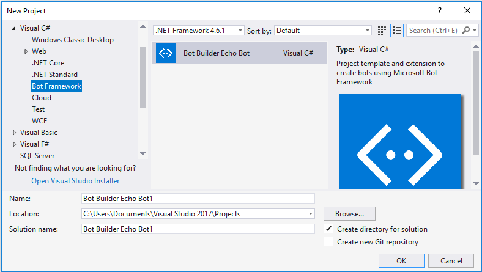
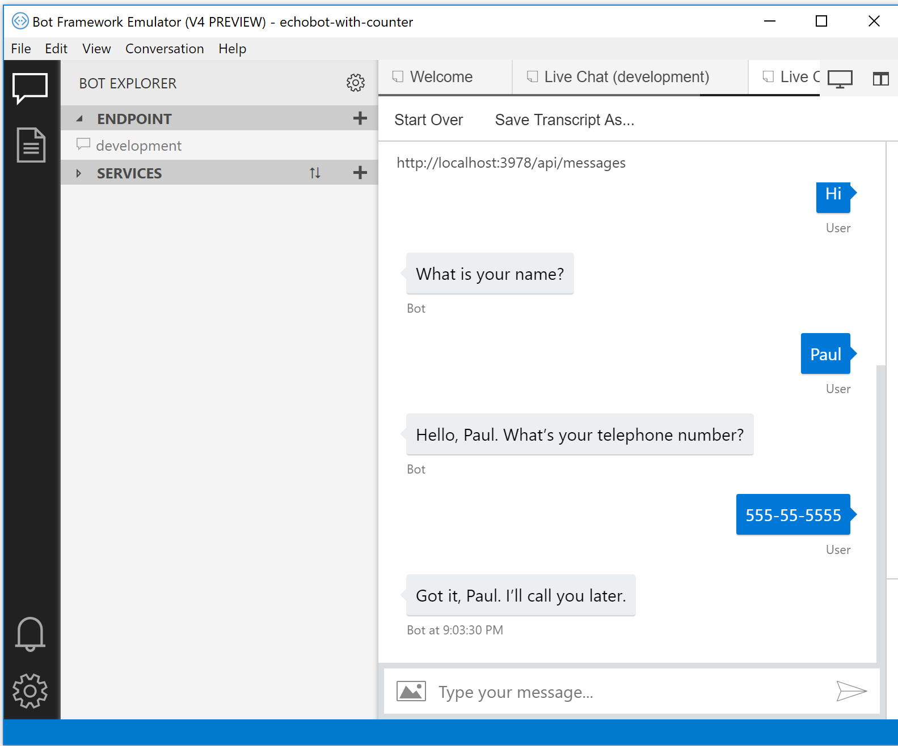

# Create a bot with the Bot Builder SDK for .NET
[!INCLUDE [pre-release-label](../includes/pre-release-label.md)]

This quickstart walks you through building a bot by using the C# template, and then testing it with the Bot Framework Emulator. 

## Prerequisites
- Visual Studio [2017](https://www.visualstudio.com/downloads)
- Bot Builder SDK v4 template for [C#](https://botbuilder.myget.org/feed/aitemplates/package/vsix/BotBuilderV4.fbe0fc50-a6f1-4500-82a2-189314b7bea2)
- Bot Framework [Emulator](https://github.com/Microsoft/BotFramework-Emulator/releases)
- Knowledge of [ASP.Net Core](https://docs.microsoft.com/aspnet/core/) and asynchronous programming in [C#](https://docs.microsoft.com/en-us/dotnet/csharp/programming-guide/concepts/async/index)

## Create a bot
Install BotBuilderVSIX.vsix template that you downloaded in the prerequisites section. 

In Visual Studio, create a new bot project using the Bot Builder Echo Bot V4 template.

> [!TIP] 
> If needed, change the project build type to ``.Net Core 2.1``
> If needed, update [NuGet packages](https://docs.microsoft.com/en-us/nuget/quickstart/install-and-use-a-package-in-visual-studio).

Thanks to the template, your project contains all of the code that's necessary to create the bot in this quickstart. You won't actually need to write any additional code.

## Start your bot in Visual Studio

When you click the run button, Visual Studio will build the application, deploy it to localhost, and launch the web browser to display the application's `default.htm` page. At this point, your bot is running locally.

## Start the emulator and connect your bot

Next, start the emulator and then connect to your bot in the emulator:

1. Click the **Open Bot** link in the emulator "Welcome" tab. 
2. Select the .bot file located in the directory where you created the Visual Studio solution.

## Interact with your bot

Send a message to your bot, and the bot will respond back with a message.

> [!NOTE]
> If you see that the message can not be sent, you might need to restart your machine as ngrok didn't get the needed privileges on your system yet (only needs to be done one time).

## Next steps

> [!div class="nextstepaction"]
> [How bots work](../v4sdk/bot-builder-basics.md) 
