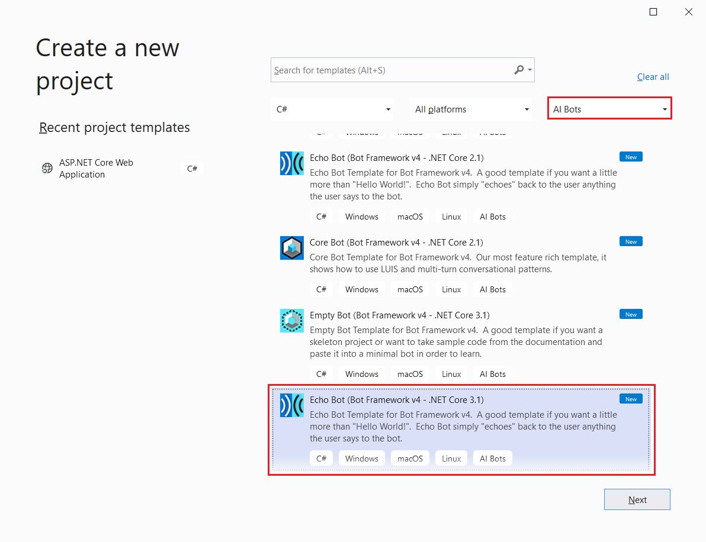
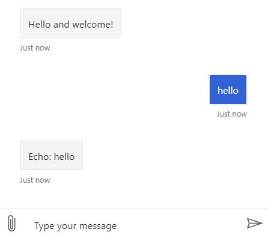
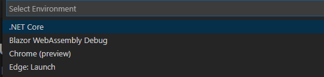

## Prerequisites

- [Visual Studio 2019 or later](https://www.visualstudio.com/downloads)
- [Bot Framework SDK v4 template for C#](https://aka.ms/bot-vsix)
- [.NET Core 3.1](https://dotnet.microsoft.com/download)
- [Bot Framework Emulator](https://aka.ms/bot-framework-emulator-readme)
- Knowledge of [ASP.Net Core](https://docs.microsoft.com/aspnet/core/) and [asynchronous programming in C#](https://docs.microsoft.com/dotnet/csharp/programming-guide/concepts/async/index)


## Templates

# [Visual Studio](#tab/vs)

## Visual Studio templates

Install [BotBuilderVSIX.vsix template](https://aka.ms/bot-vsix) that you downloaded in the prerequisites section.

In Visual Studio, create a new bot project using the **Echo Bot (Bot Framework v4 - .NET Core 3.1)** template. Choose **AI Bots** from the project types to show only bot templates.

> [!div class="mx-imgBorder"]
> 

Thanks to the template, your project contains all the code that's necessary to create the bot in this quickstart. You don't need any additional code to test your bot.

> [!NOTE]
> If you create a `Core` bot, you'll need a LUIS language model. (You can create a language model at [luis.ai](https://www.luis.ai)). After creating the model, update the configuration file.

[!INCLUDE [dotnet vsix templates info](~/includes/vsix-templates-versions.md)]

# [Visual Studio Code / Command Line](#tab/vc+cl)

## Visual Studio Code and Command Line templates

.NET Core Templates will help you to quickly build new conversational AI bots using Bot Framework v4. As of May 2020, these templates and the code they generate require .NET Core 3.1.

In a console window, perform the steps shown below.

1. Install [.NET Core SDK](https://dotnet.microsoft.com/download) version 3.1 or higher.
1. You can use this command to determine which version of the .NET Core command-line interface you have installed.

   ```cmd
   dotnet --version
   ```

1. Install the 3 Bot Framework C# templates: the echo, core, and empty bot templates.

   ```cmd
   dotnet new -i Microsoft.Bot.Framework.CSharp.EchoBot
   dotnet new -i Microsoft.Bot.Framework.CSharp.CoreBot
   dotnet new -i Microsoft.Bot.Framework.CSharp.EmptyBot
   ```

1. Verify the templates have been installed correctly.

   ```cmd
   dotnet new --list
   ```

> [!NOTE]
> The above installation steps will install all 3 Bot Framework templates. You do not need to install all 3 templates and can install just the ones you will use. This article makes use of the echo bot template.

---

## Build and run the bot

# [Visual Studio](#tab/vs)

## Build and run the bot in Visual Studio

Start your project in Visual Studio. This will build the application, deploy it to localhost, and launch the web browser to display the application's `default.htm` page.

At this point, your bot is running locally on port 3978.

### Start the Emulator and connect to your bot

1. Start the Bot Framework Emulator.

1. Click **Open Bot** on the Emulator's **Welcome** tab.

1. Enter your bot's URL, which is the URL of the local port, with /api/messages added to the path, typically `http://localhost:3978/api/messages`.

   <!--This is the same process in the Emulator for all three languages.-->
   

1. Then click **Connect**.

   Send a message to your bot, and the bot will respond back.

   > [!div class="mx-imgBorder"]
   > 

<!--
> [!NOTE]
> If you see that the message cannot be sent, you might need to restart your machine as ngrok didn't get the needed privileges on your system yet (only needs to be done one time).
-->

# [Visual Studio Code](#tab/vc)

## Build and run the bot in Visual Studio Code

Make sure that [.NET Core 3.1](https://dotnet.microsoft.com/download) is installed.

1. Launch VS Code and open your bot project folder.
1. On the menu bar, click **Run**.
1. In the drop-down menu, select **Run Without Debugging**.

   

1. Select the **.Net Core** environment.

   

This will build the application, deploy it to localhost, and launch the web browser to display the application's `default.htm` page.

At this point, your bot is running locally on port 3978.

### Start the Emulator and connect to your bot

1. Start the Bot Framework Emulator.

1. Click **Open Bot** on the Emulator's **Welcome** tab.

1. Enter your bot's URL, which is the URL of the local port, with /api/messages added to the path, typically `http://localhost:3978/api/messages`.

1. Click **Connect**.

   Send a message to your bot, and the bot will respond back.

# [Command Line](#tab/cl)

## Build and run the bot with command line

Create a new bot project using one of the commands shown below.

1. Echo Bot

   ```cmd
      dotnet new echobot -n MyEchoBot
   ```

1. Core Bot

   ```cmd
      dotnet new corebot -n MyCoreBot
   ```

1. CoreBot with CoreBot.Test project

   ```cmd
      dotnet new corebot -n MyCoreBotWithTests --include-tests
   ```

1. Empty Bot

   ```cmd
      dotnet new emptybot -n MyEmptyBot
   ```

### Run the Bot locally

To run your bot locally, execute the commands shown below.

1. Change into the project's folder (for example, EchoBot).

   ```cmd
      cd EchoBot
   ```

1. Run the bot.

   ```cmd
      dotnet run
   ```

### Start the emulator and connect to the bot

1. Launch Bot Framework Emulator
1. File -> Open Bot
1. Enter a Bot URL, for example http://localhost:3978/api/messages

Once the emulator is connected, you can interact with and receive messages from your bot.

---

