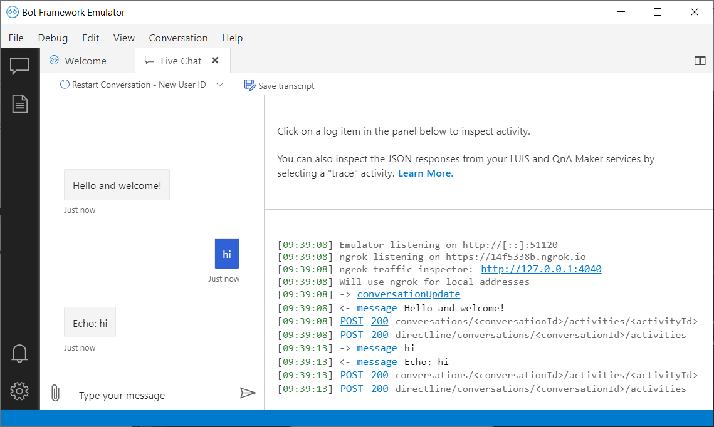

## Prerequisites

- [Visual Studio Code](https://www.visualstudio.com/downloads)
- [Node.js](https://nodejs.org/)
- [Yeoman](http://yeoman.io/), which uses a generator to create a bot for you
- [git](https://git-scm.com/)
- [Bot Framework Emulator](https://aka.ms/bot-framework-emulator-readme)
- Knowledge of [restify](http://restify.com/) and asynchronous programming in JavaScript

> [!NOTE]
> The install of Windows build tools listed below is only required if you use Windows as your development operating system.
> For some installations the install step for restify is giving an error related to node-gyp.
> If this is the case you can try running this command with elevated permissions.
> This call may also hang without exiting if python is already installed on your system:

> ```bash
> npm install -g windows-build-tools
> ```

## Create a bot

To create your bot and initialize its packages

1. Open a terminal or elevated command prompt.
1. If you don't already have a directory for your JavaScript bots, create one and change directories to it. (We're creating a directory for your JavaScript bots in general, even though we're only creating one bot in this tutorial.)

   ```bash
   mkdir myJsBots
   cd myJsBots
   ```

1. Ensure your version of npm is up to date.

   ```bash
   npm install -g npm
   ```

1. Next, install Yeoman and the generator for JavaScript.

   ```bash
   npm install -g yo generator-botbuilder
   ```

1. Then, use the generator to create an echo bot.

   ```bash
   yo botbuilder
   ```

Yeoman prompts you for some information with which to create your bot. For this tutorial, use the default values.

- Enter a name for your bot. (my-chat-bot)
- Enter a description. (Demonstrate the core capabilities of the Microsoft Bot Framework)
- Choose the language for your bot. (JavaScript)
- Choose the template to use. (Echo Bot - https://aka.ms/bot-template-echo)

Thanks to the template, your project contains all of the code that's necessary to create the bot in this quickstart. You won't actually need to write any additional code.

> [!NOTE]
> If you choose to create a `Core` bot, you'll need a LUIS language model. You can create one on [luis.ai](https://www.luis.ai). After creating the model, update the configuration file.

## Start your bot

In a terminal or command prompt change directories to the one created for your bot, and start it with `npm start`. At this point, your bot is running locally.

## Start the Emulator and connect your bot

1. Start the Bot Framework Emulator.
2. Click the **Create a new bot configuration** link in the emulator "Welcome" tab. 
3. Fill out the fields for your bot. Use your bot's welcome page address (typically http://localhost:3978) and append routing info '/api/messages' to this address.
4. Then click **Save and connect**.

Send a message to your bot, and the bot will respond back with a message.

