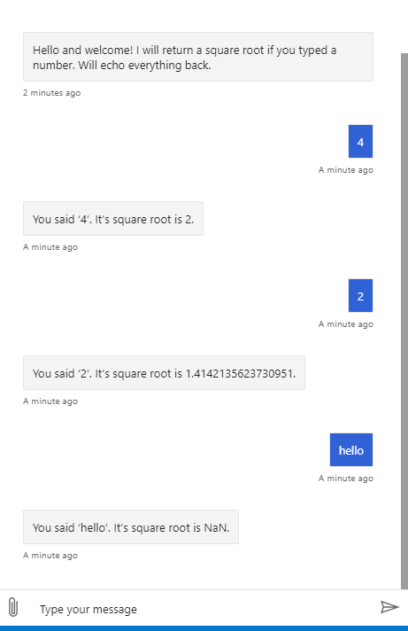

# Use custom functions in language generation

[!INCLUDE[applies-to](../includes/applies-to.md)]

Developers can use both [prebuilt functions](../adaptive-expressions/adaptive-expressions-prebuilt-functions.md) supported by adaptive expressions and custom functions in [language generation (LG) templates](../file-format/bot-builder-lg-file-format.md). This article shows you how to add a custom function in your bot to adaptive expressions and use the function in an LG template.

## Prerequisites

- Knowledge of [bot basics](../v4sdk/bot-builder-basics.md), [adaptive expressions](../v4sdk/bot-builder-concept-adaptive-expressions.md), [language generation](../v4sdk/bot-builder-concept-language-generation.md), and the [.lg file format](../file-format/bot-builder-lg-file-format.md). Familiarity with [prebuilt functions](../adaptive-expressions/adaptive-expressions-prebuilt-functions.md) is also helpful.
- A copy of the 20.custom-functions sample in [C#](https://github.com/microsoft/BotBuilder-Samples/tree/master/samples/csharp_dotnetcore/language-generation/20.extending-with-custom-functions) or[JavaScript] (https://github.com/microsoft/BotBuilder-Samples/tree/master/samples/javascript_nodejs/language-generation/20.custom-functions)

## About the sample

This LG custom functions sample is an example of how to add a simple custom function to adaptive expressions and then use that expression in an LG template. The bot asks the user for a number, and if the input is valid returns the square root. The function that computes the square root, `contoso.sqrt`, is defined in the bot logic, and is used in the LG template that generates bot responses.

This article uses a bottom up approach to adding and using custom functions in LG templates. You will learn about how to:

- add [packages](#packages) you need to use adaptive expressions and LG in your bot
- [add a custom function to adaptive expressions](#add-a-custom-function-to-adaptive-expressions) in your bot's logic
- [use your custom function in an LG template](#use-your-custom-function-in-an-lg-template)
- [load and use your template in your bot](#load-and-use-your-lg-template-in-your-bot)
- [test the bot](#test-the-bot)

## Packages

### [C#](#tab/cs)

To use adaptive expressions and LG, install the **Microsoft.Bot.Builder.LanguageGeneration** and **AdaptiveExpressions** packages. Add the following snippet to your main bot file.

**Bots/CustomFunctionBot.cs**

[!code-csharp[packages](~/../BotBuilder-Samples/samples/csharp_dotnetcore/language-generation/20.extending-with-custom-functions/Bots/CustomFunctionBot.cs?range=9-10)]

### [JavaScript](#tab/javascript)

To use adaptive expressions and LG, install the **botbuilder-lg** and **adaptive-expressions** packages installed. Add the following snippet to your main bot file.

**bot.js**

[!code-javascript[packages](~/../BotBuilder-Samples/samples/javascript_nodejs/language-generation/20.custom-functions/bot.js?range=6-7)]

---

## Add a custom function to adaptive expressions

To use custom functions in your bot, you need to add them to adaptive expressions. This section shows how to add a custom function named `contoso.sqrt` to adaptive expressions.

### [C#](#tab/cs)

Start by adding a string constant with the name of your custom function. The name of your function should be short but recognizable. In this sample, the custom function is named `contoso.sqrt`:

**Bots/CustomFunctionBot.js**

[!code-csharp[function-name](~/../BotBuilder-Samples/samples/csharp_dotnetcore/language-generation/20.extending-with-custom-functions/Bots/CustomFunctionBot.cs?range=26)]

> [!IMPORTANT]
> Prefix your functions to avoid namespace collisions.

In the function name `contoso` is the prefix and `sqrt` is short hand for square root, which the function returns.

Now you can define the logic for your function in your bot constructor and add it to adaptive expressions using the `Expression.Functions.Add()` function. Adding your custom function to adaptive expression makes it possible to use your function across LG templates, just as you can with any of the prebuilt functions.

The snippet below shows how to add a function, defined as `mySqrtFnName`, to adaptive expressions. This function returns the square root of a single argument, `args`, if valid, and `null` if not not:

[!code-csharp[add-function](~/../BotBuilder-Samples/samples/csharp_dotnetcore/language-generation/20.extending-with-custom-functions/Bots/CustomFunctionBot.cs?range=28-41)]

### [JavaScript](#tab/javascript)

Start by adding a string constant with the name of your custom function. The name of your function should be short but recognizable. In this sample, the custom function is named `contoso.sqrt`:

**bot.js**

[!code-javascript[function-name](~/../BotBuilder-Samples/samples/javascript_nodejs/language-generation/20.custom-functions/bot.js?range=6-7)]

> [!IMPORTANT]
> Prefix your functions to avoid namespace collisions.

In the function name `contoso` is the prefix and `sqrt` is short hand for square root, which the function returns.

Now you can define the logic for your function in your bot constructor and add it to adaptive expressions using the `Expression.functions.add()` function. Adding your custom function to adaptive expression makes it possible to use your function across LG templates, just as you can with any of the prebuilt functions.

The snippet below shows how to add a function, defined as `mySqrtFnName`, to adaptive expressions. This function returns the square root of a single argument, `args`, if valid, and `null` if not not:

[!code-javascript[add-function](~/../BotBuilder-Samples/samples/javascript_nodejs/language-generation/20.custom-functions/bot.js?range=19-30)]

---

## Use your custom function in an LG template

After adding your custom function to adaptive expressions you can use it in LG templates. This section describes how to set up the bot's response depending on whether the user input was valid.

### [C#](#tab/cs)

There are two template definitions in **main.lg**: the [simple response template](../file-format/bot-builder-lg-file-format.md#simple-response-template) `sqrtReadBack` and the [conditional response template](../file-format/bot-builder-lg-file-format.md#conditional-response-template) `sqrtTemplate`:

**Resources/main.lg**

[!code-csharp[sqrtReadBack](~/../BotBuilder-Samples/samples/csharp_dotnetcore/language-generation/20.extending-with-custom-functions/Resources/main.lg?range=4-5)]

This template generates a response that contains the user input, `${text}` and the result of the second conditional [if-else template](../file-format/bot-builder-lg-file-format.md#if-else-template) `sqrtTemplate`:

[!code-csharp[sqrtTemplate](~/../BotBuilder-Samples/samples/csharp_dotnetcore/language-generation/20.extending-with-custom-functions/Resources/main.lg?range=9-13)]

In this template, the result of `contoso.sqrt(text)` is used to determine the response:

- If the result is not **null**, the line under the `IF` block is used in `sqrtReadBack`. Note that this line uses an inline expression, `${coalesce(contoso.sqrt(text), 'NaN)}`. The prebuilt function [coalesce](../adaptive-expressions/adaptive-expressions-prebuilt-functions.md#coalesce) returns the result of `contoso.sqrt(text)` if it is not null and `NaN` if it is null.
- If the result is **null**, the line under the `ELSE` block is used in `sqrtReadBack`.

### [JavaScript](#tab/javascript)

There are two template definitions in the LG. The first is the [simple response template](../file-format/bot-builder-lg-file-format.md#simple-response-template) `sqrtReadBack`:

**resources/main.lg**

[!code-javascript[sqrtReadBack](~/../BotBuilder-Samples/samples/csharp_dotnetcore/language-generation/20.extending-with-custom-functions/Resources/main.lg?range=4-5)]

This template generates a response that contains the user input, `${text}` and the result of the second conditional [if-else template](../file-format/bot-builder-lg-file-format.md#if-else-template) `sqrtTemplate`:

[!code-javascript[sqrtTemplate](~/../BotBuilder-Samples/samples/javascript_nodejs/language-generation/20.custom-functions/resources/main.lg?range=9-13)]

In this template, the result of `contoso.sqrt(text)` is used to determine the response:

- If the result is not **null**, the line under the `IF` block is used in `sqrtReadBack`. Note that this line uses an inline expression, `${coalesce(contoso.sqrt(text), 'NaN)}`. The prebuilt function [coalesce](../adaptive-expressions/adaptive-expressions-prebuilt-functions.md#coalesce) returns the result of `contoso.sqrt(text)` if it is not null and `NaN` if it is null.
- If the result is **null**, the line under the `ELSE` block is used in `sqrtReadBack`.

---

## Load and use your LG template in your bot

Now that you've created your bot's response template `sqrtReadBack` in **main.lg**, you can use the template in your bot's logic.

### [C#](#tab/cs)

To start, create a private `Templates` object called `_templates`.

**Bots/CustomFunctionBot.js**

[!code-csharp[create-_templates](~/../BotBuilder-Samples/samples/csharp_dotnetcore/language-generation/20.extending-with-custom-functions/Bots/CustomFunctionBot.cs?range=19)]

The `_templates` object is used to reference templates in your .lg files.

Then combine the path for cross-platform support. Make sure to include **main.lg** by adding the following:

[!code-csharp[cross-path](~/../BotBuilder-Samples/samples/csharp_dotnetcore/language-generation/20.extending-with-custom-functions/Bots/CustomFunctionBot.cs?range=23)]

Now you can parse the files in `lgFilePath` and load your LG templates.

[!code-csharp[load-templates](~/../BotBuilder-Samples/samples/csharp_dotnetcore/language-generation/20.extending-with-custom-functions/Bots/CustomFunctionBot.cs?range=44)]

By default [`Templates.ParseFile()`](https://docs.microsoft.com/dotnet/api/microsoft.bot.builder.languagegeneration.templates.parsefile) uses `Expression.Function`, which includes the custom function you added earlier.

Your templates are now loaded and you can reference them by name in your bot. In this sample, the result of evaluating `sqrtReadBack` is used as the `replyText` sent to the user.

[!code-csharp[use-template-in-code](~/../BotBuilder-Samples/samples/csharp_dotnetcore/language-generation/20.extending-with-custom-functions/Bots/CustomFunctionBot.cs?range=47-51)]

You're now ready to test your bot.

### [JavaScript](#tab/javascript)

To start, combine the path for cross-platform support. Make sure to include the path to **./resources/main.lg**, seen below:

**bot.js**

[!code-javascript[cross-path](~/../BotBuilder-Samples/samples/javascript_nodejs/language-generation/20.custom-functions/bot.js?range=16)]

Now you can parse the files in `lgFilePath` and load your LG templates.

[!code-javascript[load-templates](~/../BotBuilder-Samples/samples/javascript_nodejs/language-generation/20.custom-functions/bot.js?range=33)]

By default [`Templates.parsefile()`](https://docs.microsoft.com/dotnet/api/microsoft.bot.builder.languagegeneration.templates.parsefile) uses `Expression.functions`, which includes the custom function you added earlier.

Your templates are now loaded and you can reference them by name in your bot. In this sample, the result of evaluating `sqrtReadBack` is used as the `replyText` sent to the user.

[!code-javascript[use-template-in-code](~/../BotBuilder-Samples/samples/javascript_nodejs/language-generation/20.custom-functions/bot.js?range=36-43)]

You're now ready to test your bot.

---

## Test the bot

Download and install the latest version of the [Bot Framework Emulator](https://aka.ms/bot-framework-emulator-readme).

1. Run the sample locally on your machine. If you need instructions, refer to the README file for the [C#](https://aka.ms/dotnet-lg-20-custom-function-sample)or [Javascript](https://aka.ms/js-lg-20-custom-functions-sample) sample.
1. In the emulator, type anything. You will notice that the emulator will return the square root of numbers entered and `NaN` for all other input.

## Additional Information

- [Structured response templates](language-generation-structured-response-template.md)
- [.lg file format](../file-format/bot-builder-lg-file-format.md)
- [Adaptive expressions prebuilt functions reference](../adaptive-expressions/adaptive-expressions-prebuilt-functions.md)

<!--
## Next steps

> [!div class="nextstepaction"]->