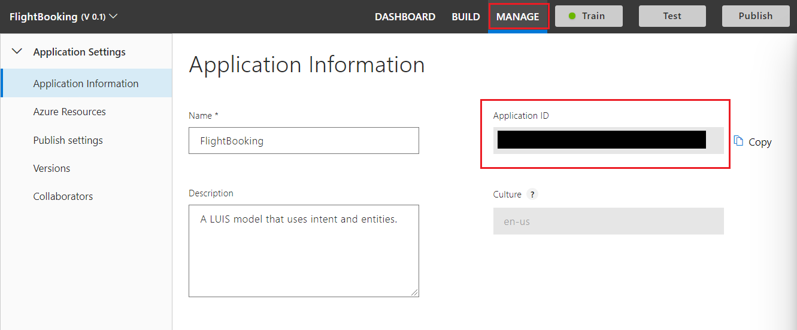
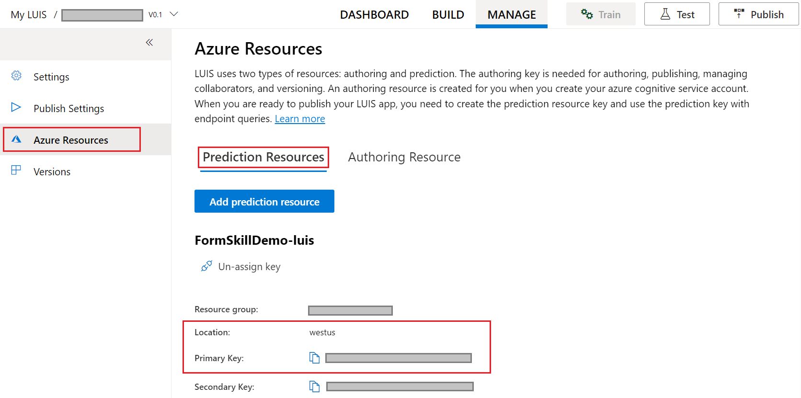

# Use language generation templates in your bot

Language generation templates make it easy for bot developers to send a variety of messages and media to users. In the is article we will show you how to leverage LG templates to send simple text messages, cards, as well as evaluate text input from users.

## Prerequisites

- [LUIS](https://luis.ai) account
- A copy of the language generation core bot sample in either C# or Javascript
- Knowledge of [bot basics](../v4sdk/bot-builder-basics.md) and [language generation](../v4sdk/bot-builder-concept-language-generation.md)

## About this sample

This LG core bot sample shows an example of an airport flight booking application. It uses a LUIS service to recognize the user input and return the top recognized LUIS intent.

<!--insert diagram here
-->

## Create a simple response template

A [simple response template](../file-format/bot-builder-lg-file-format.md#simple-response-template) includes one or more variations of text that are used for composition and expansion. One of the variations provided will be selected at random by the LG library.

The simple response templates in **BookingDialog.lg**, like `# PromptForDestinationCity`, `# PromptForDepartureCity`, and `# ConfirmPrefix`, add variety to flight booking prompts.

**Resources/BookingDialog.lg**

[!code-lg[confirm-message](~/../BotBuilder-Samples/experimental/language-generationcsharp_dotnet/samples/csharp_dotnetcore/13.core-bot/Resources/BookingDialog.LG?range=4-6)]

For example, a call to `# PromptForDepartureCity`, see above, will produce one of the two possible text prompts:

- _Where would you like to travel to?_
- _What is your destination city?_

### Reference memory

Like more complex templates, simple response templates can reference memory. In **BookingDialog.LG** the `# ConfirmMessage` simple response template references the `Destination`, `Origin`, and `TravelDate` properties:

**Resources/BookingDialog.lg**

[!code-lg[confirm-message](~/../BotBuilder-Samples/experimental/language-generationcsharp_dotnet/samples/csharp_dotnetcore/13.core-bot/Resources/BookingDialog.LG?range=7-9)]

If the user enters _Seattle_ for the `Origin`, _Paris_ for the `Destination`, and _05/24/2020_ for the `TravelDate`, your bot will produce one of the following results:

- *I have you traveling to: Paris from: Seattle on: 05/24/2020*
- *on 05/24/2020, travelling from Seattle to Paris*

## Create a conditional response template

A [conditional response template](../file-format/bot-builder-lg-file-format.md#conditional-response-template) lets you author content that's selected based on a condition. All conditions are expressed using [adaptive expressions](../v4sdk/bot-builder-concept-adaptive-expressions.md).

The `# PromptForMissingInformation` template in **BookingDialog.LG** is an example of an [if-else template](../file-format/bot-builder-lg-file-format.md#conditional-response-template). In the template, the user is prompted for pieces of information if their properties are set to `null`:

**Resources/BookingDialog.lg**

[!code-lg[conditional](~/../BotBuilder-Samples/experimental/language-generationcsharp_dotnet/samples/csharp_dotnetcore/13.core-bot/Resources/BookingDialog.LG?range=31-39)].

### Reference other templates

Variations in templates can reference other templates. In the example above, if a property is `null` then the template calls the relevant template to prompt for the missing information.

For example, if `Destination` equals `null`, then the `# PromptforDestinationCity` template would be called via `${PromptForDestinationCity()}` to obtain the missing flight destination information. If all properties equal non-null values then the template calls the `# ConfirmBooking` prompt.

## Create a cards template

Language generation templates can leverage cards and media to create a richer conversational experience. In **welcomeCard.LG** four templates are used to create the Adaptive card that displays when you first start the bot.

`# Adaptive Card` defines an Adaptive card JSON object:

**Resources/welcomeCard.lg**

[!code-lg[adaptive-card](~/../BotBuilder-Samples/experimental/language-generationcsharp_dotnet/samples/csharp_dotnetcore/13.core-bot/Resources/welcomeCard.LG?range=25-57)]

This card displays an image, one of the variations in `# HeaderText` as the card header, and buttons for suggested actions.

## [C#](#tab/cs)

 The `actions` are filled in by calling `# cardActionTemplate(title, url, type)` and obtaining the`title`, `url`, and `type` from the `OnMembersAddedAsync()` method in **DialogAndWelcomeBot.cs**:

**Bots/DialogAndWelcomeBot.cs**

[!code-csharp[fill-card](~/../BotBuilder-Samples/experimental/language-generationcsharp_dotnet/samples/csharp_dotnetcore/13.core-bot/Resources/welcomeCard.LG?range=30-48)]

The `title` is the text in the suggested action button, and the `url` is the url opened when the button is clicked.

## [JavaScript](#tab/js)

 The `actions` are filled in by calling `# cardActionTemplate(title, url, type)` and obtaining the`title`, `url`, and `type` from the `OnMembersAddedAsync()` method in **dialogAndWelcomeBot.js**:

***Bots/DialogAndWelcomeBot.js**

[!code-javascript[fill-card](~/../BotBuilder-Samples/experimental/language-generationcsharp_dotnet/samples/javascript_nodejs/13.core-bot/bots/dialogAndWelcomeBot.js?range=30-48)]

The `title` is the text in the suggested action button, and the `url` is the url opened when the button is clicked.

---

Finally the `# WelcomeCard` calls the `# AdaptiveCard` template to return the Adaptive card JSON object.

**Resources/welcomeCard.lg**

[!code-lg[fill-card](~/../BotBuilder-Samples/experimental/language-generationcsharp_dotnet/samples/csharp_dotnetcore/13.core-bot/Resources/welcomeCard.LG?range=11-14]

For more information about the `ActivityAttachment()` function, read [inject functions from the LG library](functions-injected-from-language-generation.md)

## Call templates in files

After creating .lg files you need to reference them in your bot logic.

## [C#](#tab/cs)

Make sure you have the **Microsoft.Bot.Builder.LanguageGeneration** package. Add the following snippet to load the package:

**Bots/DialogAndWelcomeBot.cs**

[!code-csharp[add-package](~/../BotBuilder-Samples/experimental/language-generationcsharp_dotnet/samples/csharp_dotnetcore/13.core-bot/Bots/DialogAndWelcomeBot.cs?range=12)]

After loading the package create a private `Templates` object called **_templates**:

[!code-csharp[create-Templates](~/../BotBuilder-Samples/experimental/language-generationcsharp_dotnet/samples/csharp_dotnetcore/13.core-bot/Bots/DialogAndWelcomeBot.cs?range=19)]

Combine the path for cross-platform support and parse the path that contains **welcomeCard.lg** by adding the following to your code:

[!code-csharp[add-package](~/../BotBuilder-Samples/experimental/language-generationcsharp_dotnet/samples/csharp_dotnetcore/13.core-bot/Bots/DialogAndWelcomeBot.cs?range=25-27)]

Now you can can reference templates from the **welcomeCard.lg** by name, seen below:

[!code-csharp[add-package](~/../BotBuilder-Samples/experimental/language-generationcsharp_dotnet/samples/csharp_dotnetcore/13.core-bot/Bots/DialogAndWelcomeBot.cs?range=49-57?highlight=7)]

Notice how the `WelcomeCard` template is referenced in the call `SendActivityAsync()`.

## [JavaScript](#tab/js)

Make sure you have the **botbuilder-lg** packaged installed. Add the following snippet to load the package:

**bots/dialogAndWelcomeBot.js**

[!code-javascript[add-package](~/../BotBuilder-Samples/experimental/language-generationcsharp_dotnet/samples/javascript_nodejs/13.core-bot/bots/dialogAndWelcomeBot.js?range=6)]

To use templates parse **welcomeCard.lg** and save the lg templates to **lgTemplates**:

[!code-javascript[create-Templates](~/../BotBuilder-Samples/experimental/language-generationcsharp_dotnet/samples/javascript_nodejs/13.core-bot/bots/dialogAndWelcomeBot.js?range=11)]

Now you can can reference templates from the **welcomeCard.lg** by name, seen below:

[!code-javascript[reference-welcome-card-template](~/../BotBuilder-Samples/experimental/language-generationcsharp_dotnet/samples/javascript_nodejs/13.core-bot/bots/dialogAndWelcomeBot.js?range=31-43?highlight=3)]

Notice how the `WelcomeCard` template is referenced in the creation of the **welcomeCard** constant.

---

## Create a LUIS app in the LUIS portal

Sign in to the LUIS portal to create your own version of the sample LUIS app. You can create and manage your applications on **My Apps**.

1. Select **Import new app**.
1. Click **Choose App file (JSON format)...**
1. Select `FlightBooking.json` file located in the `CognitiveModels` folder of the sample. In the **Optional Name**, enter **FlightBooking**. This file contains three intents: 'Book Flight', 'Cancel', and 'None'. We'll use these intents to understand what the user meant when they send a message to the bot.
1. [Train](https://docs.microsoft.com/azure/cognitive-services/LUIS/luis-how-to-train) the app.
1. [Publish](https://docs.microsoft.com/azure/cognitive-services/LUIS/publishapp) the app to *production* environment.

## Obtain values to connect to your LUIS app

Once your LUIS app is published, you can access it from your bot. You will need to record several values to access your LUIS app from within your bot. You can retrieve that information using the LUIS portal.

### Retrieve application information from the LUIS.ai portal

The settings file (`appsettings.json`, `.env` or `config.py`) acts as the place to bring all service references together in one place. The information you retrieve will be added to this file in the next section.

1. Select your published LUIS app from [luis.ai](https://www.luis.ai).
1. With your published LUIS app open, select the **MANAGE** tab.
1. Select the **Application Information** tab on the left side. Record the value shown for _Application ID_ as <YOUR_APP_ID>.
    
1. Select the **Azure Resources** tab on the left side. Record the value shown for:_Region_ as <YOUR_REGION> and _Primary key_ as <YOUR_AUTHORING_KEY>.
    

### Update the settings file

# [C#](#tab/csharp)

Add the information required to access your LUIS app including application id, authoring key, and region into the `appsettings.json` file. These are the values you saved previously from your published LUIS app. Note that the API host name should be in the format `<your region>.api.cognitive.microsoft.com`.

**appsetting.json**

[!code-json[appsettings](~/../BotBuilder-Samples/samples/csharp_dotnetcore/13.core-bot/appsettings.json?range=1-7)]

# [JavaScript](#tab/javascript)

Add the information required to access your LUIS app including application id, authoring key, and region into the `.env` file. These are the values you saved previously from your published LUIS app. Note that the API host name should be in the format `<your region>.api.cognitive.microsoft.com`.

**.env**

[!code[env](~/../BotBuilder-Samples/samples/javascript_nodejs/13.core-bot/.env?range=1-5)]

---

## Test the bot

Download and install the latest [Bot Framework Emulator](https://aka.ms/bot-framework-emulator-readme)

1. Run the sample locally on your machine. If you need instructions, refer to the readme file for the [C# Sample](https://aka.ms/cs-core-sample), [JS Sample](https://aka.ms/js-core-sample) or [Python Sample](https://aka.ms/python-core-sample).

1. In the emulator, type a message such as "travel to paris" or "going from paris to berlin". Use any utterance found in the file FlightBooking.json for training the intent "Book flight".

If the top intent returned from LUIS resolves to "Book flight" your bot will ask additional questions until it has enough information stored to create a travel booking. At that point it will return this booking information back to your user.

At this point the code bot logic will reset and you can continue to create additional bookings.

## Additional Information

- Read about [structured response templates](language-generation-structure-response-template.md) for more information about activities and cards
- Reference [.lg file format](../file-format/bot-builder-lg-file-format.md) for more information about .lg files
- See [Adaptive expressions prebuilt functions reference](../adaptive-expressions/adaptive-expressions-prebuilt-functions.md) for more information about prebuilt functions you can user in expressions in your templates

## Next steps

> [!div class="nextstepaction"]