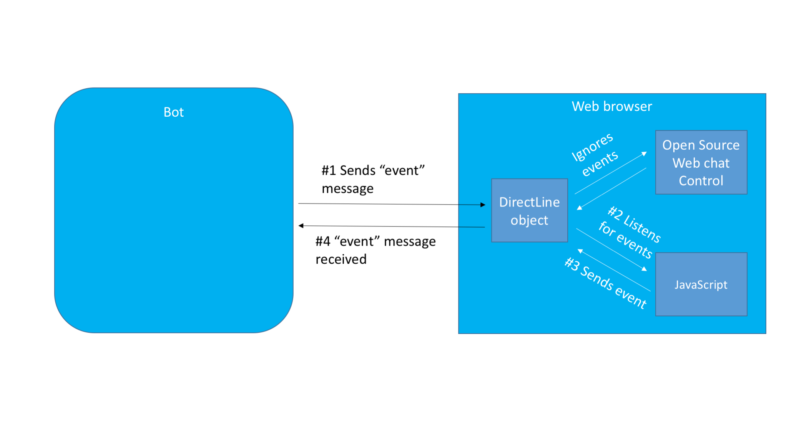

# Use the backchannel mechanism

[!INCLUDE [pre-release-label](../includes/pre-release-label-v3.md)]

[!INCLUDE [Introduction to backchannel mechanism](../includes/snippet-backchannel.md)]

## Walk through

The open source web chat control accesses the Direct Line API by using a JavaScript class 
called <a href="https://github.com/microsoft/botframework-DirectLinejs" target="_blank">DirectLineJS</a>. 
The control can either create its own instance of Direct Line, or it can share one with the hosting page. 
If the control shares an instance of Direct Line with the hosting page, 
both the control and the page will be capable of sending and receiving activities. 
The following diagram shows the high-level architecture of a website that supports bot functionality by 
using the open source web (chat) control and the Direct Line API. 



### Sample code 

In this example, the bot and web page will use the backchannel mechanism to exchange information that is invisible to the user. 
The bot will request that the web page change its background color, and the 
web page will notify the bot when the user clicks a button on the page. 

> [!NOTE]
> The code snippets in this article originate from 
> the <a href="https://github.com/Microsoft/BotFramework-WebChat/blob/master/samples/backchannel/index.html" target="_blank">backchannel sample</a>
> and the <a href="https://github.com/ryanvolum/backChannelBot" target="_blank">backchannel bot</a>. 

#### Client-side code

First, the web page creates a **DirectLine** object.

```javascript
var botConnection = new BotChat.DirectLine(...);
```

Then, it shares the **DirectLine** object when creating the WebChat instance.

```javascript
BotChat.App({
    botConnection: botConnection,
    user: user,
    bot: bot
}, document.getElementById("BotChatGoesHere"));
```

When the user clicks a button on the web page, the web page posts an activity of type "event" 
to notify the bot that the button was clicked.

```javascript
const postButtonMessage = () => {
    botConnection
        .postActivity({type: "event", value: "", from: {id: "me" }, name: "buttonClicked"})
        .subscribe(id => console.log("success"));
    }
```

> [!TIP]
> Use the attributes `name` and `value` to communicate any information that the bot may need in order 
> to properly interpret and/or respond to the event. 

Finally, the web page also listens for a specific event from the bot.
In this example, the web page listens for an activity where type="event" and name="changeBackground". 
When it receives this type of activity, it changes the background color of the web page to the `value` specified by the activity. 

```javascript
botConnection.activity$
    .filter(activity => activity.type === "event" && activity.name === "changeBackground")
    .subscribe(activity => changeBackgroundColor(activity.value))
```

#### Server-side code

The <a href="https://github.com/ryanvolum/backChannelBot" target="_blank">backchannel bot</a> 
creates an event by using a helper function.

```javascript
var bot = new builder.UniversalBot(connector, 
    function (session) {
        var reply = createEvent("changeBackground", session.message.text, session.message.address);
        session.endDialog(reply);
    }
);

const createEvent = (eventName, value, address) => {
    var msg = new builder.Message().address(address);
    msg.data.type = "event";
    msg.data.name = eventName;
    msg.data.value = value;
    return msg;
}
```

Likewise, the bot also listens for events from the client. 
In this example, if the bot receives an event with `name="buttonClicked"`, 
it will send a message to the user to say "I see that you clicked a button."

```javascript
bot.on("event", function (event) {
    var msg = new builder.Message().address(event.address);
    msg.data.textLocale = "en-us";
    if (event.name === "buttonClicked") {
        msg.data.text = "I see that you clicked a button.";
    }
    bot.send(msg);
})
```

## Additional resources

- [Direct Line API][directLineAPI]
- <a href="https://github.com/Microsoft/BotFramework-WebChat" target="_blank">Microsoft Bot Framework WebChat control</a>
- <a href="https://aka.ms/v3-js-backchannel-sample" target="_blank">Backchannel sample</a>
- <a href="https://github.com/ryanvolum/backChannelBot" target="_blank">Backchannel bot</a>

[directLineAPI]: https://docs.botframework.com/en-us/restapi/directline3/#navtitle
