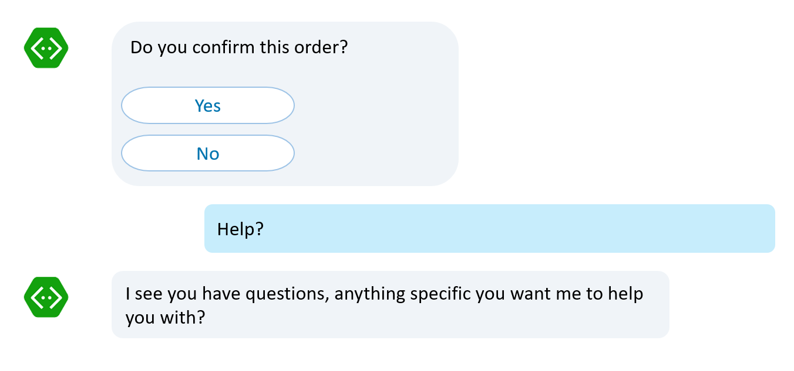

# Handle user actions

[!INCLUDE [pre-release-label](../includes/pre-release-label-v3.md)]

> [!div class="op_single_selector"]
> - [.NET](../dotnet/bot-builder-dotnet-global-handlers.md)
> - [Node.js](../nodejs/bot-builder-nodejs-dialog-actions.md)

Users commonly attempt to access certain functionality within a bot by using keywords like "help", "cancel", or "start over." 
Users do this in the middle of a conversation, when the bot is expecting a different response. By implementing **actions**, you can design your bot to handle such requests more gracefully. The handlers will examine user input for the keywords that you specify, such as "help", "cancel", or "start over," and respond appropriately. 



## Action types

The action types you can attach to a dialog are listed in the table below. The link for each action name will take you to a section that provide more details about that action.

| Action | Scope | Description |
|------|------| ---- |
| [triggerAction](#bind-a-triggeraction) | Global | Binds an action to the dialog that will clear the dialog stack and push itself onto the bottom of stack. Use `onSelectAction` option to override this default behavior. |
| [customAction](#bind-a-customaction) | Global | Binds a custom action to the bot that can process information or take action without affecting the dialog stack. Use `onSelectAction` option to customize the functionality of this action. |
[beginDialogAction](#bind-a-begindialogaction) | Contextual | Binds an action to the dialog that starts another dialog when it is triggered. The starting dialog will be pushed onto the stack and popped off once it ends. |
[reloadAction](#bind-a-reloadaction) | Contextual | Binds an action to the dialog that causes the dialog to reload when it is triggered. You can use `reloadAction` to handle user utterances like "start over." |
[cancelAction](#bind-a-cancelaction) | Contextual | Binds an action to the dialog that cancels the dialog when it is triggered. You can use `cancelAction` to handle user utterances like "cancel" or "nevermind." |
[endConversationAction](#bind-an-endconversationaction) | Contextual | Binds an action to the dialog that ends the conversation with the user when triggered. You can use `endConversationAction` to handle user utterances like "goodbye." |

## Action precedence 

When a bot receives an utterance from a user, it checks the utterance against all the registered actions that are on the dialog stack. The matching starts from the top of the stack down to the bottom of the stack. If nothing matches, then it check the utterance against the `matches` option of all global actions.

The action precedence is important in cases where you use the same command in difference contexts. For example, you can use the "Help" command for the bot as a general help. You can also use "Help" for each of the tasks but these help commands are contextual to each task. For a working sample that elaborates on this point, see [Respond to user input](bot-builder-nodejs-dialog-manage-conversation-flow.md#respond-to-user-input).

## Bind actions to dialog

Either user utterances or button clicks can *trigger* an action, which is associated with a [dialog](https://docs.botframework.com/en-us/node/builder/chat-reference/classes/_botbuilder_d_.dialog.html).
If *matches* is specified, the action will listen for the user to say a word or a phrase that triggers the action.  The `matches` option can take a regular expression or the name of a [recognizer][RecognizeIntent].
To bind the action to a button click, use [CardAction.dialogAction()][CardAction] to trigger the action.

Actions are *chainable*, which allows you to bind as many actions to a dialog as you want.

### Bind a triggerAction

To bind a [triggerAction][triggerAction] to a dialog, do the following:

```javascript
// Order dinner.
bot.dialog('orderDinner', [
    //...waterfall steps...
])
// Once triggered, will clear the dialog stack and pushes
// the 'orderDinner' dialog onto the bottom of stack.
.triggerAction({
    matches: /^order dinner$/i
});
```

Binding a `triggerAction` to a dialog registers it to the bot. Once triggered, the `triggerAction` will clear the dialog stack and push the triggered dialog onto the stack. This action is best used to switch between [topic of conversation](bot-builder-nodejs-dialog-manage-conversation-flow.md#change-the-topic-of-conversation) or to allow users to request arbitrary stand-alone tasks. If you want to override the behavior where this action clears the dialog stack, add an `onSelectAction` option to the `triggerAction`.

The code snippet below shows how to provide general help from a global context without clearing the dialog stack.

```javascript
bot.dialog('help', function (session, args, next) {
    //Send a help message
    session.endDialog("Global help menu.");
})
// Once triggered, will start a new dialog as specified by
// the 'onSelectAction' option.
.triggerAction({
    matches: /^help$/i,
    onSelectAction: (session, args, next) => {
        // Add the help dialog to the top of the dialog stack 
        // (override the default behavior of replacing the stack)
        session.beginDialog(args.action, args);
    }
});
```

In this case, the `triggerAction` is attached to the `help` dialog itself (as opposed to the `orderDinner` dialog). The `onSelectAction` option allows you to start this dialog without clearing the dialog stack. This allows you to handle global requests such as "help", "about", "support", etc. Notice that the `onSelectAction` option explicitly calls the `session.beginDialog` method to start the triggered dialog. The ID of the triggered dialog is provided via the `args.action`. Do not hand code the dialog ID (e.g.: 'help') into this method otherwise you may get runtime errors. If you wish to trigger a contextual help message for the `orderDinner` task itself then consider attaching a `beginDialogAction` to the `orderDinner` dialog instead.

### Bind a customAction

Unlike other action types, `customAction` does not have any default action defined. It's up to you to define what this action does. The benefit of using `customAction` is that you have the option to process user requests without manipulating the dialog stack. When a `customAction` is triggered, the `onSelectAction` option can process the request without pushing new dialogs onto the stack. Once the action is completed, control is passed back to the dialog that is at the top of the stack and the bot can continue.

You can use a `customAction` to provide general and quick action requests such as "What is the temperature outside right now?", "What time is it right now in Paris?", "Remind me to buy milk at 5pm today.", etc. These are general actions that the bot can perform with out manipulating the stack.

Another key difference with `customAction` is that it binds to the bot as opposed to a dialog.

The follow code sample shows how to bind a `customAction` to the `bot` listening for requests to set a reminder.

```javascript
bot.customAction({
    matches: /remind|reminder/gi,
    onSelectAction: (session, args, next) => {
        // Set reminder...
        session.send("Reminder is set.");
    }
})
```

### Bind a beginDialogAction

Binding a `beginDialogAction` to a dialog will register the action to the dialog. This method will start another dialog when it is triggered. The behavior of this action is similar to calling the [beginDialog](https://docs.botframework.com/en-us/node/builder/chat-reference/classes/_botbuilder_d_.session.html#begindialog) method. The new dialog is pushed onto the top of the dialog stack so it does not automatically end the current task. The current task is continued once the new dialog ends. 

The following code snippet shows how to bind a [beginDialogAction][beginDialogAction] to a dialog.

```javascript
// Order dinner.
bot.dialog('orderDinner', [
    //...waterfall steps...
])
// Once triggered, will start the 'showDinnerCart' dialog.
// Then, the waterfall will resumed from the step that was interrupted.
.beginDialogAction('showCartAction', 'showDinnerCart', {
    matches: /^show cart$/i
});

// Show dinner items in cart
bot.dialog('showDinnerCart', function(session){
    for(var i = 1; i < session.conversationData.orders.length; i++){
        session.send(`You ordered: ${session.conversationData.orders[i].Description} for a total of $${session.conversationData.orders[i].Price}.`);
    }

    // End this dialog
    session.endDialog(`Your total is: $${session.conversationData.orders[0].Price}`);
});
```

In cases where you need to pass additional arguments into the new dialog, you can add a [`dialogArgs`](https://docs.botframework.com/en-us/node/builder/chat-reference/interfaces/_botbuilder_d_.idialogactionoptions#dialogargs) option to the action.

Using the sample above, you can modify it to accept arguments passed in via the `dialogArgs`.

```javascript
// Order dinner.
bot.dialog('orderDinner', [
    //...waterfall steps...
])
// Once triggered, will start the 'showDinnerCart' dialog.
// Then, the waterfall will resumed from the step that was interrupted.
.beginDialogAction('showCartAction', 'showDinnerCart', {
    matches: /^show cart$/i,
    dialogArgs: {
        showTotal: true;
    }
});

// Show dinner items in cart with the option to show total or not.
bot.dialog('showDinnerCart', function(session, args){
    for(var i = 1; i < session.conversationData.orders.length; i++){
        session.send(`You ordered: ${session.conversationData.orders[i].Description} for a total of $${session.conversationData.orders[i].Price}.`);
    }

    if(args && args.showTotal){
        // End this dialog with total.
        session.endDialog(`Your total is: $${session.conversationData.orders[0].Price}`);
    }
    else{
        session.endDialog(); // Ends without a message.
    }
});
```

### Bind a reloadAction

Binding a `reloadAction` to a dialog will register it to the dialog. Binding this action to a dialog causes the dialog to restart when the action is triggered. Triggering this action is similar to calling the [replaceDialog](https://docs.botframework.com/en-us/node/builder/chat-reference/classes/_botbuilder_d_.session.html#replacedialog) method. This is useful for implementing logic to handle user utterances like "start over" or to create [loops](bot-builder-nodejs-dialog-replace.md#repeat-an-action).

The following code snippet shows how to bind a [reloadAction][reloadAction] to a dialog.

```javascript
// Order dinner.
bot.dialog('orderDinner', [
    //...waterfall steps...
])
// Once triggered, will restart the dialog.
.reloadAction('startOver', 'Ok, starting over.', {
    matches: /^start over$/i
});
```

In cases where you need to pass additional arguments into the reloaded dialog, you can add a [`dialogArgs`](https://docs.botframework.com/en-us/node/builder/chat-reference/interfaces/_botbuilder_d_.idialogactionoptions#dialogargs) option to the action. This option is passed into the `args` parameter. Rewriting the sample code above to receive an argument on a reload action will look something like this:

```javascript
// Order dinner.
bot.dialog('orderDinner', [
    function(session, args, next){
        if(args && args.isReloaded){
            // Reload action was triggered.
        }

        session.send("Lets order some dinner!");
        builder.Prompts.choice(session, "Dinner menu:", dinnerMenu);
    }
    //...other waterfall steps...
])
// Once triggered, will restart the dialog.
.reloadAction('startOver', 'Ok, starting over.', {
    matches: /^start over$/i,
    dialogArgs: {
        isReloaded: true;
    }
});
```

### Bind a cancelAction

Binding a `cancelAction` will register it to the dialog. Once triggered, this action will abruptly end the dialog. Once the dialog ends, the parent dialog will resume with a resumed code indicating that it was `canceled`. This action allows you to handle utterances such as "nevermind" or "cancel." If you need to programmatically cancel a dialog instead, see [Cancel a dialog](bot-builder-nodejs-dialog-replace.md#cancel-a-dialog). For more information on *resumed code*, see [Prompt results](bot-builder-nodejs-dialog-prompt.md#prompt-results). 

The following code snippet shows how to bind a [cancelAction][cancelAction] to a dialog.

```javascript
// Order dinner.
bot.dialog('orderDinner', [
    //...waterfall steps...
])
//Once triggered, will end the dialog.
.cancelAction('cancelAction', 'Ok, cancel order.', {
    matches: /^nevermind$|^cancel$|^cancel.*order/i
});
```

### Bind an endConversationAction

Binding an `endConversationAction` will register it to the dialog. Once triggered, this action ends the conversation with the user. Triggering this action is similar to calling the [endConversation](https://docs.botframework.com/en-us/node/builder/chat-reference/classes/_botbuilder_d_.session.html#endconversation) method. Once a conversation ends, the Bot Framework SDK for Node.js will clear the dialog stack and persisted state data. For more information on persisted state data, see [Manage state data](bot-builder-nodejs-state.md).

The following code snippet shows how to bind an [endConversationAction][endConversationAction] to a dialog.

```javascript
// Order dinner.
bot.dialog('orderDinner', [
    //...waterfall steps...
])
// Once triggered, will end the conversation.
.endConversationAction('endConversationAction', 'Ok, goodbye!', {
    matches: /^goodbye$/i
});
```

## Confirm interruptions

Most, if not, all of these actions interrupt the normal flow of a conversation. Many are disruptive and should be handle with care. For example, the `triggerAction`, `cancelAction`, or the `endConversationAction` will clear the dialog stack. If the user made the mistake of triggering either of these actions, they will have to start the task over again. To make sure the user really intended to trigger these actions, you can add a `confirmPrompt` option to these actions. The `confirmPrompt` will ask if the user is sure about canceling or ending the current task. It allows the user to change their minds and continue the process.

The code snippet below shows a [cancelAction][cancelAction] with a [confirmPrompt](http://docs.botframework.com/en-us/node/builder/chat-reference/interfaces/_botbuilder_d_.itriggeractionoptions#confirmprompt) to make sure the user really wants to cancel the order process.

```javascript
// Order dinner.
bot.dialog('orderDinner', [
    //...waterfall steps...
])
// Confirm before triggering the action.
// Once triggered, will end the dialog. 
.cancelAction('cancelAction', 'Ok, cancel order.', {
    matches: /^nevermind$|^cancel$|^cancel.*order/i,
    confirmPrompt: "Are you sure?"
});
```

Once this action is triggered, it will ask the user "Are you sure?" The user will have to answer "Yes" to go through with the action or "No" to cancel the action and continue where they were.

## Next steps

**Actions** allow you to anticipate user requests and allow the bot to handle those requests gracefully. Many of these actions are disruptive to the current conversation flow. If you want to allow users the ability to switch out and resume a conversation flow, you need to save the user state before switching out. Let's take a closer look at how to save user state and manage state data.

> [!div class="nextstepaction"]
> [Manage state data](bot-builder-nodejs-state.md)


[triggerAction]: https://docs.botframework.com/en-us/node/builder/chat-reference/classes/_botbuilder_d_.dialog.html#triggeraction

[cancelAction]: https://docs.botframework.com/en-us/node/builder/chat-reference/classes/_botbuilder_d_.dialog.html#cancelaction

[reloadAction]: https://docs.botframework.com/en-us/node/builder/chat-reference/classes/_botbuilder_d_.dialog.html#reloadaction

[beginDialogAction]: https://docs.botframework.com/en-us/node/builder/chat-reference/classes/_botbuilder_d_.dialog.html#begindialogaction

[endConversationAction]: https://docs.botframework.com/en-us/node/builder/chat-reference/classes/_botbuilder_d_.dialog.html#endconversationaction

[RecognizeIntent]: bot-builder-nodejs-recognize-intent-messages.md

[CardAction]: https://docs.botframework.com/en-us/node/builder/chat-reference/classes/_botbuilder_d_.cardaction#dialogaction
