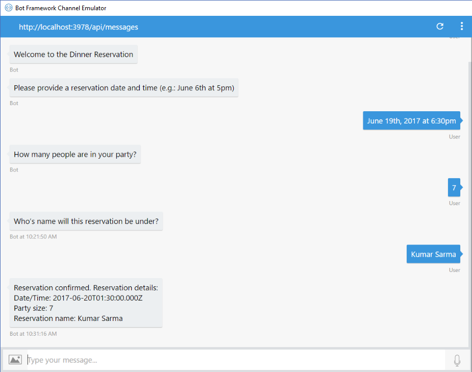

# Manage conversation flow with dialogs

[!INCLUDE [pre-release-label](../includes/pre-release-label-v3.md)]

> [!div class="op_single_selector"]
> - [.NET](../dotnet/bot-builder-dotnet-manage-conversation-flow.md)
> - [Node.js](../nodejs/bot-builder-nodejs-dialog-manage-conversation-flow.md)

Managing conversation flow is an essential task in building bots. A bot needs to be able to perform core tasks elegantly and handle interruptions gracefully. With the Bot Framework SDK for Node.js, you can manage conversation flow using dialogs.

A dialog is like a function in a program. It is generally designed to perform a specific operation and it can be invoked as often as it is needed. You can chain multiple dialogs together to handle just about any conversation flow that you want your bot to handle. The Bot Framework SDK for Node.js includes built-in features such as [prompts](bot-builder-nodejs-dialog-prompt.md) and [waterfalls](bot-builder-nodejs-dialog-waterfall.md) to help you manage conversation flow.

This article provides a series of examples to explain how to manage both simple conversation flows and complex conversation flows where your bot can handle interruptions and resume the flow gracefully using dialogs. The examples are based on the following scenarios: 

1. Your bot will take a dinner reservation.
2. Your bot can process "Help" request at any time during the reservation.
3. Your bot can process context-sensitive "Help" for current step of the reservation.
4. Your bot can handle multiple topics of conversation.

## Manage conversation flow with a waterfall

A [waterfall](bot-builder-nodejs-dialog-waterfall.md) is a dialog that allows the bot to easily walk a user through a series of tasks. In this example, the reservation bot asks the user a series of questions so that the bot can process the reservation request. The bot will prompt the user for the following information:

1. Reservation date and time
2. Number of people in the party
3. Name of the person making the reservation

The following code sample shows how to use a waterfall to guide the user through a series of prompts.

```javascript
var inMemoryStorage = new builder.MemoryBotStorage();

// This is a dinner reservation bot that uses a waterfall technique to prompt users for input.
var bot = new builder.UniversalBot(connector, [
    function (session) {
        session.send("Welcome to the dinner reservation.");
        builder.Prompts.time(session, "Please provide a reservation date and time (e.g.: June 6th at 5pm)");
    },
    function (session, results) {
        session.dialogData.reservationDate = builder.EntityRecognizer.resolveTime([results.response]);
        builder.Prompts.number(session, "How many people are in your party?");
    },
    function (session, results) {
        session.dialogData.partySize = results.response;
        builder.Prompts.text(session, "Whose name will this reservation be under?");
    },
    function (session, results) {
        session.dialogData.reservationName = results.response;
        
        // Process request and display reservation details
        session.send(`Reservation confirmed. Reservation details: <br/>Date/Time: ${session.dialogData.reservationDate} <br/>Party size: ${session.dialogData.partySize} <br/>Reservation name: ${session.dialogData.reservationName}`);
        session.endDialog();
    }
]).set('storage', inMemoryStorage); // Register in-memory storage 
```

The core functionality of this bot occurs in the default dialog. The default dialog is defined when the bot is created: 

```javascript
var bot = new builder.UniversalBot(connector, [..waterfall steps..]); 
```

Also, during this creation process, you can set which [data storage](bot-builder-nodejs-state.md) you want to use. For instance, to use the in-memory storage, you can set it as follows:

```javascript
var inMemoryStorage = new builder.MemoryBotStorage();
var bot = new builder.UniversalBot(connector, [..waterfall steps..]).set('storage', inMemoryStorage); // Register in-memory storage 
```

The default dialog is created as an array of functions that define the steps of the waterfall. In the example, there are four functions so the waterfall has four steps. Each step performs a single task and the results are processed in the next step. The process continues until the last step, where the reservation is confirmed and the dialog ends.

The following screen shot shows the results of this bot running in the [Bot Framework Emulator](../bot-service-debug-emulator.md):



### Prompt user for input

Each step of this example uses a prompt to ask the user for input. A prompt is a special type of dialog that asks for user input, waits for a response, and returns the response to the next step in the waterfall. See [Prompt users for input](bot-builder-nodejs-dialog-prompt.md) for information about the many different types of prompts you can use in your bot.

In this example, the bot uses `Prompts.text()` to solicit a freeform response from the user in text format. The user can respond with any text and the bot must decide how to handle the response. `Prompts.time()` uses the [Chrono](https://github.com/wanasit/chrono) library to parse for date and time information from a string. This allows your bot to understand more natural language for specifying date and time. For example: "June 6th, 2017 at 9pm", "Today at 7:30pm", "next monday at 6pm", and so on.

> [!TIP] 
> The time that the user enters is converted to UTC time based upon the time zone of the server that hosts the bot. Since the server may be located in a different time zone than the user, be sure to take time zones into consideration. To convert date and time to the user's local time, consider asking the user what time zone they are in.

## Manage a conversation flow with multiple dialogs

Another technique for managing conversation flow is to use a combination of waterfall and multiple dialogs. The waterfall allows you to chain functions together in a dialog, while dialogs enable you to break a conversation into smaller pieces of functionality that can be reused at any time.

For example, consider the dinner reservation bot. The following code sample shows the previous example rewritten to use waterfall and multiple dialogs.

```javascript
var inMemoryStorage = new builder.MemoryBotStorage();

// This is a dinner reservation bot that uses multiple dialogs to prompt users for input.
var bot = new builder.UniversalBot(connector, [
    function (session) {
        session.send("Welcome to the dinner reservation.");
        session.beginDialog('askForDateTime');
    },
    function (session, results) {
        session.dialogData.reservationDate = builder.EntityRecognizer.resolveTime([results.response]);
        session.beginDialog('askForPartySize');
    },
    function (session, results) {
        session.dialogData.partySize = results.response;
        session.beginDialog('askForReserverName');
    },
    function (session, results) {
        session.dialogData.reservationName = results.response;

        // Process request and display reservation details
        session.send(`Reservation confirmed. Reservation details: <br/>Date/Time: ${session.dialogData.reservationDate} <br/>Party size: ${session.dialogData.partySize} <br/>Reservation name: ${session.dialogData.reservationName}`);
        session.endDialog();
    }
]).set('storage', inMemoryStorage); // Register in-memory storage 

// Dialog to ask for a date and time
bot.dialog('askForDateTime', [
    function (session) {
        builder.Prompts.time(session, "Please provide a reservation date and time (e.g.: June 6th at 5pm)");
    },
    function (session, results) {
        session.endDialogWithResult(results);
    }
]);

// Dialog to ask for number of people in the party
bot.dialog('askForPartySize', [
    function (session) {
        builder.Prompts.text(session, "How many people are in your party?");
    },
    function (session, results) {
        session.endDialogWithResult(results);
    }
])

// Dialog to ask for the reservation name.
bot.dialog('askForReserverName', [
    function (session) {
        builder.Prompts.text(session, "Who's name will this reservation be under?");
    },
    function (session, results) {
        session.endDialogWithResult(results);
    }
]);
```

The results from executing this bot are exactly the same as the previous bot where only waterfall is used. However, programmatically, there are two primary differences:

1. The default dialog is dedicated to managing the flow of the conversation.
2. The task for each step of the conversation is being managed by a separate dialog. In this case, the bot needed three pieces of information so it prompts the user three times. Each prompt is now contained within its own dialog.

With this technique, you can separate the conversation flow from the task logic. This allows the dialogs to be reused by different conversation flows if necessary. 

## Respond to user input

In the process of guiding the user through a series of tasks, if the user has questions or wants to request additional information before answering, how would you handle those requests? For example, regardless of where the user is in the conversation, how would the bot respond if the user enters "Help", "Support" or "Cancel"? What if the user wants additional information about a step? What happens if the user changes their mind and wants to abandon the current task to start a completely different task?

The Bot Framework SDK for Node.js allows a bot to listen for certain input within a global context or within a local context in the scope of the current dialog. These inputs are called [actions](bot-builder-nodejs-dialog-actions.md), which allow the bot to listen for user input based on a `matches` clause. It's up to the bot to decide how to react to specific user inputs.

### Handle global action

If you want your bot to be able to handle actions at any point in a conversation, use `triggerAction`. Triggers allow the bot to invoke a specific dialog when the input matches the specified term. For example, if you want to support a global "Help" option, you can create a help dialog and attach a `triggerAction` that listens for input matching "Help".

The following code sample shows how to attach a `triggerAction` to a dialog to specify that the dialog should be invoked when the user enters "help".

```javascript
// The dialog stack is cleared and this dialog is invoked when the user enters 'help'.
bot.dialog('help', function (session, args, next) {
    session.endDialog("This is a bot that can help you make a dinner reservation. <br/>Please say 'next' to continue");
})
.triggerAction({
    matches: /^help$/i,
});
```

By default, when a `triggerAction` executes, the dialog stack is cleared and the triggered dialog becomes the new default dialog. In this example, when the `triggerAction` executes, the dialog stack is cleared and the `help` dialog is then added to the stack as the new default dialog. If this is not the desired behavior, you can add the `onSelectAction` option to the `triggerAction`. The `onSelectAction` option allows the bot to start a new dialog without clearing the dialog stack, which enables the conversation to be temporarily redirected and later resume where it left off.

The following code sample shows how to use the `onSelectAction` option with `triggerAction` so that the `help` dialog is added to the existing dialog stack (and the dialog stack is not cleared).

```javascript
bot.dialog('help', function (session, args, next) {
    session.endDialog("This is a bot that can help you make a dinner reservation. <br/>Please say 'next' to continue");
})
.triggerAction({
    matches: /^help$/i,
    onSelectAction: (session, args, next) => {
        // Add the help dialog to the dialog stack 
        // (override the default behavior of replacing the stack)
        session.beginDialog(args.action, args);
    }
});
```

In this example, the `help` dialog takes control of the conversation when the user enters "help". Because the `triggerAction` contains the `onSelectAction` option, the `help` dialog is pushed onto the existing dialog stack and the stack is not cleared. When the `help` dialog ends, it is removed from the dialog stack and the conversation resumes from the point at which it was interrupted with the `help` command.

### Handle contextual action

In the previous example, the `help` dialog is invoked if the user enters "help" at any point in the conversation. As such, the dialog can only offer general help guidance, as there is no specific context for the user's help request. But, what if the user wants to request help regarding a specific point in the conversation? In that case, the `help` dialog must be triggered within the context of the current dialog.

For example, consider the dinner reservation bot. What if a user wants to know the maximum party size when they are asked for the number of members in their party? To handle this scenario, you can attach a `beginDialogAction` to the `askForPartySize` dialog, listening for the user input "help".

The following code sample shows how to attach context-sensitive help to a dialog using `beginDialogAction`.

```javascript
// Dialog to ask for number of people in the party
bot.dialog('askForPartySize', [
    function (session) {
        builder.Prompts.text(session, "How many people are in your party?");
    },
    function (session, results) {
       session.endDialogWithResult(results);
    }
])
.beginDialogAction('partySizeHelpAction', 'partySizeHelp', { matches: /^help$/i });

// Context Help dialog for party size
bot.dialog('partySizeHelp', function(session, args, next) {
    var msg = "Party size help: Our restaurant can support party sizes up to 150 members.";
    session.endDialog(msg);
})
```

In this example, whenever the user enters "help", the bot will push the `partySizeHelp` dialog onto the stack. That dialog sends a help message to the user and then ends the dialog, returning control back to the `askForPartySize` dialog which reprompts the user for a party size.

It is important to note that this context-sensitive help is only executed when the user is in the `askForPartySize` dialog. Otherwise, the general help message from the `triggerAction` will execute instead. In other words, the local `matches` clause always takes precedence over the global `matches` clause. For example, if a `beginDialogAction` matches for **help**, then the matches for **help** in the `triggerAction` will not be executed. For more information, see [Action precedence](bot-builder-nodejs-dialog-actions.md#action-precedence).

### Change the topic of conversation

By default, executing a `triggerAction` clears the dialog stack and resets the conversation, starting with the specified dialog. This behavior is often preferable when your bot needs to switch from one topic of conversation to another, such as if a user in the midst of booking a dinner reservation instead decides to order dinner to be delivered to their hotel room. 

The following example builds upon the previous one such that the bot allows the user to either make a dinner reservation or order dinner to be delivered. In this bot, the default dialog is a greeting dialog that presents two options to the user: `Dinner Reservation` and `Order Dinner`.

```javascript
var inMemoryStorage = new builder.MemoryBotStorage();

// This bot enables users to either make a dinner reservation or order dinner.
var bot = new builder.UniversalBot(connector, function(session){
    var msg = "Welcome to the reservation bot. Please say `Dinner Reservation` or `Order Dinner`";
    session.send(msg);
}).set('storage', inMemoryStorage); // Register in-memory storage 
```

The dinner reservation logic that was in the default dialog of the previous example is now in its own dialog called `dinnerReservation`. The flow of the `dinnerReservation` remains the same as the multiple dialog version discussed earlier. The only difference is that the dialog has a `triggerAction` attached to it. Notice that in this version, the `confirmPrompt` asks the user to confirm that they want to change the topic of conversation, before invoking the new dialog. It is good practice to include a `confirmPrompt` in scenarios like this because once the dialog stack is cleared, the user will be directed to the new topic of conversation, thereby abandoning the topic of conversation that was underway.

```javascript
// This dialog helps the user make a dinner reservation.
bot.dialog('dinnerReservation', [
    function (session) {
        session.send("Welcome to the dinner reservation.");
        session.beginDialog('askForDateTime');
    },
    function (session, results) {
        session.dialogData.reservationDate = builder.EntityRecognizer.resolveTime([results.response]);
        session.beginDialog('askForPartySize');
    },
    function (session, results) {
        session.dialogData.partySize = results.response;
        session.beginDialog('askForReserverName');
    },
    function (session, results) {
        session.dialogData.reservationName = results.response;

        // Process request and display reservation details
        session.send(`Reservation confirmed. Reservation details: <br/>Date/Time: ${session.dialogData.reservationDate} <br/>Party size: ${session.dialogData.partySize} <br/>Reservation name: ${session.dialogData.reservationName}`);
        session.endDialog();
    }
])
.triggerAction({
    matches: /^dinner reservation$/i,
    confirmPrompt: "This will cancel your current request. Are you sure?"
});
```

The second topic of conversation is defined in the `orderDinner` dialog using a waterfall. This dialog simply displays the dinner menu and prompts the user for a room number after the order is specified. A `triggerAction` is attached to the dialog to specify that it should be invoked when the user enters "order dinner" and to ensure that the user is prompted to confirm their selection, should they indicate a desire to change the topic of conversation.

```javascript
// This dialog help the user order dinner to be delivered to their hotel room.
var dinnerMenu = {
    "Potato Salad - $5.99": {
        Description: "Potato Salad",
        Price: 5.99
    },
    "Tuna Sandwich - $6.89": {
        Description: "Tuna Sandwich",
        Price: 6.89
    },
    "Clam Chowder - $4.50":{
        Description: "Clam Chowder",
        Price: 4.50
    }
};

bot.dialog('orderDinner', [
    function(session){
        session.send("Lets order some dinner!");
        builder.Prompts.choice(session, "Dinner menu:", dinnerMenu);
    },
    function (session, results) {
        if (results.response) {
            var order = dinnerMenu[results.response.entity];
            var msg = `You ordered: ${order.Description} for a total of $${order.Price}.`;
            session.dialogData.order = order;
            session.send(msg);
            builder.Prompts.text(session, "What is your room number?");
        } 
    },
    function(session, results){
        if(results.response){
            session.dialogData.room = results.response;
            var msg = `Thank you. Your order will be delivered to room #${session.dialogData.room}`;
            session.endDialog(msg);
        }
    }
])
.triggerAction({
    matches: /^order dinner$/i,
    confirmPrompt: "This will cancel your order. Are you sure?"
});
```

After the user starts a conversation and selects either `Dinner Reservation` or `Order Dinner`, they may change their mind at any time. For example, if the user is in the middle of making a dinner reservation and enters "order dinner," the bot will confirm by saying, "This will cancel your current request. Are you sure?". If the user types "no," then the request is canceled and the user can continue with the dinner reservation process. If the user types "yes," the bot will clear the dialog stack and transfer control of the conversation to the `orderDinner` dialog.

## End conversation

In the examples above, dialogs are closed by either using `session.endDialog` or `session.endDialogWithResult`, both of which end the dialog, remove it from the stack, and return control to the calling dialog. In situations where the user has reached the end of the conversation, you should use `session.endConversation` to indicate that the conversation is finished.

The [`session.endConversation`](https://docs.botframework.com/en-us/node/builder/chat-reference/classes/_botbuilder_d_.session#endconversation) method ends a conversation and optionally sends a message to the user. For example, the `orderDinner` dialog in the previous example could end the conversation by using `session.endConversation`, as shown in the following code sample.

```javascript
bot.dialog('orderDinner', [
    //...waterfall steps...
    // Last step
    function(session, results){
        if(results.response){
            session.dialogData.room = results.response;
            var msg = `Thank you. Your order will be delivered to room #${session.dialogData.room}`;
            session.endConversation(msg);
        }
    }
]);
```

Calling `session.endConversation` will end the conversation by clearing the dialog stack and resetting the [`session.conversationData`](https://docs.botframework.com/en-us/node/builder/chat-reference/classes/_botbuilder_d_.session#conversationdata) storage. For more information on data storage, see [Manage state data](bot-builder-nodejs-state.md).

Calling `session.endConversation` is a logical thing to do when the user completes the conversation flow for which the bot is designed. You may also use `session.endConversation` to end the conversation in situations where the user enters "cancel" or "goodbye" in the midst of a conversation. To do so, simply attach an `endConversationAction` to the dialog and have this trigger listen for input matching "cancel" or "goodbye".

The following code sample shows how to attach an `endConversationAction` to a dialog to end the conversation if the user enters "cancel" or "goodbye".

```javascript
bot.dialog('dinnerOrder', [
    //...waterfall steps...
])
.endConversationAction(
    "endOrderDinner", "Ok. Goodbye.",
    {
        matches: /^cancel$|^goodbye$/i,
        confirmPrompt: "This will cancel your order. Are you sure?"
    }
);
```

Since ending a conversation with `session.endConversation` or `endConversationAction` will clear the dialog stack and force the user to start over, you should include a `confirmPrompt` to ensure that the user really wants to do so.

## Next steps

In this article, you explore ways to manage conversations that are sequential in nature. What if you want to repeat a dialog or use looping pattern in your conversation? Let's see how you can do that by replacing dialogs on the stack.

> [!div class="nextstepaction"]
> [Replace dialogs](bot-builder-nodejs-dialog-replace.md)

