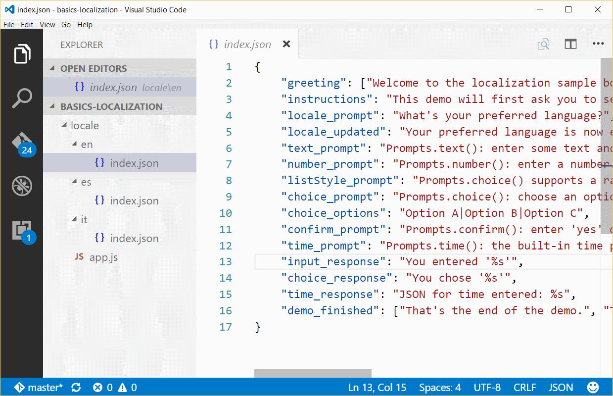
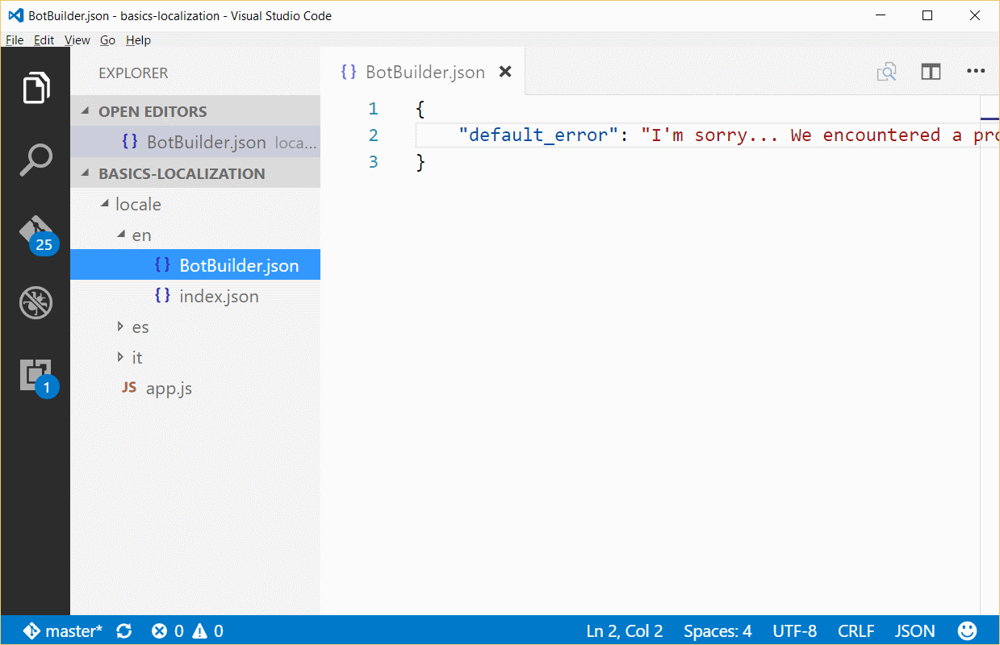

# Support localization

[!INCLUDE [pre-release-label](../includes/pre-release-label-v3.md)]

Bot Builder includes a rich localization system for building bots that can communicate with the user in multiple languages. All of your bot's prompts can be localized using JSON files stored in your bot's directory structure. If you’re using a system like LUIS to perform natural language processing, you can configure your [LuisRecognizer][LUISRecognizer] with a separate model for each language your bot supports and the SDK will automatically select the model that matches the user's preferred locale.

## Determine the locale by prompting the user
The first step to localizing your bot is adding the ability to identify the user's preferred language. The SDK provides a [session.preferredLocale()][preferredLocal] method to both save and retrieve this preference on a per-user basis. The following example is a dialog to prompt the user for their preferred language and then save their choice.

``` javascript
bot.dialog('/localePicker', [
    function (session) {
        // Prompt the user to select their preferred locale
        builder.Prompts.choice(session, "What's your preferred language?", 'English|Español|Italiano');
    },
    function (session, results) {
        // Update preferred locale
        var locale;
        switch (results.response.entity) {
            case 'English':
                locale = 'en';
                break;
            case 'Español':
                locale = 'es';
                break;
            case 'Italiano':
                locale = 'it';
                break;
        }
        session.preferredLocale(locale, function (err) {
            if (!err) {
                // Locale files loaded
                session.endDialog(`Your preferred language is now ${results.response.entity}`);
            } else {
                // Problem loading the selected locale
                session.error(err);
            }
        });
    }
]);
```

## Determine the locale by using analytics
Another way to determine the user's locale is to use a service like the [Text Analytics API](/azure/cognitive-services/cognitive-services-text-analytics-quick-start) to automatically detect the user's language based upon the text of the message they sent.

The code snippet below illustrates how you can incorporate this service into your own bot.
``` javascript
var request = require('request');

bot.use({
    receive: function (event, next) {
        if (event.text && !event.textLocale) {
            var options = {
                method: 'POST',
                url: 'https://westus.api.cognitive.microsoft.com/text/analytics/v2.0/languages?numberOfLanguagesToDetect=1',
                body: { documents: [{ id: 'message', text: event.text }]},
                json: true,
                headers: {
                    'Ocp-Apim-Subscription-Key': '<YOUR API KEY>'
                }
            };
            request(options, function (error, response, body) {
                if (!error && body) {
                    if (body.documents && body.documents.length > 0) {
                        var languages = body.documents[0].detectedLanguages;
                        if (languages && languages.length > 0) {
                            event.textLocale = languages[0].iso6391Name;
                        }
                    }
                }
                next();
            });
        } else {
            next();
        }
    }
});
```

Once you add the above code snippet to your bot, calling [session.preferredLocale()][preferredLocal] will automatically return the detected language. The search order for `preferredLocale()` is as follows:
1. Locale saved by calling `session.preferredLocale()`. This value is stored in `session.userData['BotBuilder.Data.PreferredLocale']`.
2. Detected locale assigned to `session.message.textLocale`.
3. The configured default locale for the bot (e.g.: English (‘en’)).

You can configure the bot's default locale using its constructor:

```javascript
var bot = new builder.UniversalBot(connector, {
    localizerSettings: { 
        defaultLocale: "es" 
    }
});
```

## Localize prompts
The default localization system for the Bot Framework SDK is file-based and allows a bot to support multiple languages using JSON files stored on disk. By default, the localization system will search for the bot's prompts in the **./locale/<IETF TAG>/index.json** file where <IETF TAG> is a valid [IETF language tag][IEFT] representing the preferred locale for which to find prompts. 

The following screenshot shows the directory structure for a bot that supports three languages: English, Italian, and Spanish.



The structure of the file is a simple JSON map of message IDs to localized text strings. If the value is an array instead of a string, one prompt from the array is chosen at random when that value is retrieved using [session.localizer.gettext()][GetText]. 

The bot automatically retrieves the localized version of a message if you pass the message ID in a call to [session.send()](http://docs.botframework.com/en-us/node/builder/chat-reference/classes/_botbuilder_d_.session#send) instead of language-specific text:

```javascript
var bot = new builder.UniversalBot(connector, [
    function (session) {
        session.send("greeting");
        session.send("instructions");
        session.beginDialog('/localePicker');
    },
    function (session) {
        builder.Prompts.text(session, "text_prompt");
    }
]);
```

Internally, the SDK calls [`session.preferredLocale()`][preferredLocale] to get the user's preferred locale and then uses that in a call to [`session.localizer.gettext()`][GetText] to map the message ID to its localized text string.  There are times where you may need to manually call the localizer. For instance, the enum values passed to [`Prompts.choice()`][promptsChoice] are never automatically localized so you may need to manually retrieve a localized list prior to calling the prompt:

```javascript
var options = session.localizer.gettext(session.preferredLocale(), "choice_options");
builder.Prompts.choice(session, "choice_prompt", options);
```

The default localizer searches for a message ID across multiple files and if it can’t find an ID (or if no localization files were provided) it will simply return the text of ID, making the use of localization files transparent and optional.  Files are searched in the following order:

1. The **index.json** file under the locale returned by [`session.preferredLocale()`][preferredLocale] is searched.
2. If the locale included an optional subtag like **en-US** then the root tag of **en** is searched.
3. The bot's configured default locale is searched.

## Use namespaces to customize and localize prompts
The default localizer supports the namespacing of prompts to avoid collisions between message IDs.  Your bot can override namespaced prompts to customize or reword the prompts from another namespace.  You can leverage this capability to customize the SDK’s built-in messages, letting you either add support for additional languages or to simply reword the SDK's current messages.  For instance, you can change the SDK’s default error message by simply adding a file called **BotBuilder.json** to your bot's locale directory and then adding an entry for the `default_error` message ID:




## Additional resources

To learn about how to localize a recognizer, see [Recognizing intent](bot-builder-nodejs-recognize-intent-messages.md).


[LUIS]: https://www.luis.ai/
[IMessage]: http://docs.botframework.com/en-us/node/builder/chat-reference/interfaces/_botbuilder_d_.imessage
[IntentRecognizerSetOptions]: https://docs.botframework.com/en-us/node/builder/chat-reference/interfaces/_botbuilder_d_.iintentrecognizersetoptions.html
[LUISRecognizer]: https://docs.botframework.com/en-us/node/builder/chat-reference/classes/_botbuilder_d_.luisrecognizer
[LUISSample]: https://aka.ms/v3-js-luisSample
[DisambiguationSample]: https://aka.ms/v3-js-onDisambiguateRoute
[preferredLocal]: https://docs.botframework.com/en-us/node/builder/chat-reference/classes/_botbuilder_d_.session#preferredlocale
[preferredLocale]: https://docs.botframework.com/en-us/node/builder/chat-reference/classes/_botbuilder_d_.session#preferredlocale
[promptsChoice]: https://docs.botframework.com/en-us/node/builder/chat-reference/interfaces/_botbuilder_d_.__global.iprompts.html#choice
[GetText]: https://docs.botframework.com/en-us/node/builder/chat-reference/interfaces/_botbuilder_d_.ilocalizer.html#gettext
[IEFT]: https://en.wikipedia.org/wiki/IETF_language_tag

