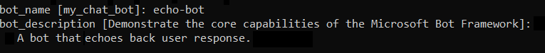
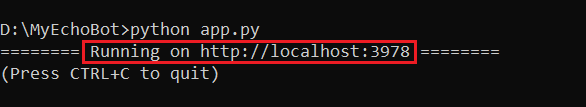
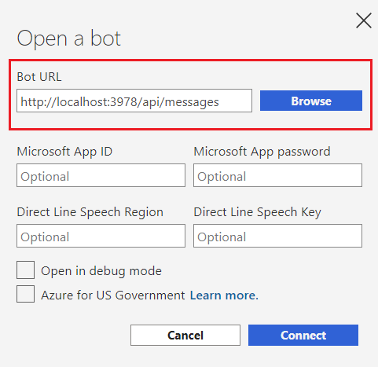
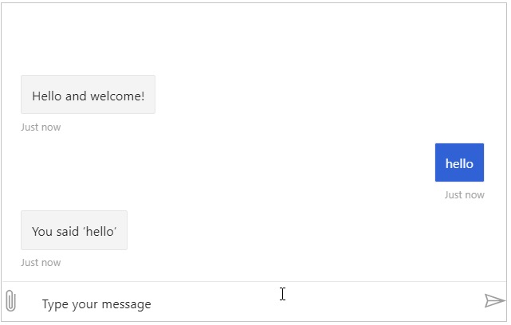

# Create a bot with the Bot Framework SDK for Python

[!INCLUDE [applies-to-v4](../includes/applies-to.md)]

This quickstart walks you through building a bot by using the Python Echo Bot template, and then testing it with the Bot Framework Emulator.

## Prerequisites
- Python [3.6](https://www.python.org/downloads/release/python-369/) or [3.7](https://www.python.org/downloads/release/python-375/)
- [Bot Framework Emulator](https://aka.ms/bot-framework-emulator-readme)
- [git](https://git-scm.com/)
- knowledge of ansynchronous programming in Python

## Create a bot
1. Open a terminal and navigate to the folder where you're saving your bot locally. Install the necessary packages by running the following commands:
- `pip install botbuilder-core`
- `pip install asyncio`
- `pip install cookiecutter`

The last package, cookiecutter, will be used to generate your bot. Verify that cookiecutter was installed correctly by running `cookiecutter --help`.

2. To create your bot run:

```cmd
cookiecutter https://github.com/microsoft/botbuilder-python/releases/download/Templates/echo.zip
```

This command creates an Echo Bot based on the Python [echo template](https://github.com/microsoft/botbuilder-python/tree/master/generators/app/templates/echo).

3. You will then be prompted for the *name* of the bot and a *description*. Name your bot `echo-bot` and set the description to `A bot that echoes back user response.` as shown below:



Copy the last four digits in the address on the last line (usually 3978) since you will be using them in the next step. You are now ready to start your bot.

## Start you bot
1. From a terminal navigate to the `echo-bot` folder where you saved your bot. Run `pip install -r requirements.txt` to install any required packages to run your bot.

2. Once the packages are installed run `python app.py` to start your bot. You will know your bot is ready to test when you see  the last line shown in the screenshot below:



## Start the Emulator and connect your bot
1. Start the Emulator and click the **Open Bot** button.

2. After clicking the button a box window will open where you set the necessary values to run the bot. Use the number you saved earlier and set the **Bot URL** to `http://localhost:<saved number>/api/messages` as seen below:



3. Click the **Connect** button and your bot should start. Try testing the bot by typing anything and clicking *Enter* as seen below:



## Additional resources
See [tunneling (ngrok)](https://github.com/Microsoft/BotFramework-Emulator/wiki/Tunneling-(ngrok)) for how to connect to a bot hosted remotely.

## Next steps

> [!div class="nextstepaction"]
> [Deploy your bot to Azure](../bot-builder-deploy-az-cli.md)

