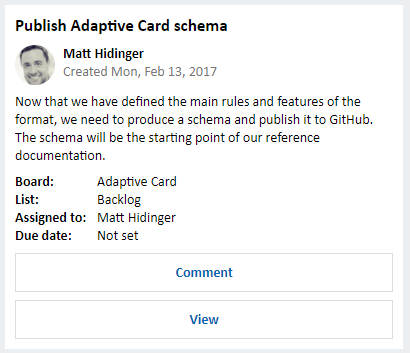

# Add rich card attachments to messages

> [!div class="op_single_selector"]
> - [.NET](../dotnet/bot-builder-dotnet-add-rich-card-attachments.md)
> - [Node.js](../nodejs/bot-builder-nodejs-send-rich-cards.md)
> - [REST](../rest-api/bot-framework-rest-connector-add-rich-cards.md)

Bots and channels typically exchange text strings but some channels also support exchanging attachments, which lets your bot send richer messages to users. For example, your bot can send rich cards and media attachments (e.g., images, videos, audio, files). This article describes how to add rich card attachments to messages using the Bot Connector service.

> [!NOTE]
> For information about how to add media attachments to messages, see
> [Add media attachments to messages](bot-framework-rest-connector-add-media-attachments.md).

## Types of rich cards

A rich card comprises a title, description, link, and images.
A message can contain multiple rich cards, displayed in either list format or carousel format.
The Bot Framework currently supports eight types of rich cards:

| Card type | Description |
|----|----|
| [AdaptiveCard](/adaptive-cards/get-started/bots) | A customizable card that can contain any combination of text, speech, images, buttons, and input fields. See [per-channel support](/adaptive-cards/get-started/bots#channel-status). |
| [AnimationCard][] | A card that can play animated GIFs or short videos. |
| [AudioCard][] | A card that can play an audio file. |
| [HeroCard][] | A card that typically contains a single large image, one or more buttons, and text. |
| [ThumbnailCard][] | A card that typically contains a single thumbnail image, one or more buttons, and text. |
| [ReceiptCard][] | A card that enables a bot to provide a receipt to the user. It typically contains the list of items to include on the receipt, tax and total information, and other text. |
| [SignInCard][] | A card that enables a bot to request that a user sign-in. It typically contains text and one or more buttons that the user can click to initiate the sign-in process. |
| [VideoCard][] | A card that can play videos. |

[!INCLUDE [Channel Inspector intro](~/includes/snippet-channel-inspector.md)]

## Process events within rich cards

To process events within rich cards, use [CardAction][] objects to specify what should happen when the user clicks a button or taps a section of the card. Each `CardAction` object contains these properties:

| Property | Type | Description |
|----|----|----|
| channelData | string | channel-specific data associated with this action |
| displayText | string | test to display in the chat feed if the button is clicked |
| text | string | text for the action |
| type | string | type of action (one of the values specified in the table below) |
| title | string | title of the button |
| image | string | image URL for the button |
| value | string | value needed to perform the specified type of action |

> [!NOTE]
> Buttons within Adaptive Cards are not created using `CardAction` objects,
> but instead using the schema that is defined by Adaptive Cards.
> See [Add an Adaptive Card to a message](#add-an-adaptive-card-to-a-message) for an example that shows how to
> add buttons to an Adaptive Card.

This table lists the valid values for the `type` property of a `CardAction` object and describes the expected contents of the `value` property for each type:

| type | value |
|----|----|
| openUrl | URL to be opened in the built-in browser |
| imBack | Text of the message to send to the bot (from the user who clicked the button or tapped the card). This message (from user to bot) will be visible to all conversation participants via the client application that is hosting the conversation. |
| postBack | Text of the message to send to the bot (from the user who clicked the button or tapped the card). Some client applications may display this text in the message feed, where it will be visible to all conversation participants. |
| call | Destination for a phone call in this format: **tel:123123123123** |
| playAudio | URL of audio to be played |
| playVideo | URL of video to be played |
| showImage | URL of image to be displayed |
| downloadFile | URL of file to be downloaded |
| signin | URL of OAuth flow to be initiated |

## Add a Hero card to a message

To add a rich card attachment to a message, first create an object that corresponds to the [type of card](#types-of-rich-cards) that you want to add to the message. Then create an [Attachment][] object, set its `contentType` property to the card's media type and its `content` property to the object you created to represent the card. Specify your `Attachment` object within the `attachments` array of the message.

> [!TIP]
> Messages that contain rich card attachments typically do not specify `text`.

Some channels allow you to add multiple rich cards to the `attachments` array within a message. This capability can be useful in scenarios where you want to provide the user with multiple options. For example, if your bot lets users book hotel rooms, it could present the user with a list of rich cards that shows the types of available rooms. Each card could contain a picture and list of amenities corresponding to the room type and the user could select a room type by tapping a card or clicking a button.

> [!TIP]
> To display multiple rich cards in list format, set the [Activity][] object's `attachmentLayout` property to "list".
> To display multiple rich cards in carousel format, set the `Activity` object's `attachmentLayout` property to "carousel".
> If the channel does not support carousel format, it will display the rich cards in list format, even if the `attachmentLayout` property specifies "carousel".

The following example shows a request that sends a message containing a single Hero card attachment. In this example request, `https://smba.trafficmanager.net/apis` represents the base URI; the base URI for requests that your bot issues may be different. For details about setting the base URI, see [API Reference](bot-framework-rest-connector-api-reference.md#base-uri).

```http
POST https://smba.trafficmanager.net/apis/v3/conversations/abcd1234/activities/5d5cdc723
Authorization: Bearer ACCESS_TOKEN
Content-Type: application/json
```

```json
{
    "type": "message",
    "from": {
        "id": "12345678",
        "name": "sender's name"
    },
    "conversation": {
        "id": "abcd1234",
        "name": "conversation's name"
    },
    "recipient": {
        "id": "1234abcd",
        "name": "recipient's name"
    },
    "attachments": [
        {
            "contentType": "application/vnd.microsoft.card.hero",
            "content": {
                "title": "title goes here",
                "subtitle": "subtitle goes here",
                "text": "descriptive text goes here",
                "images": [
                    {
                        "url": "https://aka.ms/DuckOnARock",
                        "alt": "picture of a duck",
                        "tap": {
                            "type": "playAudio",
                            "value": "url to an audio track of a duck call goes here"
                        }
                    }
                ],
                "buttons": [
                    {
                        "type": "playAudio",
                        "title": "Duck Call",
                        "value": "url to an audio track of a duck call goes here"
                    },
                    {
                        "type": "openUrl",
                        "title": "Watch Video",
                        "image": "https://aka.ms/DuckOnARock",
                        "value": "url goes here of the duck in flight"
                    }
                ]
            }
        }
    ],
    "replyToId": "5d5cdc723"
}
```

## Add an Adaptive card to a message

The Adaptive Card can contain any combination of text, speech, images, buttons, and input fields.
Adaptive Cards are created using the JSON format specified in [Adaptive Cards](http://adaptivecards.io), which gives you full control over card content and format.

Leverage the information within the [Adaptive Cards](http://adaptivecards.io) site to understand Adaptive Card schema, explore Adaptive Card elements, and see JSON samples that can be used to create cards of varying composition and complexity. Additionally, you can use the Interactive Visualizer to design Adaptive Card payloads and preview card output. The following example is a single Adaptive Card for a work assignment.

```json
{
  "$schema": "http://adaptivecards.io/schemas/adaptive-card.json",
  "type": "AdaptiveCard",
  "version": "1.0",
  "body": [
    {
      "type": "Container",
      "items": [
        {
          "type": "TextBlock",
          "text": "Publish Adaptive Card schema",
          "weight": "bolder",
          "size": "medium"
        },
        {
          "type": "ColumnSet",
          "columns": [
            {
              "type": "Column",
              "width": "auto",
              "items": [
                {
                  "type": "Image",
                  "url": "https://pbs.twimg.com/profile_images/3647943215/d7f12830b3c17a5a9e4afcc370e3a37e_400x400.jpeg",
                  "size": "small",
                  "style": "person"
                }
              ]
            },
            {
              "type": "Column",
              "width": "stretch",
              "items": [
                {
                  "type": "TextBlock",
                  "text": "Matt Hidinger",
                  "weight": "bolder",
                  "wrap": true
                },
                {
                  "type": "TextBlock",
                  "spacing": "none",
                  "text": "Created {{DATE(2017-02-14T06:08:39Z, SHORT)}}",
                  "isSubtle": true,
                  "wrap": true
                }
              ]
            }
          ]
        }
      ]
    },
    {
      "type": "Container",
      "items": [
        {
          "type": "TextBlock",
          "text": "Now that we have defined the main rules and features of the format, we need to produce a schema and publish it to GitHub. The schema will be the starting point of our reference documentation.",
          "wrap": true
        },
        {
          "type": "FactSet",
          "facts": [
            {
              "title": "Board:",
              "value": "Adaptive Card"
            },
            {
              "title": "List:",
              "value": "Backlog"
            },
            {
              "title": "Assigned to:",
              "value": "Matt Hidinger"
            },
            {
              "title": "Due date:",
              "value": "Not set"
            }
          ]
        }
      ]
    }
  ],
  "actions": [
    {
      "type": "Action.ShowCard",
      "title": "Comment",
      "card": {
        "type": "AdaptiveCard",
        "body": [
          {
            "type": "Input.Text",
            "id": "comment",
            "isMultiline": true,
            "placeholder": "Enter your comment"
          }
        ],
        "actions": [
          {
            "type": "Action.Submit",
            "title": "OK"
          }
        ]
      }
    },
    {
      "type": "Action.OpenUrl",
      "title": "View",
      "url": "https://adaptivecards.io"
    }
  ]
}

```

The resulting card contains a title, information about who created the card (their name and avatar), when the card was created, a description of the work assignments, and information related to the assignment. There are also buttons which can be clicked to either comment on the work assignment or view it:



## Additional resources

- [Create messages](bot-framework-rest-connector-create-messages.md)
- [Send and receive messages](bot-framework-rest-connector-send-and-receive-messages.md)
- [Add media attachments to messages](bot-framework-rest-connector-add-media-attachments.md)
- [Bot Framework Activity schema](https://aka.ms/botSpecs-activitySchema)
- [Channel Inspector][ChannelInspector]

[ChannelInspector]: ../bot-service-channels-reference.md
[Activity]: bot-framework-rest-connector-api-reference.md#activity-object
[Attachment]: bot-framework-rest-connector-api-reference.md#attachment-object
[CardAction]: bot-framework-rest-connector-api-reference.md#cardaction-object
[AnimationCard]: bot-framework-rest-connector-api-reference.md#animationcard-object
[AudioCard]: bot-framework-rest-connector-api-reference.md#audiocard-object
[HeroCard]: bot-framework-rest-connector-api-reference.md#herocard-object
[ThumbnailCard]: bot-framework-rest-connector-api-reference.md#thumbnailcard-object
[ReceiptCard]: bot-framework-rest-connector-api-reference.md#receiptcard-object
[SigninCard]: bot-framework-rest-connector-api-reference.md#signincard-object
[VideoCard]: bot-framework-rest-connector-api-reference.md#videocard-object
