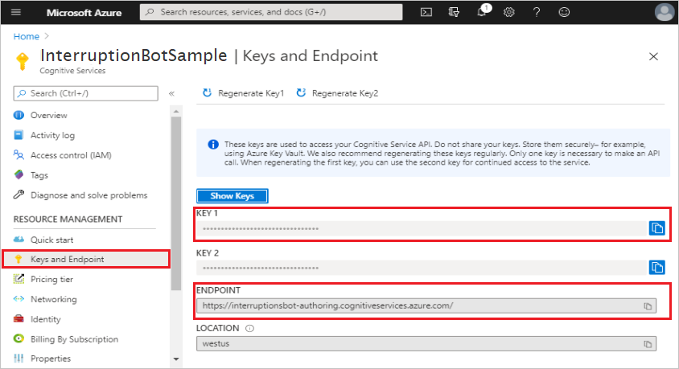

# Section on using LUIS in the iterruption bot sample
## Create LUIS resources in Azure portal

1. Go to the Azure [Create Cognitive Services][CognitiveServicesLUISAllInOne] page.  
2. In the **Create options** section, select **Authoring**.

   

3. Enter values for each of the fields, then select the **Review + create** button.

   

    > [!NOTE]
    > When entering the **Resource Group** and **Name**, keep in mind that you cannot change these values later. Also note that the value you give for **Name** will will be part of your **Endpoint URL**.

4. Review the values to ensure they are correct, then select the **Create** button.

### Get your authoring key

Now that you have created your LUIS resource in the Azure portal, you can get your authoring key.

1. Once Azure is done creating your LUIS resources in the Azure portal, you will see a screen with ***Your deployment is complete***, select the **Go to resource** button.

   

2. Select **Keys and Endpoint** from the *resource menu*
3. Copy the **KEY 1** value, this is your ***Authoring Key***. You need to enter this as the value for:
    -  The `LuisAPIKey` setting in your configuration file.
    - The `--authoringKey` property of the `bf luis:build` CLI command that is discussed in the following section.

   

4. Copy the **ENDPOINT** and enter it as the `LuisAPIHostName` value in your configuration file.

With this new LUIS resources in Azure portal, you are now ready to connect your bot to it.

## Using CLI to connect your bot to your LUIS resource in Azure

This section explains how to use the Bot Framework CLI to connect your bot to your LUIS resources in Azure. This automates the various tasks required to create, update, train and publish LUIS applications for each .lu file for the bot. In order to use this, you first need Node.js and the Bot Framework CLI.

1. Install [Node.js](https://nodejs.org/en/download/). If you already have it installed, make sure you have version 10.14 or higher.
1. Using Node.js, install the Bot Framework CLI from the command line.

    ```bash
    > npm i -g @microsoft/botframework-cli
    ```

1. In a command prompt, navigate to the root directory of your interruption bot sample, generally `..\samples\csharp_dotnetcore\adaptive-dialog\05.interruptions-bot`.

Now you are ready to connect your bot to your LUIS resources in Azure using the Bot Framework CLI. You do this by running the following command from a command prompt while in the root directory of your project source code.

``` bash
bf luis:build --in Dialogs --out generated --log --botName InterruptionBotSample --authoringKey <your-authoring-key>
```

**The bf luis:build parameters:**

- `in`: This is the directory, along with its sub-directories, that will be searched for .lu files.
- `out`: This is the directory that the files generated by this process are saved to.
- `log`: A boolean value that determines if a log if created during this process.
- `botName`: Use the same value that you used for **Name** in step 3 of the [Create LUIS resources in Azure portal](#create-luis-resources-in-azure-portal) section above.
- `authoringKey`: Your [authoring key](#get-your-authoring-key).

Running the `bf luis:build` command does several things. It uploads all of the information contained in all of your .lu files to your LUIS resource in Azure and then performs the required LUIS training and publishing.  All you need to do now is update your configuration file with the information generated as a result of the steps taken previously.

## Update your configuration file

# [C#](#tab/csharp)

Add the following values to **appsettings.json**:

``` json
  "luis": {
    "GetUserProfileDialog_en_us_lu": "",
    "RootDialog_en_us_lu": "",
    "LuisAPIKey": "",
    "LuisAPIHostName": ""
  }
```

- **GetUserProfileDialog_en_us_lu**: Get this value from the file named **luis.settings.\<youralias>.\<region>.json** that was generated as a part of running the `bf luis:build` command.

- **RootDialog_en_us_lu**: Get this value from the file named **luis.settings.\<youralias>.\<region>.json** that was generated as a part of running the `bf luis:build` command.

- **LuisAPIKey**: This is your [authoring key](#get-your-authoring-key).

- **LuisAPIHostName**: This is the **ENDPOINT** URL value that you get from the **Keys and Endpoint** section in Azure, which will look something like: `https://InterruptionBotSample.cognitiveservices.azure.com`.
 
# [JavaScript](#tab/javascript)

Add the following values to your **.env** file:

``` JavaScript
getUserProfileDialog_en_us_lu=
rootDialog_en_us_lu=
LuisAPIHostName=
LuisAPIKey=
```

- **GetUserProfileDialog_en_us_lu**: Get this value from the file named **luis.settings.\<youralias>.\<region>.json** that was generated as a part of running the `bf luis:build` command.

- **RootDialog_en_us_lu**: Get this value from the file named **luis.settings.\<youralias>.\<region>.json** that was generated as a part of running the `bf luis:build` command.

- **LuisAPIKey**: This is your [authoring key](#get-your-authoring-key).

- **LuisAPIHostName**: This is the **ENDPOINT** URL value that you get from the **Keys and Endpoint** section in Azure, which will look something like: `https://InterruptionBotSample.cognitiveservices.azure.com`.

---

You should now be able to use LUIS in your bot.

<!-- End note style links ----------------------------------------------------------------------------------------->
[create-luis-resources-in-azure-portal]: https://docs.microsoft.com/en-us/azure/cognitive-services/luis/luis-how-to-azure-subscription#create-luis-resources-in-azure-portal
[CognitiveServicesLUISAllInOne]: https://portal.azure.com/#create/Microsoft.CognitiveServicesLUISAllInOne
