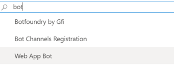
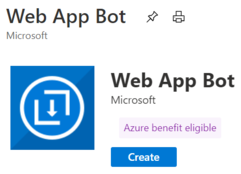

# Create a bot with Azure Bot Service

[!INCLUDE [applies-to-v4](../includes/applies-to-v4-current.md)]

<!--TODO **Web App Bot** and **Bot Channels Registration** deprecation notice.-->

<!--Q: What _is_ the relationship between the Azure Bot Service and the Bot Framework SDK? The Connector REST API?-->

The Azure Bot Service provides the core components for hosting bots and connecting them to channels.
The Bot Framework SDK allows you to develop bots in C#, JavaScript, Python, or Java.

This article shows how to create a bot by using the Azure _Web App Bot_ resource type.

> [!IMPORTANT]
> As of 2021-05-??, the **Azure Bot** Azure resource type is available and the **Web App Bot** and **Bot Channels Registration** resource types are deprecated.
>
> - New developers are encouraged to use the Bot Framework Composer for new bot development. See the Composer [overview](/composer/introduction) and [quickstart](/composer/quickstart-create-bot) for more information.<!--Should this paragraph be a snippet?-->
> - New deployments of Bot Framework SDK bots to Azure should use the **Azure Bot** resource type. See the [Deploy a basic bot](bot-builder-tutorial-deploy-basic-bot.md) tutorial for more information.

## Prerequisites

- [Azure](https://portal.azure.com) account

### Create a new bot service

1. Log in to the [Azure portal](https://portal.azure.com/).
1. Click **Create a resource** link found in the upper left-hand corner of the Azure portal.
1. In the search box enter *bot* and in the drop-down list select **Web App Bot**.

    

1. In the **Web App Bot** page, click the **Create** button.

    

1. In the **Web App Bot** form, provide the requested information about your bot as specified in the table below the image.

    

    | Setting | Suggested value | Description |
    | ---- | ---- | ---- |
    | **Bot name** | Your bot's display name | The display name for the bot that appears in channels and directories. This name can be changed at anytime. |
    | **Subscription** | Your subscription | Select the Azure subscription you want to use. |
    | **Resource Group** | myResourceGroup | You can create a new [resource group](/azure/azure-resource-manager/resource-group-overview#resource-groups) or choose from an existing one. |
    | **Location** | The default location | Select the geographic location for your resource group. Your location choice can be any location listed, though it's often best to choose a location closest to your customer. The location cannot be changed once the bot is created. |
    | **Pricing tier** | F0 | Select a pricing tier. You may update the pricing tier at any time. For more information, see [Bot Service pricing](https://azure.microsoft.com/pricing/details/bot-service/). |
    | **App name** | A unique name | The unique URL name of the bot. For example, if you name your bot *myawesomebot*, then your bot's URL will be `http://myawesomebot.azurewebsites.net`. The name must use alphanumeric and underscore characters only. There is a 35 character limit to this field. The App name cannot be changed once the bot is created. |
    | **Bot template** | Echo bot | Choose **SDK v4**. Select either C# or Node.js for this quickstart, then click **Select**.
    | **App service plan/Location** | Your app service plan  | Select an [app service plan](https://azure.microsoft.com/pricing/details/app-service/plans/) location. Your location choice can be any location listed, though it's often best to choose the same location as the bot service. |
    | **LUIS Accounts** _Only available for Basic Bot template_ | LUIS Azure Resource Name | After [migrating LUIS Resources over to an Azure Resource](/azure/cognitive-services/luis/luis-migration-authoring), input the Azure Resource name to associate this LUIS Application with that Azure Resource.
    | **Application Insights** | On | Decide if you want to turn [Application Insights](/bot-framework/bot-service-manage-analytics) **On** or **Off**. If you select **On**, you must also specify a regional location. Your location choice can be any location listed, though it's often best to choose the same location as the bot service. |
    | **Microsoft App ID and password** | Auto create App ID and password | Use this option if you need to manually enter a Microsoft App ID and password. Otherwise, a new Microsoft App ID and password will be created for you in the bot creation process. When creating an app registration manually for the Bot Service, please ensure that the supported account types is set to **Accounts in any organizational directory** or **Accounts in any organizational directory and personal Microsoft accounts (e.g. Outlook.com, Xbox, etc.)** |

1. Click **Create** to create the service and deploy the bot to the cloud. This process may take several minutes.

    Confirm that the bot has been deployed by checking the **Notifications**. The notifications will change from **Deployment in progress...** to **Deployment succeeded**. Click **Go to resource** link to open the bot's resources page.

Now that your bot is created, test it in Web Chat.

## Test the bot

In the **Settings** section, click **Test in Web Chat**. Azure Bot Service will load the Web Chat control and connect to your bot.

:::image type="content" source="../media/azure-bot-quickstarts/web-app-bot-test.png" alt-text="The the bot on Azure in Web Chat.":::

Enter a message and your bot should respond.

## Download code

You can download the code to work on it locally.

1. Go to the **Overview** blade.
1. Select **Download bot source code** in the top toolbar or at the bottom of the pane.
1. Follow the prompts to download the code, and then unzip the folder.

    [!INCLUDE [download keys snippet](../includes/snippet-abs-key-download.md)]

:::image type="content" source="../media/azure-bot-quickstarts/web-app-bot-download.png" alt-text="Links on the Overview pane to download the bot source code.":::

## Additional information

When you create a Web App Bot resource, Azure also creates App Service and App Service plan resources.

You have two approaches to create a bot with Azure:

1. **Web App**. Create a bot and register it with Azure using a Web application as shown in this article. You use this approach if you develop and host a bot in Azure.
1. **Bot channels registration**. Create and develop your bot locally and host it on a platform different from Azure. When you register your bot, you provide the web address where your bot is hosted. You can still host it in Azure. Follow the steps described in the [Bot channels registration](../bot-service-quickstart-registration.md) article.

[!INCLUDE [Azure vs local development](../includes/snippet-quickstart-paths.md)]

### Manual app registration

You might need a manual registration when:

- You are unable to make the registrations in your organization and need another party to create the App ID for the bot you're building.
- You need to manually create your own app ID (and password).

See [FAQ - App Registration](../bot-service-resources-faq-azure.yml#how-do-i-create-my-own-app-registration).

## Next steps

After you download the code, you can continue to develop the bot locally on your machine. Once you test your bot and are ready to upload the bot code to the Azure portal, follow the instructions listed under [set up continuos deployment](../bot-service-build-continuous-deployment.md) topic to automatically update code after you make changes.
