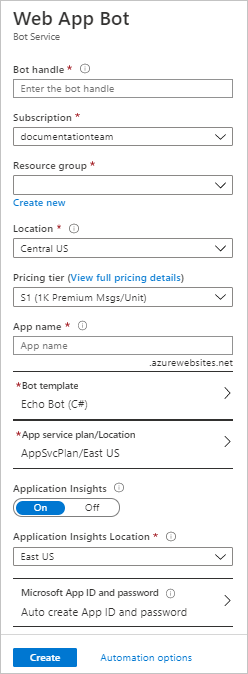
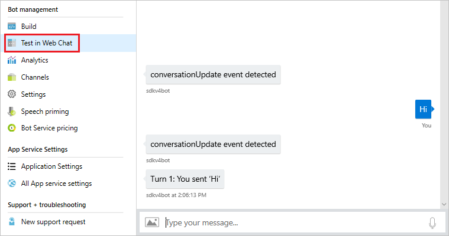

# Create a bot with Azure Bot Service

[!INCLUDE [applies-to-v4](../includes/applies-to.md)]

Azure Bot Service provides the core components for creating bots, including the Bot Framework SDK for developing bots and the bot service for connecting bots to channels. In the topic, you'll be able to choose either .NET or Node.js template to create a bot using the Bot Framework SDK v4.

>[!NOTE] 
> The bot you create is automatically registered with the Azure Bot Service. If you already have a bot hosted elsewhere and you want to register it, see the article: [Register a bot with Azure Bot Service](../bot-service-quickstart-registration.md).

[!INCLUDE [Azure vs local development](~/includes/snippet-quickstart-paths.md)]

## Prerequisites

- [Azure](https://portal.azure.com) account

### Create a new bot service

1. Log in to the [Azure portal](https://portal.azure.com/).
1. Click **Create new resource** link found on the upper left-hand corner of the Azure portal, then select **AI + Machine Learning** > **Web App bot**. 

2. A *new blade* will open with information about the **Web App Bot**.  

3. In the **Bot Service** blade, provide the requested information about your bot as specified in the table below the image.   
 

 | Setting | Suggested value | Description |
 | ---- | ---- | ---- |
 | **Bot name** | Your bot's display name | The display name for the bot that appears in channels and directories. This name can be changed at anytime. |
 | **Subscription** | Your subscription | Select the Azure subscription you want to use. |
 | **Resource Group** | myResourceGroup | You can create a new [resource group](/azure/azure-resource-manager/resource-group-overview#resource-groups) or choose from an existing one. |
 | **Location** | The default location | Select the geographic location for your resource group. Your location choice can be any location listed, though it's often best to choose a location closest to your customer. The location cannot be changed once the bot is created. |
 | **Pricing tier** | F0 | Select a pricing tier. You may update the pricing tier at any time. For more information, see [Bot Service pricing](https://azure.microsoft.com/pricing/details/bot-service/). |
 | **App name** | A unique name | The unique URL name of the bot. For example, if you name your bot *myawesomebot*, then your bot's URL will be `http://myawesomebot.azurewebsites.net`. The name must use alphanumeric and underscore characters only. There is a 35 character limit to this field. The App name cannot be changed once the bot is created. |
 | **Bot template** | Echo bot | Choose **SDK v4**. Select either C# or Node.js for this quickstart, then click **Select**.  
 | **App service plan/Location** | Your app service plan  | Select an [app service plan](https://azure.microsoft.com/pricing/details/app-service/plans/) location. Your location choice can be any location listed, though it's often best to choose the same location as the bot service. |
 | **LUIS Accounts** _Only available for Basic Bot template_ | LUIS Azure Resource Name | After [migrating LUIS Resources over to an Azure Resource](https://docs.microsoft.com/azure/cognitive-services/luis/luis-migration-authoring), input the Azure Resource name to associate this LUIS Application with that Azure Resource. 
 | **Application Insights** | On | Decide if you want to turn [Application Insights](/bot-framework/bot-service-manage-analytics) **On** or **Off**. If you select **On**, you must also specify a regional location. Your location choice can be any location listed, though it's often best to choose the same location as the bot service. |
 | **Microsoft App ID and password** | Auto create App ID and password | Use this option if you need to manually enter a Microsoft App ID and password. Otherwise, a new Microsoft App ID and password will be created for you in the bot creation process. When creating an app egistration manually for the Bot Service, please ensure that the supported account types is set to ‘Accounts in any organizational directory’ or ‘Accounts in any organizational directory and personal Microsoft accounts (e.g. Skype, Outlook.com, Xbox, etc.)’ |

4. Click **Create** to create the service and deploy the bot to the cloud. This process may take several minutes.

Confirm that the bot has been deployed by checking the **Notifications**. The notifications will change from **Deployment in progress...** to **Deployment succeeded**. Click **Go to resource** button to open the bot's resources blade.

Now that your bot is created, test it in Web Chat.

## Test the bot
In the **Bot Management** section, click **Test in Web Chat**. Azure Bot Service will load the Web Chat control and connect to your bot. 

Enter a message and your bot should respond.

## Manual app registration

A manual registration is necessary for situations like:

- You are unable to make the registrations in your organization and need another party to create the App ID for the bot you're building.
- You need to manually create your own app ID (and password).

See [FAQ - App Registration](../bot-service-resources-bot-framework-faq.md#app-registration).

## Download code
You can download the code to work on it locally. 
1. In the **Bot Management** section, click **Build**. 
1. Click on **Download Bot source code** link in the right-pane. 
1. Follow the prompts to download the code, and then unzip the folder.
    1. [!INCLUDE [download keys snippet](../includes/snippet-abs-key-download.md)]

## Next steps
After you download the code, you can continue to develop the bot locally on your machine. Once you test your bot and are ready to upload the bot code to the Azure portal, follow the instructions listed under [set up continous deployment](../bot-service-build-continuous-deployment.md) topic to automatically update code after you make changes.
