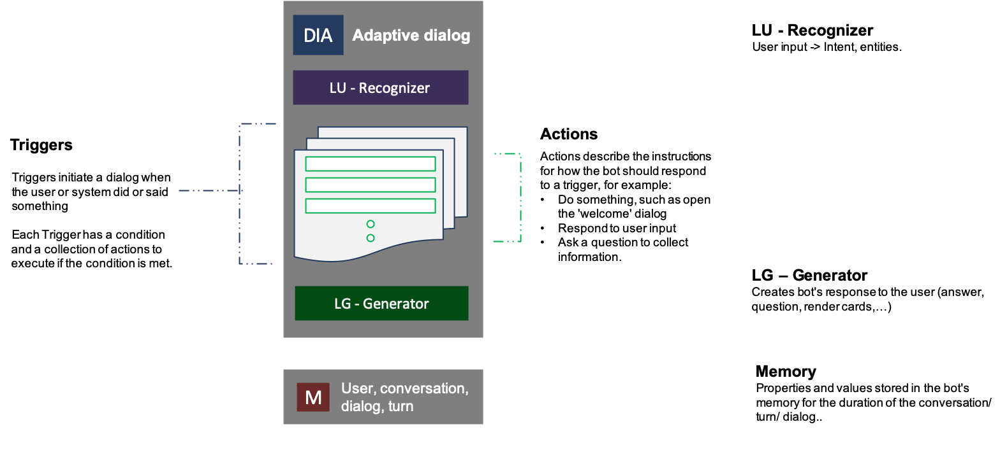

# Introduction to adaptive dialogs

Adaptive dialogs offer new A new event based addition to the [Dialogs library][1] that enables you to start simple and quickly layer in sophisticated conversation management techniques like interruption handling, dispatching and more.

> [!IMPORTANT]
> Adaptive dialogs is currently available in the .Net version of the bot framework SDK. You can find Sample bots built using adaptive dialogs in [the BotBuilder-Samples repository][16] on GitHub, however the JavaScript version is now in [Preview][15].

## Prerequisites

* An understanding of [dialogs][1] in the Bot Framework V4 SDK
* A general understanding of [prompts][14] in the Bot Framework V4 SDK

## Adaptive dialogs defined

### Why adaptive dialog
<!--This needs work-->

Because adaptive dialogs:

* Provides the flexibility that enables you to model conversations as a sequence of steps while simultaneously allowing for rules that dynamically adjust to the context. This is especially useful when users do not provide the requested information in order or decide to start a new conversation in the middle of an active dialog.
* Supports and sits on top of a rich event system for dialogs, so modeling interruptions, cancellation, and execution planning semantics are a lot easier to describe and manage.
* Brings input recognition, event handling via rules, model of the conversation (dialog) and output generation into one cohesive, self-contained unit.
* Supports extensibility points for recognition, event rules and machine learning.
* Was designed to be declarative from the start. This enables tooling including products like [Bot Framework Composer](https://aka.ms/bf-composer-docs-welcome-page) that provides a visual canvas to model conversations.

## Anatomy of an adaptive dialog  

<p align="center">
    
</p>

### Triggers

All adaptive dialogs contain a list of one or more event handlers called _triggers_, and each trigger contains an optional `Condition` and a list of one or more _actions_. Triggers are what enable you to catch and respond to events, if its `Condition` is met its `Actions` will execute and once an event is handled no further action is taken on that event. If the triggers `Condition` is not met, the event is passed to the next event handler for evaluation.

See the [_Events and triggers in adaptive dialogs_][3] article for more information on _triggers_ in adaptive dialogs.

<!--- If an event is not handled in a child dialog, it gets passed up to its parent dialog to handle and this continues until it is either handled or reaches the bots main dialog. If no event handler is found, it will be ignored and no action will be taken.

_Triggers_ enable you to catch and respond to events. The broadest trigger is the OnEvent trigger that allows you to catch and attach a set of steps to execute when a specific event is emitted by any sub-system. Adaptive dialogs supports a couple of other specialized triggers to wrap common events that your bot would handle. See [here][3] to learn more about supported triggers and their usage.-->

### Actions

_Actions_ define the conversation flow when a specific event is captured via a Trigger. Unlike a waterfall dialog where each step is a function, each action in an Adaptive dialog is in itself a dialog. This makes adaptive dialogs both powerful and flexible and enables adaptive dialogs to easily handle interruptions and branch conditionally based on context or current state.

The bot framework SDK provides many built in actions to enable you to perform various actions such as memory manipulation, dialog management, and controlling the conversational flow of your bot. Since actions are in fact dialogs, they are extensible, making it possible to create your own custom actions.

See the [_Actions in adaptive dialogs_][4] article for more information on _actions_ in adaptive dialogs.

### Inputs

_Inputs_ are to adaptive dialogs what [prompts][14] are to the base dialog class. Inputs are specialized actions that you can use in an adaptive dialog to request and validate information from a user, then if the validation passes, accept the input into memory. All input classes in the bot framework SDK are designed to do the following:

* Perform existential checks before prompting, to avoid prompting for information the bot already has.
* Save the input to the specified property if it matches the type of entity expected.
* Accept constraints - min, max, etc.

See the [Asking for user input using adaptive dialogs][5] article for more information on _inputs_ in adaptive dialogs.

### Recognizers

_Recognizers_ enable your bot to understand and extract meaningful pieces of information from user's input. All recognizers emit events such as the `recognizedIntent` event that fires when the recognizer picks up an intent (or extracts entities) from a user utterance. You are not required to use recognizers with an adaptive dialog, but if you don't no `recognizedIntent` events will ever fire, instead the `unknownIntent` event will fire.

See the [_Recognizers in adaptive dialogs_][6] article for more information on _recognizers_ in adaptive dialogs.

### Generator

_Generator_ ties a specific language generation system to an adaptive dialog. This, along with the recognizer enables clean separation and encapsulation of a specific dialog's Language Understanding and Language Generation assets. With the [Language Generation][7] feature, you can associate the generator with a _.lg_ file or set the generator to a `TemplateEngine` instance where you explicitly manage the one or more _.lg_ files that power the adaptive dialog.

See the [_Language Generation in adaptive dialogs_][7] article for more information on _generators_ in adaptive dialogs.

### Memory scopes and managing state

Adaptive dialogs provide a way to access and manage memory. All adaptive dialogs by default use this model so all components that consume or contribute to memory have a common method to read and write information in the appropriate scope. All properties in all scopes are property bags which gives you the ability to dynamically modify what properties are stored.

See the [_Memory scopes and managing state in adaptive dialogs_][7] article for more information on _Memory scopes_ and _managing state_ in adaptive dialogs.

### Declarative assets

Adaptive dialogs enable you to define your dialog as a class by creating a new AdaptiveDialog object and defining your triggers and actions in the classes source file, but you can also create your dialog using a declarative approach where you define all the attributes of your dialog in a JSON file with a file extension of .dialog.  No source code is required to define your dialogs and you can have multiple dialogs using both approaches in the same bot. At runtime your bot will generate and execute the dialog code as defined in these declarative dialog files.

<!--See the [_Using declarative assets_][9] article for more information on using _declarative assets_ in adaptive dialogs.-->

## Tying it all together

### The adaptive dialog runtime behavior

The following fictitious _Travel agent bot_ will help illustrate the runtime behavior of adaptive dialogs. A real world application would have multiple capabilities like the ability to search for and book flights, hotel rooms, cars and even check the weather and each of these would be handled in their own specialized dialog.

What happens when the user does something unexpected while in the middle of a conversation with your bot?

Consider this scenario:

```
    User: I’d like to book a flight
    Bot:  Sure. What is your destination city?
    User: How’s the weather in Seattle?
    Bot:  Its 72 and sunny in Seattle
    ...
```

The user not only did not answer the question, but they changed the subject entirely, which will require completely different code (Action) that exists in a different dialog to execute. Adaptive dialogs enables you to handle this scenario which is shown in the following diagram:

<p align="center">
    
</p>

This bot has the following three adaptive dialogs:

1. The **rootDialog** that has its own 'LUIS' model and a set of triggers and actions, some of which will call a child dialog that is designed to handle specific user requests.
2. The **bookFlightDialog** that has its own 'LUIS' model and a set of triggers and actions that handles conversations about booking flights.
3. The **weatherDialog** that has its own 'LUIS' model and a set of triggers and actions that handles conversations about getting weather information.

Here's the flow when user says: _I'd like to book a flight_

<p align="center">
    
</p>

The active dialog (rootDialog) recognizer emits a `recognizedIntent` event that you can handle with an `OnIntent` trigger. In this case the user said _"I’d like to book a flight"_ which matches an intent defined in `rootDialog` and causes the `OnIntent` trigger contains a `BeginDialog` action to execute, which calls the dialog `bookFlightDialog`. The book a flight dialog executes its actions, one of them is asking for the city you want to fly to.

The user can provide anything in response, in some cases the response may have nothing to do with the question that was asked and in this case the user responded with _How's the weather in Seattle?_

<p align="center">
    
</p>

Since the dialog `bookFlightDialog` has no `OnIntent` trigger to handle the users request, the bot propagates the handling of this user input up the conversation stack, up through all the calling dialogs all the way to the root dialog, which in this case is up just one dialog, and since `rootDialog` has an `OnIntent` trigger to handle the `weather` intent, this trigger executes its `BeginDialog` action that calls the dialog `weatherDialog`, passing along the users question. Once `weatherDialog` finishes by responding to the users question, the bot returns control back to the originating dialog and the conversation flow continues where it left off prior to this _interruption_, and prompts the user again for the destination city.

To summarize:

Each dialog's _recognizer_ analyzes the user's input to determine the user intent. Once the intent is determined, the _recognizer_ emits an `IntentRecognized` event which the dialog handles using an `OnIntent` trigger. If there is no `OnIntent` trigger in the active dialog that can handle that intent, the bot will send it to the dialog's parent dialog. If the parent dialog does not have a trigger to handle the intent it bubbles up until it reached the root dialog. Once the trigger that handles that intent completes, it sends control back to the dialog that started this process where it can continue the conversational flow where it left off.

## Additional information

### Adaptive concepts
<!-- Links will remain broken until all articles exist-->
* [Events and triggers in adaptive dialogs][3]
* [Actions in adaptive dialogs][4]
* [Asking for user input using adaptive dialogs][5]
* [Recognizers in adaptive dialogs][6]
* [Language Generation in adaptive dialogs][7]
* [Memory scopes and managing state in adaptive dialogs][8]
<!--* [Using declarative assets][9]-->

### How to develop a bot using adaptive dialogAdaptive

* [Create a bot using adaptive dialogs][10]
<!--* [Create a bot using Declarative adaptive dialogs][11]--->
* [Create a bot combining adaptive, component, waterfall, and custom dialogs][12]

[1]:https://aka.ms/bot-builder-concept-dialog
[3]:bot-builder-concept-adaptive-dialog-triggers.md
[4]:bot-builder-concept-adaptive-dialog-actions.md
[5]:bot-builder-concept-adaptive-dialog-inputs.md
[6]:bot-builder-concept-adaptive-dialog-recognizers.md
[7]:bot-builder-concept-adaptive-dialog-generators.md
[8]:bot-builder-concept-adaptive-dialog-memory-states.md
[9]:bot-builder-concept-adaptive-dialog-declarative.md
[10]:bot-builder-dialogs-adaptive.md
[11]:bot-builder-dialogs-declarative-adaptive.md
[12]:bot-builder-mixed-dialogs.md
[13]:bot-builder-concept-adaptive-dialog-inputs.md#interruptions
[14]:https://aka.ms/bot-builder-concept-dialog#prompts
[15]:https://github.com/microsoft/botbuilder-samples/tree/master/experimental/adaptive-dialog
[16]:https://github.com/microsoft/botbuilder-samples/tree/master/samples/csharp_dotnetcore
