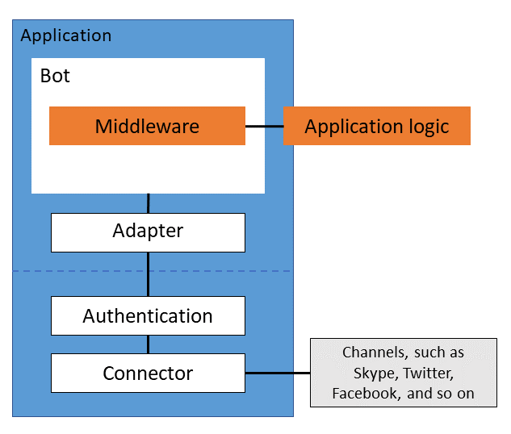

The Microsoft Bot Builder SDK is one component of the [Azure Bot Service](#), which allows you to create a _bot_, an application that users can interact with in a conversational way.

## Architecture

Your bot communicates with a user over a _channel_, the application the user interacts with when accessing your bot, such as text/sms, Skype, Slack, and others.
Communication over a channel uses the [Bot Connector REST API](#), which allows your bot to send and receive activities, such as messages, to users.
A channel can refer to the client application or the service the application implements to send and receive these REST calls.
(To enable communication between your own client application and the bot service, use the [Direct Line API](#).)

The SDK provides an _adapter_ that facilitates conversations between the bot and users and that mediates _authentication_ of your bot with the Azure Bot Service.
The adapter uses a _connector_ to send outgoing REST API calls to the channels.

The SDK defines a _bot object_, which provides a way to add your application logic.
* The bot requires an adapter.
* The bot uses _middleware_ and _pipelines_ to divide your application logic into a sequence of smaller tasks.

A _conversation_ represents an interaction between your bot and a specific user over a specific channel.
The bot object exposes an incoming Bot Connectore REST API request as an _activity_.
Your bot can send activities back to the user.

## Middleware and pipelines

Use middleware to add reusable, components to your application in a modular way.
- The bot processes activities through its middleware layers.
- Middleware can establish and persist context and react to incoming requests.
- You add middleware to the bot object at initialization time.
- The order in which you add middleware to the bot determines the order in which the bot calls the middleware.
- The library provides some predefined middleware, but you can define your own.

The bot is stateless. However, when the bot receives an activity, it generates a _context_ object that captures various parameters of the conversation.
Each received activity is processed independently of other incoming activities.
Your bot can use a storage manager, either in middleware or or not, to persist state between activities.

The bot object invokes middleware via the following pipelines:
1. Context created – establishes and enriches a context object that represents the request and conversation state.
1. Receive activity – operates on the request.
1. Post activity – persists context and updates conversation state.

![NOTE] The bot handles requests asynchronously; however, your underlying application logic does not need to be request-response driven.

## Language-specific implementations

The SDK is available in the following languages.
* [C#](https://github.com/Microsoft/botbuilder-dotnet)
* [Java](https://github.com/Microsoft/botbuilder-java)
* [Node.js](https://github.com/Microsoft/botbuilder-js)
* [Python](https://github.com/Microsoft/botbuilder-python)

You can also generate your own SDK from the [Connector API Swagger file](https://raw.githubusercontent.com/Microsoft/BotBuilder/master/CSharp/Library/Microsoft.Bot.Connector.Shared/Swagger/ConnectorAPI.json).

<!-- Update links when the associated conceptual topics are available. -->

## See also
- Activities
- Adapters
- Authentication
- Bots
- Channels
- Connectors
- Conversations
- Middleware
- Pipelines
- Storage
