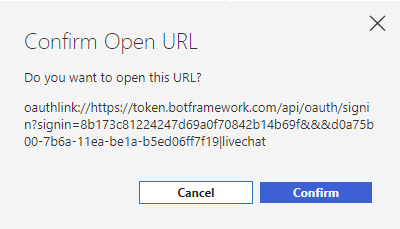
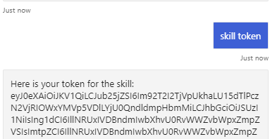
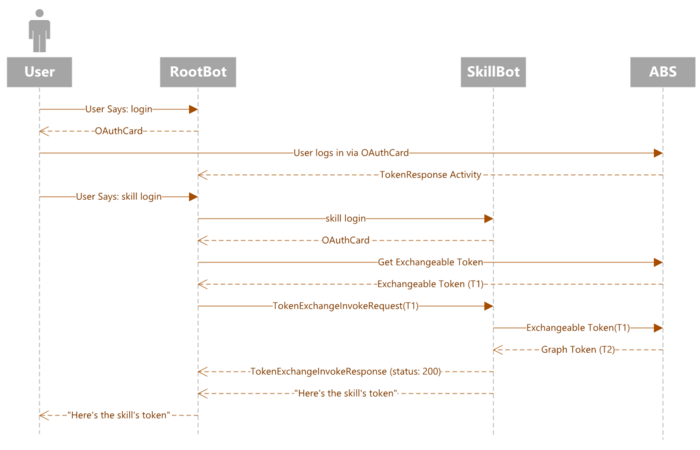

# Add single sign on to a bot

[!INCLUDE [applies-to-v4](../includes/applies-to-v4-current.md)]

This article shows how to use the Single sign on (SSO) feature in a bot.
To do so, it uses a *consumer* bot, also known as *root* bot, to interact with a *skill* bot.

Once the users sign in the root bot, they are not required to sign into each skill bot they might use through the root bot. This is because of SSO. Without it the users would have to sign in every time they communicate with a different skill bot.


> [!NOTE]
> The *consumer* bot is also called *root* or *parent* bot. The *skill* bot is also called *child* bot.\
> This article uses the terms **root** bot and **skill** bot.\
> With skills, the root and skill are separate bots, running on potentially different servers, each with its own separate memory and state.

### Web Chat and Direct Line considerations

> [!IMPORTANT]
> When you use Azure Bot Service authentication with Web Chat there are some important security considerations you must keep in mind. For more information, see the [security considerations](../rest-api/bot-framework-rest-direct-line-3-0-authentication.md#security-considerations) section in the REST authentication article.

## Prerequisites

- Knowledge of [bot basics][concept-basics], [managing state][concept-state], the [dialogs library][concept-dialogs], how to [implement sequential conversation flow][simple-dialog], and how to [reuse dialogs][component-dialogs].
- Knowledge of Azure and OAuth 2.0 development.
- Visual Studio 2017 or later for .NET.
- Node.js for Javascript.
- Python [3.8+](https://www.python.org/downloads/release/python-383/) for Python.
- The samples listed below.

| Sample | BotBuilder version | Demonstrates |
|:---|:---:|:---|
| SSO with Simple Skill Consumer and Skill in [**CSharp**][cs-auth-sample] | v4 | SSO support |


## About the samples

This article references two samples: the **RootBot** and the **SkillBot**. The **RootBot** forwards activities to the **SkillBot**. They model this *typical* skill scenario:

- A *root* bot calls one or more skill bots.
- Both the root and skill bots implement the basic authentication described in the [Add authentication to a bot](bot-builder-authentication.md) article.
- The user logs into root bot.
- Because of the SSO and being already logged into the root bot, she is logged into the skill bot without requiring user interaction again.


For an overview of how the Bot Framework handles authentication, see [User authentication](bot-builder-concept-authentication.md).
For SSO background information, see [Single sign on](bot-builder-concept-sso.md).

The **RootBot** supports user's SSO. It communicates with the
**SkillBot** on behalf of the user, without the user being required to authenticate again into the *SkillBot*.

For each project in the sample, you need the following:

1. An Azure AD application to register a bot resource in Azure.
1. An Azure AD identity provider application for authentication.
    > [!NOTE]
    > Currently, only the [Azure AD v2](/azure/bot-service/bot-builder-concept-identity-providers?view=azure-bot-service-4.0&tabs=adv2%2Cga2#azure-ad-v2-1&preserve-view=true) identity provider is supported.

## Create the Azure RootBot resource

1. Create an Azure bot resource in the [Azure portal][azure-portal] for the `RootBot`. Follow the steps described in
[Create an Azure bot resource](bot-builder-authentication.md#create-the-resource).
1. Copy and save the bot registration **app ID** and the **client secret**.

## Create the Azure AD identity for RootBot

The Azure AD is a cloud identity service that allows you to build applications that securely sign in users using industry standard protocols like OAuth2.0.

1. Create an identity application for the `RootBot` that uses Azure AD v2  to authenticate the user. Follow the steps described in [Create the Azure AD identity provider](bot-builder-authentication.md#create-the-azure-ad-identity-provider).

1. In the left pane, click **Manifest**.
1. Set `accessTokenAcceptedVersion` to 2.
1. Click **Save**.
1. In the left pane, click **Expose an API**.
1. In the right pane, click **Add a scope**.
1. In the far right *Add a scope* section click **Save and continue**.
1. In the displayed window, under *Who can consent?* select **Admins and users**.
1. Enter the remaining required information.
1. Click **Add scope**.
1. Copy and save the scope value.

### Create an OAuth connection settings

1. Create an Azure AD v2 connection in the `RootBot` bot registration and enter values as described in [Azure AD v2](/azure/bot-service/bot-builder-concept-identity-providers?view=azure-bot-service-4.0&tabs=adv2%2Cga2#azure-ad-v2-1&preserve-view=true) and the value described below.

1. Leave the **Token Exchange URL** empty.
1. In the **Scopes** box enter the `RootBot` scope value you saved in the previous steps.
    > [!NOTE]
    > The *scopes* contains the URL that the user initially signs in into the root bot, while the *token exchange URL* is left empty.
    >
    > As an example, let's assume that the root bot *appid* is *rootAppId* and the skill bot *appid* is *skillAppId*. The root bot's *scopes* will look like *api://rootAppId/customScope*, which is used to login the user. This root bot's *scopes* is then exchanged with *api://skillAppId/customscope* during SSO. 
1. Copy and save the name of the connection.

## Create the Azure SkillBot resource

1. Create an Azure bot resource in the [Azure portal][azure-portal] for the `SkillBot`. Follow the steps described in
[Create an Azure bot resource](bot-builder-authentication.md#create-the-resource).
1. Copy and save the bot registration **app ID** and the **client secret**.

## Create the Azure AD identity for SkillBot

The Azure AD is a cloud identity service that allows you to build applications that securely sign in users using industry standard protocols like OAuth2.0.

1. Create an identity application for the `SkillBot` that uses Azure AD v2  to authenticate the bot. Follow the steps described in [Create the Azure AD identity provider](bot-builder-authentication.md#create-the-azure-ad-identity-provider).

1. In the left pane, click **Manifest**.
1. Set `accessTokenAcceptedVersion` to 2.
1. Click **Save**.
1. In the left pane, click **Expose an API**.
1. In the right pane, click **Add a scope**.
1. In the far right *Add a scope* section click **Save and continue**.
1. In the displayed window, under *Who can consent?* select **Admins and users**.
1. Enter the remaining required information.
1. Click **Add scope**.
1. Copy and save the scope value.
1. Click **Add a client application**. In the far right section, in the **Client ID** box, enter the **RootBot identity** app ID you saved before. Make sure you use the *RootBot* identity and not the registration app ID.
1. Under **Authorized scope**, check the box by the scope value.
1. Click **Add application**.
1. In the navigation pane on the left, click **API permissions**. It is a best practice to explicitly set the API permissions for the app.

   1. In the right pane, click **Add a permission**.
   1. Select **Microsoft APIs** then **Microsoft Graph**.
   1. Choose **Delegated permissions** and make sure the permissions you need are selected. This sample requires the permissions listed below.
      > [!NOTE]
      > Any permission marked as **ADMIN CONSENT REQUIRED** will require both a user and a tenant admin to login.

      - **openid**
      - **profile**
      - **User.Read**
      - **User.ReadBasic.All**

   1. Click **Add permissions**.

### Create an OAuth connection settings

1. Create an Azure AD v2 connection in the `SkillBot` bot registration and enter values as described in [Azure AD v2](/azure/bot-service/bot-builder-concept-identity-providers?view=azure-bot-service-4.0&tabs=adv2%2Cga2#azure-ad-v2-1&preserve-view=true) and the values described below.
1. In the **Token Exchange URL** box enter the `SkillBot` scope value you saved in the previous steps.
1. In the **Scopes** box enter the following values separated by blank space: `profile` `User.Read` `User.ReadBasic.All` `openid`.

1. Copy and save to a file the name of the connection.

## Test the connection

1. Click on the connection entry to open the connection you just created.
1. Click **Test Connection** at the top of the **Service Provider Connection Setting** pane.
1. The first time, this should open a new browser tab listing the permissions your app is requesting and prompt you to accept.
1. Click **Accept**.
1. This should then redirect you to a **Test Connection to \<your-connection-name> Succeeded** page.

For more information, see the [Azure Active Directory for developers (v1.0) overview](/azure/active-directory/azuread-dev/v1-overview) and [Microsoft identity platform (v2.0) overview](/azure/active-directory/develop/active-directory-appmodel-v2-overview).
For information about the differences between the v1 and v2 endpoints, see [Why update to Microsoft identity platform (v2.0)?](/azure/active-directory/develop/active-directory-v2-compare). For complete information, see [Microsoft identity platform (formerly Azure Active Directory for developers)](/azure/active-directory/develop/).

## Prepare the samples code

You must update the `appsettings.json` file in both samples as described below.

# [C#](#tab/csharp)

1. From the GitHub repository clone the sample
 [SSO with Simple Skill Consumer and Skill][cs-auth-sample]

 1. Open the `SkillBot` project `appsettings.json` file. From the saved file, assign the following values:

    ```json
    {
        "MicrosoftAppId": "<SkillBot registration app ID>",
        "MicrosoftAppPassword": "<SkillBot registration password>",
        "ConnectionName": "<SkillBot connection name>",
        "AllowedCallers": [ "<RootBot registration app ID>" ]
    }

1. Open the `RootBot` project `appsettings.json` file. From the saved file, assign the following values:

    ```json
    {
        "MicrosoftAppId": "<RootBot registration app ID>",
        "MicrosoftAppPassword": "<RootBot registration password>",
        "ConnectionName": "<RootBot connection name>",
        "SkillHostEndpoint": "http://localhost:3978/api/skills/",
        "BotFrameworkSkills": [
                {
                "Id": "SkillBot",
                "AppId": "<SkillBot registration app ID>",
                "SkillEndpoint": "http://localhost:39783/api/messages"
                }
            ]
    }
    ```

<!--
# [JavaScript](#tab/javascript)

TBD

# [Python](#tab/python)

TBD
-->

---

## Test the samples

Use the following for testing:

- `RootBot` commands

    - `login` allows the user to sign into the Azure AD registration using the `RootBot`. Once signed in, SSO takes care of the sign in into the the `SkillBot` also. The user does not have to sign in again.
    - `token` displays the user's token.
    - `logout` logs the user out of the `RootBot`.

- `SkillBot` commands

    - `skill login` allows the `RootBot` to sign into the `SkillBot`, on behalf of the user. The user is not shown a sign in card, if already signed in, unless SSO fails.
    - `skill token` displays the user's token from the `SkillBot`.
    - `skill logout` logs the user out of the `SkillBot`

>[!NOTE]
> The first time users try SSO on a skill, they may be presented with an OAuth card to log in. This is because they have not yet given consent to the skill's Azure AD app. To avoid this, they can grant admin consent for any graph permissions requested by the Azure AD app.

# [Emulator](#tab/eml)

### Test using the Emulator

If you have not done so already, install the [Bot Framework Emulator](https://github.com/microsoft/BotFramework-Emulator/blob/master/README.md). See also [Debug with the Emulator](../bot-service-debug-emulator.md).

In order for the bot sample login to work you must configure the Emulator
as shown in [Configure the Emulator for authentication](../bot-service-debug-emulator.md#configure-the-emulator-for-authentication).

After you have configured the authentication mechanism, you can perform the actual bot sample testing.

1. In Visual Studio, open the `SSOWithSkills.sln` solution and configure it to start [debugging with multiple processes](/visualstudio/debugger/debug-multiple-processes?view=vs-2019#start-debugging-with-multiple-processes&preserve-view=true).
1. Start debugging locally on your machine.
Notice that in the`RootBot` project `appsettings.json` file you have the following settings:

```json
    "SkillHostEndpoint": "http://localhost:3978/api/skills/"
    "SkillEndpoint": "http://localhost:39783/api/messages"
```
> [!NOTE]
> These settings imply that, with both `RootBot` and `SkillBot` are running on the local machine. The Emulator communicates with `RootBot` on port 3978 and `RootBot` communicates with `SkillBot` on port 39783. As soon as you start debugging, two default browser windows open. One on port 3978 and the other on port 39783.

1. Start the Emulator.
1. You need to provide your `RootBot` registration app ID and password when you connect to the bot.
1. Type `hi` to start the conversation.
1. Enter **login**.  The `RootBot` will display a *Sign In to AAD* authentication card.

    

1. Click **Sign In**. The pop-up dialog *Confirm Open URL* is displayed.

    

1. Click **Confirm**. You will be logged in and the `RootBot` token is displayed.
1. Enter **token** to display the token again.

    

    Now you are ready to communicate with the `SkillBot`. Once you've signed using the `RootBot`, you don't need to provide your credentials again until you sign out. This demonstrates that SSO is working.

1. Enter **skill login** in the Emulator box. You will not be asked to login again. Instead the SkillBot token is displayed.

1. Go ahead enter **skill token** to display the token again.

     

1. Now you can enter **skill logout** to sign out of the `SkillBot`. Then enter **logout** to sign out of the `SimpleRootBoot`.

# [Web Chat](#tab/wct)

### Test using Web Chat

1. Deploy the root bot and the skill bot to Azure. For information about deployment, see [Tutorial: Deploy a basic bot](bot-builder-tutorial-deploy-basic-bot.md) and [Deploy your bot](../bot-builder-deploy-az-cli.md) articles.
1. In your code editor, for example Visual Studio, replace the localhost addresses in the `RootBot` project `appsetting.js` file with the actual Azure addresses as shown below.

    ```json
    "SkillHostEndpoint": "https://<your root bot deployed name>.azurewebsites.net/api/skills"
    "SkillEndpoint": "https://<your skill bot deployed name>.azurewebsites.net/api/messages"
    ````

1. In your browser, navigate to the [Azure portal][azure-portal].
1. Open your root bot registration. In the left, pane click **Test in Web Chat**. The dialog window with you root bot is displayed with the bot greeting message.
1. Start the conversation with the bot by entering *hi* for example. The bot will echo your message back.
1. Enter **login**. The `RootBot` will display a *Sign In to AAD* authentication card.

    

1. Click **Sign In**. A web page with a validation code is displayed.
1. Copy the code and enter in the input box to complete the sign in. The `RootBot` token is displayed.
1. Enter **token** to display the token again.

    

    Now you are ready to communicate with the `SkillBot`. Once you've signed in the `RootBot`, you don't need to provide your credentials again until you sign out. This demonstrates that SSO is working.

1. Enter **skill login**.  The SkillBot token is displayed.

    

1. Go ahead enter **skill token** to display the token again.
This tells you that you are communicating with the `SkillBot` without the need to sign in again. SSO in action!
1. Now you can enter **skill logout** to sign out of the `SkillBot`. Then enter **logout** to sign out of the `SimpleRootBoot`.

---

## Additional information

The following time-sequence diagram applies to the samples used in the article and shows the interaction between the various components involved. *ABS* stands for *Azure Bot Service*.



<!-- verify -->
1. The first time, the user enters the `login` command for the **RootBot**.
1. The **RootBot** sends an **OAuthCard** asking the user to sign in.
1. The user enters the authentication credentials that are sent to the **ABS** (Azure Bot Service).
1. The **ABS** sends the authentication token, generated based on the user's credentials, to the **RootBot**.
1. The **RootBot** displays the root token for the user to see.
1. The user enters the `skill login` command for the **SkillBot**.
1. The **SkillBot** sends an **OAuthCard** to the **RootBot**.
1. The **RootBot** asks for an **exchangeable token** from **ABS**.
1. At this point the SSO "dance" comes into play which ends with the **skill token** sent by the **SkillBot** to the **RootBot**.
1. The **RootBot** displays the skill token for the user to see. Notice that the skill token was generated without the user having to sign in the **SKillBot**. This is because of the SSO.

To see how the token exchange happens, please refer to the example shown below. The function can be found in [TokenExchangeSkillHandler.cs](https://github.com/microsoft/BotBuilder-Samples/blob/master/experimental/sso-with-skills/RootBot/TokenExchangeSkillHandler.cs).

# [C#](#tab/csharp)

<!-- Fixed link -->
[!code-csharp[sso-token-exchange](~/../botbuilder-samples/experimental/sso-with-skills/RootBot/TokenExchangeSkillHandler.cs?range=92-136)]

---

## Further reading

- [Single sign on](bot-builder-concept-sso.md) background information
- [Identity providers](bot-builder-concept-identity-providers.md) provide user authentication as a service
- [User authentication](bot-builder-concept-authentication.md) for accessing secured online resources on behalf of the user

<!-- Footnote-style links -->

[azure-portal]: https://ms.portal.azure.com
[azure-aad-blade]: https://ms.portal.azure.com/#blade/Microsoft_AAD_IAM/ActiveDirectoryMenuBlade/Overview
[aad-registration-blade]: https://ms.portal.azure.com/#blade/Microsoft_AAD_IAM/ActiveDirectoryMenuBlade/RegisteredAppsPreview

[concept-basics]: bot-builder-basics.md
[concept-state]: bot-builder-concept-state.md
[concept-dialogs]: bot-builder-concept-dialog.md

[simple-dialog]: bot-builder-dialog-manage-conversation-flow.md
[dialog-prompts]: bot-builder-prompts.md
[component-dialogs]: bot-builder-compositcontrol.md

[cs-auth-sample]: https://github.com/microsoft/BotBuilder-Samples/tree/master/experimental/sso-with-skills
[js-auth-sample]: https://github.com/Microsoft/BotBuilder-Samples/blob/main/samples/javascript_nodejs/18.bot-authentication
[python-auth-sample]: https://github.com/microsoft/BotBuilder-Samples/tree/master/samples/python/18.bot-authentication

