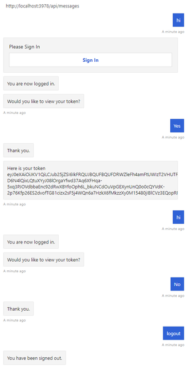
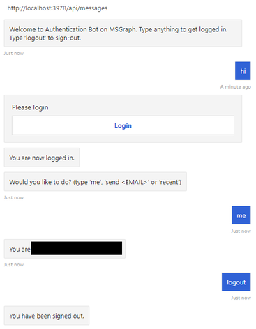
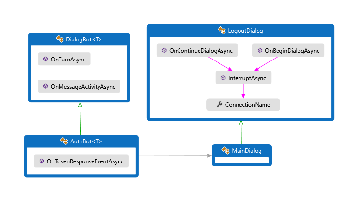
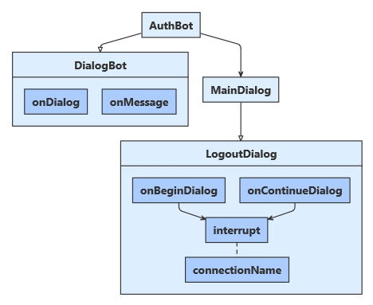
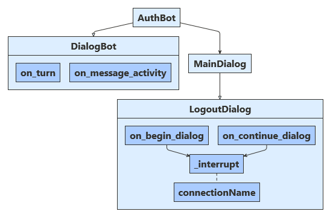

<!-- 

Related TODO:
- Check code in [Web Chat channel](https://docs.microsoft.com/azure/bot-service/bot-service-channel-connect-webchat?view=azure-bot-service-4.0)
- Check guidance in [DirectLine authentication](https://docs.microsoft.com/azure/bot-service/rest-api/bot-framework-rest-direct-line-3-0-authentication?view=azure-bot-service-4.0)
-->

<!-- General TODO: (Feedback from CSE (Nafis))
- Add note that: token management is based on user ID
- Explain why/how to share existing website authentication with a bot.
- Risk: Even people who use a DirectLine token can be vulnerable to user ID impersonation.
    Docs/samples that show exchange of secret for token don't specify a user ID, so an attacker can impersonate a different user by modifying the ID client side. There's a [blog post](https://nam06.safelinks.protection.outlook.com/?url=https%3A%2F%2Fblog.botframework.com%2F2018%2F09%2F01%2Fusing-webchat-with-azure-bot-services-authentication%2F&data=02%7C01%7Cv-jofing%40microsoft.com%7Cee005e1c9d2c4f4e7ea508d6b231b422%7C72f988bf86f141af91ab2d7cd011db47%7C1%7C0%7C636892323874079713&sdata=b0DWMxHzmwQvg5EJtlqKFDzR7fYKmg10fXma%2B8zGqEI%3D&reserved=0) that shows how to do this properly.
"Major issues":
- This doc is a sample walkthrough, but there's no deeper documentation explaining how the Azure Bot Service is handling tokens. How does the OAuth flow work? Where is it storing my users' access tokens? What's the security and best practices around using it?

"Minor issues":
- AAD v2 steps tell you to add delegated permission scopes during registration, but this shouldn't be necessary in AAD v2 due to dynamic scopes. (Ming, "This is currently necessary because scopes are not exposed through our runtime API. We don’t currently have a way for the developer to specify which scope he wants at runtime.")

- "The scope of the connection setting needs to have both openid and a resource in the Azure AD graph, such as Mail.Read." Unclear if I need to take some action at this point to make happen. Kind of out of context. I'm registering an AAD application in the portal, there's no connection setting
- Does the bot need all of these scopes for the samples? (e.g. "Read all users' basic profiles")
-->

# Add authentication to your bot via Azure Bot Service

[!INCLUDE [applies-to-v4](../includes/applies-to.md)]

The Azure Bot Service and the v4 SDK include new bot authentication capabilities, providing features to make it easier to develop a bot that authenticates users to various identity providers, such as Azure AD (Azure Active Directory), GitHub, Uber, and so on. These capabilities can improve the user experience by eliminating the _magic code verification_ for some clients.

Prior to this, your bot needed to include OAuth controllers and login links, store the target client IDs and secrets, and perform user token management. The bot would ask the user sign in on a website, which would then generate a _magic code_ the user could use to verify their identity.

Now, bot developers no longer need to host OAuth controllers or manage the token life-cycle, as all of this can now be done by the Azure Bot Service.

The features include:

- Improvements to the channels to support new authentication features, such as new WebChat and DirectLineJS libraries to eliminate the need for the 6-digit magic code verification.
- Improvements to the Azure Portal to  add, delete, and configure connection settings to various OAuth identity providers.
- Support for a variety of out-of-the-box identity providers including Azure AD (both v1 and v2 endpoints), GitHub, and others.
- Updates to the C# and Node.js Bot Framework SDKs to be able to retrieve tokens, create OAuthCards and handle TokenResponse events.
- Samples for how to make a bot that authenticates to Azure AD.

For more information about how the Azure Bot Service handles authentication, see [User authentication within a conversation](bot-builder-concept-authentication.md).

You can extrapolate from the steps in this article to add such features to an existing bot. These sample bots demonstrate the new authentication features.

> [!NOTE]
> The authentication features also work with BotBuilder v3. However, this article covers just the v4 sample code.

### About this sample

You need to create an Azure bot resource, and you need:

1. An Azure AD app registration to allow your bot to access an external resource, such as Office 365.
1. A separate bot resource. The bot resource registers your bot's credentials, and you need these credentials to test the authentication features, even when running your bot code locally.

> [!IMPORTANT]
> Whenever you register a bot in Azure, it gets assigned an Azure AD app. However, this app secures channel-to-bot access. You need an additional AAD app for each application that you want the bot to be able to authenticate on behalf of the user.

This article describes a sample bot that connects to the Microsoft Graph using an Azure AD v1 or v2 token. It also covers how to create and register the associated Azure AD app. As part of this process, you'll use code from the [Microsoft/BotBuilder-Samples](https://github.com/Microsoft/BotBuilder-Samples) GitHub repo. This article covers these processes.

- **Create your bot resource**
- **Create an Azure AD application**
- **Register your Azure AD application with your bot**
- **Prepare the bot sample code**

Once you finish, you will have a bot running locally that can respond to a few simple tasks against an Azure AD application, such as checking and sending an email, or displaying who you are and who your manager is. To do this, your bot will use a token from an Azure AD application against the Microsoft.Graph library. You do not need to publish your bot to test the OAuth sign-in features; however, your bot will need a valid Azure app ID and password.

### Web Chat and Direct Line considerations

<!-- Summarized from: https://blog.botframework.com/2018/09/25/enhanced-direct-line-authentication-features/ -->

> [!IMPORTANT]
> Please, keep in mind these important [Security considerations](../rest-api/bot-framework-rest-direct-line-3-0-authentication.md#security-considerations).

## Prerequisites

- Knowledge of [bot basics][concept-basics], [managing state][concept-state], the [dialogs library][concept-dialogs], how to [implement sequential conversation flow][simple-dialog], and how to [reuse dialogs][component-dialogs].
- Knowledge of Azure and OAuth 2.0 development.
- Visual Studio 2017 or later, Node.js, npm, and git.
- One of these samples.

| Sample | BotBuilder version | Demonstrates |
|:---|:---:|:---|
| **Bot authentication** in [**CSharp**][cs-auth-sample] or [**JavaScript**][js-auth-sample] or  [**Python**][python-auth-sample] | v4 | OAuthCard support |
| **Bot authentication MSGraph** in [**CSharp**][cs-msgraph-sample] or [**JavaScript**][js-msgraph-sample] or [**Python**](https://aka.ms/bot-auth-msgraph-python-sample-code)| v4 |  Microsoft Graph API support with OAuth 2 |

## Create your bot resource on Azure

Create a **Bot resource** using the [Azure Portal](https://portal.azure.com/).

For more information, see [Create a bot with Azure Bot Service](./abs-quickstart.md).

## Create and register an Azure AD application

You need an Azure AD application that your bot can use to connect to the Microsoft Graph API.

For this bot you can use Azure AD v1 or v2 endpoints.
For information about the differences between the v1 and v2 endpoints, see the [v1-v2 comparison](https://docs.microsoft.com/azure/active-directory/develop/active-directory-v2-compare) and the [Azure AD v2.0 endpoint overview](https://docs.microsoft.com/azure/active-directory/develop/active-directory-appmodel-v2-overview).

### Create your Azure AD application

Use these steps to create a new Azure AD application. You can use the v1 or v2 endpoints with the app that you create.

> [!TIP]
> You will need to create and register the Azure AD application in a tenant
> in which you can consent to delegate permissions requested by an application.

1. Open the [Azure Active Directory][azure-aad-blade] panel in the Azure portal.
    If you are not in the correct tenant, click **Switch directory** to switch to the correct tenant. (For instruction on creating a tenant, see [Access the portal and create a tenant](https://docs.microsoft.com/azure/active-directory/fundamentals/active-directory-access-create-new-tenant).)
1. Open the **App registrations** panel.
1. In the **App registrations** panel, click **New registration**.
1. Fill in the required fields and create the app registration.

   1. Name your application.
   1. Select the **Supported account types** for your application. (Any of these options will work with this sample.)
   1. For the **Redirect URI**
       1. Select **Web**.
       1. Set the URL to `https://token.botframework.com/.auth/web/redirect`.
   1. Click **Register**.

      - Once it is created, Azure displays the **Overview** page for the app.
      - Record the **Application (client) ID** value. You will use this value later as the _Client id_ when you register your Azure AD application with your bot.
      - Also record the **Directory (tenant) ID** value. You will also use this to register this application with your bot.

1. In the navigation pane, click **Certificates & secrets** to create a secret for your application.

   1. Under **Client secrets**, click **New client secret**.
   1. Add a description to identify this secret from others you might need to create for this app, such as `bot login`.
   1. Set **Expires** to **Never**.
   1. Click **Add**.
   1. Before leaving this page, record the secret. You will use this value later as the _Client secret_ when you register your Azure AD application with your bot.

1. In the navigation pane, click **API permissions** to open the **API permissions** panel. It is a best practice to explicitly set the API permissions for the app.

   1. Click **Add a permission** to show the **Request API permissions** pane.
   1. For this sample, select **Microsoft APIs** and **Microsoft Graph**.
   1. Choose **Delegated permissions** and make sure the permissions you need are selected. This sample requires theses permissions.

      > [!NOTE]
      > Any permission marked as **ADMIN CONSENT REQUIRED** will require both a user and a tenant admin to login, so for your bot tend to stay away from these.

      - **openid**
      - **profile**
      - **Mail.Read**
      - **Mail.Send**
      - **User.Read**
      - **User.ReadBasic.All**

   1. Click **Add permissions**. (The first time a user accesses this app through the bot, they will need to grant consent.)

You now have an Azure AD application configured.

### Register your Azure AD application with your bot

The next step is to register with your bot the Azure AD application that you just created.

#### Azure AD v1

1. Navigate to your bot's resource page on the [Azure Portal](https://portal.azure.com/).
1. Click **Settings**.
1. Under **OAuth Connection Settings** near the bottom of the page, click **Add Setting**.
1. Fill in the form as follows:

    1. For **Name**, enter a name for your connection. You'll use this name in your bot code.
    1. For **Service Provider**, select **Azure Active Directory**. Once you select this, the Azure AD-specific fields will be displayed.
    1. For **Client id**, enter the application (client) ID that you recorded for your Azure AD v1 application.
    1. For **Client secret**, enter the secret that you created to grant the bot access to the Azure AD app.
    1. For **Grant Type**, enter `authorization_code`.
    1. For **Login URL**, enter `https://login.microsoftonline.com`.
    1.For **Tenant ID**, enter the **directory (tenant) ID** that your recorded earlier for your AAD app or **common** depending on the supported account types selected when you created the ADD app. To decide which value to assign follow these criteria:

        - When creating the AAD app if you selected either *Accounts in this organizational directory only (Microsoft only - Single tenant)* or *Accounts in any organizational directory(Microsoft AAD directory - Multi tenant)* enter the **tenant ID** you recorded earlier for the AAD app.

        - However, if you selected *Accounts in any organizational directory (Any AAD directory - Multi tenant and personal Microsoft accounts e.g. Skype, Xbox, Outlook.com)* enter the word **common** instead of a tenant ID. Otherwise, the AAD app will verify through the tenant whose ID was selected and exclude personal MS accounts.

       This will be the tenant associated with the users who can be authenticated.

    1. For **Resource URL**, enter `https://graph.microsoft.com/`.
    1. Leave **Scopes** blank.

1. Click **Save**.

> [!NOTE]
> These values enable your application to access Office 365 data via the Microsoft Graph API.

#### Azure AD v2

1. Navigate to your bot's Bot Channels Registration page on the [Azure Portal](https://portal.azure.com/).
1. Click **Settings**.
1. Under **OAuth Connection Settings** near the bottom of the page, click **Add Setting**.
1. Fill in the form as follows:

    1. For **Name**, enter a name for your connection. You'll use it in your bot code.
    1. For **Service Provider**, select **Azure Active Directory v2**. Once you select this, the Azure AD-specific fields will be displayed.
    1. For **Client id**, enter the application (client) ID that you recorded for your Azure AD v1 application.
    1. For **Client secret**, enter the secret that you created to grant the bot access to the Azure AD app.
    1. For **Tenant ID**, enter the **directory (tenant) ID** that your recorded earlier for your AAD app or **common** depending on the supported account types selected when you created the ADD app. To decide which value to assign follow these criteria:

        - When creating the AAD app if you selected either *Accounts in this organizational directory only (Microsoft only - Single tenant)* or *Accounts in any organizational directory(Microsoft AAD directory - Multi tenant)* enter the **tenant ID** you recorded earlier for the AAD app.

        - However, if you selected *Accounts in any organizational directory (Any AAD directory - Multi tenant and personal Microsoft accounts e.g. Skype, Xbox, Outlook.com)* enter the word **common** instead of a tenant ID. Otherwise, the AAD app will verify through the tenant whose ID was selected and exclude personal MS accounts.

       This will be the tenant associated with the users who can be authenticated.

    1. For **Scopes**, enter the names of the permission you chose from application registration:
       `Mail.Read Mail.Send openid profile User.Read User.ReadBasic.All`.

        > [!NOTE]
        > For Azure AD v2, **Scopes** takes a case-sensitive, space-separated list of values.

1. Click **Save**.

> [!NOTE]
> These values enable your application to access Office 365 data via the Microsoft Graph API.

### Test your connection

1. Click on the connection entry to open the connection you just created.
1. Click **Test Connection** at the top of the **Service Provider Connection Setting** pane.
1. The first time, this should open a new browser tab listing the permissions your app is requesting and prompt you to accept.
1. Click **Accept**.
1. This should then redirect you to a **Test Connection to \<your-connection-name> Succeeded** page.

You can now use this connection name in your bot code to retrieve user tokens.

## Prepare the bot code

You will need your bot's app ID and password to complete this process.

# [C#](#tab/csharp)

<!-- TODO: Add guidance (once we have it) on how not to hard-code IDs and ABS auth. -->

1. Clone from the github repository the sample you want to work with: [**Bot authentication**][cs-auth-sample] or [**Bot authentication MSGraph**][cs-msgraph-sample].
1. Update **appsettings.json**:

    - Set `ConnectionName` to the name of the OAuth connection setting you added to your bot.
    - Set `MicrosoftAppId` and `MicrosoftAppPassword` to your bot's app ID and app secret.

      Depending on the characters in your bot secret, you may need to XML escape the password. For example, any ampersands (&) will need to be encoded as `&amp;`.

    [!code-json[appsettings](~/../botbuilder-samples/samples/csharp_dotnetcore/18.bot-authentication/appsettings.json)]

# [JavaScript](#tab/javascript)

1. Clone from the github repository you want to work with: [**Bot authentication**][js-auth-sample] or [**Bot authentication MSGraph**][js-msgraph-sample].
1. Update **.env**:

    - Set `connectionName` to the name of the OAuth connection setting you added to your bot.
    - Set `MicrosoftAppId` and `MicrosoftAppPassword` values to your bot's app ID and app secret.

      Depending on the characters in your bot secret, you may need to XML escape the password. For example, any ampersands (&) will need to be encoded as `&amp;`.

    [!code-txt[.env](~/../botbuilder-samples/samples/javascript_nodejs/18.bot-authentication/.env)]

# [Python](#tab/python)

1. Clone the sample [**Bot authentication**][python-auth-sample] from the github repository.
1. Update **config.py**:

    - Set `ConnectionName` to the name of the OAuth connection setting you added to your bot.
    - Set `MicrosoftAppId` and `MicrosoftAppPassword` to your bot's app ID and app secret.

      Depending on the characters in your bot secret, you may need to XML escape the password. For example, any ampersands (&) will need to be encoded as `&amp;`.

    [!code-python[config](~/../botbuilder-python/samples/python/18.bot-authentication/config.py)]

---

If you do not know how to get your **Microsoft app ID** and **Microsoft app password** values, you can create a new password [as described here](../bot-service-quickstart-registration.md#get-registration-password)

> [!NOTE]
> You could now publish this bot code to your Azure subscription (right-click on the project and choose **Publish**), but it is not necessary for this article. You would need to set up a publishing configuration that uses the application and hosting plan that you used when configuration the bot in the Azure Portal.

## Test the bot using the emulator

If you have not done so already, install the [Bot Framework Emulator](https://aka.ms/bot-framework-emulator-readme). See also [Debug with the emulator](../bot-service-debug-emulator.md).

<!-- auth config steps -->
In order for the bot sample login to work you must configure the emulator 
as shown in [Configure the emulator for authentication](../bot-service-debug-emulator.md#configure-the-emulator-for-authentication).

### Testing

After you have configured the authentication mechanism, you can perform the actual bot sample testing.  

1. Run the bot sample locally on your machine.
1. Start the emulator.
1. You will need to provide your bot's app ID and password when you connect to the bot.
    - You get the app ID and the password from the Azure app registration. These are the same values you assigned to the bot app in the `appsettings.json` or `.env` file. In the emulator, you assign these values in the configuration file or the first time you connect to the bot.
    - If you needed to XML-escape the password in your bot code, you also need to do so here.
1. Type `help` to see a list of available commands for the bot, and test the authentication features.
1. Once you've signed in, you don't need to provide your credentials again until you sign out.
1. To sign out, and cancel your authentication, type `logout`.

> [!NOTE]
> Bot authentication requires use of the Bot Connector Service. The service accesses the bot channels registration information for your bot.

## Bot authentication example

In the **Bot authentication** sample, the dialog is designed to retrieve the user token after the user is logged in.

## Bot authentication MSGraph example

In the **Bot authentication MSGraph** sample, the dialog is designed to accept a limited set of commands after the user is logged in.

---

## Additional information

When a user asks the bot to do something that requires the bot to have the user logged in, the bot can use an `OAuthPrompt` to initiate retrieving a token for a given connection. The `OAuthPrompt` creates a token retrieval flow that consists of:

1. Checking to see if the Azure Bot Service already has a token for the current user and connection. If there is a token, the token is returned.
1. If Azure Bot Service does not have a cached token, an `OAuthCard` is created which is a sign in button the user can click on.
1. After the user clicks on the `OAuthCard` sign in button, Azure Bot Service will either send the bot the user's token directly or will present the user with a 6-digit authentication code to enter in the chat window.
1. If the user is presented with an authentication code, the bot then exchanges this authentication code for the user's token.

The following sections describe how the sample implements some common authentication tasks.

### Use an OAuth prompt to sign the user in and get a token

# [C#](#tab/csharp)

<!-- The two authentication samples have nearly identical architecture. Using 18.bot-authentication for the sample code. -->

**Dialogs\MainDialog.cs**

Add an OAuth prompt to **MainDialog** in its constructor. Here, the value for the connection name was retrieved from the **appsettings.json** file.

[!code-csharp[Add OAuthPrompt](~/../botbuilder-samples/samples/csharp_dotnetcore/18.bot-authentication/Dialogs/MainDialog.cs?range=23-31)]

Within a dialog step, use `BeginDialogAsync` to start the OAuth prompt, which asks the user to sign in.

- If the user is already signed in, this will generate a token response event, without prompting the user.
- Otherwise, this will prompt the user to sign in. The Azure Bot Service sends the token response event after the user attempts to sign in.

[!code-csharp[Use the OAuthPrompt](~/../botbuilder-samples/samples/csharp_dotnetcore/18.bot-authentication/Dialogs/MainDialog.cs?range=49)]

Within the following dialog step, check for the presence of a token in the result from the previous step. If it is not null, the user successfully signed in.

[!code-csharp[Get the OAuthPrompt result](~/../botbuilder-samples/samples/csharp_dotnetcore/18.bot-authentication/Dialogs/MainDialog.cs?range=54-56)]

# [JavaScript](#tab/javascript)

**dialogs/mainDialog.js**

Add an OAuth prompt to **MainDialog** in its constructor. Here, the value for the connection name was retrieved from the **.env** file.

[!code-javascript[Add OAuthPrompt](~/../botbuilder-samples/samples/javascript_nodejs/18.bot-authentication/dialogs/mainDialog.js?range=24-29)]

Within a dialog step, use `beginDialog` to start the OAuth prompt, which asks the user to sign in.

- If the user is already signed in, this will generate a token response event, without prompting the user.
- Otherwise, this will prompt the user to sign in. The Azure Bot Service sends the token response event after the user attempts to sign in.

[!code-javascript[Use OAuthPrompt](~/../botbuilder-samples/samples/javascript_nodejs/18.bot-authentication/dialogs/mainDialog.js?range=57)]

Within the following dialog step, check for the presence of a token in the result from the previous step. If it is not null, the user successfully signed in.

[!code-javascript[Get OAuthPrompt result](~/../botbuilder-samples/samples/javascript_nodejs/18.bot-authentication/dialogs/mainDialog.js?range=62-63)]

# [Python](#tab/python)

**dialogs/main_dialog.py**

Add an OAuth prompt to **MainDialog** in its constructor. Here, the value for the connection name was retrieved from the **config.py** file.

[!code-python[Add OAuthPrompt](~/../botbuilder-python/samples/python/18.bot-authentication/dialogs/main_dialog.py?range=34-44)]

Within a dialog step, use `begin_dialog` to start the OAuth prompt, which asks the user to sign in.

- If the user is already signed in, this will generate a token response event, without prompting the user.
- Otherwise, this will prompt the user to sign in. The Azure Bot Service sends the token response event after the user attempts to sign in.

[!code-python[Add OAuthPrompt](~/../botbuilder-python/samples/python/18.bot-authentication/dialogs/main_dialog.py?range=49)]

Within the following dialog step, check for the presence of a token in the result from the previous step. If it is not null, the user successfully signed in.

[!code-python[Add OAuthPrompt](~/../botbuilder-python/samples/python/18.bot-authentication/dialogs/main_dialog.py?range=54-65)]

---

### Wait for a TokenResponseEvent

When you start an OAuth prompt, it waits for a token response event, from which it will retrieve the user's token.

# [C#](#tab/csharp)

**Bots\AuthBot.cs**

**AuthBot** derives from `ActivityHandler` and explicitly handles token response event activities. Here, we continue the active dialog, which allows the OAuth prompt to process the event and retrieve the token.

[!code-csharp[OnTokenResponseEventAsync](~/../botbuilder-samples/samples/csharp_dotnetcore/18.bot-authentication/Bots/AuthBot.cs?range=32-38)]

# [JavaScript](#tab/javascript)

**bots/authBot.js**

**AuthBot** derives from `ActivityHandler` and explicitly handles token response event activities. Here, we continue the active dialog, which allows the OAuth prompt to process the event and retrieve the token.

[!code-javascript[onTokenResponseEvent](~/../botbuilder-samples/samples/javascript_nodejs/18.bot-authentication/bots/authBot.js?range=29-31)]

# [Python](#tab/python)

**bots/auth_bot.py**

**AuthBot** explicitly handles token response event activities. Here, we continue the active dialog, which allows the OAuth prompt to process the event and retrieve the token.

[!code-python[on_token_response_event](~/../botbuilder-python/samples/python/18.bot-authentication/bots/auth_bot.py?range=38-44)]

---

### Log the user out

It is best practice to let users explicitly sign out or logout, instead of relying on the connection to time out.

# [C#](#tab/csharp)

**Dialogs\LogoutDialog.cs**

[!code-csharp[Allow logout](~/../botbuilder-samples/samples/csharp_dotnetcore/18.bot-authentication/Dialogs/LogoutDialog.cs?range=44-61&highlight=11)]

# [JavaScript](#tab/javascript)

**dialogs/logoutDialog.js**

[!code-javascript[Allow logout](~/../botbuilder-samples/samples/javascript_nodejs/18.bot-authentication/dialogs/logoutDialog.js?range=31-42&highlight=7)]

# [Python](#tab/python)

**dialogs/logout_dialog.py**

[!code-python[allow logout](~/../botbuilder-python/samples/python/18.bot-authentication/dialogs/logout_dialog.py?range=27-34&highlight=6)]

---

### Adding Teams Authentication

Teams behaves somewhat differently than other channels in regards to OAuth and requires a few changes to properly implement authentication. We will add code from the Teams Authentication Bot sample ([C#][cs-teams-auth-sample]/[JavaScript][js-teams-auth-sample]).
 
One difference between other channels and Teams is that Teams sends an *invoke* activity to the bot, rather than an *event* activity. 

# [C#](#tab/csharp)  
**Bots/TeamsBot.cs**  
[!code-csharp[Invoke Activity](~/../botbuilder-samples/samples/csharp_dotnetcore/46.teams-auth/Bots/TeamsBot.cs?range=34-42&highlight=1)]

# [JavaScript](#tab/javascript)   

**bots/teamsBot.js**  
[!code-javascript[Invoke Activity](~/../botbuilder-samples/samples/javascript_nodejs/46.teams-auth/bots/teamsBot.js?range=16-25&highlight=1)]

# [Python](#tab/python)

Microsoft Teams currently differs slightly in the way auth is integrated with the bot. Please, refer to [Teams documentation](https://aka.ms/teams-docs) on authentication.

---

If you use an *OAuth prompt*, this invoke activity must be forwarded to the dialog. We will do so in the `TeamsActivityHandler`. Add the following code to your main dialog file. 

# [C#](#tab/csharp)  
**Bots/DialogBot.cs**  
[!code-csharp[Dialogs Handler](~/../botbuilder-samples/samples/csharp_dotnetcore/46.teams-auth/Bots/DialogBot.cs?range=19)]

# [JavaScript](#tab/javascript)  
**Bots/dialogBot.js**  
[!code-javascript[Dialogs Handler](~/../botbuilder-samples/samples/javascript_nodejs/46.teams-auth/bots/dialogBot.js?range=6)]

# [Python](#tab/python)

Microsoft Teams currently differs slightly in the way auth is integrated with the bot. Please, refer to [Teams documentation](https://aka.ms/teams-docs) on authentication.

---

Finally, make sure to add an appropriate `TeamsActivityHandler` file (`TeamsActivityHandler.cs` for C# bots and `teamsActivityHandler.js` for Javascript bots) at the topmost level in your bot's folder.

The `TeamsActivityHandler` also sends *message reaction* activities. A message reaction activity references the original activity using the *reply to ID* field. This activity should also be visible through the [Activity Feed][teams-activity-feed] in Microsoft Teams.

> [!NOTE]
> You need to create a manifest and include `token.botframework.com` in the `validDomains` section; otherwise the OAuthCard **Sign in** button will not open the authentication window. Use the [App Studio](https://docs.microsoft.com/microsoftteams/platform/get-started/get-started-app-studio) to generate your manifest.

### Further reading

- [Bot Framework additional resources](https://docs.microsoft.com/azure/bot-service/bot-service-resources-links-help) includes links for additional support.
- The [Bot Framework SDK](https://github.com/microsoft/botbuilder) repo has more information about repos, samples, tools, and specs associated with the Bot Builder SDK.

<!-- Footnote-style links -->

[Azure portal]: https://ms.portal.azure.com
[azure-aad-blade]: https://ms.portal.azure.com/#blade/Microsoft_AAD_IAM/ActiveDirectoryMenuBlade/Overview
[aad-registration-blade]: https://ms.portal.azure.com/#blade/Microsoft_AAD_IAM/ActiveDirectoryMenuBlade/RegisteredAppsPreview

[concept-basics]: bot-builder-basics.md
[concept-state]: bot-builder-concept-state.md
[concept-dialogs]: bot-builder-concept-dialog.md

[simple-dialog]: bot-builder-dialog-manage-conversation-flow.md
[dialog-prompts]: bot-builder-prompts.md
[component-dialogs]: bot-builder-compositcontrol.md

[cs-auth-sample]: https://aka.ms/v4cs-bot-auth-sample
[js-auth-sample]: https://aka.ms/v4js-bot-auth-sample
[python-auth-sample]: https://aka.ms/bot-auth-python-sample-code

[cs-msgraph-sample]: https://aka.ms/v4cs-auth-msgraph-sample
[js-msgraph-sample]: https://aka.ms/v4js-auth-msgraph-sample
[cs-teams-auth-sample]:https://aka.ms/cs-teams-auth-sample
[js-teams-auth-sample]:https://aka.ms/js-teams-auth-sample
[teams-activity-feed]:[https://aka.ms/teams-activity-feed
