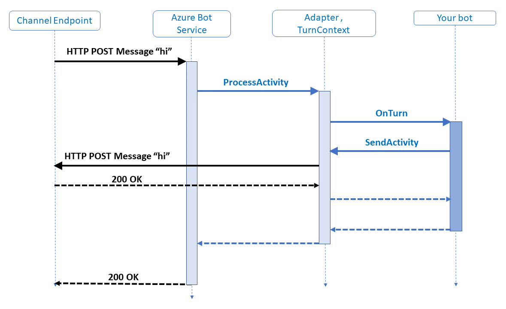

# How bots work

[!INCLUDE[applies-to](../includes/applies-to.md)]

A bot is an app that users interact with in a conversational way, using text, graphics (such as cards or images), or speech. Every interaction between the user and the bot generates an *activity*. The Bot Framework Service, which is a component of the Azure Bot Service, sends information between the user's bot-connected app (such as Facebook, Skype, Slack, etc. which we call the *channel*) and the bot. Each channel may include additional information in the activities they send. Before creating bots, it is important to understand how a bot uses activity objects to communicate with its users. Let's first take a look at activities that are exchanged when we run a simple echo bot. 


Two activity types illustrated here are: *conversation update* and *message*.

The Bot Framework Service may send a conversation update when a party joins the conversation. For example, on starting a conversation with the Bot Framework Emulator, you will see two conversation update activities (one for the user joining the conversation and one for the bot joining). To distinguish these conversation update activities, check whether the *members added* property includes a member other than the bot. 

The message activity carries conversation information between the parties. In an echo bot example, the message activities are carrying simple text and the channel will render this text. Alternatively, the message activity might carry text to be spoken, suggested actions or cards to be displayed.

In this example, the bot created and sent a message activity in response to the inbound message activity it had received. However, a bot can respond in other ways to a received message activity; it’s not uncommon for a bot to respond to a conversation update activity by sending some welcome text in a message activity. More information can be found in [welcoming the user](bot-builder-welcome-user.md).

### HTTP Details

Activities arrive at the bot from the Bot Framework Service via an HTTP POST request. The bot responds to the inbound POST request with a 200 HTTP status code. Activities sent from the bot to the channel are sent on a separate HTTP POST to the Bot Framework Service. This, in turn, is acknowledged with a 200 HTTP status code.

The protocol doesn’t specify the order in which these POST requests and their acknowledgments are made. However, to fit with common HTTP service frameworks, typically these requests are nested, meaning that the outbound HTTP request is made from the bot within the scope of the inbound HTTP request. This pattern is illustrated in the diagram above. Since there are two distinct HTTP connections back to back, the security model must provide for both.

### Defining a turn

In a conversation, people often speak one-at-a-time, taking turns speaking. With a bot, it generally reacts to user input. Within the Bot Framework SDK, a _turn_ consists of the user's incoming activity to the bot and any activity the bot sends back to the user as an immediate response. You can think of a turn as the processing associated with the arrival of a given activity.

The *turn context* object provides information about the activity such as the sender and receiver, the channel, and other data needed to process the activity. It also allows for the addition of information during the turn across various layers of the bot.

The turn context is one of the most important abstractions in the SDK. Not only does it carry the inbound activity to all the middleware components and the application logic but it also provides the mechanism whereby the middleware components and the application logic can send outbound activities.

## The activity processing stack

Let's drill into the previous diagram with a focus on the arrival of a message activity.



In the example above, the bot replied to the message activity with another message activity containing the same text message. Processing starts with the HTTP POST request, with the activity information carried as a JSON payload, arriving at the web server. In C# this will typically be an ASP.NET project, in a JavaScript Node.js project this is likely to be one of the popular frameworks such as Express or Restify.

The *adapter*, an integrated component of the SDK, is the core of the SDK runtime. The activity is carried as JSON in the HTTP POST body. This JSON is deserialized to create the Activity object that is then handed to the adapter with a call to *process activity* method. On receiving the activity, the adapter creates a *turn context* and calls the middleware. 

As mentioned above, the turn context provides the mechanism for the bot to send outbound activities, most often in response to an inbound activity. To achieve this, the turn context provides _send, update, and delete activity_ response methods. Each response method runs in an asynchronous process. 

[!INCLUDE [alert-await-send-activity](../includes/alert-await-send-activity.md)]

## Activity handlers

When the bot receives an activity, it passes it on to its *activity handlers*. Under the covers, there is one base handler called the *turn handler*. All activities get routed through there. That turn handler then calls the individual activity handler for whatever type of activity it received.

# [C#](#tab/csharp)

For example, if the bot receives a message activity, the turn handler would see that incoming activity and send it to the `OnMessageActivityAsync` activity handler. 

When building your bot, your bot logic for handling and responding to messages will go in this `OnMessageActivityAsync` handler. Likewise, your logic for handling members being added to the conversation will go in your `OnMembersAddedAsync` handler, which is called whenever a member is added to the conversation.

To implement your logic for these handlers, you will override these methods in your bot as seen in the [Bot logic](#bot-logic) section below. For each of these handlers, there is no base implementation, so just add the logic that you want in your override.

There are certain situations where you will want to override the base turn handler, such as [saving state](bot-builder-concept-state.md) at the end of a turn. When doing so, be sure to first call `await base.OnTurnAsync(turnContext, cancellationToken);` to make sure the base implementation of `OnTurnAsync` is run before your additional code. That base implementation is, among other things, responsible for calling the rest of the activity handlers such as `OnMessageActivityAsync`.

# [JavaScript](#tab/javascript)

For example, if the bot receives a message activity, the turn handler would see that incoming activity and send it to the `onMessage` activity handler.

When building your bot, your bot logic for handling and responding to messages will go in this `onMessage` handler. Likewise, your logic for handling members being added to the conversation will go in your `onMembersAdded` handler, which is called whenever a member is added to the conversation.

To implement your logic for these handlers, you will override these methods in your bot as seen in the [Bot logic](#bot-logic) section below. For each of these handlers, define your bot logic, then **be sure to call `next()` at the end**. By calling `next()` you ensure that the next handler is run.

There aren't any common situations where you will want to override the base turn handler, so be careful if you try to do so. For things such as [saving state](bot-builder-concept-state.md) that you want to do at the end of a turn, there is a special handler called `onDialog`. The `onDialog` handler runs at the end, after the rest of the handlers have run, and is not tied to a certain activity type. As with all the above handlers, be sure to call `next()` to ensure the rest of the process wraps up.

---

## Middleware

Middleware is much like any other messaging middleware, comprising a linear set of components that are each executed in order, giving each a chance to operate on the activity. The final stage of the middleware pipeline is a callback to the turn handler on the bot class the application has registered with the adapter's *process activity* method. The turn handler is generally `OnTurnAsync` in C# and `onTurn` in JavaScript.

The turn handler takes a turn context as its argument, typically the application logic running inside the turn handler function will process the inbound activity’s content and generate one or more activities in response, sending these out using the *send activity* function on the turn context. Calling *send activity* on the turn context will cause the middleware components to be invoked on the outbound activities. Middleware components execute before and after the bot’s turn handler function. The execution is inherently nested and, as such, sometimes referred to being like a Russian Doll. For more in depth information about middleware, see the [middleware topic](~/v4sdk/bot-builder-concept-middleware.md).

## Bot structure

In the following sections, we examine _key pieces_ of an EchoBot that you can easily create using the templates provided for [**CSharp**](../dotnet/bot-builder-dotnet-sdk-quickstart.md) or [**JavaScript**](../javascript/bot-builder-javascript-quickstart.md).

<!--Need to add section calling out the controller in code, and explaining it further-->

A bot is a web application, and we provide templates for each language.

# [C#](#tab/csharp)

The VSIX template generates a [ASP.NET MVC Core](https://dotnet.microsoft.com/apps/aspnet/mvc) web app. If you look at the [ASP.NET](https://docs.microsoft.com/aspnet/core/fundamentals/index?view=aspnetcore-2.1&tabs=aspnetcore2x) fundamentals, you'll see similar code in files such as **Program.cs** and **Startup.cs**. These files are required for all web apps and are not bot specific.

### appsettings.json file

The **appsettings.json** file specifies the configuration information for your bot, such as the app ID, and password among other things. If using certain technologies or using this bot in production, you will need to add your specific keys or URL to this configuration. For this Echo bot, however, you don't need to do anything here right now; the app ID and password may be left undefined at this time.

# [JavaScript](#tab/javascript)

<!-- TODO: Update this aka link to point to samples/javascript_nodejs/02.echobot (instead of samples/javascript_nodejs/02.a.echobot) once work-in-progress is merged into master. -->

The Yeoman generator creates a type of [restify](http://restify.com/) web application. If you look at the restify quickstart in their docs, you'll see an app similar to the generated **index.js** file. We describe some of the key files generated by the template. Code in some files won't be copied, but you will see it when you run the bot, and you can refer to the [Node.js echobot](https://aka.ms/js-echobot-sample) sample.

### package.json

**package.json** specifies dependencies and their associated versions for your bot. This is all set up by the template and your system.

### .env file

The **.env** file specifies the configuration information for your bot, such as the port number, app ID, and password among other things. If using certain technologies or using this bot in production, you will need to add your specific keys or URL to this configuration. For this Echo bot, however, you don't need to do anything here right now; the app ID and password may be left undefined at this time.

To use the **.env** configuration file, the template needs an extra package included.  First, get the `dotenv` package from npm:

`npm install dotenv`

---

### Bot logic

The bot logic processes incoming activities from one or more channels and generates outgoing activities in response.

# [C#](#tab/csharp)

The main bot logic is defined in the bot code, here called `Bots/EchoBot.cs`. `EchoBot` derives from `ActivityHandler`, which in turn derives from the `IBot` interface. `ActivityHandler` defines various handlers for different types of activities, such as the two defined here: `OnMessageActivityAsync`, and `OnMembersAddedAsync`. These methods are protected, but can be overwritten since we're deriving from `ActivityHandler`.

The handlers defined in `ActivityHandler` are:

| Event | Handler | Description |
| :-- | :-- | :-- |
| Any activity type received | `OnTurnAsync` | Calls one of the other handlers, based on the type of activity received. |
| Message activity received | `OnMessageActivityAsync` | Override this to handle a `Message` activity. |
| Conversation update activity received | `OnConversationUpdateActivityAsync` | On a `ConversationUpdate` activity, calls a handler if members other than the bot joined or left the conversation. |
| Non-bot members joined the conversation | `OnMembersAddedAsync` | Override this to handle members joining a conversation. |
| Non-bot members left the conversation | `OnMembersRemovedAsync` | Override this to handle members leaving a conversation. |
| Event activity received | `OnEventActivityAsync` | On an `Event` activity, calls a handler specific to the event type. |
| Token-response event activity received | `OnTokenResponseEventAsync` | Override this to handle token response events. |
| Non-token-response event activity received | `OnEventAsync` | Override this to handle other types of events. |
| Other activity type received | `OnUnrecognizedActivityTypeAsync` | Override this to handle any activity type otherwise unhandled. |

These different handlers have a `turnContext` that provides information about the incoming activity, which corresponds to the inbound HTTP request. Activities can be of various types, so each handler provides a strongly-typed activity in its turn context parameter; in most cases, `OnMessageActivityAsync` will always be handled, and is generally the most common.

As in previous 4.x versions of this framework, there is also the option to implement the public method `OnTurnAsync`. Currently, the base implementation of this method handles error checking and then calls each of the specific handlers (like the two we define in this sample) depending on the type of incoming activity. In most cases, you can leave that method alone and use the individual handlers, but if your situation requires a custom implementation of `OnTurnAsync`, it is still an option.

> [!IMPORTANT]
> If you do override the `OnTurnAsync` method, you'll need to call `base.OnTurnAsync` to get the base implementation to call all the other `On<activity>Async` handlers or call those handlers yourself. Otherwise, those handlers won't be called and that code won't be run.

In this sample, we welcome a new user or echo back the message the user sent using the `SendActivityAsync` call. The outbound activity corresponds to the outbound HTTP POST request.

```cs
public class MyBot : ActivityHandler
{
    protected override async Task OnMessageActivityAsync(ITurnContext<IMessageActivity> turnContext, CancellationToken cancellationToken)
    {
        await turnContext.SendActivityAsync(MessageFactory.Text($"Echo: {turnContext.Activity.Text}"), cancellationToken);
    }

    protected override async Task OnMembersAddedAsync(IList<ChannelAccount> membersAdded, ITurnContext<IConversationUpdateActivity> turnContext, CancellationToken cancellationToken)
    {
        foreach (var member in membersAdded)
        {
            await turnContext.SendActivityAsync(MessageFactory.Text($"welcome {member.Name}"), cancellationToken);
        }
    }
}
```

# [JavaScript](#tab/javascript)

The main bot logic is defined in the bot code, here called `bots\echoBot.js`. `EchoBot` derives from `ActivityHandler`. `ActivityHandler` defines various handlers for different types of activities, and you can modify your bot's behavior by providing additional logic, such as with `onMessage` and `onConversationUpdate` here.

The handlers defined in `ActivityHandler` are:

| Event | Handler | Description |
| :-- | :-- | :-- |
| Any activity type received | `onTurn` | Calls one of the other handlers, based on the type of activity received. |
| Message activity received | `onMessage` | Provide a function for this to handle a `Message` activity. |
| Conversation update activity received | `onConversationUpdate` | On a `ConversationUpdate` activity, calls a handler if members other than the bot joined or left the conversation. |
| Non-bot members joined the conversation | `onMembersAdded` | Provide a function for this to handle members joining a conversation. |
| Non-bot members left the conversation | `onMembersRemoved` | Provide a function for this to handle members leaving a conversation. |
| Event activity received | `onEvent` | On an `Event` activity, calls a handler specific to the event type. |
| Token-response event activity received | `onTokenResponseEvent` | Provide a function for this to handle token response events. |
| Other activity type received | `onUnrecognizedActivityType` | Provide a function for this to handle any activity type otherwise unhandled. |
| Activity handlers have completed | `onDialog` | Provide a function for this to handle any processing that should be done at the end of a turn, after the rest of your activity handlers have completed. |

On each turn, we first check to see if the bot has received a message. When we receive a message from the user, we echo back  the message they sent.

```javascript
const { ActivityHandler } = require('botbuilder');

class MyBot extends ActivityHandler {
    constructor() {
        super();
        // See https://aka.ms/about-bot-activity-message to learn more about the message and other activity types.
        this.onMessage(async (context, next) => {
            await context.sendActivity(`You said '${ context.activity.text }'`);
            // By calling next() you ensure that the next BotHandler is run.
            await next();
        });
        this.onConversationUpdate(async (context, next) => {
            await context.sendActivity('[conversationUpdate event detected]');
            // By calling next() you ensure that the next BotHandler is run.
            await next();
        });
    }
}

module.exports.MyBot = MyBot;
```

---

### Access the bot from your app

# [C#](#tab/csharp)

#### Set up services

The `ConfigureServices` method in the `Startup.cs` file loads the connected services, as well as their keys from `appsettings.json` or Azure Key Vault (if there are any), connects state, and so on. Here, we're adding MVC and setting the compatibility version on our services, then setting up the adapter and bot to be available through dependency injection to the bot controller.

<!-- want to explain the singleton vs transient here?-->

```csharp
// This method gets called by the runtime. Use this method to add services to the container.
public void ConfigureServices(IServiceCollection services)
{
    services.AddMvc().SetCompatibilityVersion(CompatibilityVersion.Version_2_1);

    // Create the credential provider to be used with the Bot Framework Adapter.
    services.AddSingleton<ICredentialProvider, ConfigurationCredentialProvider>();

    // Create the Bot Framework Adapter.
    services.AddSingleton<IBotFrameworkHttpAdapter, BotFrameworkHttpAdapter>();

    // Create the bot as a transient. In this case the ASP Controller is expecting an IBot.
    services.AddTransient<IBot, EchoBot>();
}
```

The `Configure` method finishes the configuration of your app by specifying that the app use MVC and a few other files. All bots using the Bot Framework will need that configuration call, however that will already be defined in samples or the VSIX template when you build your bot. `ConfigureServices` and `Configure` are called by the runtime when the app starts.

#### Bot Controller

The controller, following the standard MVC structure, lets you determine the routing of messages and HTTP POST requests. For our bot, we pass the incoming request on to the adapter's *process async activity* method as explained in the [activity processing stack](#the-activity-processing-stack) section above. In that call, we specify the bot and any other authorization information that may be required.

The controller implements `ControllerBase`, holds the adapter and bot that we set in `Startup.cs` (that are available here through dependency injection), and passes the necessary information on to the bot when it receives an incoming HTTP POST.

Here, you'll see the class proceeded by route and controller attributes. These assist the framework to route the messages appropriately and know which controller to use. If you change the value in the route attribute, that changes the endpoint the emulator or other channels use access your bot.

```cs
// This ASP Controller is created to handle a request. Dependency Injection will provide the Adapter and IBot
// implementation at runtime. Multiple different IBot implementations running at different endpoints can be
// achieved by specifying a more specific type for the bot constructor argument.
[Route("api/messages")]
[ApiController]
public class BotController : ControllerBase
{
    private readonly IBotFrameworkHttpAdapter Adapter;
    private readonly IBot Bot;

    public BotController(IBotFrameworkHttpAdapter adapter, IBot bot)
    {
        Adapter = adapter;
        Bot = bot;
    }

    [HttpPost]
    public async Task PostAsync()
    {
        // Delegate the processing of the HTTP POST to the adapter.
        // The adapter will invoke the bot.
        await Adapter.ProcessAsync(Request, Response, Bot);
    }
}
```

# [JavaScript](#tab/javascript)

#### index.js

The `index.js` sets up your bot and the hosting service that will forward activities to your bot logic.

#### Required libraries

At the very top of your `index.js` file you will find a series of modules or libraries that are being required. These modules will give you access to a set of functions that you may want to include in your application.

```javascript
const dotenv = require('dotenv');
const path = require('path');
const restify = require('restify');

// Import required bot services.
// See https://aka.ms/bot-services to learn more about the different parts of a bot.
const { BotFrameworkAdapter } = require('botbuilder');

// This bot's main dialog.
const { MyBot } = require('./bot');

// Import required bot configuration.
const ENV_FILE = path.join(__dirname, '.env');
dotenv.config({ path: ENV_FILE });
```

#### Set up services

The next parts set up the server and adapter that allow your bot to communicate with the user and send responses. The server will listen on the specified port from the configuration file, or fall back to _3978_ for connection with your emulator. The adapter will act as the conductor for your bot, directing incoming and outgoing communication, authentication, and so on.

```javascript
// Create HTTP server
const server = restify.createServer();
server.listen(process.env.port || process.env.PORT || 3978, () => {
    console.log(`\n${ server.name } listening to ${ server.url }`);
    console.log(`\nGet Bot Framework Emulator: https://aka.ms/botframework-emulator`);
    console.log(`\nTo talk to your bot, open the emulator select "Open Bot"`);
});

// Create adapter.
// See https://aka.ms/about-bot-adapter to learn more about how bots work.
const adapter = new BotFrameworkAdapter({
    appId: process.env.MicrosoftAppId,
    appPassword: process.env.MicrosoftAppPassword
});

// Catch-all for errors.
adapter.onTurnError = async (context, error) => {
    // This check writes out errors to console log .vs. app insights.
    console.error(`\n [onTurnError]: ${ error }`);
    // Send a message to the user
    await context.sendActivity(`Oops. Something went wrong!`);
};

// Create the main dialog.
const myBot = new MyBot();
```

#### Forwarding requests to the bot logic

The adapter's `processActivity` sends incoming activities to the bot logic.
The third parameter within `processActivity` is a function handler that will be called to perform the bot's logic after the received [activity](#the-activity-processing-stack) has been pre-processed by the adapter and routed through any middleware. The turn context variable, passed as an argument to the function handler, can be used to provide information about the incoming activity, the sender and receiver, the channel, the conversation, etc. Activity processing is routed to the bot's `run` method. `run` is defined in `ActivityHandler`; it performs some error checking, and then calls the bot's event handlers based on the type of activity received.

```javascript
// Listen for incoming requests.
server.post('/api/messages', (req, res) => {
    adapter.processActivity(req, res, async (context) => {
        // Route to main dialog.
        await myBot.run(context);
    });
});
```

---

## Manage bot resources

The bot resources, such as app ID, passwords, keys or secrets for connected services, will need to be managed appropriately. For more on how to do so, see [Manage bot resources](bot-file-basics.md).

## Additional resources

- To understand the role of state in bots, see [managing state](bot-builder-concept-state.md).
