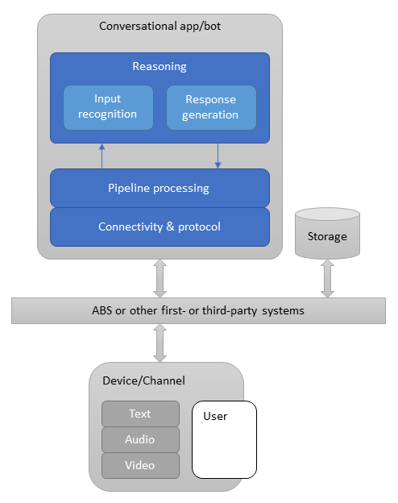

# How bots work

[!INCLUDE[applies-to](../includes/applies-to.md)]

A bot is an app that users interact with in a conversational way, using text, graphics (such as cards or images), or speech. Azure Bot Service (ABS) is a cloud platform. It hosts bots and makes them available to channels, such as Facebook or Slack.

The Bot Framework Service, which is a component of the Azure Bot Service, sends information between the user's bot-connected app (such as Facebook or Slack and so on, which we call the *channel*) and the bot. Each channel may include additional information in the activities they send. Before creating bots, it is important to understand how a bot uses activity objects to communicate with its users. Let's first take a look at activities that are exchanged when we run a simple echo bot.


Two activity types illustrated here are: *conversation update* and *message*.

The Bot Framework Service may send a conversation update when a party joins the conversation. For example, on starting a conversation with the Bot Framework Emulator, you will see two conversation update activities (one for the user joining the conversation and one for the bot joining). To distinguish these conversation update activities, check who is included in the *members added* property of the activity.

The message activity carries conversation information between the parties. In an echo bot example, the message activities are carrying simple text and the channel will render this text. Alternatively, the message activity might carry text to be spoken, suggested actions or cards to be displayed.

In this example, the bot created and sent a message activity in response to the inbound message activity it had received. However, a bot can respond in other ways to a received message activity; it's not uncommon for a bot to respond to a conversation update activity by sending some welcome text in a message activity. More information can be found in [welcoming the user](bot-builder-welcome-user.md).

## The Bot Framework SDK

The Bot Framework SDK allows you to build bots that can be hosted on ABS. The service defines a REST API and an activity protocol for how your bot and channels or users can interact. The SDK builds upon this REST API and provides an abstraction of the service so that you can focus on the conversational logic. While you don't need to understand the REST service to use the SDK, understanding some of its features can be helpful.

## What a bot is

A bot is an app that has a conversational interface. They can be used to shift simple, repetitive tasks, such as taking a dinner reservation or gathering profile information, on to automated systems that may no longer require direct human intervention. Users converse with a bot using text, interactive cards, and speech. A bot interaction can be a quick question and answer, or it can be a sophisticated conversation that intelligently provides access to services.

### Activities

Every interaction between the user and the bot is represented as an *activity*.
The activity schema defines the activities that can be exchanged between a user or channel and a bot. An activity can represent human text or speech, app-to-app notifications, reactions to other messages, and so on.

<a id="defining-a-turn"></a>

### Turns

In a conversation, people often speak one-at-a-time, taking turns speaking. With a bot, it generally reacts to user input. Within the Bot Framework SDK, a _turn_ consists of the user's incoming activity to the bot and any activity the bot sends back to the user as an immediate response. You can think of a turn as the processing associated with the bot receiving a given activity.

### HTTP Details

Activities arrive at the bot from the Bot Framework Service via an HTTP POST request. The bot responds to the inbound POST request with a 200 HTTP status code. Activities sent from the bot to the channel are sent on a separate HTTP POST to the Bot Framework Service. This, in turn, is acknowledged with a 200 HTTP status code.

The protocol doesn't specify the order in which these POST requests and their acknowledgments are made. However, to fit with common HTTP service frameworks, typically these requests are nested, meaning that the outbound HTTP request is made from the bot within the scope of the inbound HTTP request. This pattern is illustrated in the earlier diagram. Since there are two distinct HTTP connections back to back, the security model must provide for both.

> [!NOTE]
> The bot has 15 seconds to acknowledge the call with a status 200 on most channels. If the bot does not respond within 15 seconds, an HTTP GatewayTimeout error (504) occurs.

## Bot application structure

In the SDK, a bot application has an _adapter_ class that handles connectivity with the channels
The adapter includes a pipeline that allows you to add _middleware_ to every turn. Middleware can provide additional processing that happens outside of your bot's conversational reasoning. (The SDK also lets you use custom channel adapters, in which the adapter itself performs the tasks that the Bot Connector Service and the default Bot Adapter do.)

A bot application also has a _bot_ class that handles the conversational reasoning for the bot, the _bot logic_ or _bot code_.

Bots often need to retrieve and store state each turn. This is handled through a _storage_ class.

> [!div class="mx-imgBorder"]
> 

## The activity processing stack

Let's drill into the previous sequence diagram with a focus on the arrival of a message activity.


In the example above, the bot replied to the message activity with another message activity containing the same text message. Processing starts with the HTTP POST request, with the activity information carried as a JSON payload, arriving at the web server. In C# this will typically be an ASP.NET project, in a JavaScript Node.js project this is likely to be one of the popular frameworks such as Express or Restify.

The _adapter_, an integrated component of the SDK, is the core of the SDK runtime. The activity is carried as JSON in the HTTP POST body. This JSON is deserialized to create the _activity_ object that is then handed to the adapter through its _process activity_ method. On receiving the activity, the adapter creates a _turn context_ and calls the middleware.

As mentioned above, the turn context provides the mechanism for the bot to send outbound activities, most often in response to an inbound activity. To achieve this, the turn context provides _send_, _update_, and _delete activity_ response methods. Each response method runs in an asynchronous process.

[!INCLUDE [alert-await-send-activity](../includes/alert-await-send-activity.md)]

<!-- TODO Need to reorganize and rewrite parts of this. -->

### The role of ABS

### HTTP request details

### messaging endpoint

## The bot adapter

### The turn context

The *turn context* object provides information about the activity such as the sender and receiver, the channel, and other data needed to process the activity. It also allows for the addition of information during the turn across various layers of the bot.

The turn context is one of the most important abstractions in the SDK. Not only does it carry the inbound activity to all the middleware components and the application logic but it also provides the mechanism whereby the middleware components and the application logic can send outbound activities.

### Middleware

Middleware is much like any other messaging middleware, comprising a linear set of components that are each executed in order, giving each a chance to operate on the activity. The final stage of the middleware pipeline is a callback to the turn handler on the bot class the application has registered with the adapter's *process activity* method. The turn handler is generally `OnTurnAsync` in C# and `onTurn` in JavaScript.

The turn handler takes a turn context as its argument, typically the application logic running inside the turn handler function will process the inbound activity's content and generate one or more activities in response, sending these out using the *send activity* function on the turn context. Calling *send activity* on the turn context will cause the middleware components to be invoked on the outbound activities. Middleware components execute before and after the bot's turn handler function. The execution is inherently nested and, as such, sometimes referred to being like a Russian Doll. For more in depth information about middleware, see the [middleware topic](~/v4sdk/bot-builder-concept-middleware.md).

## The bot object

## Bot templates

In the following sections, we examine _key pieces_ of an EchoBot that you can easily create using the templates provided for [**CSharp**](../dotnet/bot-builder-dotnet-sdk-quickstart.md) or [**JavaScript**](../javascript/bot-builder-javascript-quickstart.md) or [**Python**](../python/bot-builder-python-quickstart.md).

<!--Need to add section calling out the controller in code, and explaining it further-->

A bot is a web application, and templates are provided for each language.

[!INCLUDE [VSIX templates](~/includes/vsix-templates-versions.md)]

# [C#](#tab/csharp)

The VSIX template generates a [ASP.NET MVC Core](https://dotnet.microsoft.com/apps/aspnet/mvc) web app. If you look at the [ASP.NET](/aspnet/core/fundamentals/index?view=aspnetcore-3.1&preserve-view=true) fundamentals, you'll see similar code in files such as **Program.cs** and **Startup.cs**. These files are required for all web apps and are not bot specific.

### appsettings.json file

The **appsettings.json** file specifies the configuration information for your bot, such as the app ID, and password among other things. If using certain technologies or using this bot in production, you will need to add your specific keys or URL to this configuration. For this Echo bot, however, you don't need to do anything here right now; the app ID and password may be left undefined at this time.

# [JavaScript](#tab/javascript)

<!-- TODO: Update this aka link to point to samples/javascript_nodejs/02.echobot (instead of samples/javascript_nodejs/02.a.echobot) once work-in-progress is merged into master. -->

The Yeoman generator creates a type of [restify](http://restify.com/) web application. If you look at the restify quickstart in their docs, you'll see an app similar to the generated **index.js** file. We describe some of the key files generated by the template. Code in some files won't be copied, but you will see it when you run the bot, and you can refer to the [Node.js echobot](https://aka.ms/js-echobot-sample) sample.

### package.json

**package.json** specifies dependencies and their associated versions for your bot. This is all set up by the template and your system.

### .env file

The **.env** file specifies the configuration information for your bot, such as the port number, app ID, and password among other things. If using certain technologies or using this bot in production, you will need to add your specific keys or URL to this configuration. For this Echo bot, however, you don't need to do anything here right now; the app ID and password may be left undefined at this time.

To use the **.env** configuration file, the template needs an extra package included.  First, get the `dotenv` package from npm:

`npm install dotenv`

# [Python](#tab/python)

### requirements.txt

**requirements.txt** specifies dependencies and their associated versions for your bot.  This is all setup by the template and your system.

Dependencies should be installed using `pip install -r requirements.txt`

### config.py

The **config.py** file specifies the configuration information for your bot, such as the port number, app ID, and password among other things. If using certain technologies or using this bot in production, you will need to add your specific keys or URL to this configuration. For this Echo bot, however, you don't need to do anything here right now; the app ID and password may be left undefined at this time.

---

### Access the bot from your app

# [C#](#tab/csharp)

#### Set up services

The `ConfigureServices` method in the `Startup.cs` file loads the connected services, as well as their keys from `appsettings.json` or Azure Key Vault (if there are any), connects state, and so on. Here, we're adding MVC and setting the compatibility version on our services, then setting up the adapter and bot to be available through dependency injection to the bot controller.

<!-- want to explain the singleton vs transient here?-->

```csharp
// This method gets called by the runtime. Use this method to add services to the container.
public void ConfigureServices(IServiceCollection services)
{
    services.AddMvc().SetCompatibilityVersion(CompatibilityVersion.Version_2_1);

    // Create the credential provider to be used with the Bot Framework Adapter.
    services.AddSingleton<ICredentialProvider, ConfigurationCredentialProvider>();

    // Create the Bot Framework Adapter.
    services.AddSingleton<IBotFrameworkHttpAdapter, BotFrameworkHttpAdapter>();

    // Create the bot as a transient. In this case the ASP Controller is expecting an IBot.
    services.AddTransient<IBot, EchoBot>();
}
```

The `Configure` method finishes the configuration of your app by specifying that the app use MVC and a few other files. All bots using the Bot Framework will need that configuration call, however that will already be defined in samples or the VSIX template when you build your bot. `ConfigureServices` and `Configure` are called by the runtime when the app starts.

#### Bot Controller

The controller, following the standard MVC structure, lets you determine the routing of messages and HTTP POST requests. For our bot, we pass the incoming request on to the adapter's *process async activity* method as explained in the [activity processing stack](#the-activity-processing-stack) section above. In that call, we specify the bot and any other authorization information that may be required.

The controller implements `ControllerBase`, holds the adapter and bot that we set in `Startup.cs` (that are available here through dependency injection), and passes the necessary information on to the bot when it receives an incoming HTTP POST.

Here, you'll see the class proceeded by route and controller attributes. These assist the framework to route the messages appropriately and know which controller to use. If you change the value in the route attribute, that changes the endpoint the emulator or other channels use access your bot.

```cs
// This ASP Controller is created to handle a request. Dependency Injection will provide the Adapter and IBot
// implementation at runtime. Multiple different IBot implementations running at different endpoints can be
// achieved by specifying a more specific type for the bot constructor argument.
[Route("api/messages")]
[ApiController]
public class BotController : ControllerBase
{
    private readonly IBotFrameworkHttpAdapter Adapter;
    private readonly IBot Bot;

    public BotController(IBotFrameworkHttpAdapter adapter, IBot bot)
    {
        Adapter = adapter;
        Bot = bot;
    }

    [HttpPost]
    public async Task PostAsync()
    {
        // Delegate the processing of the HTTP POST to the adapter.
        // The adapter will invoke the bot.
        await Adapter.ProcessAsync(Request, Response, Bot);
    }
}
```

# [JavaScript](#tab/javascript)

#### index.js

The `index.js` sets up your bot and the hosting service that will forward activities to your bot logic.

#### Required libraries

At the very top of your `index.js` file you will find a series of modules or libraries that are being required. These modules will give you access to a set of functions that you may want to include in your application.

```javascript
const dotenv = require('dotenv');
const path = require('path');
const restify = require('restify');

// Import required bot services.
// See https://aka.ms/bot-services to learn more about the different parts of a bot.
const { BotFrameworkAdapter } = require('botbuilder');

// This bot's main dialog.
const { MyBot } = require('./bot');

// Import required bot configuration.
const ENV_FILE = path.join(__dirname, '.env');
dotenv.config({ path: ENV_FILE });
```

#### Set up services

The next parts set up the server and adapter that allow your bot to communicate with the user and send responses. The server will listen on the specified port from the configuration file, or fall back to _3978_ for connection with your emulator. The adapter will act as the conductor for your bot, directing incoming and outgoing communication, authentication, and so on.

```javascript
// Create HTTP server
const server = restify.createServer();
server.listen(process.env.port || process.env.PORT || 3978, () => {
    console.log(`\n${ server.name } listening to ${ server.url }`);
    console.log(`\nGet Bot Framework Emulator: https://aka.ms/bot-framework-www-portal-emulator`);
    console.log(`\nTo talk to your bot, open the emulator select "Open Bot"`);
});

// Create adapter.
// See https://aka.ms/about-bot-adapter to learn more about how bots work.
const adapter = new BotFrameworkAdapter({
    appId: process.env.MicrosoftAppId,
    appPassword: process.env.MicrosoftAppPassword
});

// Catch-all for errors.
adapter.onTurnError = async (context, error) => {
    // This check writes out errors to console log .vs. app insights.
    console.error(`\n [onTurnError]: ${ error }`);
    // Send a message to the user
    await context.sendActivity(`Oops. Something went wrong!`);
};

// Create the main dialog.
const myBot = new MyBot();
```

#### Forwarding requests to the bot logic

The adapter's `processActivity` sends incoming activities to the bot logic.
The third parameter within `processActivity` is a function handler that will be called to perform the bot's logic after the received [activity](#the-activity-processing-stack) has been pre-processed by the adapter and routed through any middleware. The turn context variable, passed as an argument to the function handler, can be used to provide information about the incoming activity, the sender and receiver, the channel, the conversation, etc. Activity processing is routed to the bot's `run` method. `run` is defined in `ActivityHandler`; it performs some error checking, and then calls the bot's event handlers based on the type of activity received.

```javascript
// Listen for incoming requests.
server.post('/api/messages', (req, res) => {
    adapter.processActivity(req, res, async (context) => {
        // Route to main dialog.
        await myBot.run(context);
    });
});
```

# [Python](#tab/python)

#### app.py

The `app.py` sets up your bot and the hosting service that will forward activities to your bot logic.

#### Required libraries

At the very top of your `app.py` file you will find a series of modules or libraries that are being required. These modules will give you access to a set of functions that you may want to include in your application.

```py
from botbuilder.core import BotFrameworkAdapterSettings, TurnContext, BotFrameworkAdapter
from botbuilder.schema import Activity, ActivityTypes

from bots import MyBot

# Create the loop and Flask app
LOOP = asyncio.get_event_loop()
app = Flask(__name__, instance_relative_config=True)
app.config.from_object("config.DefaultConfig")
```

#### Set up services

The next parts set up the server and adapter that allow your bot to communicate with the user and send responses. The server will listen on the specified port from the configuration file, or fall back to _3978_ for connection with your emulator. The adapter will act as the conductor for your bot, directing incoming and outgoing communication, authentication, and so on.

```py
# Create adapter.
# See https://aka.ms/about-bot-adapter to learn more about how bots work.
SETTINGS = BotFrameworkAdapterSettings(app.config["APP_ID"], app.config["APP_PASSWORD"])
ADAPTER = BotFrameworkAdapter(SETTINGS)

# Catch-all for errors.
async def on_error(context: TurnContext, error: Exception):
    # This check writes out errors to console log .vs. app insights.
    # NOTE: In production environment, you should consider logging this to Azure
    #       application insights.
    print(f"\n [on_turn_error] unhandled error: {error}", file=sys.stderr)

    # Send a message to the user
    await context.send_activity("The bot encountered an error or bug.")
    await context.send_activity("To continue to run this bot, please fix the bot source code.")
    # Send a trace activity if we're talking to the Bot Framework Emulator
    if context.activity.channel_id == 'emulator':
        # Create a trace activity that contains the error object
        trace_activity = Activity(
            label="TurnError",
            name="on_turn_error Trace",
            timestamp=datetime.utcnow(),
            type=ActivityTypes.trace,
            value=f"{error}",
            value_type="https://www.botframework.com/schemas/error"
        )
        # Send a trace activity, which will be displayed in Bot Framework Emulator
        await context.send_activity(trace_activity)

ADAPTER.on_turn_error = on_error

# Create the Bot
BOT = MyBot()
```

#### Forwarding requests to the bot logic

The adapter's `process_activity` sends incoming activities to the bot logic.
The third parameter within `process_activity` is a function handler that will be called to perform the bot's logic after the received [activity](#the-activity-processing-stack) has been pre-processed by the adapter and routed through any middleware. The turn context variable, passed as an argument to the function handler, can be used to provide information about the incoming activity, the sender and receiver, the channel, the conversation, etc. Activity processing is routed to the bot's `on_turn` method. `on_turn` is defined in `ActivityHandler`; it performs some error checking, and then calls the bot's event handlers based on the type of activity received.

```py
# Listen for incoming requests on /api/messages
@app.route("/api/messages", methods=["POST"])
def messages():
    # Main bot message handler.
    if "application/json" in request.headers["Content-Type"]:
        body = request.json
    else:
        return Response(status=415)

    activity = Activity().deserialize(body)
    auth_header = (
        request.headers["Authorization"] if "Authorization" in request.headers else ""
    )

    try:
        task = LOOP.create_task(
            ADAPTER.process_activity(activity, auth_header, BOT.on_turn)
        )
        LOOP.run_until_complete(task)
        return Response(status=201)
    except Exception as exception:
        raise exception
```

---

## Manage bot resources

The bot resources, such as app ID, passwords, keys or secrets for connected services, will need to be managed appropriately. For more on how to do so, see [Manage bot resources](bot-file-basics.md).

## Additional information

The Bot Framework SDK wraps and builds upon the Bot Connector REST API. If you want to understand the underlying HTTP requests that support the SDK, see the Connector [authentication](../rest-api/bot-framework-rest-connector-authentication.md) and associated articles.
The activities a bot sends and receives conform to the [Bot Framework Activity schema](https://aka.ms/botSpecs-activitySchema).

## Next steps

- To understand the role of state in bots, see [managing state](bot-builder-concept-state.md).
- To understand key concepts of developing bots for Microsoft Teams, see [How Microsoft Teams bots work](bot-builder-basics-teams.md)
