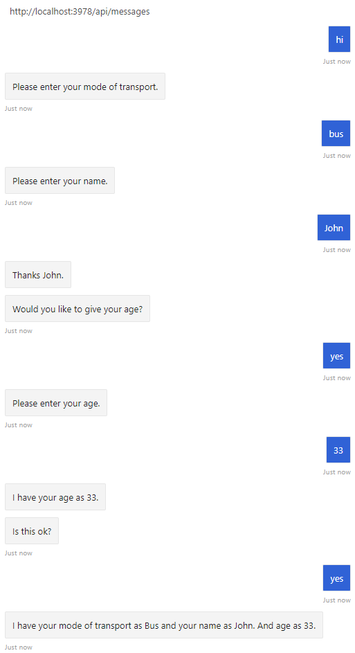

# Reuse dialogs

[!INCLUDE[applies-to](../includes/applies-to.md)]

With component dialogs, you can create independent dialogs to handle specific scenarios, breaking a large dialog set into more manageable pieces. Each of these pieces has its own dialog set, and avoids any name collisions with the dialog sets outside of it.

## Prerequisites

- Knowledge of [bot basics][concept-basics], the [dialogs library][concept-dialogs], and how to [manage conversations][simple-flow].
- A copy of the multi-turn prompt sample in either [**CSharp**][cs-sample] or [**JavaScript**][js-sample].

## About the sample

In the multi-turn prompt sample, we use a waterfall dialog, a few prompts, and a component dialog to create a simple interaction that asks the user a series of questions. The code uses a dialog to cycle through these steps:

| Steps        | Prompt type  |
|:-------------|:-------------|
| Ask the user for their mode of transportation | Choice prompt |
| Ask the user for their name | Text prompt |
| Ask the user if they want to provide their age | Confirm prompt |
| If they answered yes, asks for their age  | Number prompt with validation to only accept ages greater than 0 and less than 150. |
| Asks if the collected information is "ok" | Reuse Confirm prompt |

Finally, if they answered yes, display the collected information; otherwise, tell the user that their information will not be kept.

## Implement the component dialog

In the multi-turn prompt sample, we use a _waterfall dialog_, a few _prompts_, and a _component dialog_ to create a simple interaction that asks the user a series of questions.

A component dialog encapsulates one or more dialogs. The component dialog has an inner dialog set, and the dialogs and prompts that you add to this inner dialog set have their own IDs, visible only from within the component dialog.

# [C#](#tab/csharp)

To use dialogs, install the **Microsoft.Bot.Builder.Dialogs** NuGet package.

**Dialogs\UserProfileDialog.cs**

Here the `UserProfileDialog` class derives from the `ComponentDialog` class.

[!code-csharp[Class](~/../botbuilder-samples/samples/csharp_dotnetcore/05.multi-turn-prompt/Dialogs/UserProfileDialog.cs?range=13)]

Within the constructor, the `AddDialog` method adds dialogs and prompts to the component dialog. The first item you add with this method is set as the initial dialog, but you can change this by explicitly setting the `InitialDialogId` property. When you start a component dialog, it will start its _initial dialog_.

[!code-csharp[Constructor](~/../botbuilder-samples/samples/csharp_dotnetcore/05.multi-turn-prompt/Dialogs/UserProfileDialog.cs?range=17-42)]

This is the implementation of the first step of the waterfall dialog.

[!code-csharp[First step](~/../botbuilder-samples/samples/csharp_dotnetcore/05.multi-turn-prompt/Dialogs/UserProfileDialog.cs?range=44-54)]

For more information on implementing waterfall dialogs, see how to [implement sequential conversation flow](bot-builder-dialog-manage-complex-conversation-flow.md).

# [JavaScript](#tab/javascript)

To use dialogs, your project needs to install the **botbuilder-dialogs** npm package.

**dialogs/userProfileDialog.js**

Here the `UserProfileDialog` class extends `ComponentDialog`.

[!code-javascript[Class](~/../botbuilder-samples/samples/javascript_nodejs/05.multi-turn-prompt/dialogs/userProfileDialog.js?range=24)]

Within the constructor, the `AddDialog` method adds dialogs and prompts to the component dialog. The first item you add with this method is set as the initial dialog, but you can change this by explicitly setting the `InitialDialogId` property. When you start a component dialog, it will start its _initial dialog_.

[!code-javascript[Constructor](~/../botbuilder-samples/samples/javascript_nodejs/05.multi-turn-prompt/dialogs/userProfileDialog.js?range=25-47)]

This is the implementation of the first step of the waterfall dialog.

[!code-javascript[First step](~/../botbuilder-samples/samples/javascript_nodejs/05.multi-turn-prompt/dialogs/userProfileDialog.js?range=66-73)]

For more information on implementing waterfall dialogs, see how to [implement sequential conversation flow](bot-builder-dialog-manage-complex-conversation-flow.md).

---

At run-time, the component dialog maintains its own dialog stack. When the component dialog is started:

- An instance is created and added to the outer dialog stack
- It creates an inner dialog stack that it adds to its state
- It starts its initial dialog and adds that to the inner dialog stack.

From the parent context, it will look like the component is the active dialog. From inside the component, it will look like the initial dialog is the active dialog.

### Implement the rest of the dialog and add it to the bot

In the outer dialog set, the one to which you add the component dialog, the component dialog has the ID that you created it with. In the outer set, the component looks like a single dialog, much like prompts do.

To use a component dialog, add an instance of it to the bot's dialog set - this is the outer dialog set.

# [C#](#tab/csharp)

**DialogExtensions.cs**

In the sample, this is done using the `Run` extension method as shown below.

[!code-csharp[Run method](~/../botbuilder-samples/samples/csharp_dotnetcore/05.multi-turn-prompt/DialogExtensions.cs?range=13-24)]

**Bots\DialogBot.cs**

The `Run` method is called from the bot's `OnMessageActivityAsync` method.

[!code-csharp[OnMessageActivityAsync](~/../botbuilder-samples/samples/csharp_dotnetcore/05.multi-turn-prompt/Bots/DialogBot.cs?range=42-48)]

# [JavaScript](#tab/javascript)

**dialogs/userProfileDialog.js**

In the sample, we've added a `run` method to the user profile dialog.

[!code-javascript[run method](~/../botbuilder-samples/samples/javascript_nodejs/05.multi-turn-prompt/dialogs/userProfileDialog.js?range=55-64)]

**bots/dialogBot.js**

The `run` method is called from the bot's `onMessage` method.

[!code-javascript[onMessage](~/../botbuilder-samples/samples/javascript_nodejs/05.multi-turn-prompt/bots/dialogBot.js?range=30-37)]

---

## To test the bot

1. If you have not done so already, install the [Bot Framework Emulator](https://aka.ms/bot-framework-emulator-readme).
1. Run the sample locally on your machine.
1. Start the emulator, connect to your bot, and send messages as shown below.

## Additional information

### How cancellation works for component dialogs

If you call _cancel all dialogs_ from the component dialog's context, the component dialog will cancel all of the dialogs on its inner stack and then end, returning control to the next dialog on the outer stack.

If you call _cancel all dialogs_ from the outer context, the component is cancelled, along with the rest of the dialogs on the outer context.

Keep this in mind when managing nested component dialogs in your bot.

## Next steps

You can enhance bots to react to additional input, like "help" or "cancel", that can interrupt the normal flow of the conversation.

> [!div class="nextstepaction"]
> [Handle user interruptions](bot-builder-howto-handle-user-interrupt.md)

<!-- Footnote-style links -->

[concept-basics]: bot-builder-basics.md
[concept-state]: bot-builder-concept-state.md
[concept-dialogs]: bot-builder-concept-dialog.md

[simple-flow]: bot-builder-dialog-manage-conversation-flow.md
[prompting]: bot-builder-prompts.md
[component-dialogs]: bot-builder-compositcontrol.md

[cs-sample]: https://aka.ms/cs-multi-prompts-sample
[js-sample]: https://aka.ms/js-multi-prompts-sample
