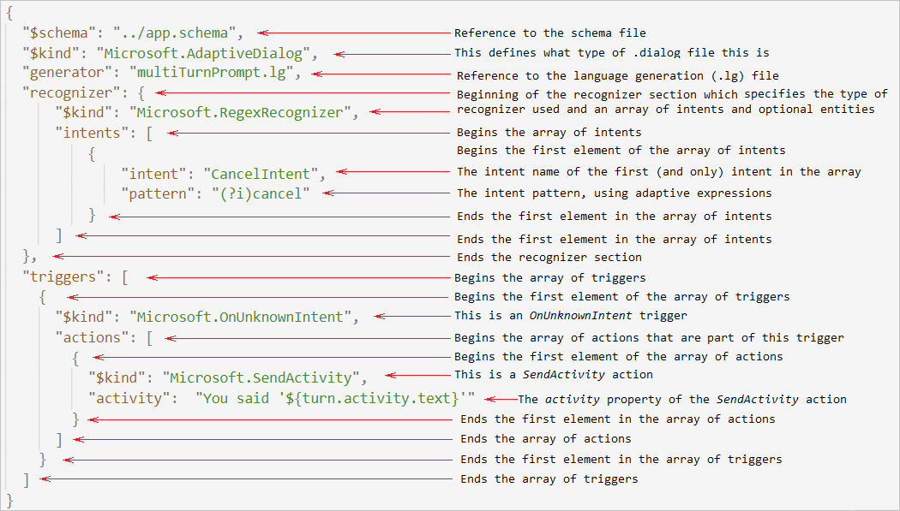

# Using declarative assets in adaptive dialogs

This article explains the concepts behind declarative assets and bots that incorporate an adaptive dialog using the declarative approach.  Declarative adaptive dialogs consist of JSON-based files that describe all of the attributes of the adaptive dialogs, including their [triggers](bot-builder-concept-adaptive-dialog-triggers.md) and [actions](bot-builder-concept-adaptive-dialog-actions.md). These declarative files are loaded at run time using the resource manager to create the adaptive dialogs.

## Prerequisites

- Knowledge of [bot basics][concept-basics], the [dialogs library][concept-dialogs] and [adaptive dialogs][concept-adaptive].

## Declarative files

Declarative files currently consist of `.dialog` files, a JSON based file that describe all of the attributes of an adaptive dialog and `.lg` files that consist of LG templates that define the [language generation (LG)](bot-builder-concept-adaptive-dialog-generators.md) aspects of your bot.

### .dialog files

Adaptive dialog declarative files that have the .dialog extension contain the following elements:

- The `$schema` field contains the URI of the JSON Schema definition for Bot Framework dialog schemas. In order to create a component for Bot Framework .dialog files, you need to create a schema file describing your configuration that meets this definition. This is described uses draft 7 of the JSON schema vocabulary.

 This schema file enables [IntelliSense][intellisense] to work for your declarative elements. If it cannot find the referenced file, it will not result in a warning or error. Everything except IntelliSense will work as expected. For information on how to create this file, see [Creating the schema file](bot-builder-dialogs-declarative.md#creating-the-schema-file) in the _Create a bot using declarative adaptive dialogs_ article. The name of the schema file can be any valid filename, but is typically named **app.schema**.
- The `$kind` field identifies the type of component described in this file. For an adaptive dialog, `$kind` must be "Microsoft.AdaptiveDialog". In subobjects, `$kind` identifies a trigger or action that is part of the dialog. This field correlates with the `[JsonProperty("$kind")]` class attribute that is associated with every class in the Bot framework SDK that is designed to work using the declarative approach.
- The `triggers` field contains an array of one or more triggers. The type of trigger is declared by its `$kind` field. Each trigger contains an array of one or more actions and can have additional properties associate with it.
- Each `actions` field contains an array of one or more actions Its `$kind` field indicates the action type. Each action can have additional properties associated with it.

An example of a simple `.dialog` file:

```json
{
  "$schema": "../app.schema",
  "$kind": "Microsoft.AdaptiveDialog",
  "triggers": [
    {
      "$kind": "Microsoft.OnUnknownIntent",
      "actions": [
        {
          "$kind": "Microsoft.SendActivity",
          "activity":  "You said '${turn.activity.text}'"
        }
      ]
    }
  ]
}
```

The elements of the `.dialog` file defined:

> [!div class="mx-imgBorder"]
> 

### .lg files

Adaptive dialog declarative files that have the `.lg` extension are described in detail in the [.lg file format][lg-file-format] article.

## The resource explorer

The resource explorer provides the tools you need to import declarative adaptive dialog files into your bot and use them as if they were adaptive dialogs hard coded directly in your bots source code.

With the resource explorer you can create resource objects that contain all of the relevant information about the declarative files required to create adaptive dialogs at run time, which is done using the resource explorer's type loader that imports files with the `.dialog` and `.lg` extensions.

### The resource object

The resource explorer's `GetResource` method reads the declarative file into a resource object.  The resource object contains the information about the declarative file and can be used by any process that needs to reference it, such as the type loader.

# [C#](#tab/csharp)

<!--This example could be improved-->
```Csharp
var resource = this.resourceExplorer.GetResource("main.dialog");
```

# [JavaScript](#tab/javascript)

```javascript
let rootDialogResource = resourceExplorer.getResource('echo.dialog');
```

---

### The type loader

Once the resource explorer's `GetResource` method reads the declarative file into a resource object, the `LoadType` method casts the resource to an `AdaptiveDialog` object. The `AdaptiveDialog` object can be used the same as any other non-declarative adaptive dialog is used when creating a dialog manager.

# [C#](#tab/csharp)

<!--This example could be improved-->
```Csharp
dialogManager = new DialogManager(resourceExplorer.LoadType<AdaptiveDialog>(resource));
```

# [JavaScript](#tab/javascript)

```javascript
let dialogManager = new DialogManager(resourceExplorer.loadType(rootDialogResource));
```

---

### Auto reload dialogs when file changes

Any time a declarative file changes when your bot is running, a `changed` event fires. You can capture that event and reload your declarative files, that way when any adaptive dialog needs updated you do not need to update your code and recompile your source code or restart your bot. This can be especially useful in a production environment.

# [C#](#tab/csharp)

<!--This example could be improved-->
```Csharp
// auto reload the root dialog when it changes
this.resourceExplorer.Changed += (e, resources) =>
{
    if (resources.Any(resource => resource.Id == "main.dialog"))
    {
        Task.Run(() => this.LoadRootDialogAsync());
    }
};

private void LoadRootDialogAsync()
{
    var resource = this.resourceExplorer.GetResource("main.dialog");
    dialogManager = new DialogManager(resourceExplorer.LoadType<AdaptiveDialog>(resource));
}
```

# [JavaScript](#tab/javascript)

```javascript
const handleResourceChange = (resources) => {
    if (Array.isArray(resources)) {
        if((resources || []).find(r => r.resourceId.endsWith('.dialog')) !== undefined) loadRootDialog();
    } else {
        if (resources.resourceId && resources.resourceId.endsWith('.dialog')) loadRootDialog()
    }
};

// Add a resource change handler to resource explorer.
resourceExplorer.emitter.on('changed', handleResourceChange);
```

---


<!---
- Create resource objects that contain all of the relevant information about your declarative files using the `GetResource()` method.
- Automatically reload dialogs during run time from the declarative files anytime one of them changes, simply by setting the `Changed` property to `true`.
- 

1. Create a `ResourceExplorer` object.
   - Use `resourceExplorer.Changed` to auto reload dialogs from the declarative files when any of them change.
   - Use `resourceExplorer.GetResource()` to read the declarative file into a resource object.
   - use `resourceExplorer.LoadType()` to dynamically create your adaptive dialog from the resource object that you previously loaded you declarative (`.dialog`) files into using `.GetResource()`.
2. Use `dialogManager.UseResourceExplorer()` to register the resource explorer object for discovery by the various parts of the Bot Framework SDK. `.UseResourceExplorer()` is written the same way that any 3rd party component would need to be written in that it registers itself with the bot framework to load declarative resources such as .lg, .lu, .Dialog files, etc. It does this by adding itself to the dialogManagers Initial Turn State. This architectural design enables any 3rd party component to get authored content that may be coming from a radically different place (such as CMS system)
-->

<!--
> [!IMPORTANT]
> ***FolderResourceProviderExtensions***
> - **LoadProject:**
>   - https://github.com/microsoft/botbuilder-dotnet/blob/eca16a81eb2c8f442079bebd4191e5c6ddad5cd3/libraries/Microsoft.Bot.Builder.Dialogs.Declarative/Resources/FolderResourceProviderExtensions.cs#L65
>   - **add project references:**
>      - https://github.com/microsoft/botbuilder-dotnet/blob/eca16a81eb2c8f442079bebd4191e5c6ddad5cd3/libraries/Microsoft.Bot.Builder.Dialogs.Declarative/Resources/FolderResourceProviderExtensions.cs#L107
>   - **Adding NuGet package references:**
>      - https://github.com/microsoft/botbuilder-dotnet/blob/eca16a81eb2c8f442079bebd4191e5c6ddad5cd3/libraries/Microsoft.Bot.Builder.Dialogs.Declarative/Resources/FolderResourceProviderExtensions.cs#L132


**var resource = this.resourceExplorer.GetResource("main.dialog");**

The method `GetResource` reads the declarative file into a resource object and assigns it to `resource`.

**dialogManager = new DialogManager(resourceExplorer.LoadType<AdaptiveDialog>(resource));**

The method `LoadType` returns the first top-level `AdaptiveDialog` object found in `resource`, which in the EchoBot sample is `main.dialog`.

This tells the resource explorer that the `resource` represents an `AdaptiveDialog` instance and to create the object from the file. This is comparable to statement `DialogManager = new DialogManager(Dialog);` used in non-declarative adaptive dialogs, except that the dialog is being read in and created from the declarative file instead of defined in code.

**dialogManager.UseResourceExplorer(resourceExplorer);**

This tells the `dialogManager` to use `resourceExplorer` as the resourceExplorer.
-->
## Declarative assets

The Bot framework SDK has various declarative assets available, each will be listed below. These assets can be used in your `.dialog` files as the `$kind` keyword.

### Triggers

This section contains all [triggers](bot-builder-concept-adaptive-dialog-triggers.md), grouped by type:

#### Base trigger

| `$kind` keyword          | Trigger Name                   | What this trigger does                                              |
| ------------------------ | ------------------------------ | ------------------------------------------------------------------- |
| `Microsoft.OnCondition`  | [OnCondition][send-activity]  | The `OnCondition` trigger is the base trigger that all triggers derive from. When defining triggers in an adaptive dialog they are defined as a list of `OnCondition` triggers. |

#### Recognizer event triggers

| `$kind` keyword         | Trigger name  | Description                                                                                                                                                   |
| ----------------------- | ------------- | ------------------------------------------------------------------------------------------------------------------------------------------------------------- |
| Microsoft.OnChooseIntent| OnChooseIntent| This trigger is run when ambiguity has been detected between intents from multiple recognizers in a [CrossTrainedRecognizerSet][cross-trained-recognizer-set].|
| Microsoft.OnIntent      | OnIntent      | Actions to perform when specified intent is recognized.                                                                                                       |
| Microsoft.OnQnAMatch    | OnQnAMatch    | This trigger is run when the [QnAMakerRecognizer][qna-maker-recognizer] has returned a QnAMatch intent. The entity @answer will have the QnAMaker answer.     |
|Microsoft.OnUnknownIntent|OnUnknownIntent| Actions to perform when user input is unrecognized or no match is found in any of the `OnIntent` triggers.                                                    |

#### Dialog events

| `$kind` keyword          | Trigger name   | Description                                                                                                                          |
| ------------------------ | -------------- | ------------------------------------------------------------------------------------------------------------------------------------ |
| Microsoft.OnBeginDialog  | OnBeginDialog  | Actions to perform when this dialog begins. For use with child dialogs only.                                                         |
| Microsoft.OnCancelDialog | OnCancelDialog | This event allows you to prevent the current dialog from being cancelled due to a child dialog executing a CancelAllDialogs action.  |
| Microsoft.OnEndOfActions | OnEndOfActions | This event occurs once all actions and ambiguity events have been processed.                                                         |
| Microsoft.OnError        | OnError        | Action to perform when an 'Error' dialog event occurs. This event is similar to `OnCancelDialog` in that you are preventing the current dialog from ending, in this case due to an error in a child dialog.|
| Microsoft.OnRepromptDialog |OnRepromptDialog| Actions to perform when 'RepromptDialog' event occurs.                                                                             |

> [!TIP]
> Most child dialogs include an `OnBeginDialog` trigger that responds to the `BeginDialog` event. This trigger automatically fires when the dialog begins, which can allow the bot to respond immediately with a [welcome message][dialog-event-trigger-example-using-declarative] or a [prompt for user input][bot-builder-concept-adaptive-dialog-inputs.md].

> [!IMPORTANT]
> Do not use the `OnBeginDialog` trigger in your root dialog as it can potentially cause problems. You can instead use the `OnUnknownIntent` trigger which will fire when your root dialog runs.

##### Dialog event trigger example using declarative

```json
{
    "$schema": "../app.schema",
    "$kind": "Microsoft.AdaptiveDialog",
    "triggers": [
        {
            "$kind": "Microsoft.OnBeginDialog",
            "actions": [
                {
                    "$kind": "Microsoft.SendActivity",
                    "activity": "Hello world!"
                }
            ]
        }
    ]
}
```

#### Activity events

Activity triggers enable you to associate actions to any incoming activity from the client such as when a new user joins and the bot begins a new conversation. Additional information on activities can be found in [Bot Framework Activity schema][botframework-activity].

| `$kind` keyword                        | Trigger name                 | Description                                                                       |
| -------------------------------------- | ---------------------------- | --------------------------------------------------------------------------------- |
| Microsoft.OnConversationUpdateActivity | OnConversationUpdateActivity | Handle the events fired when a user begins a new conversation with the bot.       |
| Microsoft.OnEndOfConversationActivity  | OnEndOfConversationActivity  | Actions to perform on receipt of an activity with type 'EndOfConversation'.       |
| Microsoft.OnEventActivity              | OnEventActivity              | Actions to perform on receipt of an activity with type 'Event'.                   |
| Microsoft.OnHandoffActivity            | OnHandoffActivity            | Actions to perform on receipt of an activity with type 'HandOff'.                 |
| Microsoft.OnInvokeActivity             | OnInvokeActivity             | Actions to perform on receipt of an activity with type 'Invoke'.                  |
| Microsoft.OnTypingActivity             | OnTypingActivity             | Actions to perform on receipt of an activity with type 'Typing'.                  |

### Message events

**Message event** triggers allow you to react to any message event such as when a message is updated (`MessageUpdate`) or deleted (`MessageDeletion`) or when someone reacts (`MessageReaction`) to a message (for example, some of the common message reactions include a Like, Heart, Laugh, Surprised, Sad and Angry reactions).

Message events are a type of activity event and as such, all message events have a base event of `ActivityReceived` and are further refined by ActivityType. The Base class that all message triggers derive from is `OnActivity`.

| `$kind` keyword                     |  Trigger name             | Description                                                               |
| ----------------------------------- |  ------------------------ | ------------------------------------------------------------------------- |
| Microsoft.OnMessageActivity         | OnMessageActivity         | Actions to perform on receipt of an activity with type 'MessageReceived'. |
| Microsoft.OnMessageDeleteActivity   | OnMessageDeleteActivity   | Actions to perform on receipt of an activity with type 'MessageDelete'.   |
| Microsoft.OnMessageReactionActivity | OnMessageReactionActivity | Actions to perform on receipt of an activity with type 'MessageReaction'. |
| Microsoft.OnMessageUpdateActivity   | OnMessageUpdateActivity   | Actions to perform on receipt of an activity with type 'MessageUpdate'.   |

### Custom events

You can emit your own events by adding the [EmitEvent][13] action to any trigger, then you can handle that custom event in any trigger in any dialog in your bot by defining a _custom event_ trigger. A custom event trigger is a type of `OnDialogEvent` trigger, where its _event_ property to the same value as the emit event's _event name_ property.

> [!TIP]
> You can allow other dialogs in your bot to handle your custom event by setting the EmitEvent's `BubbleEvent` property to true.

| `$kind` keyword         | Trigger name  | Description                                                                                                                               |
| ----------------------- | ------------- | ----------------------------------------------------------------------------------------------------------------------------------------- |
| Microsoft.OnDialogEvent | OnDialogEvent | Actions to perform when a custom event is detected. Use [Emit a custom event][access-external-resources]' action to raise a custom event. |

### Actions

This section contains all [actions](bot-builder-concept-adaptive-dialog-actions.md), grouped by type:

#### Send a response

| `$kind` keyword          | Action Name                    | What this action does                                              |
| ------------------------ | ------------------------------ | ------------------------------------------------------------------ |
| `Microsoft.SendActivity` | [SendActivity][send-activity] | Enables you send any type of activity such as responding to users. |

#### Requesting user input

| `$kind` keyword           | Input class                       | Description                                          | Returns                                      |
| ------------------------- | --------------------------------- | ---------------------------------------------------- | -------------------------------------------- |
| Microsoft.AttachmentInput |[AttachmentInput][attachmentinput]| Used to request/enable a user to **upload a file**.  | A collection of attachment objects.          |
| Microsoft.ChoiceInput     | [ChoiceInput][choiceinput]       | Used to asks for a choice from a **set of options**. | The value or index of the selection.         |
| Microsoft.ConfirmInput    | [ConfirmInput][confirminput]     | Used to request a **confirmation** from the user.    | A Boolean value.                             |
| Microsoft.DateTimeInput   | [DateTimeInput][datetimeinput]   | Used to ask your users for a **date and or time**.   | A collection of date-time objects.           |
| Microsoft.InputDialog     | [InputDialog][inputdialog]       | This is the base class that all of the input classes derive from. It defines all shared properties. |
| Microsoft.NumberInput     | [NumberInput][numberinput]       | Used to ask your users for a **number**.             | A numeric value.                             |
| Microsoft.OAuthInput      | [OAuthInput][oauthinput]         | Used to enable your users to **sign into a secure site**.| A token response.                        |
| Microsoft.TextInput       | [TextInput][textinput]           | Used to ask your users for a **word or sentence**.   | A string.                                    |

#### Create a condition

| Activity to accomplish | `$kind` keyword           | Action Name                | What this action does                                                                                |
| ---------------------- | ------------------------- | -------------------------- | ---------------------------------------------------------------------------------------------------- |
| Branch: if/else        | Microsoft.IfCondition     |[IfCondition][ifcondition]| Used to create If and If-Else statements which are used to execute code only if a condition is true.  |
| Branch: Switch (Multiple options) | Microsoft.SwitchCondition | [SwitchCondition][switchcondition] | Used to build a multiple-choice menu.                                            |
| Loop: for each item    | Microsoft.Foreach         | [ForEach][foreach]        | Loop through a set of values stored in an array.                                                     |
| Loop: for each page (multiple items) | Microsoft.ForeachPage | [ForEachPage][foreachpage] | Loop through a large set of values stored in an array one page at a time.                 |
| Exit a loop            | Microsoft.BreakLoop       | [BreakLoop][break-loop]   | Break out of a loop.                                                                                 |
| Continue a loop        | Microsoft.ContinueLoop    | [ContinueLoop][continue-loop] | Continue the loop.                                                                               |
| Goto a different Action| Microsoft.GotoAction      | [GotoAction][goto-action] | Immediately goes to the specified action and continues execution. Determined by actionId.            |

### Dialog management

| `$kind` keyword        | Action Name                        | What this action does                                                                                                      |
| ---------------------- | ---------------------------------- | -------------------------------------------------------------------------------------------------------------------------- |
| Microsoft.BeginDialog  | [BeginDialog][begindialog]        | Begins executing another dialog. When that dialog finishes, the execution of the current trigger will resume.              |
| Microsoft.CancelDialog | CancelDialog                       | Cancels the active dialog. Use when you want the dialog to close immediately, even if that means stopping mid-process.     |
| Microsoft.CancelAllDialogs| [CancelAllDialogs][cancelalldialog]| Cancels all active dialogs including any active parent dialogs. Use this if you want to pop all dialogs off the stack, you can clear the dialog stack by calling the dialog context's cancel all dialogs method. Emits the `CancelAllDialogs` event.|
| Microsoft.EndDialog    | [EndDialog][enddialog]            | Ends the active dialog.  Use when you want the dialog to complete and return results before ending. Emits the `EndDialog` event.|
| Microsoft.EndTurn      | [EndTurn][endturn]                | Ends the current turn of conversation without ending the dialog.                                                           |
| Microsoft.RepeatDialog | [RepeatDialog][repeatdialog]      | Used to restart the parent dialog.                                                                                         |
| Microsoft.ReplaceDialog| [ReplaceDialog][replacedialog]    | Replaces the current dialog with a new dialog                                                                              |
| Microsoft.UpdateActivity| [UpdateActivity][update-activity]| This enables you to update an activity that was sent.                                                                      |
| Microsoft.DeleteActivity | [DeleteActivity][delete-activity]| Enables you to delete an activity that was sent.                                                                          |
| Microsoft.GetActivityMembers | [GetActivityMembers][get-activity-members]| Enables you to get a list of activity members and save it to a property in [memory][memory-states].|
| Microsoft.GetConversationMembers| [GetConversationMembers][get-conversation-members] | Enables you to get a list of the conversation members and save it to a property in [memory][memory-states].|
| Microsoft.EditActions  | [EditActions][editactions] | Enables you to edit the current action sequence on the fly based on user input. Especially useful when handling interruptions. <!--TODO P1: [interruptions][6]--> |

#### Manage properties

|  `$kind` keyword           | Action Name                           | What this action does                                                     |
| -------------------------- | ------------------------------------- | ------------------------------------------------------------------------- |
| Microsoft.EditArray        | [EditArray][editarray]               | This enables you to perform edit operations on an array.                  |
| Microsoft.DeleteProperty   | [DeleteProperty][deleteproperty]     | This enables you to remove a property from [memory][11].                  |
| Microsoft.DeleteProperties | [DeleteProperties][deleteproperties] | This enables you to delete more than one property in a single action.     |
| Microsoft.SetProperty      | [SetProperty][setproperty]           | This enables you to set a property's value in [memory][11].               |
| Microsoft.SetProperties    | [SetProperties][setproperties]      | This enables you to initialize one or more properties in a single action. |

#### Access external resources

| `$kind` keyword        | Action Name                  | What this action does                                                                                      |
| ---------------------- | ---------------------------- | ---------------------------------------------------------------------------------------------------------- |
| Microsoft.BeginSkill   | [BeginSkill][beginskill]    | Use the adaptive skill dialog to run a skill.                                                              |
| Microsoft.HttpRequest  | [HttpRequest][httprequest]  | Enables you to make HTTP requests to any endpoint.                                                         |
| Microsoft.EmitEvent    | [EmitEvent][emitevent]      | Enables you to raise a custom event that your bot can respond to using a [custom trigger][custom-trigger]. |
| Microsoft.SignOutUser  | [SignOutUser][sign-out-user]| Enables you to sign out the currently signed in user.                                                      |

#### Debugging options

| `$kind` keyword        | Action Name                     | What this action does                                                       |
| ---------------------- | ------------------------------- | --------------------------------------------------------------------------- |
| Microsoft.LogAction    | [LogAction][log-action]        | Writes to the console and optionally sends the message as a trace activity. |
| Microsoft.TraceActivity| [TraceActivity][traceactivity] | Sends a trace activity with whatever payload you specify.                   |


| `$kind` keyword          | Action Name                    | What this action does                                              |
| ------------------------ | ------------------------------ | ------------------------------------------------------------------ |
| `Microsoft.SendActivity` | [SendActivity][send-activity] | Enables you send any type of activity such as responding to users. |


[log-action]: bot-builder-concept-adaptive-dialog-Actions.md#log-action
[traceactivity]: bot-builder-concept-adaptive-dialog-Actions.md#traceactivity
[emitevent]: bot-builder-concept-adaptive-dialog-Actions.md#emitevent
[sign-out-user]: bot-builder-concept-adaptive-dialog-Actions.md#sign-out-user
[codeaction]: bot-builder-concept-adaptive-dialog-Actions.md#codeaction
[editactions]: bot-builder-concept-adaptive-dialog-Actions.md#editactions

## Additional information

- How to [Create a bot using declarative adaptive dialogs](bot-builder-dialogs-declarative.md)

<!-- Footnote-style links -->
[concept-basics]: bot-builder-basics.md
[concept-state]: bot-builder-concept-state.md
[concept-dialogs]: bot-builder-concept-dialog.md
[concept-adaptive]: bot-builder-adaptive-dialog-introduction.md
[lg-file-format]: ../file-format/bot-builder-lg-file-format.md

<!-- Declarative files section  -->
[bf-cli]: https://aka.ms/bf-cli-overview
[bf-cli-install]: https://aka.ms/bf-cli-overview#installation
[intellisense]: https://aka.ms/intellisense-in-visual-studio

<!-- (Triggers) Recognizer event triggers  -->
[cross-trained-recognizer-set]:bot-builder-concept-adaptive-dialog-recognizers.md#cross-trained-recognizer-set
[qna-maker-recognizer]:bot-builder-concept-adaptive-dialog-recognizers.md#qna-maker-recognizer
[botframework-activity]: https://github.com/microsoft/botframework-sdk/blob/master/specs/botframework-activity/botframework-activity.md

<!-- (Actions) Input  -->
[attachmentinput]: bot-builder-concept-adaptive-dialog-Inputs.md#attachmentinput
[choiceinput]: bot-builder-concept-adaptive-dialog-Inputs.md#choiceinput
[confirminput]: bot-builder-concept-adaptive-dialog-Inputs.md#confirminput
[datetimeinput]: bot-builder-concept-adaptive-dialog-Inputs.md#datetimeinput
[inputdialog]: bot-builder-concept-adaptive-dialog-Inputs.md#inputdialog
[numberinput]: bot-builder-concept-adaptive-dialog-Inputs.md#numberinput
[oauthinput]: bot-builder-concept-adaptive-dialog-Inputs.md#oauthinput
[textinput]: bot-builder-concept-adaptive-dialog-Inputs.md#textinput
[send-activity]: bot-builder-concept-adaptive-dialog-Actions.md#send-activity

<!--  (Actions) Create a condition -->
[ifcondition]: bot-builder-concept-adaptive-dialog-Actions.md#ifcondition
[switchcondition]: bot-builder-concept-adaptive-dialog-Actions.md#switchcondition
[foreach]: bot-builder-concept-adaptive-dialog-Actions.md#foreach
[foreachpage]: bot-builder-concept-adaptive-dialog-Actions.md#foreachpage
[break-loop]: bot-builder-concept-adaptive-dialog-Actions.md#break-loop
[continue-loop]: bot-builder-concept-adaptive-dialog-Actions.md#continue-loop
[goto-action]: bot-builder-concept-adaptive-dialog-Actions.md#goto-action

<!--  (Actions) Dialog management -->
[begindialog]: bot-builder-concept-adaptive-dialog-Actions.md#begindialog
[cancelalldialog]: bot-builder-concept-adaptive-dialog-Actions.md#cancelalldialog
[enddialog]: bot-builder-concept-adaptive-dialog-Actions.md#enddialog
[endturn]: bot-builder-concept-adaptive-dialog-Actions.md#endturn
[repeatdialog]: bot-builder-concept-adaptive-dialog-Actions.md#repeatdialog
[replacedialog]: bot-builder-concept-adaptive-dialog-Actions.md#replacedialog
[update-activity]: bot-builder-concept-adaptive-dialog-Actions.md#update-activity
[delete-activity]: bot-builder-concept-adaptive-dialog-Actions.md#delete-activity
[get-activity-members]: bot-builder-concept-adaptive-dialog-Actions.md#get-activity-members
[get-conversation-members]: bot-builder-concept-adaptive-dialog-Actions.md#get-conversation-members
[editactions]: bot-builder-concept-adaptive-dialog-Actions.md#editactions
[memory-states]:bot-builder-concept-adaptive-dialog-memory-states.md

<!--  (Actions) Manage properties -->
[editarray]: bot-builder-concept-adaptive-dialog-Actions.md#editarray
[deleteproperty]: bot-builder-concept-adaptive-dialog-Actions.md#deleteproperty
[deleteproperties]: bot-builder-concept-adaptive-dialog-Actions.md#deleteproperties
[setproperty]: bot-builder-concept-adaptive-dialog-Actions.md#setproperty
[setproperties]: bot-builder-concept-adaptive-dialog-Actions.md#setproperties

<!--  (Actions) Access external resources -->
[beginskill]: bot-builder-concept-adaptive-dialog-Actions.md#beginskill
[httprequest]: bot-builder-concept-adaptive-dialog-Actions.md#httprequest
[emitevent]: bot-builder-concept-adaptive-dialog-Actions.md#emitevent
[sign-out-user]: bot-builder-concept-adaptive-dialog-Actions.md#sign-out-user
[custom-trigger]: bot-builder-concept-adaptive-dialog-triggers.md#custom-events

<!--  (Actions) Debugging options -->
[log-action]: bot-builder-concept-adaptive-dialog-Actions.md#log-action
[traceactivity]: bot-builder-concept-adaptive-dialog-Actions.md#traceactivity
