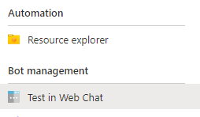

# Authentication types

[!INCLUDE [applies-to-v4](../includes/applies-to-v4-current.md)]

In the Bot Framework, two broad authentication categories exist: **bot authentication** and **user authentication**. Each has an associated **token** to allow access to secured resources. The following figure shows the elements involved in both bot and user authentication.

In this figure:

- **Host Platform** is the bot hosting platform. It can be Azure or any host platform you chose.
- **Bot Connector Service** facilitates communication between a bot and a channel. It converts messages received from channels into activity objects, and send them to the bot's messaging endpoint. Likewise, it converts activity objects received from the bot into messages understood by the channel and sends them to the channel.
- **Bot Adapter**. This is the default Bot Framework adapter. It performs these tasks:
  - Converts the JSON payload into an object. At this point, it is already an activity object, thanks to the Bot Connector Service.
  - Creates a turn context and adds the activity object to it.
  - Runs middleware, if any.
  - Forwards the turn context to the bot.

> [!NOTE]
> When a custom channel adapter is used, the adapter itself performs the tasks that the Bot Connector Service and the default Bot Adapter do. Also, it provides the authentication mechanism for the related web hook API. For an example,
see [Connect a bot to Slack using the Slack adapter](~/bot-service-channel-connect-slack.md?tabs=adapter#connect-a-bot-to-slack-using-the-slack-adapter).

## Bot authentication

A bot is identified by its **MicrosoftAppID** and **MicrosoftAppPassword**, which are kept within the bot's settings files (`appsettings.json` (.NET), `.env` (JavaScript), `config.py` (Python)) or in **Azure Key Vault**.
For more information, see [MicrosoftAppID and MicrosoftAppPassword](~/bot-service-manage-overview.md#microsoftappid-and-microsoftapppassword).

When you register a bot in the Azure portal, for example via the **Bot Channels Registration**, Azure creates an Active Directory (AD) registration application. If you use the Bot Framework CLI, you must specifically perform a step to create the AD registration. This registration has an application ID (`MicrosoftAppID`) and client secret (`MicrosoftAppPassword`). Azure uses these values to generate a **token** with which the bot can access secure resources.

When a channel sends a request to a bot, via the Bot Connector service, it specifies a **token** in the **Authorization header** of the request. The bot authenticates calls from the Bot Connector service by verifying the authenticity of the token.

When the bot sends a request to a channel via the **Bot Connector service**, it must specify the **token** in the **Authorization header** of the request.
All requests must include the access token which is verified by the Bot Connector service to authorize the request.

The operations described are automatically performed by the Bot Framework SDK.

For more details, see the REST API documentation on how to [authenticate requests from the Bot Connector service to your bot](~/rest-api/bot-framework-rest-connector-authentication.md#connector-to-bot) and [authenticate requests from your bot to the Bot Connector service](~/rest-api/bot-framework-rest-connector-authentication.md#bot-to-connector).

### Channels

Typically, channels communicate with a bot via the **Bot Connector service**. This means that the previous authentication principles generally apply. You may want to notice characteristics of specific channels.

#### Direct Line

Besides the standard supported channels, a client application can communicate with a bot using the Direct Line channel.

The client application authenticates requests to Direct Line (version 3.0) either by using a **secret** obtained from the [Direct Line channel configuration](~/bot-service-channel-connect-directline.md) page in the Azure portal or, better, by using a **token** obtained at runtime. The secret or token are specified in the Authorization header of each request.

> [!IMPORTANT]
> When you use Azure Bot Service authentication with Web Chat there are some important security considerations you must keep in mind. For more information, see the [security considerations](~/bot-service-channel-connect-webchat.md#keep-your-secret-hidden-exchange-your-secret-for-a-token-and-generate-the-embed) section in the REST authentication article.

For more information, see [Keep your secret hidden, exchange your secret for a token, and generate the embed](~/bot-service-channel-connect-webchat.md#keep-your-secret-hidden-exchange-your-secret-for-a-token-and-generate-the-embed).

#### Web Chat

The Web Chat has two implementations: the **channel** and the **control**.

- When you register a bot with Azure, the Web Chat channel is automatically configured to allow testing of the bot.

    .

    For more information, see [Connect a bot to Web Chat](~/bot-service-channel-connect-webchat.md).

- You can use a Web Chat control with the Direct Line channel to provide access to a bot in a client application. For more information about the control, see [Bot Framework Web Chat](https://github.com/microsoft/BotFramework-WebChat).

### Skills

A skill and a skill consumer are two distinct bots, each with their own app ID and password.

- The consumer can forward user activities to a skill and forward the skill's responses to the user.
- To the skill, the skill consumer acts as a channel. The consumer has a skill host endpoint that acts as the service URL that the skill sends activities to.
- For more information about skills, see the [skills overview](skills-conceptual.md).

Service-level authentication is managed by the Bot Connector service. The framework uses bearer tokens and bot application IDs to verify the identity of each bot.

> [!IMPORTANT]
> This requires all bots (the skill consumer and any skills it consumes) to have valid application credentials.

#### Claims validation

In addition to this basic level of authentication, you must add a _claims validator_ to the authentication configuration of the skill and the skill consumer. The claims are evaluated after the authentication header. This allows each bot to restrict which other bots it will accept activities from.

For sample claims validation, see how to [implement a skill](skill-implement-skill.md) and [implement a skill consumer](skill-implement-consumer.md).

### Bot Framework Emulator

The Bot Framework Emulator has its own authentication flow and its own tokens. The Emulator has its own channel and a built-in server.

## User authentication

At times a bot must access secured online resources on behalf of the user. To do that the bot must be authorized. This is because to perform certain operations such as checking email, checking on flight status, or placing an order, the bot needs to call an external service such as Microsoft Graph, GitHub, or a company's REST service. OAuth is used to authenticate the user and authorize the bot.

> [!NOTE]
> Two macro-steps are involved for a bot to access a user's resources.
>
> 1. **Authentication**. The process of verifying the user's identity.
> 1. **Authorization**. The process of verifying that the bot can access the user's resources.
>
> If the first step is successful then a token based on the user's credentials is issued. In the second step, the bot uses the token to access the user's resources.

For more information, see [User authentication](bot-builder-concept-authentication.md).

### Identity providers

An identity provider authenticates user or client identities and issues consumable security tokens. It provides user authentication as a service. Client applications, such as web applications, delegate authentication to a trusted identity provider.

A bot can use a trusted identity provider to:

- Enable single sign-on (SSO) features, allowing it to access multiple secured resources.
- Connect to cloud computing resources on behalf of a user, decreasing the need for users to re-authenticate.

> [!NOTE]
> The token issued during **Bot authentication** is not the same token issued during **User authentication**. The first is used to establish secure communication between a bot, channels and, ultimately, client applications. The second is used to authorize the bot to access secured resource on behalf of the user.

Notice that channels provide their own, separate user authentication to let a user sign in to the channel.

See [Identity providers](bot-builder-concept-identity-providers.md) for more about how bots can use identity providers to access resources on behalf of a user.
