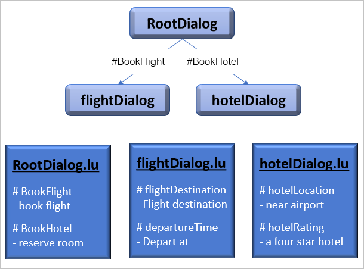
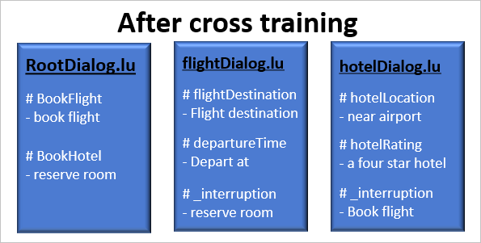
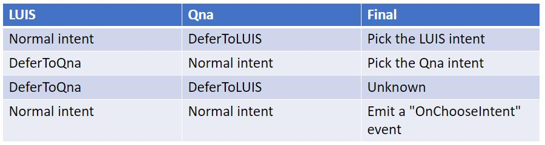

# Cross train your bot to use both LUIS and QnA Maker recognizers

[!INCLUDE [applies-to-v4](../includes/applies-to-v4-current.md)]

Cross-training is how you teach each container adaptive dialog about the capabilities of the other adaptive dialogs in your bot. This enables an adaptive dialog to defer to another adaptive dialog when a user enters any request or input that it is unable to handle on its own.

<!--
The Bot Framework SDK provides two primary ways to handle these types of situations. The first is a dialog centric approach that enables [interruptions][interruptions] at run time, first giving the active dialog a chance to process the user input, then bubbling up to the parent dialog when it cannot. Using this approach does not require any modifications to any dialogs LU models, so the active adaptive dialog does not know the capabilities of any other dialog in your bot.

The second approach is an LU model centric approach that is accomplished by cross training all the LU models in your bot at design time. This gives every dialog some insights into the capabilities of other dialogs and the active dialog does not need to send the users input to its parent dialog in order to determine if it or a sibling dialog is able to handle the request. Using This approach also enables an adaptive dialog to use multiple LU technologies and select the results that will best address the users request, for example you can cross train a LUIS model with a QnA Maker model, then depending on the user request either LUIS or QnA Maker can provide the response. The cross training approach is covered in detail in this article.


With the Bot Frameworks adaptive dialogs, each dialog has its own language understanding (LU) model. This gives you tremendous flexibility. There may be situations however, where you will duplicate language understanding capabilities across multiple dialogs. For example, you may want to enable your users to request help, or cancel the current process regardless of what dialog is currently active. This requires the [intents][intents] and [utterances][utterances] of each to exist in every dialogs LU model, as well as underlying code to handle the related triggers. To minimize the need for this duplicate code, the Bot Framework's _consultation mechanism_ provides the capability to cross-train the LU models in your bot that are compatible with the [LUIS][luis-recognizer] or [QnA Maker][qnamaker-recognizer] recognizers. This in effect allows you to share a dialogs functionality with other dialogs in the bot.

You can cross train LUIS to LUIS, LUIS to QnA Maker, which includes both LUIS to LUIS and LUIS to QnA Maker. Once cross trained, use the [Cross-trained recognizer set][cross-trained-recognizer-set-concept], that enables each adaptive dialog to determine the best possible response to the user input, using [language generation][language-generation], regardless of which dialog is active.

This article introduces the concepts required to create a bot that integrates the capabilities of both [LUIS][luis] and [QnA Maker][qnamaker] together in every adaptive dialogs in your bot.
-->

## Introduction to cross training

Adaptive dialogs offer a dialog-centric way to model conversations, with each adaptive dialog having its own language understanding (LU) model. While this gives bot developers tremendous flexibility, it can also present some challenges. Cross training can be helpful when an adaptive dialog might want to know when the user expresses something that could be handled by another dialog within the bot. Here are some examples where cross training could be useful.

- A bot that lets users cancel the current conversational flow or ask for help, without duplicating the cancel or help intents in every adaptive dialog.
- A bot that supports non-linear conversations, in which a user may think of something they had previously forgotten or simply change their mind mid-way through a task.
- A bot that allows a user to correct information they previously provided. 

In the article [Handling interruptions in adaptive dialogs][interruptions], the concept of interruptions in adaptive dialogs is introduced. It explains how a parent adaptive dialog can be consulted when the active adaptive dialog's recognizer does not find a suitable match. In this case the active dialog does not know if a parent or sibling dialog can respond, so to find out, it must send utterances or question to its parent using the Bot Framework's _consultation_ mechanism.

Cross training can build on and improve on the capabilities provided by interruptions in a few ways:

1. Cross-dialog training: by cross training the LU models of all the adaptive dialogs in your bot, you give every dialog the ability to know if other dialogs are capable of responding to a user request. In this way the bot does not need to consult all the way up the dialog stack to find out if another dialog can best process a given user input. This is described in more detail in the [LUIS to LUIS Cross training](#luis-to-luis-cross-training) section.

1. Cross training different language understanding engines within the same dialog. LUIS and QnA Maker are different language understanding engines, once the models for each are cross trained, the recognizer for both can be consulted to determine which is best suited to respond to a user request. This is described in more detail in the [LUIS to QnA Maker cross training](#luis-to-qna-maker-cross-training) section.

> [!TIP]
>
> If the language understanding models associated with the various adaptive dialogs in a bot are not cross trained, no utterances or questions from other dialogs will be considered unless the recognizer of the active dialog returns an unknown intent. When the models have been cross trained, utterances and questions from parent and sibling dialogs will always be considered because they are associated with a new intent created in the active dialogs language understanding model. A parent no longer must be consulted to find out if it can respond to the users input. When this new intent is returned, the Bot Framework knows to consult the parent or sibling to handle it.

## LUIS-to-LUIS cross training

By cross training the LUIS models in your bot, you enable a process called _Global interrupts_. This means that if there are no triggers in the active adaptive dialog that can handle the intent returned by the recognizer, the bot will bubble it up to the dialog's parent dialog, using adaptive dialogs _consultation mechanism_.  If the parent dialog does not have a trigger to handle the intent, it continues to bubble up until it reaches the root dialog. Once the intent is handled, the conversation flow continues where it left off. For a more detailed discussion on Global interrupts see [Handling interruptions globally][Global-interrupts] in the _handling interruptions in adaptive dialogs_ concepts article. For LUIS models cross trained with other LUIS models, you will use the [LUIS recognizer][luis-recognizer].

Common uses for global interrupts include creating basic dialog management features such as help or cancel in the root dialog that are then available to any of its child dialogs, as mentioned in the introduction. global interrupts also enables users to seamlessly change the direction of the conversational flow. Consider the following example in this fictional travel bot.

### Travel bot

The following example travel bot will help explain how to cross train a bot with multiple adaptive dialogs, each with its own LUIS model.

This bot consists of three adaptive dialogs, each with their own LUIS model:



1. RootDialog
    - Intents: `BookFlight`, `BookHotel`.
1. flightDialog
    - Intents: `flightDestination`, `departureTime`.
1. hotelDialog
    - Intents: `hotelLocation`, `hotelRating`.

#### Travel bot customer scenario

The following exchange demonstrates a potential customer ussage scenario that cannot be handled by the bot, but could be after cross training the bot's LUIS models.

> **Bot**: Hello, how can I help you today?
>
> **User**: I want to book a flight
>
> **Bot**: Great, I can help you with that. What is your departure date?

The bot will be expecting an answer to the question _What is your departure date?_, something like "February 29", but how will it handle an interruption to the conversational flow when the user responds with something that the flight dialog cannot handle? Something like the following:

>
> **User**: I need to reserve a room first

In this example, When the user requested to to book a flight, the root dialog's recognizer returned the `BookFlight` intent, resulting in the flight dialog, which processes a users request to book flights. When in the flight dialog the user requested to reserve a hotel room, unfortunately the flight dialog does not understand what the user is requesting since the utterance "I need to reserve a room first" does not match any intents in the flight dialogs LUIS model. After you cross train the `.lu` files, your bot will now be able to detect that the user is requesting something that another dialog understands, so it bubbles the request up to the root dialog which detects the `BookHotel` intent and calls the hotel dialog to process the hotel reservation request. Once the hotel dialog completes the hotel reservation request, control is passed back to the flight dialog to complete the flight booking.

#### Cross train the LUIS models of the travel bot

To enable this fictional travel bot to handle the interruption in the previous example, you need to update the the flight dialog's LUIS model, contained in the **flightDialog.lu** file, to include a new intent named `_interruption`, then add the utterances for the `BookHotel` intent. The **flightDialog.lu** file is used to create your LUIS application associated with the flight dialog.

> [!TIP]
>
> Cross training all the LUIS models in a typical bot can be a very involved and tedious process. There is a command included with the Bot Framework command line interface (BF CLI) that automates this work for you. This is discussed in detail in the [The Bot Framework CLI cross-train command][the-bot-framework-cli-cross-train-command] section below.
before this update, the example flight booking `.lu` file looks like this:

```.lu
# flightDestination
- book a flight

# departureTime
- I need to depart next thursday
```

After cross training with the hotel booking `.lu` file, it would look like this:

```.lu
# flightDestination
- book a flight

# departureTime
- I need to depart next thursday

# _Interruption
- reserve a hotel room
```

The utterance _reserve a hotel room_ is associated with the `_interruption` intent When the `_interruption` intent is detected, it bubbles up any utterance associated with it to its parent dialog, whose recognizer returns the `BookHotel` intent. When cross training LUIS to LUIS, you need to include all user utterances from all intents from the dialog you are cross training with.



> [!IMPORTANT]
>
> LUIS predictions are influenced by the number of utterances in each intent. If you have an intent with 100 example utterances and an intent with 20 example utterances, the 100-utterance intent will have a higher rate of prediction and will more likely be selected. This can impact cross trained models because all utterances from the models of all parent and sibling dialogs become utterances of the new `_Interruption` intent. In some cases, this can result in a parent or sibling dialog responding to the user when acceptable matches would have been returned by the current dialogs recognizer prior to cross training. Minimize the effects of this, if needed, by limiting the number of example utterances in the new `_Interruption` intent.

## Cross train LUIS and QnA Maker models

A well designed bot can answer relevant product or service questions asked by a user, regardless what dialog is currently active. LUIS is ideal for handling conversational flows while QnA Maker is ideal for handling users questions and FAQs. Having access to both in your adaptive dialogs can improve the bots ability to meet user needs.

To enable this capability you need to _cross-train_ your `.lu` and `.qna` files to include the information required by your bot's recognizer to determine if the LUIS or QnA Maker response is best suited for the user. For a LUIS model cross trained with a QnA Maker model, you will use the [Cross-trained recognizer set][cross-trained-recognizer-set-concept].

Before creating your LUIS applications and QnA Maker knowledge base, you need to _cross-train_ your `.lu` and `.qna` files to include the information required by your bot's recognizer to determine if the LUIS or QnA Maker response is best suited for the user.

For each adaptive dialog that has an associated `.lu` and `.qna` file, the following updates are made with cross training these files:

1. In lu files a new intent named: `DeferToRecognizer_qna_<dialog-file-name>` is required. Each question and question variation from the corresponding `.qna` file becomes an utterance associated with that new intent.<!-- Answers are not copied to the `.lu` file from the `.qna` file.-->

1. In qna files a new answer named: `intent=DeferToRecognizer_luis_<dialog-file-name>` is required, along with each utterance from every intent in the corresponding `.lu` file. These utterances become questions associated with that answer. Additionally, all utterances from any referenced `.lu` files also become questions associated with that answer.

When a user converses with the bot, the `CreateCrossTrainedRecognizer` recognizer sends that user input to both LUIS and the QnA Maker knowledge base to be processed. The following table shows the matrix of possible responses and the resulting action taken by the bot.

<!---->

| LUIS recognizer returns | QnA Maker recognizer returns | Final results                     |
| ----------------------- | ---------------------------- | --------------------------------- |
| Valid LUIS intent       |  Defer To **LUIS** intent    |  Select response from **LUIS** recognizer. Handle using the `OnIntent` trigger.|
| Defer to **QnA Maker** intent | Valid QnA Maker intent |  Select response from **QnA Maker** recognizer. Handle using the `OnQnAMatch` trigger.|
| Defer to **QnA Maker** intent | Defer To **LUIS** intent | The `UnknownIntent` event is emitted by the recognizer. Handle using the `OnUnknownIntent` trigger.|
| Valid LUIS intent | Valid QnA Maker intent | The `ChooseIntent` event is emitted by the recognizer. Handle using the `OnChooseIntent` trigger.|

> [!IMPORTANT]
>
> Cross training all the LUIS and QnA Maker models in a typical bot can be a very involved and tedious process. There is a command included with the Bot Framework command line interface (BF CLI) that automates this work for you. This is discussed in detail in the [The Bot Framework CLI cross-train command][the-bot-framework-cli-cross-train-command] section below.
>
> Running this command on a bot project that has both LUIS and QnA Maker models will automatically cross-train both LUIS to LUIS and QnA Maker to QnA Maker across all adaptive dialogs across the entire project as well as LUIS to QnA Maker cross training within each adaptive dialogs that have both models, meaning both an `.lu` and `.qna` file.

### Cross train multiple LUIS and QnA Maker models

Cross training a bot with both LUIS and QnA Maker models enables global interruptions as described previously in [LUIS to LUIS cross training](#luis-to-luis-cross-training). This also applies to QnA Maker. For example, when the root dialog's LUIS model is cross trained with the root dialogs QnA Maker model, it creates the `DeferToRecognizer_qna` intent in RootDialog.lu, with all questions listed as utterances. Next, when the root dialogs child is cross trained, it picks up those intents and in turn passes them to its child dialog and this continues until there are no more child dialogs. When a user asks any question associated with RootDialog.qna when the active dialog is a child or grandchild, the active dialog will not be able to respond, but because it has been cross-trained it will be aware that another dialog is able to respond and will then bubble it up to its parent, and in turn it is bubbled up to each parent all the way to the root dialog which answers the question before returning control back to the previous conversational flow. This results in multiple transactions to both the LUIS and QnA Maker services. The deeper the dialog hierarchy, the more transactions will potentially occur for a given user request. This increase in transactions may be something to consider when designing your bot.

The advantage of global interruptions in this scenario is the ability it provides to use a QnA Maker knowledge base associated with the root dialog to handle all questions the user may have regardless of where they are in their conversation with the bot.

## The Bot Framework CLI cross-train command

Cross training your bot can quickly become a challenging and error prone task in even a minimally complex bot, especially when you are still making frequent updates to the LUIS or QnA Maker models. The Bot Framework SDK provides a tool to automate this process. For information on the Bot Framework CLI cross-train command, refer to the _Cross-trained recognizer set_ section of the [Recognizers in adaptive dialogs - reference guide](../adaptive-dialog/adaptive-dialog-prebuilt-recognizers.md#cross-trained-recognizer-set).

## Source code updates

After cross training your LUIS and QnA Maker models, you need to be sure and use the Cross-trained recognizer set as the adaptive dialogs recognizer in your source code, as explained in the [Recognizers in adaptive dialogs - reference guide][crosstrainedrecognizerset-ref-guide].

## Additional information

- How to [create a bot cross trained to use both LUIS and QnA Maker recognizers](bot-builder-howto-cross-train.md)
- The [Cross-trained recognizer set][crosstrainedrecognizerset-ref-guide] section of the Recognizers in adaptive dialogs - reference guide.

<!------------------------------------------------------------------------------------------------------------->
[intents]: bot-builder-concept-adaptive-dialog-recognizers.md#intents
[utterances]: bot-builder-concept-adaptive-dialog-recognizers.md#utterances
[interruptions]: bot-builder-concept-adaptive-dialog-interruptions.md
[Global-interrupts]: bot-builder-concept-adaptive-dialog-interruptions.md#handling-interruptions-globally
[luis]: /azure/cognitive-services/luis/what-is-luis
[luis-recognizer]: bot-builder-concept-adaptive-dialog-recognizers.md#luis-recognizer
[cross-trained-recognizer-set-concept]: /azure/cognitive-services/luis/what-is-luis
[luis-recognizer]: bot-builder-concept-adaptive-dialog-recognizers.md#cross-trained-recognizer-set
[luis-build]: bot-builder-howto-bf-cli-deploy-luis.md#create-and-train-a-luis-app-then-publish-it-using-the-build-command
[bf-luiscross-train]: https://aka.ms/botframework-cli#bf-luiscross-train
[lu-templates]: ../file-format/bot-builder-lu-file-format.md
[qnamaker]: /azure/cognitive-services/QnAMaker/Overview/overview
[qnamaker-recognizer]: bot-builder-concept-adaptive-dialog-recognizers.md#qna-maker-recognizer
[qna-file-format]: ../file-format/bot-builder-qna-file-format.md
[qnamaker-build]: bot-builder-howto-bf-cli-deploy-qna.md#create-a-qna-maker-knowledge-base-and-publish-it-to-production-using-the-build-command
[recognizer]: bot-builder-concept-adaptive-dialog-recognizers.md
[cross-trained-recognizer-set-concept]: bot-builder-concept-adaptive-dialog-recognizers.md#cross-trained-recognizer-set
[crosstrainedrecognizerset-ref-guide]: ../adaptive-dialog/adaptive-dialog-prebuilt-recognizers.md#cross-trained-recognizer-set
[bf-cli]: bf-cli-overview.md
[language-generation]: bot-builder-concept-adaptive-dialog-generators.md
