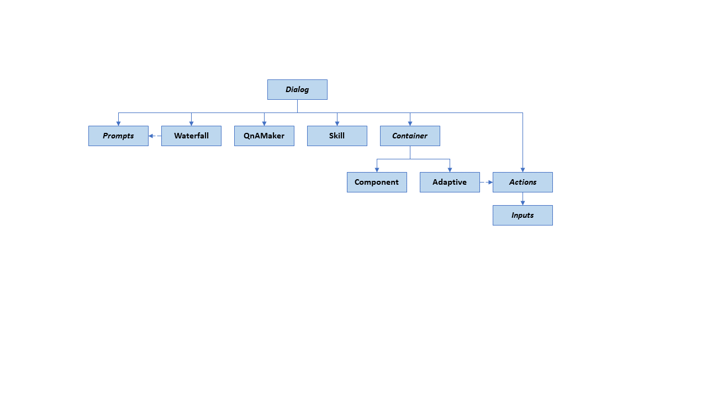
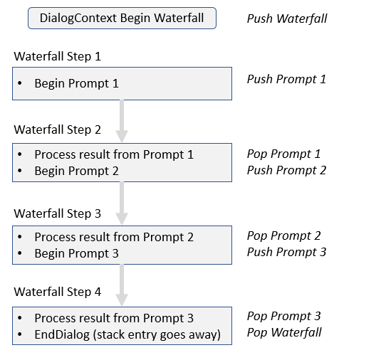

# Dialogs library

[!INCLUDE [applies-to-v4](../includes/applies-to.md)]

*Dialogs* are a central concept in the SDK, and provide a useful way to manage a conversation with the user. Dialogs are structures in your bot that act like functions in your bot's program; each dialog is designed to perform a specific task, in a specific order. You can specify the order of individual dialogs to guide the conversation, and invoke them in different ways - sometimes in response to a user, sometimes in response to some outside stimuli, or from other dialogs.

The dialogs library provides a few built-in features, such as *prompts* and *waterfall dialogs* to make your bot's conversation easier to manage. [Prompts](#prompts) are used to ask for different types of information, such as text, a number, or a date. [Waterfall dialogs](#waterfall-dialogs) can combine multiple steps together in a sequence, allowing your bot to follow easily that predefined sequence and pass information along to the next step.

<!-- When we have samples for building your own, add links and one liner about them -->

## Dialogs and their pieces

The dialogs library has a few additional pieces included to make dialogs more useful. Besides the different [types of dialogs](#dialog-types) discussed below, the library contains the idea of a *dialog set*, the *dialog context*, and the *dialog result*.

*Dialog sets* are, in the simplest terms, a collection of dialogs. This can be things like prompts, waterfall dialogs, or [component dialogs](#component-dialog). Each of these are implementations of a dialog, and each are added to the dialog set with a specific string ID. When your bot wants to start a certain dialog or prompt within the dialog set, it uses that string ID to specify which dialog to use.

*Dialog context* contains information pertaining to the dialog, and is used to interact with a dialog set from within your bot's turn handler. The dialog context includes the current turn context, the parent dialog, and the [dialog state](#dialog-state), which provides a method for preserving information within the dialog. The dialog context allows you to start a dialog with its string ID or continue the current dialog (such as a waterfall dialog that has multiple steps).

When a dialog ends, it can return a *dialog result* with some resulting information from the dialog. This is returned to let the calling method see what happened within the dialog and save the information to some persisted location, if desired.

## Dialog state

Dialogs are an approach to implementing a multi-turn conversation, and as such, they are an example of a feature in the SDK that relies on persisted state across multiple turns. Without state in dialogs, your bot wouldn't know where in the dialog set it is or what information it has already gathered.

A dialog based bot typically holds a dialog set collection as a member variable in its bot implementation. That dialog set is created with a handle to an object called an accessor that provides access to persisted state. For background on state within bots, see [managing state](bot-builder-concept-state.md).

Within the bot’s on turn handler, the bot initializes the dialog subsystem by calling *create context* on the dialog set, which returns a *dialog context*. That dialog context contains the necessary information needed by the dialog.

The creation of a dialog context requires state, which is accessed with the accessor provided when creating the dialog set. With that accessor, the dialog set can get the appropriate dialog state. Details on state accessors can be found in [Save conversation and user data](bot-builder-howto-v4-state.md).

## Dialog types

Dialogs come in a few different types: prompts, waterfall dialogs, and component dialogs, as shown in this class hierarchy.

### Prompts

Prompts, within the dialogs library, provide an easy way to ask the user for information and evaluate their response. For example for a *number prompt*, you specify the question or information you are asking for, and the prompt automatically checks to see if it received a valid number response. If it did, the conversation can continue; if it didn't, it will re-prompt the user for a valid answer.

Behind the scenes, prompts are a two-step dialog. First, the prompt asks for input; second, it returns the valid value, or starts from the top with a reprompt.

Prompts have *prompt options* given when the prompt is called, which is where you can specify the text to prompt with, the retry prompt if validation fails, and choices to answer the prompt.

Additionally, you can choose to add some custom validation for your prompt when you create it. For example, say we wanted to get a party size using the number prompt, but that party size has to be more than 2 and less than 12. The prompt first checks to see if it received a valid number, then runs the custom validation if it is provided. If the custom validation fails, it will re-prompt the user as above.

When a prompt completes, it explicitly returns the resulting value that was asked for. When that value is returned, we can be sure it has passed both the built in prompt validation and any additional custom validation that may have been provided.

For examples on using various prompts, take a look at how to use the [dialogs library to gather user input](bot-builder-prompts.md).

#### Prompt types

Behind the scenes, prompts are a two-step dialog. First, the prompt asks for input; second, it returns the valid value, or restarts from the top with a re-prompt. The dialogs library offers a number of basic prompts, each used for collecting a different type of response. The basic prompts can interpret natural language input, such as "ten" or "a dozen" for a number, or "tomorrow" or "Friday at 10am" for a date-time.

| Prompt | Description | Returns |
|:----|:----|:----|
| _Attachment prompt_ | Asks for one or more attachments, such as a document or image. | A collection of _attachment_ objects. |
| _Choice prompt_ | Asks for a choice from a set of options. | A _found choice_ object. |
| _Confirm prompt_ | Asks for a confirmation. | A Boolean value. |
| _Date-time prompt_ | Asks for a date-time. | A collection of _date-time resolution_ objects. |
| _Number prompt_ | Asks for a number. | A numeric value. |
| _Text prompt_ | Asks for general text input. | A string. |

To prompt a user for input, define a prompt using one of the built-in classes, such as the _text prompt_, and add it to your dialog set. Prompts have fixed IDs that must be unique within a dialog set. You can have a custom validator for each prompt, and for some prompts, you can specify a _default locale_. 

#### Prompt locale

The locale is used to determine language-specific behavior of the **choice**, **confirm**, **date-time**, and **number** prompts. For any given input from the user, if the channel provided a _locale_ property in user's message, then that is used. Otherwise, if the prompt's _default locale_ is set, by providing it when calling the prompt's constructor or by setting it later, then that is used. If neither of those are provided, English ("en-us") is used as the locale. Note: The locale is a 2, 3, or 4 character ISO 639 code that represents a language or language family.

### Waterfall dialogs

A waterfall dialog is a specific implementation of a dialog that is commonly used to collect information from the user or guide the user through a series of tasks. Each step of the conversation is implemented as an asynchronous function that takes a *waterfall step context* (`step`) parameter. At each step, the bot [prompts the user for input](bot-builder-prompts.md) (or can begin a child dialog, but that it is often a prompt), waits for a response, and then passes the result to the next step. The result of the first function is passed as an argument into the next function, and so on.

The following diagram shows a sequence of waterfall steps and the stack operations that take place. Details on the use of the dialog stack are below in the [using dialogs](#using-dialogs) section.

Within waterfall steps, the context of the waterfall dialog is stored in its *waterfall step context*. This is similar to the dialog context as it provides access to the current turn context and state. Use the waterfall step context object to interact with a dialog set from within a waterfall step.

You can handle a return value from a dialog either within a waterfall step in a dialog or from your bot's on turn handler, although you generally only need to check the status of the dialog turn result from your bot's turn logic.
Within a waterfall step, the dialog provides the return value in the waterfall step context's _result_ property.

#### Waterfall step context properties

The waterfall step context contains the following:

* *Options*: contains input information for the dialog.
* *Values*: contains information you can add to the context, and is carried forward into subsequent steps.
* *Result*: contains the result from the previous step.

Additionally, the *next* method continues to the next step of the waterfall dialog within the same turn, enabling your bot to skip a certain step if needed.

### Component dialog

Sometimes you want to write a reusable dialog that you want to use in different scenarios, such as an address dialog that asks the user to provide values for street, city and zip code.

The *component dialog* provides a strategy for creating independent dialogs to handle specific scenarios, breaking a large dialog set into more manageable pieces. Each of these pieces has its own dialog set, and avoids any name collisions with the dialog set that contains it. See the [component dialog how to](bot-builder-compositcontrol.md) for more on these.

## Using dialogs

You can use the dialog context to begin, continue, replace, or end a dialog. You can also cancel all dialogs on the dialog stack.

Dialogs can be thought of as a programmatic stack, which we call the *dialog stack*, with the turn handler as the one directing it and serving as the fallback if the stack is empty. The topmost item on that stack is considered the *active dialog*, and the dialog context directs all input to the active dialog.

When a dialog begins, it is pushed onto the stack, and is now the active dialog. It remains the active dialog until it either ends, it is removed by the [replace dialog](#repeating-a-dialog) method, or another dialog is pushed onto the stack (by either the turn handler or active dialog itself) and becomes the active dialog. When that new dialog ends, it is popped off the stack and the next dialog down becomes the active dialog again. This allows for [repeating a dialog](#repeating-a-dialog) or [branching a conversation](#branch-a-conversation), discussed below.

### Create the dialog context

To create your dialog context, call the *create context* method of your dialog set. Create context gets the dialog set's *dialog state* property and uses that to create the dialog context. The dialog context is then used to start, continue, or otherwise control the dialogs in the set.

The dialog set requires use of a *state property accessor* to access the dialog state. The accessor is created and used the same way as other state accessors, but is created as it's own property based off of the conversation state. Details on managing state can be found in the [managing state topic](bot-builder-concept-state.md), and usage of dialog state is shown in the [sequential conversation flow](bot-builder-dialog-manage-conversation-flow.md) how-to.

### To start a dialog

To start a dialog, pass the *dialog ID* you want to start into the dialog context's *begin dialog*, *prompt*, or *replace dialog* method.

* The begin dialog method will push the dialog onto the top of the stack.
* The replace dialog method will pop the current dialog off the stack and push the replacing dialog onto the stack. The replaced dialog is canceled and any information that instance contained is disposed of.

Use the _options_ parameter to pass information to the new instance of the dialog.
The options passed into the new dialog can be accessed via the step context's *options* property in any step of the dialog.
See the [Create advanced conversation flow using branches and loops](bot-builder-dialog-manage-complex-conversation-flow.md) how-to for example code.

### To continue a dialog

To continue a dialog, call the *continue dialog* method. The continue method will always continue the topmost dialog on the stack (the active dialog), if there is one. If the continued dialog ends, control is passed to the parent context which continues within the same turn.

Use the step context's *values* property to persist state between turns.
Any value added to this collection in a previous turn is available in subsequent turns.
See the [Create advanced conversation flow using branches and loops](bot-builder-dialog-manage-complex-conversation-flow.md) how-to for example code.

### To end a dialog

The *end dialog* method ends a dialog by popping it off the stack and returns an optional result to the parent context (such as the dialog that called it, or the bot's turn handler). This is most often called from within the dialog to end the current instance of itself.

You can call the end dialog method from anywhere you have a dialog context, but it will appear to the bot that it was called from the current active dialog.

> [!TIP]
> It is best practice to explicitly call the *end dialog* method at the end of the dialog.

### To clear all dialogs

If you want to pop all dialogs off the stack, you can clear the dialog stack by calling the dialog context's *cancel all dialogs* method.

### Repeating a dialog

You can replace a dialog with itself, creating a loop, by using the *replace dialog* method.
This is a great way to handle [complex interactions](~/v4sdk/bot-builder-dialog-manage-complex-conversation-flow.md) and a good technique to manage menus.

> [!NOTE]
> If you need to persist the internal state for the current dialog, you will need to pass information to the new instance of the dialog in the call to the *replace dialog* method, and then initialize the dialog appropriately.

### Branch a conversation

The dialog context maintains the dialog stack and for each dialog on the stack, tracks which step is next. Its *begin dialog* method creates a child and pushes that dialog onto the top of the stack, and its *end dialog* method pops the top dialog off the stack. *End dialog* is usually called from within the dialog that's ending.

A dialog can start a new dialog within the same dialog set by calling the dialog context's *begin dialog* method and providing the ID of the new dialog, which then makes the new dialog the currently active dialog. The original dialog is still on the stack, but calls to the dialog context's *continue dialog* method are only sent to the dialog that is on top of the stack, the *active dialog*. When a dialog is popped off the stack, the dialog context will resume with the next step of the waterfall on the stack where it left off of the original dialog.

Therefore, you can create a branch within your conversation flow by including a step in one dialog that can conditionally choose a dialog to start out of a set of available dialogs.

## Next steps

> [!div class="nextstepaction"]
> [Use dialog library to gather user input](bot-builder-prompts.md)
