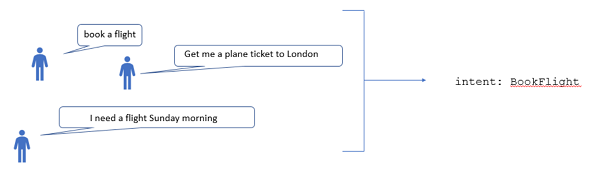
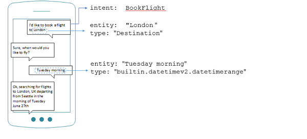
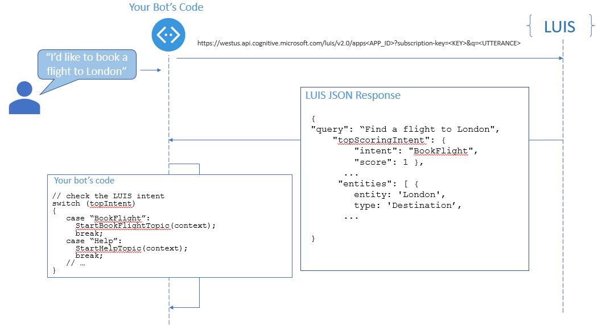

# Language Understanding

[!INCLUDE [pre-release-label](../includes/pre-release-label.md)]

Bots can use a variety of conversational styles, from the structured and guided to the free-form and open-ended. A bot needs to decide what to do next in its conversation flow, based on what the user said, and in an open-ended conversation, there is a wider range of user replies.

| Guided | Open |
|------|------|
| I'm the travel bot. Select one of the following options: find flights, find hotels, find rental car. | I can help you book travel. What would you like to do? |
| Do you need anything else? Click yes or no. | Do you need anything else? |

The interaction between users and bots is often free-form, and bots need to understand language naturally and contextually. This article explains how Language Understanding (LUIS) help you to determine what users want, to identify concepts and entities in sentences, and ultimately to allow your bots to respond with the appropriate action.

## Recognize intent

[LUIS](https://docs.microsoft.com/en-us/azure/cognitive-services/luis/home) helps you by determining the user’s **intent**, which is what they want to do, from what they say, so your bot can respond appropriately. LUIS is especially helpful when what they say to your bot doesn’t follow a predictable structure or a specific pattern. If a bot has a conversational user interface, in which the user speaks or types a response, there can be endless variations on *utterances*, which are the spoken or textual input from the user.

For example, consider the many ways a user of a travel bot can ask to book a flight.

These utterances can have different structures and contain various synonyms for “flight” that you haven't thought of. In your bot, it can be challenging to write the logic that matches all the utterances, and still distinguishes them from other intents that contain the same words. Additionally, your bot needs to extract *entities*, which are other important words like locations and times. LUIS makes this process easy by contextually identifying intents and entities for you.

When you design your bot for natural language input, you determine what intents and entities your bot needs to recognize, and think about how they'll connect to actions that your bot takes. In [luis.ai](https://www.luis.ai), you define custom intents and entities and you specify their behavior by providing examples for each intent and labeling the entities within them.

Your bot uses the intent recognized by LUIS to determine the conversation topic, or begin a conversation flow. For example, when a user says "I'd like to book a flight", your bot detects the BookFlight intent and invokes the conversation flow for starting a search for flights. LUIS detects entities like the destination city and the departure date, both in the original utterance that triggers the intent and later in the conversation flow. Once the bot has all the information it needs, it can fulfill the user's intent.

### Recognize intent in common scenarios

To save development time, LUIS provides pre-trained language models that recognize common utterances for common categories of bots. 

**Prebuilt domains** are pre-trained, ready-to-use collections of intents and entities that work well together for common scenarios like appointments, reminders, management, fitness, entertainment, communication, reservations, and more. The **Utilities** prebuilt domain helps your bot handle common tasks like Cancel, Confirm, Help, Repeat, and Stop. Take a look at the [prebuilt domains](https://docs.microsoft.com/en-us/azure/cognitive-services/LUIS/luis-how-to-use-prebuilt-domains) that LUIS offers.

**Prebuilt entities** help your bot recognize common types of information like dates, times, numbers, temperature, currency, geography, and age. See [use prebuilt entities](https://docs.microsoft.com/en-us/azure/cognitive-services/LUIS/pre-builtentities) for background on the types that LUIS can recognize.

## How your bot gets messages from LUIS

Once you have set up and connected LUIS, your bot can send the message to your LUIS app, which returns a JSON response that contains the intents and entities. Then, you can use the [turn context](~/v4sdk/bot-builder-basics.md#defining-a-turn) in your bot's _turn handler_ to route the conversation flow based on the intent in the LUIS response. 

To get started using a LUIS app with your bot, check out [using LUIS for language understanding](https://docs.microsoft.com/en-us/azure/bot-service/bot-builder-howto-v4-luis?view=azure-bot-service-4.0).

## Best practices for Language Understanding

Consider the following practices when designing a language model for your bot.

### Consider the number of intents

LUIS apps recognize intent by classifying an utterance into one of multiple categories. A natural result is that determining the correct category from among a large number of intents can reduce a LUIS app's ability to distinguish between them.

One way of reducing the number of intents is to use a hierarchical design. Consider the case of a personal assistant bot that has three intents related to weather, three intents related to home automation, and three other utility intents which are Help, Cancel and Greeting. If you put all the intents in the same LUIS app, you already have 9, and as you add features to the bot, you could end up with dozens. Instead, you can use a dispatcher LUIS app to determine whether the user's request is for weather, home automation, or utility, then call the LUIS app for the category that the dispatcher determines. In this case each of the LUIS apps only starts with 3 intents.

### Use a None intent

It's often the case that users of your bot will say something unexpected or unrelated to the current conversation flow. The _None_ intent is provided for handling those messages.

If you don't train an intent for handling the fallback, default or "none of the above" cases, your LUIS app can only classify messages into the intents it has defined. So for example, let's say you have a LUIS app with two intents: `HomeAutomation.TurnOn` and `HomeAutomation.TurnOff`. If those are the only intents, and the input is something unrelated like "schedule an appointment on Friday", your LUIS app has no choice but to classify that message as either HomeAutomation.TurnOn or HomeAutomation.TurnOff. If your LUIS app has a `None` intent with a few examples, you can provide some fallback logic in your bot to handle unexpected utterances.

The `None` intent is very useful for improving recognition results. In this home automation scenario, "schedule an appointment on Friday" may produce the `HomeAutomation.TurnOn` intent with a low confidence, and your bot should reject it. You can add such phrases to your model under the `None` intent, so that they resolve correctly to `None`.

### Review the utterances that LUIS app receives

LUIS apps provide a feature for improving your app performance, by reviewing messages that users sent to it. See [suggested utterances](https://docs.microsoft.com/azure/cognitive-services/LUIS/label-suggested-utterances) for a step-by-step walkthrough.

## Integrate multiple LUIS apps and QnA services with the Dispatch tool

When building a multi-purpose bot that understands multiple conversational topics, you can start to develop services for each function separately, and then integrate them together. These services can include Language Understanding (LUIS) apps and QnAMaker services. Here are a few example scenarios in which a bot might combine multiple LUIS apps, multiple QnAMaker services or a combination of the two:

* A personal assistant bot lets the user invoke a variety of commands. Each category of commands form a "skill" that can be developed separately, and each skill has a LUIS app.
* A bot searches many knowledge bases to find answers to frequently asked questions (FAQs).
* A bot for a business has LUIS apps for creating customer accounts and placing orders, and also has a QnAMaker service for its FAQ.  

### The Dispatch tool

The Dispatch tool helps you integrate multiple LUIS apps and QnA Maker services with your bot, by creating a *dispatch app*, which is a new LUIS app that routes messages to the appropriate LUIS and QnAMaker services. See the [dispatch tutorial](./bot-builder-tutorial-dispatch.md) for a step-by-step tutorial that combines multiple LUIS apps and QnA Maker in one bot.

## Use LUIS to improve speech recognition

For a bot that users will speak to, integrating it with LUIS can help your bot identify words that might be misunderstood when converting speech to text.  For example, in a chess scenario, a user might say: "Move knight to A 7". Without context for the user's intent, the utterance might be recognized as: "Move night 287". By creating entities that represent chess pieces and coordinates and labeling them in utterances, you provide context for speech recognition to identify them. You can [enable speech recognition priming](https://docs.microsoft.com/en-us/azure/bot-service/bot-service-manage-speech-priming?view=azure-bot-service-4.0) with Bot Framework channels that are integrated with Bing Speech, such as Web Chat, the Bot Framework Emulator and Cortana.  

## Additional resources
Refer to [Cognitive Services](https://docs.microsoft.com/en-us/azure/cognitive-services/) documentation for more information.
