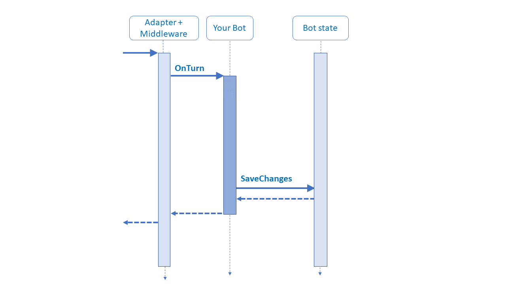
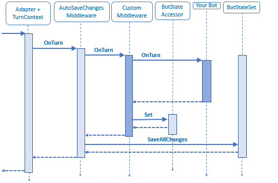

# Middleware

[!INCLUDE [applies-to-v4](../includes/applies-to.md)]

Middleware is simply a class that sits between the adapter and your bot logic, added to your adapter's middleware collection during initialization. The SDK allows you to write your own middleware or add middleware created by others. Every activity coming into or out of your bot flows through your middleware.

The adapter processes and directs incoming activities in through the bot middleware pipeline to your bot’s logic and then back out again. As each activity flows in and out of the bot, each piece of middleware can inspect or act upon the activity, both before and after the bot logic runs.

Before jumping into middleware, it is important to understand [bots in general](~/v4sdk/bot-builder-basics.md) and [how they process activities](~/v4sdk/bot-builder-basics.md#the-activity-processing-stack).

## Uses for middleware
The question often comes up: "When should I implement actions as middleware versus using my normal bot logic?" Middleware provides you with additional opportunities to interact with your users' conversation flow both before and after each _turn_ of the conversation is processed. Middleware also allows you to store and retrieve information concerning the conversation and call additional processing logic when required. Below are some common scenarios that show where middleware can be useful.

### Looking at or acting on every activity
There are plenty of situations that require your bot to do something on every activity, or for every activity of a certain type. For example, you may want to log every message activity your bot receives or provide a fallback response if the bot has not otherwise generated a response this turn. Middleware is a great place for this, with its ability to act both before and after the rest of the bot logic has executed.

### Modifying or enhancing the turn context
Certain conversations can be much more fruitful if the bot has more information than what is provided in the activity. Middleware in this case could look at the conversation state information it has so far, query an external data source, and append that to the [turn context](~/v4sdk/bot-builder-basics.md#defining-a-turn) object before passing execution on to the bot logic. 

The SDK defines logging middleware that can record incoming and outgoing activities, but you can also define your own middleware.

## The bot middleware pipeline
For each activity, the adapter calls middleware in the order in which you added it. The adapter passes in the context object for the turn and a _next_ delegate, and the middleware calls the delegate to pass control to the next middleware in the pipeline. Middleware also has an opportunity to do things after the _next_ delegate returns before completing the method. You can think of it as each middleware object has the first-and-last chance to act with respect to the middleware objects that follow it in the pipeline.

For example:

- 1st middleware object’s turn handler executes code before calling _next_.
  - 2nd middleware object’s turn handler executes code before calling _next_.
    - The bot’s turn handler executes and returns.
  - 2nd middleware object’s turn handler executes any remaining code before returning.
- 1st middleware object’s turn handler executes any remaining code before returning.

If middleware doesn’t call the next delegate, the adapter does not call any of the subsequent middleware or bot turn handlers, and the pipeline short circuits.

Once the bot middleware pipeline completes, the turn is over, and the turn context goes out of scope.

Middleware or the bot can generate responses and register response event handlers, but keep in mind that responses are handled in separate processes.

## Order of middleware
Since the order in which middleware is added determines the order in which the middleware processes an activity, it's important to decide the sequence that middleware should be added.

> [!NOTE]
> This is meant to give you a common pattern that works for most bots, but be sure to consider how each piece of middleware will interact with the others for your situation.

The first things in your middleware pipeline should likely be those that take care of the lowest-level tasks that are used every time. Examples include logging, exception handling, and translation. Ordering these can vary depending on your needs, such as whether you want the incoming message to be translated first, before messages are stored, or if message storage should occur first, which could mean stored messages wouldn't be translated.

The last things in your middleware pipeline should be bot-specific middleware, which is middleware you implement to do some processing on every message sent to your bot. If your middleware uses state information or other information set in the bot context, add it to the middleware pipeline after the middleware that modifies state or context.

## Short circuiting
An important idea around middleware and response handlers is _short circuiting_. If execution is to continue through the layers that follow it, middleware (or a response handler) is required to pass execution on by calling its _next_ delegate.  If the next delegate is not called within that middleware (or response handler), the associated pipeline short circuits and subsequent layers are not executed. This means all bot logic, and any middleware further along the pipeline, is skipped. There is a subtle difference between your middleware and your response handler short circuiting a turn.

When middleware short circuits a turn, your bot turn handler will not be called, but all middleware code executed prior to this point in the pipeline will still run to completion. 

For event handlers, not calling _next_ means that the event is cancelled, which is a significantly different result than middleware skipping logic. By not processing the rest of the event, the adapter never sends it.

> [!TIP]
> If you do short-circuit a response event, such as `SendActivities`, be sure it's the behavior you intend. Otherwise, it can result in difficult to fix bugs.

## Response event handlers
In addition to the application and middleware logic, response handlers (also sometimes referred to as event handlers, or activity event handlers) can be added to the context object. These handlers are called when the associated response happens on the current context object, before executing the actual response. These handlers are useful when you know you'll want to do something, either before or after the actual event, for every activity of that type for the rest of the current response.

> [!WARNING]
> Be careful to not call an activity response method from within its respective response event handler, for example, calling the send activity method from within an on send activity handler. Doing so can generate an infinite loop.

Remember, each new activity gets a new thread to execute on. When the thread to process the activity is created, the list of handlers for that activity is copied to that new thread. No handlers added after that point will be executed for that specific activity event.
The handlers registered on a context object are handled very similarly to how the adapter manages the middleware pipeline. Namely, handlers get called in the order they're added, and calling the next delegate passes control to the next registered event handler. If a handler doesn’t call the next delegate, none of the subsequent event handlers are called, the event short circuits, and the adapter does not send the response to the channel.

## Handling state in middleware

A common method to save state is to call the save changes method at the end of the turn handler. Here is a diagram with a focus on the call.

The problem with this approach is that any state updates made from some custom middleware that happens after the bot’s turn handler has returned will not be saved to durable storage. The solution is to move the call to the save changes method to after the custom middleware has completed by adding an instance of the _auto-save changes_ middleware to the beginning of the middleware stack, or at least before any of the middleware that might update state. The execution is shown below.

Add the state management objects that will need updating to a _bot state set_ object, and then use that when you create your auto-save changes middleware.

## Additional resources
You can take a look at the transcript logger middleware, as implemented in the Bot Framework SDK [[C#](https://github.com/Microsoft/botbuilder-dotnet/blob/master/libraries/Microsoft.Bot.Builder/TranscriptLoggerMiddleware.cs) | [JS](https://github.com/Microsoft/botbuilder-js/blob/master/libraries/botbuilder-core/src/transcriptLogger.ts)].
