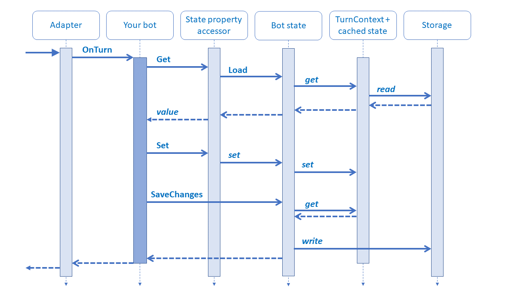

# Managing state

[!INCLUDE [applies-to-v4](../includes/applies-to-v4-current.md)]

State within a bot follows the same paradigms as modern web applications, and the Bot Framework SDK provides some abstractions to make state management easier.

As with web apps, a bot is inherently stateless; a different instance of your bot may handle any given turn of the conversation. For some bots, this simplicity is preferred - the bot can either operate without additional information, or the information required is guaranteed to be within the incoming message. For others, state (such as where in the conversation we are or previously received data about the user) is necessary for the bot to have a useful conversation.

**Why do I need state?**

Maintaining state allows your bot to have more meaningful conversations by remembering certain things about a user or conversation. For example, if you've talked to a user previously, you can save previous information about them, so that you don't have to ask for it again. State also keeps data for longer than the current turn, so that your bot keeps information over the course of a multi-turn conversation.

As it pertains to bots, there are a few layers to using state which we'll cover here: the storage layer, state management (contained in the bot state in the diagram below), and state property accessors. This diagram illustrates parts of the interaction sequence between these layers, with the solid arrows representing a method call, and the dashed arrows representing the response (with or without a return value).

The flow of this diagram is explained in following sections with details each of these layers.

## Storage layer

Starting at the backend, where the state information is actually stored, is our *storage layer*. This can be thought of as our physical storage, such as in-memory, Azure, or a third party server.

The Bot Framework SDK includes some implementations for the storage layer:

- **Memory storage** implements in-memory storage for testing purposes. In-memory data storage is intended for local testing only as this storage is volatile and temporary. The data is cleared each time the bot is restarted.
- **Azure Blob Storage** connects to an Azure Blob Storage object database.
- **Azure Cosmos DB partitioned storage** connects to a partitioned Cosmos DB NoSQL database.

>[!IMPORTANT]
> The _Cosmos DB storage_ class has been deprecated. Containers originally created with CosmosDbStorage had no partition key set, and were given the default partition key of _\/_partitionKey_.
>
> Containers created with _Cosmos DB storage_ can be used with _Cosmos DB partitioned storage_. Read [Partitioning in Azure Cosmos DB](https://aka.ms/azure-cosmosdb-partitioning-overview) for more information.
>
> Also note that, unlike the legacy Cosmos DB storage, the Cosmos DB partitioned storage does not automatically create a database within your Cosmos DB account. You need to [create a new database manually](https://docs.microsoft.com/azure/cosmos-db/create-cosmosdb-resources-portal), but skip manually creating a container since _CosmosDbPartitionedStorage_ will create the container for you.

For instructions on how to connect to other storage options, see [write directly to storage](bot-builder-howto-v4-storage.md).

## State management

*State management* automates the reading and writing of your bot's state to the underlying storage layer. State is stored as *state properties*, which are effectively key-value pairs that your bot can read and write through the state management object without worrying about the specific underlying implementation. Those state properties define how that information is stored. For example, when you retrieve a property that you defined as a specific class or object, you know how that data will be structured.

These state properties are lumped into scoped "buckets", which are just collections to help organize those properties. The SDK includes three of these "buckets":

- User state
- Conversation state
- Private conversation state

All of these buckets are subclasses of the *bot state* class, which can be derived to define other types of buckets with different scopes.

These predefined buckets are scoped to a certain visibility, depending on the bucket:

- User state is available in any turn that the bot is conversing with that user on that channel, regardless of the conversation
- Conversation state is available in any turn in a specific conversation, regardless of user (i.e. group conversations)
- Private conversation state is scoped to both the specific conversation and to that specific user

> [!TIP]
> Both user and conversation state are scoped by channel.
> The same person using different channels to access your bot appears as different users, one for each channel, and each with a distinct user state.

The keys used for each of these predefined buckets are specific to the user and conversation, or both. When setting the value of your state property, the key is defined for you internally with information contained on the turn context to ensure that each user or conversation gets placed in the correct bucket and property. Specifically, the keys are defined as follows:

- The user state creates a key using the *channel ID* and *from ID*. For example, _{Activity.ChannelId}/users/{Activity.From.Id}#YourPropertyName_
- The conversation state creates a key using the *channel ID* and the *conversation ID*. For example, _{Activity.ChannelId}/conversations/{Activity.Conversation.Id}#YourPropertyName_
- The private conversation state creates a key using the *channel ID*, *from ID* and the *conversation ID*. For example, _{Activity.ChannelId}/conversations/{Activity.Conversation.Id}/users/{Activity.From.Id}#YourPropertyName_

### When to use each type of state

Conversation state is good for tracking the context of the conversation, such as:

- Whether the bot asked the user a question, and which question that was
- What the current topic of conversation is, or what the last one was

User state is good for tracking information about the user, such as:

- Non-critical user information, such as name and preferences, an alarm setting, or an alert preference
- Information about the last conversation they had with the bot
  - For instance, a product-support bot might track which products the user has asked about.

Private conversation state is good for channels that support group conversations, but where you want to track both user and conversation specific information. For example, if you had a classroom clicker bot:

- The bot could aggregate and display student responses for a given question.
- The bot could aggregate each student's performance and privately relay that back to them at the end of the session.

For details on using these predefined buckets, see the [state how-to article](bot-builder-howto-v4-state.md).

### Connecting to multiple databases

If your bot needs to connect to multiple databases, create a storage layer for each database.
You might choose to use multiple databases if your bot collects information that has different security, concurrency, or data location needs.

For each storage layer, create the state management objects you need to support your state properties.

## State property accessors

*State property accessors* are used to actually read or write one of your state properties, and provide *get*, *set*, and *delete* methods for accessing your state properties from within a turn. To create an accessor, you must provide the property name, which usually takes place when you're initializing your bot. Then, you can use that accessor to get and manipulate that property of your bot's state.

The accessors allow the SDK to get state from the underlying storage, and update the bot's *state cache* for you. The state cache is a local cache maintained by your bot that stores the state object for you, allowing read and write operations without accessing the underlying storage. If it isn't already in the cache, calling the accessor's *get* method retrieves state and also places it in the cache. Once retrieved, the state property can be manipulated just like a local variable.

The accessor's *delete* method removes the property from the cache, and also deletes it from the underlying storage.

> [!IMPORTANT]
> For the first call to an accessor's *get* method, you must provide a factory method to create the object if it doesn't yet exist in your state. If no factory method is given, you will get an exception. Details on how to use a factory method can be found in the [state how-to article](bot-builder-howto-v4-state.md).

To persist any changes you make to the state property you get from the accessor, the property in the state cache must be updated. You can do so via a call the accessors *set* method, which sets the value of your property in the cache, and is available if that needs to be read or updated later in that turn. To actually persist that data to the underlying storage (and thus make it available after the current turn), you must then [save your state](#saving-state).

### How the state property accessor methods work

The accessor methods are the primary way for your bot to interact with state. How each work, and how the underlying layers interact, are as follows:

- The accessor's *get* method:
  - Accessor requests property from the state cache.
  - If the property is in the cache, return it. Otherwise, get it from the state management object.
    (If it is not yet in state, use the factory method provided in the accessors *get* call.)
- The accessor's *set* method:
  - Update the state cache with the new property value.
- The state management object's *save changes* method:
  - Check the changes to the property in the state cache.
  - Write that property to storage.

## State in dialogs

The dialogs library uses a dialog state property accessor, defined on the bot's conversation state, to retain a dialog's place in the conversation. The dialog state property also allows each dialog to store transient information in between turns.

Adaptive dialogs have a more elaborate memory scope structure, which makes it easier to access configuration and recognition results, among other things. The _dialog manager_ uses the user and conversation state management objects to provide these memory scopes.

For information about the dialogs library, see the [dialogs library](bot-builder-concept-dialog.md) article.
See [about component and waterfall dialogs](bot-builder-concept-waterfall-dialogs.md) for information specific to those types of dialogs.
See the [introduction to adaptive dialogs](bot-builder-adaptive-dialog-introduction.md) and [managing state in adaptive dialogs](bot-builder-concept-adaptive-dialog-memory-states.md) articles for information specific to adaptive dialogs.

## Saving state

When you call the accessor's set method to record the updated state, that state property has not yet been saved to your persisted storage, and instead is only saved to your bot's state cache. To save any changes in the state cache to your persisted state, you must call the state management object's *save changes* method, which is available on the implementation of the bot state class mentioned above (such as user state or conversation state).

Calling the save changes method for a state management object (i.e. the buckets mentioned above) saves all properties in the state cache that you have set up to that point for that bucket, but not for any of the other buckets you may have in your bot's state.

> [!TIP]
> Bot state implements a "last write wins" behavior, where the last write will stamp over the previously written state. This may work for many applications but has implications, particularly in scaled-out scenarios, where there may be some level of concurrency or latency in play.

If you have some custom middleware that might update state after your turn handler completes, consider [handling state in middleware](bot-builder-concept-middleware.md#handling-state-in-middleware).

## Additional resources

- [Dialog state](bot-builder-concept-dialog.md#dialog-state)
- [Write directly to storage](bot-builder-howto-v4-storage.md)
- [Save conversation and user data](bot-builder-howto-v4-state.md)
