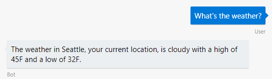
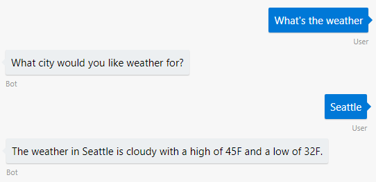
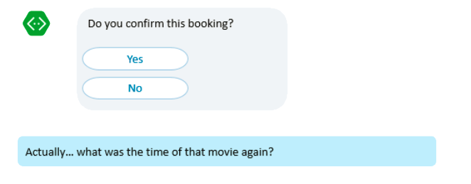

# Conversation flow
[!INCLUDE[applies-to](../includes/applies-to.md)]

Designing a bot's conversation flow involves deciding how a bot responds when the user says something to it. A bot first recognizes the task or conversation topic based on a message from the user. To determine the task or topic (known as the *intent*) associated with a user's message, the bot can look for words or patterns in the text of the user's message, or it can take advantage of services like [Language Understanding](bot-builder-concept-luis.md) and [QnA Maker](https://docs.microsoft.com/en-us/azure/cognitive-services/qnamaker/overview/overview).

Once the bot has recognized the user's intent, depending on the scenario, the bot could fulfill the user's request with a single reply, completing the conversation in one turn, or it might require a series of turns. For multi-turn conversation flows, the Bot Framework SDK provides [state management](./bot-builder-howto-v4-state.md) for keeping track of a conversation, [prompts](bot-builder-prompts.md) for asking for information, and [dialogs](bot-builder-dialog-manage-conversation-flow.md) for encapsulating conversation flows.

In a complex bot with multiple subsystems, it can be the case that you use multiple services to recognize intent, one for each subcomponent of the bot. The [dispatch tool](bot-builder-tutorial-dispatch.md) gets the results of multiple services in one place when you combine conversational subsystems into one bot.

<!-- 
A conversation identifies a series of activities sent between a bot and a user on a specific channel and represents an interaction between one or more bots and either a _direct_ conversation with a specific user or a _group_ conversation with multiple users.
A bot communicates with a user on a channel by receiving activities from, and sending activities to the user.

- Each user has an ID that is unique per channel.
- Each conversation has an ID that is unique per channel.
- The channel sets the conversation ID when it starts the conversation.
- The bot cannot start a conversation; however, once it has a conversation ID, it can resume that conversation.
- Not all channels support group conversations.
-->

## Single turn conversation

The simplest conversational flow is single-turn. In a single-turn flow, the bot finishes its task in one turn, consisting of one message from the user and one reply from the bot.

<!-- The following isn't always true, it's a generalization -->

The simplest kind of single-turn bot doesn't need to keep track of conversation state. Each time it receives a message, it responds based only on the context of the current incoming message, without knowledge of past conversational turns.

A weather bot might have a single-turn flow, it just gives the user a weather report, without going back and forth asking for the city or the date. All the logic for displaying the weather report is based on the message the bot just received. In each turn of a conversation, the bot receives a [turn context](bot-builder-concept-activity-processing.md#turn-context), which your bot can use to determine what to do next and how the conversation flows.

## Multiple turns

Most types of conversation can't be completed in a single turn, so a bot can also have a multi-turn conversation flow. Some scenarios that require multiple conversational turns include:

* A bot that prompts the user for additional information that it needs to complete a task. The bot needs to track whether it has all the parameters for fulfilling the task.
* A bot that guides the user through steps in a process, such as placing an order. The bot needs to track where the user is in the sequence of steps.

For example, a weather bot might have a multi-turn flow, if the bot responds to "what's the weather?" by asking for the city.

When the user replies to the bot's prompt for the city and the bot receives "Seattle", the bot needs to have some context saved to understand that the current message is the response to a previous prompt and part of a request to get weather. Multi-turn bots keep track of state to respond appropriately to new messages.

See [how to manage conversation and user state](bot-builder-howto-v4-state.md) for more information.

> [!NOTE]
> Multi-turn conversations with REST API clients will need to keep track of their own state, for example in a database or table storage.

## Conversation topics

You might design your bot to handle more than one type of task. For example, you might have a bot that provides different conversation flows for greeting the user, placing an order, canceling an order, and getting help. One way to handle this switch between conversation for different tasks or conversation topics is to recognize the intent (what the user wants to do) from the current message.

### Recognize intent

The Bot Framework SDK supplies _recognizers_ that can process a message to determine intent, so your bot can initiate the appropriate conversational flow. Call the recognizer's _recognize_ async method to determine the user's intent from their message content. You can then call the _get top scoring intent_ method on the result to get the recognizer's top prediction.

A recognizer could use regular expressions, language understanding, or other logic that you develop. The following are examples of possible recognizers:

* A recognizer that uses QnA Maker to detect when a user asks a question covered in a knowledgebase.
* A recognizer that uses Language Understanding (LUIS) to train a service with examples of ways user might ask for help, and map that to the `Help` intent.
* A custom recognizer that uses regular expressions to look for commands.
* A custom recognizer that uses a service to translate input.

### Consider how to interrupt conversation flow or change topics

One way to keep track of where you are in a conversation is to use [conversation state](bot-builder-howto-v4-state.md) to save information about the currently active topic or what steps in a sequence have been completed.

When a bot becomes more complex, you can also imagine a sequence of conversation flows occurring in a stack; for instance, the bot will invoke the new order flow, and then invoke the product search flow. Then the user will select a product and confirm, completing the product search flow, and then complete the order.

However, conversations rarely follow such a linear, logical path. Users do not communicate in "stacks", instead they tend to frequently change their minds. Consider the following example:

While your bot may have logically constructed a stack of flows, the user may decide to do something entirely different or ask a question that may be unrelated to the current topic. In the example, the user asks a question rather than providing the yes/no response that the flow expects. How should your flow respond?

* Insist that the user answer the question first.
* Disregard everything that the user had done previously, reset the whole flow stack, and start from the beginning by attempting to answer the user's question.
* Attempt to answer the user's question and then return to that yes/no question and try to resume from there.

There is no right answer to this question, as the best solution will depend upon the specifics of your scenario and how the user would reasonably expect the bot to respond. Refer to how to [use dialogs](bot-builder-dialog-manage-conversation-flow.md) and [handle interruptions](bot-builder-howto-handle-user-interrupt.md) to manage conversation flow.

## Conversation lifetime

<!-- Note: these activities are dependent on whether the channel actually sends them. Also, we should add links -->
A bot receives a _conversation update_ activity whenever it has been added to a conversation, other members have been added to or removed from a conversation, or conversation metadata has changed.
You may want to have your bot react to conversation update activities by greeting users or introducing itself.

A bot receives an _end of conversation_ activity to indicate that the user has ended the conversation. A bot may send an _end of conversation_ activity to indicate that the conversation is ending.
If you are storing information about the conversation, you may want to clear that information when the conversation ends.

<!--  Types of conversations -->

Your bot can support multi-turn interactions where it prompts users for multiple pieces of information. It can be focused on a very specific task or support multiple types of tasks.
The Bot Framework SDK has some built-in support for language understanding (LUIS) and QnA Maker for adding natural language "question and answer" features to your bot.

## Conversations, channels, and users

Conversations can be either a _direct_ conversation with a specific user or a _group_ conversation with multiple users.
A bot communicates with a user on a channel by receiving activities from, and sending activities to the user.

* Each user has an ID that is unique per channel.
* Each conversation has an ID that is unique per channel.
* The channel sets the conversation ID when it starts the conversation.
* The bot cannot start a conversation; however, once it has a conversation ID, it can resume that conversation.
* Not all channels support group conversations.

## Next steps

> [!div class="nextstepaction"]
> [Manage simple conversation flow with dialogs](bot-builder-dialog-manage-conversation-flow.md)

<!-- In addition, your bot can send activities back to the user, either _proactively_, in response to internal logic, or _reactively_, in response to an activity from the user or channel.-->
<!--TODO: Link to messaging how tos.-->
