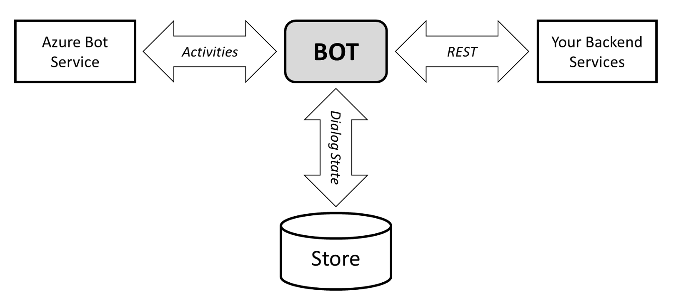
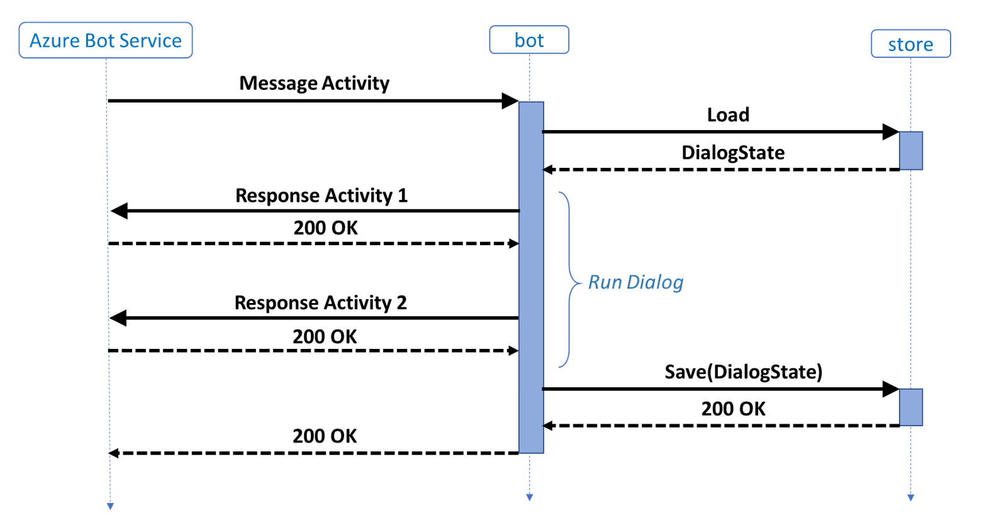
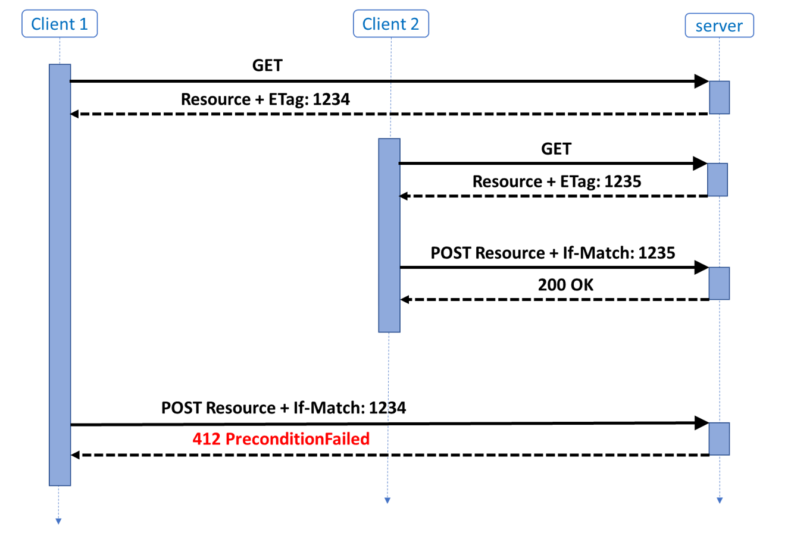
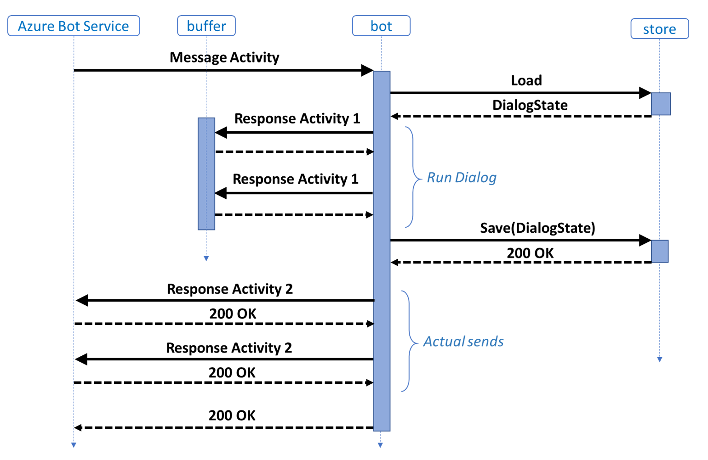

# Implement custom storage for your bot

[!INCLUDE[applies-to](../includes/applies-to.md)]

A bot’s interactions fall into three areas: firstly, the exchange of Activities with the Azure Bot Service, secondly, 
the loading and saving of dialog state with a Store and finally any other backend services the bot needs to work with 
to get its job done.

## Prerequisites
- The full sample code used in this article can be found here: [C# sample](http://aka.ms/scale-out).

In this article, we will be exploring the semantics around the bot’s interactions with the Azure Bot Service and the Store.

The Bot Framework includes a default implementation; this implementation will most likely fit the needs of many 
applications, and all that is needed to be done to make use of it is to plug the pieces together with a few lines of 
initialization code. Many of the samples illustrate just that.

The goal here, however, is to describe what you can do when the semantics of the default implementation doesn’t quite work
as you might like in your application. The basic point is that this is a framework and not a canned application with 
fixed behavior, in other words, the implementation of many of the mechanisms in the framework is just the default 
implementation and not the only implementation.

Specifically, the framework does not dictate the relationship between the exchange of Activities with the Azure 
Bot Service and the loading and saving of any Bot state; it simply provides a default. To illustrate this point further, 
we will be developing an alternative implementation that has different semantics. This alternative solution sits 
equally well in the framework and may even be more appropriate for the application being developed. It all depends on the scenario.

## Behavior of the default BotFrameworkAdapter and Storage providers

Firstly, let’s review the default implementation that ships as part of the framework packages as shown by the following 
sequence diagram:

On receiving an Activity, the bot loads the state corresponding to this conversation. It then runs the dialog logic 
with this state and the Activity that has just arrived. In the process of executing the dialog, one or more outbound 
activities are created and immediately sent. When the processing of the dialog is complete, the bot saves the updated 
state, overwriting the old state with new.

It is worth considering a couple of things that can go wrong with this behavior.

Firstly, if the Save operation were to fail for some reason the state has implicitly slipped out of sync with 
what is seen on the channel because the user having seen the responses is under the impression that the state 
has moved forward, but it hasn’t. This is generally worse than if the state was successful and the response 
messaging were successful. This can have implications for the conversation design: for example, the dialog might 
include additional, otherwise redundant confirmation exchanges with the user. 

Secondly, if the implementation is deployed scaled out across multiple nodes, the state can accidentally get 
overwritten - this can be particularly confusing because the dialog will likely have sent activities to the channel 
carrying confirmation messages. Consider the example of a pizza order bot, if the user, on being asked for a topping, 
adds mushroom and without delay adds cheese, in a scaled-out scenario with multiple instances running subsequent 
activities can be sent concurrently to different machines running the bot. When this happens, there is what is referred 
to as a “race condition” where one machine might overwrite the state written by another. However, in our scenario, 
because the responses were already sent, the user has received confirmation that both mushroom and cheese were added. 
Unfortunately, when the pizza arrives, it will only contain mushroom or cheese, not both.

## Optimistic locking

The solution is to introduce some locking around the state. The particular style of locking we will be using here is called 
optimistic locking because we will let everything run as if they were each the only thing running and then we will detect any 
concurrency violations after the processing has been done. This may sound complicated but is very easy to build using cloud 
storage technologies and the right extension points in the bot framework.

We will use a standard HTTP mechanism based on the entity tag header, (ETag). Understanding this mechanism is crucial to 
understanding the code that follows. The following diagram illustrates the sequence.

The diagram illustrates the case of two clients that are performing an update to some resource. When a client issues a 
GET request and a resource is returned from the server, it is accompanied by an ETag header. The ETag header is an opaque 
value that represents the state of the resource. If a resource is changed, the ETag will be updated. When the client has 
done its update to the state, it POSTs it back to the server, making this request the client attaches the ETag value it had 
previously received in a precondition If-Match header. If this ETag does not match the value, the server last returned 
(on any response, to any client) the precondition check fails with a 412 Precondition Failure. This failure is an indicator 
to the client making the POST request that the resource has been updated. On seeing this failure, the typical behavior for 
a client will be to GET the resource again, apply the update it wanted, and POST the resource back. This second 
POST will be successful, assuming of course, that no other client has come and updated the resource, and if it has the 
client will just have to try again.

This process is called “optimistic” because the client, having got hold of a resource proceeds to do its processing, 
the resource itself is not “locked” in the sense that other clients can access it without any restriction. Any contention 
between clients over what the state of the resource should be is not determined until the processing has been done. As a 
rule, in a distributed system this strategy is more optimal than the opposite “pessimistic” approach.

The optimistic locking mechanism we’ve covered assumes program logic can be safely retried, needless, to say the important 
thing to consider here is what happens to external service calls. The ideal solution here is if these services can be made 
idempotent. In computer science, an idempotent operation is one that has no additional effect if it is called more than once 
with the same input parameters. Pure HTTP REST services that implement GET, PUT and DELETE fit this description. The reasoning 
here is intuitive: we might be retrying the processing and so making any calls it needs to make have no additional effect as 
they are re-executed as part of that retry is a good thing. For the sake of this discussion, we will assume we are living in 
an ideal world and the backend services shown to the right of the system picture at the beginning of this article are all 
idempotent HTTP REST services, from here on we will focus only on the exchange of activities.

## Buffering outbound activities

The sending of an Activity is not an idempotent operation, nor is it clear that would make much sense in the end-to-end scenario. 
After all the Activity is often just carrying a message that is appended to a view or perhaps spoken by a text to speech agent.

The key thing we want to avoid with sending the activities is sending them multiple times. The problem we have is that the optimistic locking mechanism requires that we with rerun our logic possibly multiple times. The solution is simple: we must 
buffer the outbound activities from the dialog until we are sure we are not going to rerun the logic. That is until after we 
have a successful Save operation. We are looking for a flow that looks something like the following:

Assuming we can build a retry loop around the dialog execution we get the following behavior when there is a 
precondition failure on the Save operation:

Applying this mechanism and revisiting our example from earlier we should never see an erroneous positive acknowledgment of a pizza topping being added to an order. In fact, although we might have scaled out our deployment across multiple machines, we have effectively serialized our state updates with the optimistic locking scheme. In our pizza ordering but the acknowledgement from adding an item can now even be written to reflect the full state accurately. For example, if the user immediately types “cheese” and then before the bot has had a chance to reply “mushroom” the two replies can now be “pizza with cheese” and then “pizza with cheese and mushroom.”

Looking at the sequence diagram we can see that the replies could be lost after a successful Save operation, however, they could be lost anywhere in the end to end communication. The point is this is not a problem the state management infrastructure can fix. It will require a higher-level protocol and possibly one involving the user of the channel. For example, if the bot appears to the user not to have replied it is reasonable to expect the user to ultimately try again or some such behavior. So while it is reasonable for a scenario to have occasional transient outages such as this it is far less reasonable to expect a user to be able to filter out erroneous positive acknowledgements or other unintended messages. 

Pulling this all together, in our new custom storage solution, we are going to do three things the default implementation in the framework doesn’t do. Firstly, we are going to use ETags to detect contention, secondly we are going to retry the processing when the ETag failure is detected and thirdly we are going to buffer any outbound Activities until we have a successful save. The remainder of this article describes the implementation of these three parts.

## Implementing ETag Support

To support unit testing we start out by defining an interface for our new store with ETag support. Having the interface means we can write two versions, one for the unit tests that runs in memory without the need of hitting the network and another for production. The interface will make it very easy to leverage the dependency injection mechanisms we have in ASP.NET.

The interface consists of Load and Save methods. Both these take the key we will use for the state. The Load will return the data and the associated ETag. And the Save will take these in. Additionally, the Save will return bool. This bool will indicate whether the ETag has matched and the Save was successful. This is not intended as a general error indicator but rather a specific indicator of precondition failure, we model this as a return code rather than an exception because we will be writing control flow logic around this in the shape of our retry loop.

As we would like this lowest level storage piece to be pluggable, we will make sure to avoid placing any serialization requirements on it, however we would like to specify that the content save should be JSON, that way a store implementation can set the content-type. The easiest and most natural way to do this in .NET is through the argument types, specifically we will type the content argument as JObject. In JavaScript or TypeScript this will just be a regular native object.  

This is the resulting interface:

**IStore.cs**  
[!code-csharp[IStore](~/../botbuilder-samples/samples/csharp_dotnetcore/42.scaleout/IStore.cs?range=14-19)]

Implementing this against Azure Blob Storage is straight forward.

**BlobStore.cs**  
[!code-csharp[BlobStore](~/../botbuilder-samples/samples/csharp_dotnetcore/42.scaleout/BlobStore.cs?range=18-101)]

As you can see Azure Blob Storage is doing the real work here. Note the catch of specific exceptions and how that is translated across to meet what will be the expectations of the calling code. That is, on the load we want a Not Found exception to return null and the Precondition Failed exception on the Save to return bool.

All this source code will be available in a corresponding [sample](https://aka.ms/scale-out) and that sample will include a memory store implementation.

## Implementing the Retry Loop
The basic shape of the loop is derived directly from the behavior shown in the sequence diagrams.

On receiving an Activity we create a key for the corresponding state for that conversation. We are not changing the relationship between Activity and conversation state, so we will be creating the key in exactly the same way as in the default state implementation.

After having created the appropriate key we will attempt to Load the corresponding state. Then run the bot’s dialogs and then attempt to Save. If that Save is successful, we will send the outbound Activities that resulted from running the dialog and be done. Otherwise we will go back and repeat the whole process from before the Load. Redoing the Load will give us a new ETag and so next time the Save will hopefully be successful.

The resulting OnTurn implementation looks like this:

**ScaleoutBot.cs**  
[!code-csharp[OnMessageActivity](~/../botbuilder-samples/samples/csharp_dotnetcore/42.scaleout/Bots/ScaleOutBot.cs?range=43-72)]

Note that we have modeled the dialog execution as a function call. Perhaps a more sophisticated implementation would have defined an interface and made this dependency injectable but for our purposes having the dialog all sit behind a static function emphasize the functional nature of our approach. As a general statement, organizing our implementation such that the crucial parts become functional puts us in a very good place when it comes to having it work successfully on networks.

## Implementing outbound Activity buffering 

The next requirement is that we buffer outbound Activities until a successful Save has been performed. This will require a custom BotAdapter implementation. In this code, we will implement the abstract SendActivity function to add the Activity to a list rather than sending it. The dialog we will be hosting will be non-the-wiser.
In this particular scenario UpdateActivity and DeleteActivity operations are not supported and so will just throw Not Implemented from those methods. We also don’t care about the return value from the SendActivity. This is used by some channels in scenarios where updates to Activities need to be sent, for example, to disable buttons on cards displayed in the channel. These message exchanges can get complicated particularly when state is required, that is outside the scope of this article. The full implementation of the custom BotAdapter looks like this:

**DialogHostAdapter.cs**  
[!code-csharp[DialogHostAdapter](~/../botbuilder-samples/samples/csharp_dotnetcore/42.scaleout/DialogHostAdapter.cs?range=19-46)]

## Integration

All that is left to do is glue these various new pieces together and plug them into the existing framework pieces. The main retry loop just sits in the IBot OnTurn function. It holds our custom IStore implementation which for testing purposes we have made dependency injectable. We have put all the dialog hosting code into a class called DialogHost that exposes a single public static function. This function is defined to take the inbound Activity and the old state and then return the resulting Activities and new state.

The first thing to do in this function is to create the custom BotAdapter we introduced earlier. Then we will just run the dialog in exactly the same was as we usually do by creating a DialogSet and DialogContext and doing the usual Continue or Begin flow. The only piece we haven’t covered is the need for a custom Accessor. This turns out to be a very simple shim that facilitates passing the dialog state into the dialog system. The Accessor uses ref semantics when working with the dialog system and so all that is needed is to pass the handle across. To make things even clearer we have constrained the class template we are using to ref semantics.

We are being very cautious in the layering, we are putting the JsonSerialization inline in our hosting code because we didn’t want it inside the pluggable storage layer when different implementations might serialize differently.

Here is the driver code:

**DialogHost.cs**  
[!code-csharp[DialogHost](~/../botbuilder-samples/samples/csharp_dotnetcore/42.scaleout/DialogHost.cs?range=22-72)]

And finally, the custom Accessor, we only need to implement Get because the state is by ref:

**RefAccessor.cs**  
[!code-csharp[RefAccessor](~/../botbuilder-samples/samples/csharp_dotnetcore/42.scaleout/RefAccessor.cs?range=22-60)]

## Additional information
The [C# sample](http://aka.ms/scale-out) code used in this article is available on GitHub.

