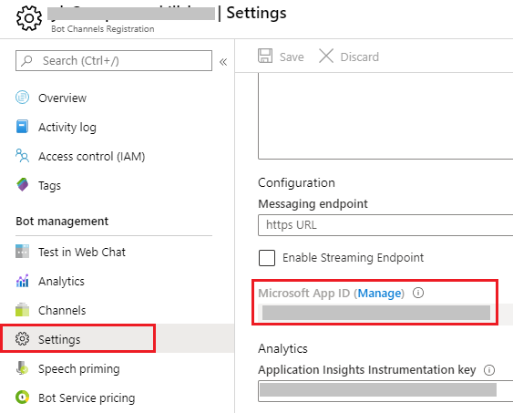
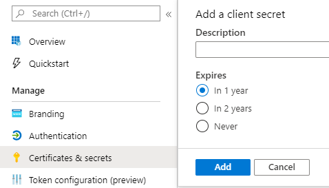
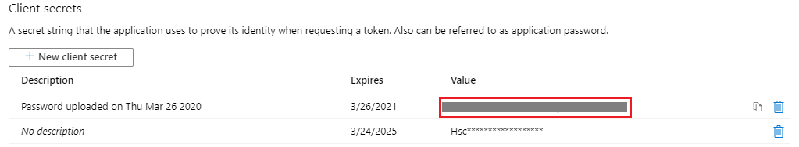
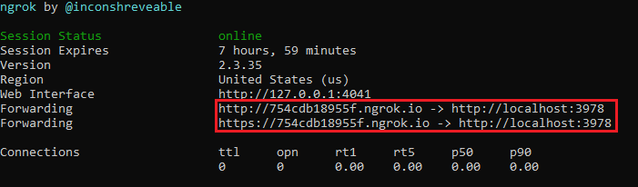

# Debug a bot from any channel using ngrok

Questions:
1. Do we have articles about how to configure a local bot to a channel? Current [doc](https://docs.microsoft.com/azure/bot-service/bot-service-manage-channels?view=azure-bot-service-4.0) is about how to connect bots hosted in Azure with channels.
2. 

When your bot is in development, you can [debug and your bot locally using an IDE](https://docs.microsoft.com/azure/bot-service/bot-service-debug-bot?view=azure-bot-service-4.0) such as Visual Studio or Visual Studio Code. You can also [debug a bot using the Bot Framework Emulator](https://docs.microsoft.com/azure/bot-service/bot-service-debug-emulator?view=azure-bot-service-4.0) by chatting with your bot locally and inspect the messages your bot sends and receives. You can even make slight updates of your bot's code and enable the feature to [debug a bot with inspection middleware](https://docs.microsoft.com/azure/bot-service/bot-service-debug-inspection-middleware?view=azure-bot-service-4.0).

When your bot is already in production, the Bot Framework Emulator uses an instance of the [Web Chat control](https://github.com/Microsoft/BotFramework-WebChat), which is only used in DirectLine, or embedded into web sites using a standard or custom configuration. Popular third party channels such as Slack, Facebook Messenger, Kik, etc. all implement their own chat channel user interfaces. In this article, we’ll discuss how you can locally debug your bot from any channel your production bot is configured for, using [ngrok](https://ngrok.com/docs).

## Prerequisites

* A subscription to [Microsoft Azure](https://azure.microsoft.com/).
* Install [Bot Framework Emulator](https://github.com/Microsoft/BotFramework-Emulator/blob/master/README.md)
* Install [ngrok](https://ngrok.com/).
* A basic bot you developed in your local machine.

## Create an Azure registration resource

You will need to create a Bot Channels Registration to register your local bot with Azure so that your local bot can be connected to any supported channel.

### Create a Bot Channels Registration

1. Navigate to your [Azure portal](https://azure.microsoft.com) and select **+ Create a resource** on top of the menu.

2. Enter **Bot Channels Registration** in the search box and press **Enter**.

3. Select **Create** from the pop-up window and then fill in the creation form to create your **Bot Channels Registration**.

### Get the App ID and password

You will need to use the **App ID** and **password** generated during the previous process for application configuration. If you already have these values, you can skip to the next section to configure these values to your bot application. If you do not have these values, follow the steps: 

1. Select the **Bot Channels Registration** you just created and then select **Settings** from the left panel. The **App ID** is displayed in the **Microsoft App ID (Manage)** section.
    
    > [!div class="mx-imgBorder"]
    > 

2. Select **Manage** from **Microsoft App ID (Manage)** on the **Settings** page to generate a new **password**. 

3. Select **+New client secret** from the **Certificate & secrets** page. Enter some description in the **Description** field (this is optional) and select an expiration time from the **Expires** list. Select **Add**. 

    > [!div class="mx-imgBorder"]
    > 

4. Copy the value from the **Value** field of the displayed table. This is the generated **password** of your **Bot Channels Registration**.

    > [!div class="mx-imgBorder"]
    > 

For more information about creating a **Bot Channels Registration**, refer to the [Register a bot with Azure Bot Service](https://docs.microsoft.com/azure/bot-service/bot-service-quickstart-registration?view=azure-bot-service-3.0&viewFallbackFrom=azure-bot-service-4.0) article.


## Run ngrok

[**ngrok**](https://ngrok.com/docs) is a cross-platform application that "allows you to expose a web server running on your local machine to the internet." Essentially, what we’ll be doing is using ngrok to forward messages from external channels on the web directly to our local machine to allow debugging, as opposed to the standard messaging endpoint configured in the Azure portal. 

1. Open a terminal and navigate to the folder where your **ngrok** executable is.

2. Run **ngrok** with the following command to create a new tunnel. 

    ```cmd
    ngrok http 3978 -host-header="localhost:3978"

    ```

    > [!NOTE]
    > Please note that the port specified is the port your bot is running on. You may use any localhost port you'd like.

3. When **ngrok** starts, copy and save the public forwarding URL for later. 
   
   

## Configure in Azure portal

While **ngrok** is running, login to your Azure portal and view your bot settings to do some configuration.


## Test

One of the key features available in Bot Framework is the ability to seamlessly connect your bot to multiple channels all from the same bot. You can read the [connect a bot to channels](https://docs.microsoft.com/azure/bot-service/bot-service-manage-channels?view=azure-bot-service-4.0) article to learn more about currently supported channels and how to connect your bots to them. In this post, we’ll discuss how you can locally debug your bot from any channel your production bot is configured for, using ngrok.


