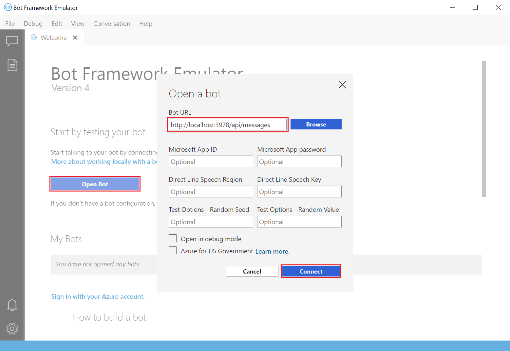
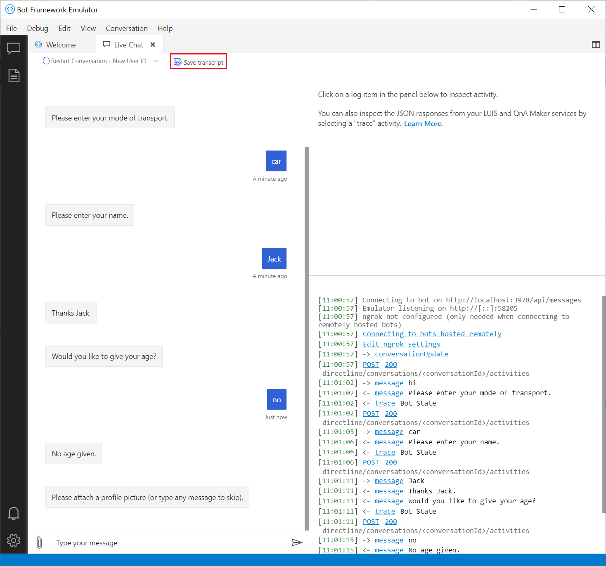
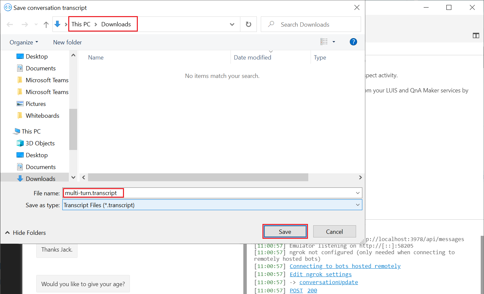
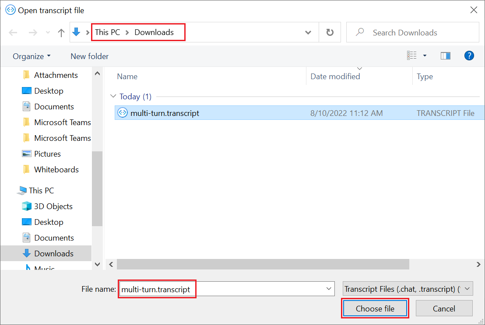
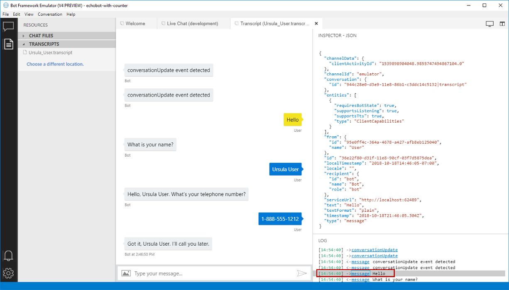

# Debug your bot using transcript files

[!INCLUDE[applies-to](../includes/applies-to.md)]

One of the keys to successful testing and debugging a bot is your ability to record and examine the set of conditions that occur when running your bot. This article discusses the creation and use of a bot transcript file to provide a detailed set of user interactions and bot responses for testing and debugging.

## The bot transcript file
A bot transcript file is a specialized JSON file that preserves the interactions between a user and your bot. A transcript file preserves not only the contents of a message, but also interaction details such as the user id, channel id, channel type, channel capabilities, time of the interaction, etc. All of this information can then be used to help find and resolve issues when testing or debugging your bot. 

## Creating/Storing a bot transcript file
This article shows how to create bot transcript files using Microsoft's [Bot Framework Emulator](https://github.com/Microsoft/BotFramework-Emulator). Transcript files may also be created programatically; you can read more concerning that approach [here](./bot-builder-howto-v4-storage.md#blob-transcript-storage). In this article we will use the Bot Framework sample code for [Multi Turn Prompt Bot](https://aka.ms/cs-multi-prompts-sample) that requests a user's mode of transportation, name and age, but any code that can be accessed using Microsoft's Bot Framework Emulator may be used to create a transcript file.

To begin this process ensure that the bot code you want to test is running within your development environment. Start the bot framework emulator, select the _Open Bot_ button, then enter the address of _localhost:port_ shown in your browser followed by "/api/messages" as shown in the image below. Now click the _Connect_ button to connect the emulator to your bot.

After connecting the emulator to your running code, test your code by sending simulated user interactions to the bot. For this example we have passed in the user's mode of transportation, name and age. After you have entered all of the user interactions you want to preserve, use the bot framework emulator to create and save a transcript file containing this conversation. 

Within the _Live Chat_ tab (shown below), select the _Save transcript_ button. 

Choose a location and name for your transcript file and then select the save button.

All of the user interactions and bot responses that you entered to test your code with the emulator have now been saved into a transcript file that you can later reload to help debug interactions between your user and your bot.

## Retrieving a bot transcript file
To retrieve a bot transcript file using the Bot Framework Emulator, select the _File_ then _Open Transcript..._ in the upper left corner of the emulator, as shown below. Next, select the transcript file that you want to retrieve. (Transcripts may also be accessed from within the _TRANSCRIPTS_ list control in the _RESOURCES_ section of the emulator) 

In this example we are retrieving the transcript file named "ursula_user.transcript". Selecting a transcript file will automatically load the entire preserved converation into a new Tab titled _Transcript_.

## Debug using transcript file
With your transcript file loaded, you are now ready to debug interactions that you captured between a user and your bot. To do this, simply click on any event or activity recorded in the _LOG_ section shown in the lower right area of the emulator. In the example shown below, we selected the user's first interaction when they sent the message "Hello". When we do this, all of the information in your transcript file concerning this specific interaction is displayed in the emulator's _INSPECTOR_ window in JSON format. Looking at some of these values from the bottom upward, we see the:
* Interaction type was _message_.
* Time the message was sent.
* Plain text sent contained "Yes".
* Message was sent to our bot.
* User id and information.
* Channel id, capabilities and information.

This detailed level of information allows you to follow the step-by-step interactions between the user's input and your bot's response, which is useful for debugging situations where your bot either did not respond back in the manner that you anticipated or did not respond back to the user at all. Having both these values and a record of the steps leading up to the failed interaction allows you to step through your code, find the location where your bot does not respond as anticipated, and resolve those issues.

Using transcript files together with the Bot Framework Emulator is just one of the many tools you can use to help you test and debug your bot's code and user interactions. To find more ways to test and debug your bot, see the additional resources listed below.

## Additional information

For additional testing and debugging information see:

* [Bot testing and debugging guidelines](./bot-builder-testing-debugging.md)
* [Debug with the bot framework emulator](../bot-service-debug-emulator.md)
* [Troubleshoot general problems](../bot-service-troubleshoot-bot-configuration.md) and the other troubleshooting articles in that section.
* [Debugging in Visual Studio](https://docs.microsoft.com/en-us/visualstudio/debugger/index)
