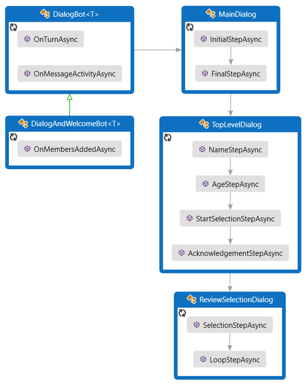
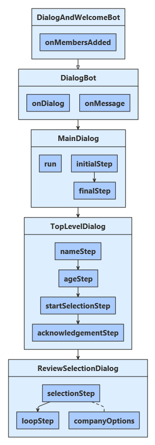
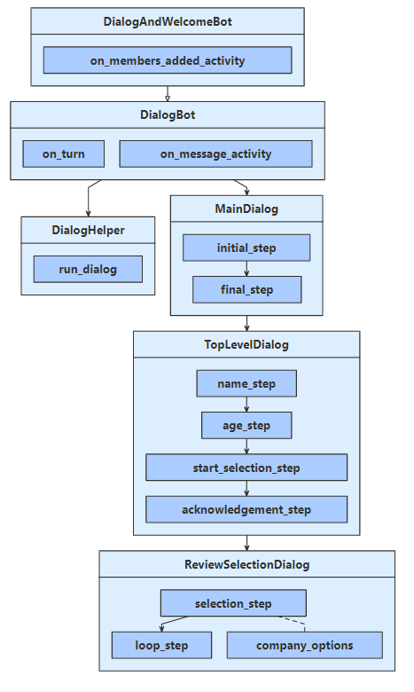

# Create advanced conversation flow using branches and loops

[!INCLUDE[applies-to](../includes/applies-to.md)]

You can manage simple and complex conversation flows using the dialogs library.
In this article, we will show you how to manage complex conversations that branch and loop.
We'll also show you how to pass arguments between different parts of the dialog.

## Prerequisites

- Knowledge of [bot basics][concept-basics], [managing state][concept-state], the [dialogs library][concept-dialogs], and how to [implement sequential conversation flow][simple-dialog].
- A copy of the complex dialog sample in [**C#**][cs-sample], [**JavaScript**][js-sample] or [**Python**][python-sample].

## About this sample

This sample represents a bot that can sign users up to review up to two companies from a list.

`DialogAndWelcomeBot` extends `DialogBot`, which defines the handlers for different activities and the bot's turn handler. `DialogBot` runs the dialogs:

- The _run_ method is used by `DialogBot` to kick off the dialog.
- `MainDialog` is the parent of the other two dialogs, which are called at certain times in the dialogs. Details on those dialogs are provided throughout this article.

The dialogs are split into `MainDialog`, `TopLevelDialog`, and `ReviewSelectionDialog` component dialogs, which together do the following:

- They ask for the user's name and age, and then _branch_ based on the user's age.
  - If the user is too young, they do not ask the user to review any companies.
  - If the user is old enough, they start to collect the user's review preferences.
    - They allow the user to select a company to review.
    - If the user chooses a company, they _loop_ to allow a second company to be selected.
- Finally, they thank the user for participating.

They use waterfall dialogs and a few prompts to manage a complex conversation.

# [C#](#tab/csharp)

To use dialogs, your project needs to install the **Microsoft.Bot.Builder.Dialogs** NuGet package.

**Startup.cs**

We register services for the bot in `Startup`. These services are available to other parts of the code through dependency injection.

- Basic services for a bot: a credential provider, an adapter, and the bot implementation.
- Services for managing state: storage, user state, and conversation state.
- The dialog the bot will use.

[!code-csharp[ConfigureServices](~/../botbuilder-samples/samples/csharp_dotnetcore/43.complex-dialog/Startup.cs?range=22-36)]

# [JavaScript](#tab/javascript)

To use dialogs, your project needs to install the **botbuilder-dialogs** npm package.

**index.js**

We create the following services for the bot that are required:

- basic services: an adapter and the bot implementation
- state management: storage, user state, and conversation state
- dialogs: bot uses these for managing conversations

[!code-javascript[ConfigureServices](~/../botbuilder-samples/samples/javascript_nodejs/43.complex-dialog/index.js?range=26-65)]

# [Python](#tab/python)

To use dialogs, your project needs to install the **botbuilder-dialogs** pypi package by running `pip install botbuilder-dialogs`.

**app.py**

We create services for the bot that other parts of the code require.

- Basic services for a bot: an adapter and the bot implementation.
- Services for managing state: storage, user state, and conversation state.
- The dialog the bot will use.

[!code-python[ConfigureServices](~/../botbuilder-python/samples/python/43.complex-dialog/app.py?range=28-75)]

---

> [!NOTE]
> Memory storage is used for testing purposes only and is not intended for production use.
> Be sure to use a persistent type of storage for a production bot.

## Define a class in which to store the collected information

# [C#](#tab/csharp)

**UserProfile.cs**

[!code-csharp[UserProfile class](~/../botbuilder-samples/samples/csharp_dotnetcore/43.complex-dialog/UserProfile.cs?range=8-16)]

# [JavaScript](#tab/javascript)

**userProfile.js**

[!code-javascript[UserProfile class](~/../botbuilder-samples/samples/javascript_nodejs/43.complex-dialog/userProfile.js?range=4-12)]

# [Python](#tab/python)

**data_models/user_profile.py**

[!code-python[UserProfile class](~/../botbuilder-python/samples/python/43.complex-dialog/data_models/user_profile.py?range=7-13)]

---

## Create the dialogs to use

# [C#](#tab/csharp)

**Dialogs\MainDialog.cs**

We've defined a component dialog, `MainDialog`, which contains a couple main steps and directs the dialogs and prompts. The initial step calls `TopLevelDialog` which is explained below.

[!code-csharp[step implementations](~/../botbuilder-samples/samples/csharp_dotnetcore/43.complex-dialog/Dialogs/MainDialog.cs?range=31-50&highlight=3)]

**Dialogs\TopLevelDialog.cs**

The initial, top-level dialog has four steps:

1. Ask for the user's name.
1. Ask for the user's age.
1. Branch based on the user's age.
1. Finally, thank the user for participating and return the collected information.

In the first step we're clearing the user's profile, so that the dialog will start with an empty profile each time. Since the last step will return information when it ends, the `AcknowledgementStepAsync` concludes with saving it to the user state, then returning that info to the main dialog for use in the final step.

[!code-csharp[step implementations](~/../botbuilder-samples/samples/csharp_dotnetcore/43.complex-dialog/Dialogs/TopLevelDialog.cs?range=39-96&highlight=3-4,47-49,56-57)]

**Dialogs\ReviewSelectionDialog.cs**

The review-selection dialog is started from the top-level dialog's `StartSelectionStepAsync`, and has two steps:

1. Ask the user to choose a company to review or choose `done` to finish.
1. Repeat this dialog or exit, as appropriate.

In this design, the top-level dialog will always precede the review-selection dialog on the stack, and the review-selection dialog can be thought of as a child of the top-level dialog.

[!code-csharp[step implementations](~/../botbuilder-samples/samples/csharp_dotnetcore/43.complex-dialog/Dialogs/ReviewSelectionDialog.cs?range=42-106)]

# [JavaScript](#tab/javascript)

**dialogs/mainDialog.js**

We've defined a component dialog, `MainDialog`, which contains a couple main steps and directs the dialogs and prompts. The initial step calls `TopLevelDialog` which is explained below.

[!code-javascript[step implementations](~/../botbuilder-samples/samples/javascript_nodejs/43.complex-dialog/dialogs/mainDialog.js?range=43-55&highlight=2)]

**dialogs/topLevelDialog.js**

The initial, top-level dialog has four steps:

1. Ask for the user's name.
1. Ask for the user's age.
1. Branch based on the user's age.
1. Finally, thank the user for participating and return the collected information.

In the first step we're clearing the user's profile, so that the dialog will start with an empty profile each time. Since the last step will return information when it ends, the `acknowledgementStep` concludes with saving it to the user state, then returning that info to the main dialog for use in the final step.

[!code-javascript[step implementations](~/../botbuilder-samples/samples/javascript_nodejs/43.complex-dialog/dialogs/topLevelDialog.js?range=32-76&highlight=2-3,37-39,43-44)]

**dialogs/reviewSelectionDialog.js**

The review-selection dialog is started from the top-level dialog's `startSelectionStep`, and has two steps:

1. Ask the user to choose a company to review or choose `done` to finish.
1. Repeat this dialog or exit, as appropriate.

In this design, the top-level dialog will always precede the review-selection dialog on the stack, and the review-selection dialog can be thought of as a child of the top-level dialog.

[!code-javascript[step implementations](~/../botbuilder-samples/samples/javascript_nodejs/43.complex-dialog/dialogs/reviewSelectionDialog.js?range=33-78)]

# [Python](#tab/python)

**dialogs\main_dialog.py**

We've defined a component dialog, `MainDialog`, that contains a couple of main steps and directs the dialogs and prompts. The initial step calls `TopLevelDialog` which is explained below.

[!code-python[step implementations](~/../botbuilder-python/samples/python/43.complex-dialog/dialogs/main_dialog.py?range=29-50&highlight=4)]

**dialogs\top_level_dialog.py**

The initial, top-level dialog has four steps:

1. Ask for the user's name.
1. Ask for the user's age.
1. Branch based on the user's age.
1. Finally, thank the user for participating and return the collected information.

In the first step we're clearing the user's profile, so that the dialog will start with an empty profile each time. Because the last step will return information when it ends, the `acknowledgementStep` concludes with saving it to the user state, then returning that info to the main dialog for use in the final step.

[!code-python[step implementations](~/../botbuilder-python/samples/python/43.complex-dialog/dialogs/top_level_dialog.py?range=43-95&highlight=2-3,43-44,52)]

**dialogs/review_selection_dialog.py**

The review-selection dialog is started from the top-level dialog's `startSelectionStep`, and has two steps:

1. Ask the user to choose a company to review or choose `done` to finish.
1. Repeat this dialog or exit, as appropriate.

In this design, the top-level dialog will always precede the review-selection dialog on the stack, and the review-selection dialog can be thought of as a child of the top-level dialog.

[!code-python[step implementations](~/../botbuilder-python/samples/python/43.complex-dialog/dialogs/review_selection_dialog.py?range=42-99)]

---

## Implement the code to manage the dialog

The bot's turn handler repeats the one conversation flow defined by these dialogs.
When we receive a message from the user:

1. Continue the active dialog, if there is one.
   - If no dialog was active, we clear the user profile and start the top-level dialog.
   - If the active dialog completed, we collect and save the returned information and display a status message.
   - Otherwise, the active dialog is still mid-process, and we don't need to do anything else at the moment.
1. Save the conversation state, so that any updates to the dialog state are persisted.

# [C#](#tab/csharp)

<!-- **DialogExtensions.cs**

In this sample, we've defined a `Run` helper method that we will use to create and access the dialog context.
Since component dialog defines an inner dialog set, we have to create an outer dialog set that's visible to the message handler code, and use that to create a dialog context.

- `dialog` is the main component dialog for the bot.
- `turnContext` is the current turn context for the bot.

[!code-csharp[Run method](~/../botbuilder-samples/samples/csharp_dotnetcore/43.complex-dialog/DialogExtensions.cs?range=13-24)]

-->

**Bots\DialogBot.cs**

The message handler calls the `RunAsync` method to manage the dialog, and we've overridden the turn handler to save any changes to the conversation and user state that may have happened during the turn. The base `OnTurnAsync` will call the `OnMessageActivityAsync` method, ensuring the save calls happen at the end of that turn.

[!code-csharp[Overrides](~/../botbuilder-samples/samples/csharp_dotnetcore/43.complex-dialog/Bots/DialogBot.cs?range=33-48&highlight=5-7)]

**Bots\DialogAndWelcome.cs**

`DialogAndWelcomeBot` extends `DialogBot` above to provide a welcome message when the user joins the conversation, and is what is created in `Startup.cs`.

[!code-csharp[On members added](~/../botbuilder-samples/samples/csharp_dotnetcore/43.complex-dialog/Bots/DialogAndWelcome.cs?range=21-38)]

# [JavaScript](#tab/javascript)

**dialogs/mainDialog.js**

In this sample, we've defined a `run` method that we will use to create and access the dialog context.
Since component dialog defines an inner dialog set, we have to create an outer dialog set that's visible to the message handler code, and use that to create a dialog context.

- `turnContext` is the current turn context for the bot.
- `accessor` is an accessor we've created to manage the dialog state.

[!code-javascript[run method](~/../botbuilder-samples/samples/javascript_nodejs/43.complex-dialog/dialogs/mainDialog.js?range=32-41)]

**bots/dialogBot.js**

The message handler calls the `run` helper method to manage the dialog, and we implement a turn handler to save any changes to the conversation and user state that may have happened during the turn. The call to `next` will let the base implementation call the `onDialog` method, ensuring the save calls happen at the end of that turn.

[!code-javascript[Overrides](~/../botbuilder-samples/samples/javascript_nodejs/43.complex-dialog/bots/dialogBot.js?range=24-41)]

**bots/dialogAndWelcomeBot.js**

`DialogAndWelcomeBot` extends `DialogBot` above to provide a welcome message when the user joins the conversation, and is what is created in `index.js`.

[!code-javascript[On members added](~/../botbuilder-samples/samples/javascript_nodejs/43.complex-dialog/bots/dialogAndWelcomeBot.js?range=10-21)]

# [Python](#tab/python)

**bots/dialog_bot.py**

The message handler calls the `run_dialog` method to manage the dialog, and we've overridden the turn handler to save any changes to the conversation and user state that may have happened during the turn. The base `on_turn` will call the `on_message_activity` method, ensuring the save calls happen at the end of that turn.

[!code-python[Overrides](~/../botbuilder-python/samples/python/43.complex-dialog/bots/dialog_bot.py?range=29-41&highlight=32-34)]

**bots/dialog_and_welcome_bot.py**

`DialogAndWelcomeBot` extends `DialogBot` above to provide a welcome message when the user joins the conversation, and is what is created in `config.py`.

[!code-python[on_members_added](~/../botbuilder-python/samples/python/43.complex-dialog/bots/dialog_and_welcome_bot.py?range=28-39)]

---

## Branch and loop

# [C#](#tab/csharp)

**Dialogs\TopLevelDialog.cs**

Here is sample branch logic from a step in the _top level_ dialog:

[!code-csharp[branching logic](~/../botbuilder-samples/samples/csharp_dotnetcore/43.complex-dialog/Dialogs/TopLevelDialog.cs?range=68-80)]

**Dialogs\ReviewSelectionDialog.cs**

Here is sample looping logic from a step in the _review selection_ dialog:

[!code-csharp[looping logic](~/../botbuilder-samples/samples/csharp_dotnetcore/43.complex-dialog/Dialogs/ReviewSelectionDialog.cs?range=96-105)]

# [JavaScript](#tab/javascript)

**dialogs/topLevelDialog.js**

Here is sample branch logic from a step in the _top level_ dialog:

[!code-javascript[branching logic](~/../botbuilder-samples/samples/javascript_nodejs/43.complex-dialog/dialogs/topLevelDialog.js?range=56-64)]

**dialogs/reviewSelectionDialog.js**

Here is sample looping logic from a step in the _review selection_ dialog:

[!code-javascript[looping logic](~/../botbuilder-samples/samples/javascript_nodejs/43.complex-dialog/dialogs/reviewSelectionDialog.js?range=71-77)]

# [Python](#tab/python)

**dialogs/top_level_dialog.py**

Here is sample branch logic from a step in the _top level_ dialog:

[!code-python[branching logic](~/../botbuilder-python/samples/python/43.complex-dialog/dialogs/top_level_dialog.py?range=71-80)]

**dialogs/review_selection_dialog.py**

Here is sample looping logic from a step in the _review selection_ dialog:

[!code-python[looping logic](~/../botbuilder-python/samples/python/43.complex-dialog/dialogs/review_selection_dialog.py?range=93-98)]

---

## To test the bot

1. If you have not done so already, install the [Bot Framework Emulator](https://aka.ms/bot-framework-emulator-readme).
1. Run the sample locally on your machine.
1. Start the emulator, connect to your bot, and send messages as shown below.

## Additional resources

For an introduction on how to implement a dialog, see [implement sequential conversation flow][simple-dialog], which uses a single waterfall dialog and a few prompts to create a simple interaction that asks the user a series of questions.

The Dialogs library includes basic validation for prompts. You can also add custom validation. For more information, see [gather user input using a dialog prompt][dialog-prompts].

To simplify your dialog code and reuse it multiple bots, you can define portions of a dialog set as a separate class.
For more information, see [reuse dialogs][component-dialogs].

## Next steps

> [!div class="nextstepaction"]
> [Reuse dialogs](bot-builder-compositcontrol.md)

<!-- Footnote-style links -->

[concept-basics]: bot-builder-basics.md
[concept-state]: bot-builder-concept-state.md
[concept-dialogs]: bot-builder-concept-dialog.md

[simple-dialog]: bot-builder-dialog-manage-conversation-flow.md
[dialog-prompts]: bot-builder-prompts.md
[component-dialogs]: bot-builder-compositcontrol.md

[cs-sample]: https://aka.ms/cs-complex-dialog-sample
[js-sample]: https://aka.ms/js-complex-dialog-sample
[python-sample]: https://aka.ms/python-complex-dialog-sample
