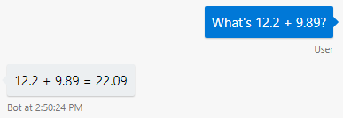

# Manage conversation flow with dialogs
[!INCLUDE [pre-release-label](../includes/pre-release-label.md)]


Managing conversation flow is an essential task in building bots. With the Bot Builder SDK, you can manage conversation flow using **dialogs**.

A dialog is like a function in a program. It is generally designed to perform a specific operation and it can be invoked as often as it is needed. You can chain multiple dialogs together to handle just about any conversation flow that you want your bot to handle. The **dialogs** library in the Bot Builder SDK includes built-in features such as **prompts** and **waterfalls** to help you manage conversation flow through dialogs. The prompts library provides various prompts you can use to ask users for different types of information. The waterfalls provide a way for you to combine multiple steps together in a sequence.

This article will show you how to create a dialogs object and add prompts and waterfall steps into a dialog set to manage both simple conversation flows and complex conversation flows. 

## Install the dialogs library

# [C#](#tab/csharp)
To use dialogs, install the `Microsoft.Bot.Builder.Dialogs` NuGet package for your project or solution.
Then reference the dialogs library in using statements in your code files. For example:

```csharp
using Microsoft.Bot.Builder.Dialogs;
```

# [JavaScript](#tab/js)
The `botbuilder-dialogs` library can be downloaded from NPM. To install the `botbuilder-dialogs` library, run the following NPM command:

```cmd
npm install --save botbuilder-dialogs
```

To use **dialogs** in your bot, include it in the bot code. For example:

**app.js**

```javascript
const botbuilder_dialogs = require('botbuilder-dialogs');
```
---

## Create a dialog stack

To use dialogs, you must first create a *dialog set*.

# [C#](#tab/csharp)

The `Microsoft.Bot.Builder.Dialogs` library provides a `DialogSet` class.
To a dialog set you can add named dialogs and sets of dialogs and then access them by name later.

```csharp
IDialog dialog = null;
// Initialize dialog.

DialogSet dialogs = new DialogSet();
dialogs.Add("dialog name", dialog);
```

# [JavaScript](#tab/js)

The `botbuilder-dialogs` library provides a `DialogSet` class.
The **DialogSet** class defines a **dialog stack** and gives you a simple interface to manage the stack.
The Bot Builder SDK implements the stack as an array.

To create a **DialogSet**, do the following:

```javascript
const dialogs = new botbuilder_dialogs.DialogSet();
```

The call above will create a **DialogSet** with a default **dialog stack** named `dialogStack`.
If you want to name your stack, you can pass it in as a parameter to **DialogSet()**. For example:

```javascript
const dialogs = new botbuilder_dialogs.DialogSet("myStack");
```
---

## Create a single-step dialog

The dialog library defines the following dialogs:
-   A **prompt** dialog where the dialog uses at least two functions, one to prompt the user for input and the other to process the input.
    You can string these together using the **waterfall** model.
-   A **waterfall** dialog defines a sequence of _waterfall steps_, which run in order.
    A waterfall dialog can have a single step, in which case it can be thought of as a simple, one-step dialog.

# [C#](#tab/csharp)

Values are passed into and returned from dialogs as `IDictionary<string,object>` property bags.

To create a simple dialog within a dialog set, use the `Add` method. The following adds a one-step waterfall named `addTwoNumbers`.

This step assumes that the dialog arguments getting passed in contain `first` and `second` properties that represent the numbers to be added.

Start with the EchoBot template. Then add code in your bot class to add the dialog in the constructor.
```csharp
public class EchoBot : IBot
{
    private DialogSet _dialogs;

    public EchoBot()
    {
        _dialogs = new DialogSet();
        _dialogs.Add("addTwoNumbers", new WaterfallStep[]
        {              
            async (dc, args, next) =>
            {
                double sum = (double)args["first"] + (double)args["second"];
                await dc.Context.SendActivity($"{args["first"]} + {args["second"]} = {sum}");
                await dc.End();
            }
        });
    }

    // The rest of the class definition is omitted here but would include OnTurn()
}

```

### Pass arguments to the dialog

To call the dialog from within your bot's `OnTurn` method, modify `OnTurn` to contain the following:
```cs
public async Task OnTurn(ITurnContext context)
{
    // This bot is only handling Messages
    if (context.Activity.Type == ActivityTypes.Message)
    {
        // Get the conversation state from the turn context
        var state = context.GetConversationState<EchoState>();

        // create a dialog context
        var dialogCtx = _dialogs.CreateContext(context, state);

        // Bump the turn count. 
        state.TurnCount++;

        await dialogCtx.Continue();
        if (!context.Responded)
        {
            // Call a helper function that identifies if the user says something 
            // like "2 + 3" or "1.25 + 3.28" and extract the numbers to add            
            if (TryParseAddingTwoNumbers(context.Activity.Text, out double first, out double second))
            { 
                var dialogArgs = new Dictionary<string, object>
                {
                    ["first"] = first,
                    ["second"] = second
                };                        
                await dialogCtx.Begin("addTwoNumbers", dialogArgs);
            }
            else
            {
                // Echo back to the user whatever they typed.
                await context.SendActivity($"Turn: {state.TurnCount}. You said '{context.Activity.Text}'");
            }
        }
    }
}
```

Add the helper function to the bot class. The helper function just uses a simple regex to detect if the user's message is a request to add 2 numbers.

```cs
// Recognizes if the message is a request to add 2 numbers, in the form: number + number, 
// where number may have optionally have a decimal point.: 1 + 1, 123.99 + 45, 0.4+7. 
// For the sake of simplicity it doesn't handle negative numbers or numbers like 1,000 that contain a comma.
// If you need more robust number recognition, try System.Recognizers.Text
public bool TryParseAddingTwoNumbers(string message, out double first, out double second)
{
    // captures a number with optional -/+ and optional decimal portion
    const string NUMBER_REGEXP = "([-+]?(?:[0-9]+(?:\\.[0-9]+)?|\\.[0-9]+))";
    // matches the plus sign with optional spaces before and after it
    const string PLUSSIGN_REGEXP = "(?:\\s*)\\+(?:\\s*)";
    const string ADD_TWO_NUMBERS_REGEXP = NUMBER_REGEXP + PLUSSIGN_REGEXP + NUMBER_REGEXP;
    var regex = new Regex(ADD_TWO_NUMBERS_REGEXP);
    var matches = regex.Matches(message);
    var succeeded = false;
    first = 0;
    second = 0;
    if (matches.Count == 0)
    {
        succeeded = false;
    }
    else
    {
        var matched = matches[0];
        if ( System.Double.TryParse(matched.Groups[1].Value, out first) 
            && System.Double.TryParse(matched.Groups[2].Value, out second))
        {
            succeeded = true;
        } 
    }
    return succeeded;
}
```

If you're using the EchoBot template, modify the `EchoState` class in **EchoState.cs** as follows:

```cs
/// <summary>
/// Class for storing conversation state.
/// This bot only stores the turn count in order to echo it to the user
/// </summary>
public class EchoState: Dictionary<string, object>
{
    private const string TurnCountKey = "TurnCount";
    public EchoState()
    {
        this[TurnCountKey] = 0;            
    }

    public int TurnCount
    {
        get { return (int)this[TurnCountKey]; }
        set { this[TurnCountKey] = value; }
    }
}
```

### Run the bot

Try running the bot in the Bot Framework Emulator, and say things like "what's 1+1?" to it.




# [JavaScript](#tab/js)

To create a dialog, use the **add** method. For example, the following code snippet defines a simple dialog named `addTwoNumbers` that belongs to the `dialogs` set:

```javascript
// Show the sum of two numbers.
dialogs.add('addTwoNumbers', async function (dc, numbers){
        var sum = numbers[0] + numbers[1];
        await dc.context.sendActivity(`${numbers[0]} + ${numbers[1]} = ${sum}`);
        await dc.end();
    }
);
```
---

Creating a dialog only adds the dialog definition to the set. The dialog is not run until it is pushed onto the stack by calling a _begin_ or _replace_ method.

The dialog name (for example, `addTwoNumbers`) must be unique within each dialog set. You can define as many dialogs as necessary within each set.

## Using dialogs to guide the user through steps

# [C#](#tab/csharp)

### Create a composite dialog

The following snippets are taken from the [Microsoft.Bot.Samples.Dialog.Prompts](https://github.com/Microsoft/botbuilder-dotnet/tree/master/samples/MIcrosoft.Bot.Samples.Dialog.Prompts) sample code in the botbuilder-dotnet repo.

In Startup.cs:
1.  Rename your bot to `DialogContainerBot`.
1.  Use a simple dictionary as a property bag for the conversation state for the bot.

```csharp
public void ConfigureServices(IServiceCollection services)
{
    services.AddBot<DialogContainerBot>(options =>
    {
        options.CredentialProvider = new ConfigurationCredentialProvider(Configuration);
        options.Middleware.Add(new ConversationState<Dictionary<string, object>>(new MemoryStorage()));
    });
}
```

Rename your `EchoBot` to `DialogContainerBot`.

In `DialogContainerBot.cs`, define a class for a profile dialog.

```csharp
public class ProfileControl : DialogContainer
{
    public ProfileControl()
        : base("fillProfile")
    {
        Dialogs.Add("fillProfile", 
            new WaterfallStep[]
            {
                async (dc, args, next) =>
                {
                    dc.ActiveDialog.State = new Dictionary<string, object>();
                    await dc.Prompt("textPrompt", "What's your name?");
                },
                async (dc, args, next) =>
                {
                    dc.ActiveDialog.State["name"] = args["Value"];
                    await dc.Prompt("textPrompt", "What's your phone number?");
                },
                async (dc, args, next) =>
                {
                    dc.ActiveDialog.State["phone"] = args["Value"];
                    await dc.End(dc.ActiveDialog.State);
                }
            }
        );
        Dialogs.Add("textPrompt", new Builder.Dialogs.TextPrompt());
    }
}
```

Then, within the bot definition, declare a field for the bot's main dialog and initialize it in the bot's constructor.
The bot's main dialog includes the profile dialog.

```csharp
private DialogSet _dialogs;

public DialogContainerBot()
{
    _dialogs = new DialogSet();

    _dialogs.Add("getProfile", new ProfileControl());
    _dialogs.Add("firstRun",
        new WaterfallStep[]
        {
            async (dc, args, next) =>
            {
                    await dc.Context.SendActivity("Welcome! We need to ask a few questions to get started.");
                    await dc.Begin("getProfile");
            },
            async (dc, args, next) =>
            {
                await dc.Context.SendActivity($"Thanks {args["name"]} I have your phone number as {args["phone"]}!");
                await dc.End();
            }
        }
    );
}
```

In the bot's `OnTurn` method:
-   Greet the user when the conversation starts.
-   Initialize and _continue_ the main dialog whenever we get a message from the user.

    If the dialog hasn't generated a response, assume that it completed earlier or hasn't started yet
    and _begin_ it, specifying the name of the dialog in the set to start with.

```csharp
public async Task OnTurn(ITurnContext turnContext)
{
    try
    {
        switch (turnContext.Activity.Type)
        {
            case ActivityTypes.ConversationUpdate:
                foreach (var newMember in turnContext.Activity.MembersAdded)
                {
                    if (newMember.Id != turnContext.Activity.Recipient.Id)
                    {
                        await turnContext.SendActivity("Hello and welcome to the Composite Control bot.");
                    }
                }
                break;

            case ActivityTypes.Message:
                var state = ConversationState<Dictionary<string, object>>.Get(turnContext);
                var dc = _dialogs.CreateContext(turnContext, state);

                await dc.Continue();

                if (!turnContext.Responded)
                {
                    await dc.Begin("firstRun");
                }

                break;
        }
    }
    catch (Exception e)
    {
        await turnContext.SendActivity($"Exception: {e.Message}");
    }
}

```

# [JavaScript](#tab/js)

### Create a dialog with waterfall steps

A conversation consists of a series of messages exchanged between user and bot. When the bot's objective is to lead the user through a series of steps, you can use a **waterfall** model to define the steps of the conversation.

A **waterfall** is a specific implementation of a dialog that is most commonly used to collect information from the user or guide the user through a series of tasks. The tasks are implemented as an array of functions where the result of the first function is passed as arguments into the next function, and so on. Each function typically represents one step in the overall process. At each step, the bot [prompts the user for input](bot-builder-prompts.md), waits for a response, and then passes the result to the next step.

For example, the following code sample defines three functions in an array that represents the three steps of a **waterfall**:

```javascript
// Greet user:
// Ask for the user name and then greet them by name.
// Ask them where they work.
dialogs.add('greetings',[
    async function (dc){
        await dc.prompt('textPrompt', 'What is your name?');
    },
    async function(dc, results){
        var userName = results;
        await dc.context.sendActivity(`Hi ${userName}!`);
        await dc.prompt('textPrompt', 'Where do you work?');
    },
    async function(dc, results){
        var workPlace = results;
        await dc.context.sendActivity(`${workPlace} is a fun place.`);
        await dc.end(); // Ends the dialog
    }
]);

dialogs.add('textPrompt', new botbuilder_dialogs.TextPrompt());
```

The signature for a **waterfall** step is as follows:

| Parameter | Description |
| ---- | ----- |
| `context` | The dialog context. |
| `args` | Optional, contains argument(s) passed into the step. |
| `next` | Optional, a method that allows you to proceed to the next step of the waterfall. You can provide an *args* argument when you call this mehtod, allowing you to pass argument(s) to the next step in the waterfall. |

Each step must call one of the following methods before returning: *next()*, *dialogs.prompt()*, *dialogs.end()*, *dialogs.begin()*, or *Promise.resolve()*; otherwise, the bot will be stuck in that step. That is, if a function does not return one of these methods then all user input will cause this step to be re-executed each time the user sent the bot a message.

When you reached the end of the waterfall, it is best practice to return with the `end()` method so that the dialog can be popped off the stack. See [End a dialog](#end-a-dialog) section for more information. Likewise, to proceed from one step to the next, the waterfall step must end with either a prompt or explicitly call the `next()` function to advance the waterfall. 

### Start a dialog

To start a dialog, pass the *dialogId* you want to start into the `begin()`, `prompt()`, or `replace()` methods. The **begin** method will push the dialog onto the top of the stack while the **replace** method will pop the current dialog off the stack and pushes the replacing dialog onto the stack.

To start a dialog without arguments:

```javascript
// Start the 'greetings' dialog.
await dc.begin('greetings');
```

To start a dialog with arguments:

```javascript
// Start the 'greetings' dialog with the 'userName' passed in. 
await dc.begin('greetings', userName);
```

To start a **prompt** dialog:

```javascript
// Start a 'choicePrompt' dialog with choices passed in as an array of colors to choose from.
await dc.prompt('choicePrompt', `choice: select a color`, ['red', 'green', 'blue']);
```

Depending on the type of prompt you are starting, the prompt's argument signature may be different. The **DialogSet.prompt** method is a helper method. This method takes in arguments and constructs the appropriate options for the prompt; then, it calls the **begin** method to start the prompt dialog.

To replace a dialog on the stack:

```javascript
// End the current dialog and start the 'mainMenu' dialog.
await dc.replace('mainMenu'); // Can optionally passed in an 'args' as the second argument.
```

More details on how to use the **replace()** method in the [Repeat a dialog](#repeat-a-dialog) and [Dialog loops](#dialog-loops) sections below.

## End a dialog

End a dialog by popping it off the stack and returns an optional result to the parent dialog. The parent dialog will have its **Dialog.resume()** method invoked with any returned result.

It is best practice to explicitly call the `end()` method at the end of the dialog; however, it is not required because the dialog will automatically be popped off the stack for you when you reach the end of the waterfall.

To end a dialog:

```javascript
// End the current dialog by popping it off the stack
await dc.end();
```

To end a dialog with optional argument(s) passed to the parent dialog:

```javascript
// End the current dialog and pass a result to the parent dialog
await dc.end(result);
```

Alternatively, you may also end the dialog by returning a resolved promise:

```javascript
await Promise.resolve();
```

The call to `Promise.resolve()` will result in the dialog ending and popping off the stack. However, this method does not call the parent dialog to resume execution. After the call to `Promise.resolve()`, execution stops, and the bot will resume where the parent dialog left off when the user sends the bot a message. This may not be the ideal user experience to end a dialog. Consider ending a dialog with either `end()` or `replace()` so your bot can continue interacting with the user.

### Clear the dialog stack

If you want to pop all dialogs off the stack, you can clear the dialog stack by calling the `dc.endAll()` method.

```javascript
// Pop all dialogs from the current stack.
await dc.endAll();
```

### Repeat a dialog

To repeat a dialog, use the `dialogs.replace()` method.

```javascript
// End the current dialog and start the 'mainMenu' dialog.
await dc.replace('mainMenu'); 
```

If you want to show the main menu by default, you can create a `mainMenu` dialog with the following steps:

```javascript
// Display a menu and ask user to choose a menu item. Direct user to the item selected.
dialogs.add('mainMenu', [
    async function(dc){
        await dc.context.sendActivity("Welcome to Contoso Hotel and Resort.");
        await dc.prompt('choicePrompt', "How may we serve you today?", ['Order Dinner', 'Reserve a table']);
    },
    async function(dc, result){
        if(result.value.match(/order dinner/ig)){
            await dc.begin('orderDinner');
        }
        else if(result.value.match(/reserve a table/ig)){
            await dc.begin('reserveTable');
        }
        else {
            // Repeat the menu
            await dc.replace('mainMenu');
        }
    },
    async function(dc, result){
        // Start over
        await dc.endAll().begin('mainMenu');
    }
]);

dialogs.add('choicePrompt', new botbuilder_dialogs.ChoicePrompt());
```

This dialog uses a `ChoicePrompt` to display the menu and waits for the user to choose an option. When the user chooses either `Order Dinner` or `Reserve a table`, it starts the dialog for the appropriate choice and when that task is done, instead of just ending the dialog in the last step, this dialog repeats itself.

### Dialog loops

Another way to use the `replace()` method is by emulating loops. Take this scenario for example. If you want to allow the user to add multiple menu items to a cart, you can loop the menu choices until the user is done ordering.

```javascript
// Order dinner:
// Help user order dinner from a menu

var dinnerMenu = {
    choices: ["Potato Salad - $5.99", "Tuna Sandwich - $6.89", "Clam Chowder - $4.50", 
        "More info", "Process order", "Cancel", "Help"],
    "Potato Salad - $5.99": {
        Description: "Potato Salad",
        Price: 5.99
    },
    "Tuna Sandwich - $6.89": {
        Description: "Tuna Sandwich",
        Price: 6.89
    },
    "Clam Chowder - $4.50": {
        Description: "Clam Chowder",
        Price: 4.50
    }

}

// The order cart
var orderCart = {
    orders: [],
    total: 0,
    clear: function(dc) {
        this.orders = [];
        this.total = 0;
        dc.context.activity.conversation.orderCart = null;
    }
};

dialogs.add('orderDinner', [
    async function (dc){
        await dc.context.sendActivity("Welcome to our Dinner order service.");
        orderCart.clear(dc); // Clears the cart.

        await dc.begin('orderPrompt'); // Prompt for orders
    },
    async function (dc, result) {
        if(result == "Cancel"){
            await dc.end();
        }
        else { 
            await dc.prompt('numberPrompt', "What is your room number?");
        }
    },
    async function(dc, result){
        await dc.context.sendActivity(`Thank you. Your order will be delivered to room ${result} within 45 minutes.`);
        await dc.end();
    }
]);

// Helper dialog to repeatedly prompt user for orders
dialogs.add('orderPrompt', [
    async function(dc){
        await dc.prompt('choicePrompt', "What would you like?", dinnerMenu.choices);
    },
    async function(dc, choice){
        if(choice.value.match(/process order/ig)){
            if(orderCart.orders.length > 0) {
                // Process the order
                // ...
                await dc.end();
            }
            else {
                await dc.context.sendActivity("Your cart was empty. Please add at least one item to the cart.");
                // Ask again
                await dc.replace('orderPrompt');
            }
        }
        else if(choice.value.match(/cancel/ig)){
            orderCart.clear(context);
            await dc.context.sendActivity("Your order has been canceled.");
            await dc.end(choice.value);
        }
        else if(choice.value.match(/more info/ig)){
            var msg = "More info: <br/>Potato Salad: contains 330 calaries per serving. <br/>"
                + "Tuna Sandwich: contains 700 calaries per serving. <br/>" 
                + "Clam Chowder: contains 650 calaries per serving."
            await dc.context.sendActivity(msg);
            
            // Ask again
            await dc.replace('orderPrompt');
        }
        else if(choice.value.match(/help/ig)){
            var msg = `Help: <br/>To make an order, add as many items to your cart as you like then choose the "Process order" option to check out.`
            await dc.context.sendActivity(msg);
            
            // Ask again
            await dc.replace('orderPrompt');
        }
        else {
            var choice = dinnerMenu[choice.value];

            // Only proceed if user chooses an item from the menu
            if(!choice){
                await dc.context.sendActivity("Sorry, that is not a valid item. Please pick one from the menu.");
                
                // Ask again
                await dc.replace('orderPrompt');
            }
            else {
                // Add the item to cart
                orderCart.orders.push(choice);
                orderCart.total += dinnerMenu[choice.value].Price;

                await dc.context.sendActivity(`Added to cart: ${choice.value}. <br/>Current total: $${orderCart.total}`);

                // Ask again
                await dc.replace('orderPrompt');
            }
        }
    }
]);

// Define prompts
// Generic prompts
dialogs.add('textPrompt', new botbuilder_dialogs.TextPrompt());
dialogs.add('numberPrompt', new botbuilder_dialogs.NumberPrompt());
dialogs.add('dateTimePrompt', new botbuilder_dialogs.DatetimePrompt());
dialogs.add('choicePrompt', new botbuilder_dialogs.ChoicePrompt());

```

The sample code above shows that the main `orderDinner` dialog uses a helper dialog named `orderPrompt` to handle user choices. The `orderPrompt` dialog displays the menu, asks the user to choose an item, add the item to cart and prompts again. This allows the user to add multiple items to their order. The dialog loops until the user chooses `Process order` or `Cancel`. At which point, execution is handed back to the parent dialog (e.g.: `orderDinner`). The `orderDinner` dialog does some last minute house keeping if the user wants to process the order; otherwise, it ends and returns execution back to its parent dialog (e.g.: `mainMenu`). The `mainMenu` dialog in turn continues executing the last step which is to simply redisplay the main menu choices.

---

## Next steps

Now that you learn how to use **dialogs**, **prompts**, and **waterfalls** to manage conversation flow, let's take a look at how we can break our dialogs into modular tasks instead of lumping them all together in the main bot logic's `dialogs` object.

> [!div class="nextstepaction"]
> [Create modular bot logic with Composite Control](bot-builder-compositcontrol.md)
