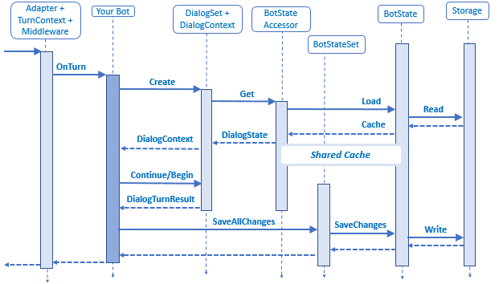

<!--
# Dialog state

Dialogs are an approach to implementing multi-turn conversation logic, and as such, they are an example of a feature in the SDK that relies on persisted state across. 

A Dialog based bot typically holds a DialogSet collection as a member variable in its bot implementation. The DialogSet is created with a handle to an object called an Accessor. 

The Accessor is the central concept in the SDK state model. An Accessor implements the IStatePropertyAccessor interface, which means it must provide implementations for the Get, Set and Delete methods. To create an Accessor, you provide it a property name. 

The code that uses the Accessor can call its Get, Set and Delete methods knowing these will refer to a property of that name. When a higher-level component requires some state persistence, it should use the Accessor. 
This way different scenarios can bring their implementations of state storage, but still, make use of the same higher-level code. For example, the Dialogs make use of the Accessor, and that is their only way of accessing the persisted state.

When the bot’s OnTurn is called the bot will initialize the Dialog subsystem by calling CreateContext on the DialogSet. The creation of a DialogContext requires state, so the DialogSet uses its Accessor to Get the appropriate dialog state JSON. The SDK provides an implementation of the Accessor in the shape of the BotState class. Applications that intend to leverage the state implementation can subclass BotState and so inherit an implementation of the Accessor. There are two subclasses of BotState included in the SDK:

- UserState
- ConversationState

UserState and ConversationState use keys for underlying storage. The key is passed down to the physical storage. Logically, the key acts as a namespace for the property named by the Accessor. The BotState implementation internally uses the inbound Activity on the TurnContext to dynamically generate the storage key it uses.

- The UserState creates a key using the Channel Id and From Id. For example, _{Activity.ChannelId}/conversations/{Activity.From.Id}#DialogState_
- The ConversationState creates a key using the Channel Id and the Conversation Id. For example, _{Activity.ChannelId}/users/{Activity.Conversation.Id}#YourPropertyName_

An application needs to provide an Accessor, and the binding to the appropriate dynamically created storage key and property name all happen behind the scenes. The BotState’s implementation of the Accessor includes some optimizations: 

- The first optimization is a cached and lazy load. A Load on the actual storage implementation is deferred until the first Get to the Accessor is called, and the result of that Load is held in a cache. A reference to this cache is added to the TurnContext, using a key provided by the corresponding BotState. So the cache corresponding to the UserState will be held in a field called “UserState” and the cache corresponding to the ConversationState is held in a field called “ConversationState.” Calls to the various Accessor objects are handed the TurnContext and so can go and fetch the appropriate cache.

- The second optimization is that the BotState class contains logic to determine whether any changes have been made on the state. Only if changes have been made does it execute an actual Save operation on the underlying storage.

- The third optimization within the BotState implementation is in a class called BotStateSet. The BotStateSet is a collection of BotState objects that delegates a call on its SaveChanges method to every member of the collection in parallel.

It is significant that the SaveChanges call on BotState is not part of the IStatePropertyAccessor interface. The reason is that SaveChanges is a particular optimization of the BotState implementation rather than a core aspect of the model. Specifically, code such as the Dialogs know nothing of BotState, let alone SaveChanges. In fact, the code of Dialogs is only coupled to the Accessor. The intention is that the SaveChanges method should be called outside of the Dialog system after its execution has completed. For example, as shown in the diagram, it can be called from within the bot’s OnTurn method.

It is important to note that the BotState implementation brings with it some specific semantics. Notably, it supports a “last write wins” behavior whereby the last write will stamp over the previously written state. This may work just fine for many applications but has implications, particularly in scale-out scenarios where there may be some level of concurrency in play. If this is a concern, the answer is to implement your own Accessor and pass that into the Dialog. There are many alternative approaches, for example, a solution might choose to leverage the eTag condition popular on cloud storage services such as Azure Storage. In this case, the solution would probably be implementing other important parts. For example, it might be buffering outbound Activities and only sending them following a successful Save operation. The important point to note is that this behavior is not the behavior of the BotState implementation but something an application would provide and plug in at the Accessor level.

The BotState implementation itself has a pluggable storage model. This follows a simple Load/Save pattern, and the SDK provides two alternative implementations for production. One for Azure Storage and the other for CosmosDB, and an in-memory implementation for testing purposes. The important thing to note here, however, is that the semantics of “last write wins” are in dictated by the BotState implementation.

## Handling state in middleware
The diagram above shows a call to SaveAllChanges that happens at the end of bot’s OnTurn. Here is that same diagram with focus on the call.

The problem with this approach is that any state updates made from some custom middleware that happens after the bot’s OnTurn method has returned will not be saved to durable storage. The solution is to move the call to SaveAllChanges to after the custom middleware has completed by adding AutoSaveChangesMiddleware to the end of the middleware stack. The execution is shown below.

## Additional resources
For more details, refer to the Bot Framework SDK on GitHub [[C#](https://github.com/Microsoft/BotBuilder-dotnet) | [JavaScript](https://github.com/Microsoft/BotBuilder-js)].
-->
