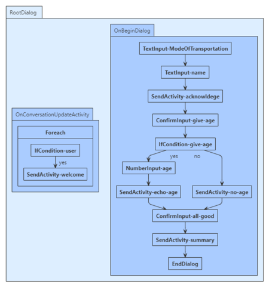
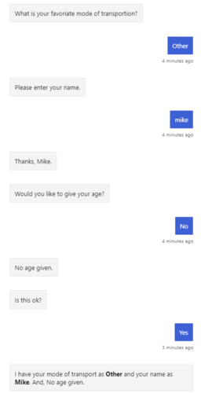

# Create a bot using adaptive dialogs  

[!INCLUDE[applies-to](../includes/applies-to.md)]

This article shows how to use **Adaptive dialog** and **Language Generation** features to achieve the same functionality obtained with the waterfall model.

## Prerequisites

- Knowledge of [bot basics][concept-basics], [managing state][concept-state], and the [dialogs library][concept-dialogs].
- A copy of the **multi turn prompt** sample in either [**C#**][cs-sample] or [**JavaScript** preview][js-sample].

### Preliminary steps to add an adaptive dialog to a bot

You must follow the steps described below to add an adaptive dialog to a bot.

1. Update all Bot Builder NuGet packages to version 4.9.x.
1. Add the `Microsoft.Bot.Builder.Dialogs.Adaptive` package to your bot project.
1. Update the the bot adapter to add storage and the user and conversation state objects to every turn context.
1. Use a dialog manager in the bot code to start or continue the root dialog each turn.

## About the sample

This sample uses an adaptive dialog, a few prompts, and a component dialog to create a simple interaction that asks the user a series of questions. The questions are created using LG templates:

- For C#, defined in [RootDialog.lg](https://github.com/microsoft/BotBuilder-Samples/blob/vishwac/r9/js/experimental/adaptive-dialog/csharp_dotnetcore/01.multi-turn-prompt/Dialogs/RootDialog.lg)
- For JavaScript, defined in [userProfileDialog.lg](https://github.com/microsoft/BotBuilder-Samples/blob/vishwac/r9/js/experimental/adaptive-dialog/javascript_nodejs/01.multi-turn-prompt/dialogs/userProfileDialog.lg) (JavaScript).

The code uses a dialog to cycle through these steps:

> [!div class="mx-tdCol2BreakAll"]
> | Steps        | LG template  |
> |:-------------|:-------------|
> | Ask the user for their mode of transportation | `ModeOfTransportPrompt` |
> | Ask the user for their name | `AskForName` |
> | Ask the user if they want to provide their age | `AgeConfirmPrompt` |
> | If they answered yes, asks for their age | `AskForAge` prompt with validation to only accept ages greater than 0 and less than 150 |
> | Asks if the collected information is "ok" | `ConfirmPrompt` prompt |

Finally, if they answered yes, display the collected information; otherwise, tell the user that their information will not be kept.

## Create the main dialog

# [C#](#tab/csharp)

To use dialogs, install the **Microsoft.Bot.Builder.Dialogs.Adaptive** NuGet package.

The bot interacts with the user via the `RootDialog`. When the bot's `RootDialog` is created, the `AdaptiveDialog` is set as the main dialog. The bot then uses the `DialogManager.OnTurnAync` to run the dialog.



**Dialogs/RootDialog.cs**

The code begins by instantiating the `RootDialog` class which in turns creates an instance of the `AdaptiveDialog`. At this time, the following `WelcomeUserSteps` and `OnBeginDialogSteps` are added to the dialog.
The created dialog is then added to the `DialogSet` and the name is saved in the dialog state. Finally, the name of the initial dialog to run is assigned to `InitialDialogId`. Notice the `paths` definition referencing the `RootDialog.lg` file that contains the LG templates used in the creation of the adaptive dialog.

[!code-csharp[RootDialog snippet](~/../botbuilder-samples/samples/csharp_dotnetcore/adaptive-dialog/01.multi-turn-prompt/Dialogs/RootDialog.cs?range=21-52&highlight=6-25)]

The root dialog is a component dialog:

[!code-csharp[RootDialog snippet](~/../botbuilder-samples/samples/csharp_dotnetcore/adaptive-dialog/01.multi-turn-prompt/Dialogs/RootDialog.cs?range=21&highlight=1)]


Notice also:

- The LG template generator is added to the adaptive dialog, to enable the use of the **LG templates**.
- The two triggers are added, with their actions being provided by the two helper methods.

In `WelcomeUserSteps` method provides the actions to perform when the trigger fires. The `Foreach` actions iterates through the `membersAdded` list to greets the user added to the conversation.

> [!NOTE]
> Within the context of adaptive dialogs and triggers, all dialogs are valid actions, and the action types (`Foreach`, `IfCondition`, `SendActivity`) are all dialogs.\
> Some channels send two conversation update events: one for the bot added to the conversation and another for the user.
> The code filters cases where the bot itself is the recipient of the message. For more information, see [Categorized activities by channel](https://docs.microsoft.com/azure/bot-service/bot-service-channels-reference?view=azure-bot-service-4.0#welcome).


[!code-csharp[RootDialog snippet](~/../botbuilder-samples/samples/csharp_dotnetcore/adaptive-dialog/01.multi-turn-prompt/Dialogs/RootDialog.cs?range=54-76&highlight=13-20)]


The `OnBeginDialogSteps` implements the **steps** that the dialog uses. It defines the prompts using the LG templates from the `RootDialog.lg` file. The code below shows how the `Name` prompt is created.

The `IfCondition` action uses an adaptive expression to either ask the user for their age or send an acknowledgement message, depending on their response to the previous question. Again it uses LG templates to format the prompts and messages.

```csharp
private static List<Dialog> OnBeginDialogSteps()
{
    return new List<Dialog>()
    {
        // Ask for user's age and set it in user.userProfile scope.
        new TextInput()
        {
            Prompt = new ActivityTemplate("${ModeOfTransportPrompt()}"),
            // Set the output of the text input to this property in memory.
            Property = "user.userProfile.Transport"
        },
        new TextInput()
        {
            Prompt = new ActivityTemplate("${AskForName()}"),
            Property = "user.userProfile.Name"
        },
        // SendActivity supports full language generation resolution.
        // See here to learn more about language generation
        // https://github.com/Microsoft/BotBuilder-Samples/tree/master/experimental/language-generation
        new SendActivity("${AckName()}"),
        new ConfirmInput()
        {
            Prompt = new ActivityTemplate("${AgeConfirmPrompt()}"),
            Property = "turn.ageConfirmation"
        },
        new IfCondition()
        {
            // All conditions are expressed using the common expression language.
            // See https://github.com/Microsoft/BotBuilder-Samples/tree/master/experimental/common-expression-language to learn more
            Condition = "turn.ageConfirmation == true",
            Actions = new List<Dialog>()
            {
                 new NumberInput()
                 {
                     Prompt = new ActivityTemplate("${AskForAge()}"),
                     Property = "user.userProfile.Age",
                     // Add validations
                     Validations = new List<BoolExpression>()
                     {
                         // Age must be greater than or equal 1
                         "int(this.value) >= 1",
                         // Age must be less than 150
                         "int(this.value) < 150"
                     },
                     InvalidPrompt = new ActivityTemplate("${AskForAge.invalid()}"),
                     UnrecognizedPrompt = new ActivityTemplate("${AskForAge.unRecognized()}")
                 },
                 new SendActivity("${UserAgeReadBack()}")
            },
            ElseActions = new List<Dialog>()
            {
                new SendActivity("${NoName()}")
            }
        },
        new ConfirmInput()
        {
            Prompt = new ActivityTemplate("${ConfirmPrompt()}"),
            Property = "turn.finalConfirmation"
        },
        // Use LG template to come back with the final read out.
        // This LG template is a great example of what logic can be wrapped up in LG sub-system.
        new SendActivity("${FinalUserProfileReadOut()}"), // examines turn.finalConfirmation
        new EndDialog()
    };
}

```

<!--
[!code-csharp[RootDialog snippet](~/../botbuilder-samples-adaptive/experimental/adaptive-dialog/csharp_dotnetcore/01.multi-turn-prompt/Dialogs/RootDialog.cs?range=77-141&highlight=12-16,31-58)]
-->

# [JavaScript](#tab/javascript)

To use dialogs, your project needs to install the **botbuilder-dialogs-adaptive** npm package.
The sample demonstrates how to use **Adaptive dialog** and **Language Generation** features to achieve the same waterfall model functionality.

At start up, the main dialog `UserProfileDialog` is initialized. The bot uses it to interact with the user.

**dialogs/userProfileDialog.js**

The code begins by instantiating the `UserProfileDialog ` class which in turns
creates an instance of the `AdaptiveDialog` root dialog. At this time, the dialog steps are created using the **Language Generation** templates.

The `OnBeginDialog` implements the **steps** that the dialog uses. It defines the prompts using the LG templates from the `userProfileDialog.lg` file.

```javascript
constructor() {
    super('userProfileDialog');
    const lgFile = Templates.parseFile(path.join(__dirname, 'userProfileDialog.lg'));
    const userProfileAdaptiveDialog = new AdaptiveDialog(ROOT_DIALOG).configure({
        generator: new TemplateEngineLanguageGenerator(lgFile),
        triggers: [
            new OnBeginDialog(
    ...............

    });
    this.addDialog(userProfileAdaptiveDialog);
    this.initialDialogId = ROOT_DIALOG;
}
```

<!--
[!code-javascript[userProfileDialog constructor](~/../botbuilder-samples-adaptive/experimental/adaptive-dialog/javascript_nodejs/01.multi-turn-prompt/dialogs/userProfileDialog.js?range=11-17)]

[!code-javascript[userProfileDialog constructor](~/../botbuilder-samples-adaptive/experimental/adaptive-dialog/javascript_nodejs/01.multi-turn-prompt/dialogs/userProfileDialog.js?range=92-97)]
-->

---

## Register the adaptive dialog

To allow the use of the adaptive dialog, the start up code must register the dialog as shown in the lines highlighted below, along with the other services.

# [C#](#tab/csharp)

**Startup.cs**

You register the adaptive dialogs in the `Startup` class, along with the other services.

```csharp
public void ConfigureServices(IServiceCollection services)
{
    services.AddMvc().SetCompatibilityVersion(CompatibilityVersion.Version_2_1);

    // Register dialog. This sets up memory paths for adaptive.
    ComponentRegistration.Add(new DialogsComponentRegistration());

    // Register adaptive component
    ComponentRegistration.Add(new AdaptiveComponentRegistration());

    // Register to use language generation.
    ComponentRegistration.Add(new LanguageGenerationComponentRegistration());

    // Create the credential provider to be used with the Bot Framework Adapter.
    services.AddSingleton<ICredentialProvider, ConfigurationCredentialProvider>();

    // Create the Bot Framework Adapter with error handling enabled.
    services.AddSingleton<IBotFrameworkHttpAdapter, AdapterWithErrorHandler>();

    // Create the storage we'll be using for User and Conversation state. (Memory is great for testing purposes.)
    services.AddSingleton<IStorage, MemoryStorage>();

    // Create the User state. (Used in this bot's Dialog implementation.)
    services.AddSingleton<UserState>();

    // Create the Conversation state. (Used by the Dialog system itself.)
    services.AddSingleton<ConversationState>();

    // The Dialog that will be run by the bot.
    services.AddSingleton<RootDialog>();

    // Create the bot. the ASP Controller is expecting an IBot.
    services.AddSingleton<IBot, DialogBot<RootDialog>>();
}
```

<!--

[!code-csharp[ConfigureServices](~/../botbuilder-samples-adaptive/experimental/adaptive-dialog/csharp_dotnetcore/01.multi-turn-prompt/Startup.cs?range=21-54&highlight=5-18)]

-->

# [JavaScript](#tab/javascript)


**index.js**

The code creates the component dialog and services in `index.js`. In particular:

- The root component dialog.
- Basic services for a bot: a credential provider, an adapter, and the bot implementation.
- Services for managing state: storage, user state, and conversation state.

Import the required bot services and the component dialog class `userProfileDialog`.

```javascript
// Import required bot services.
// See https://aka.ms/bot-services to learn more about the different parts of a bot.
const { BotFrameworkAdapter, ConversationState, MemoryStorage, UserState } = require('botbuilder');

// Import our custom bot class that provides a turn handling function.
const { DialogBot } = require('./bots/dialogBot');
const { UserProfileDialog } = require('./dialogs/userProfileDialog');
```

Create conversation state with in-memory storage provider.

```javascript

// A bot requires a state storage system to persist the dialog and user state between messages.
const memoryStorage = new MemoryStorage();

// Create conversation state with in-memory storage provider.
const conversationState = new ConversationState(memoryStorage);
const userState = new UserState(memoryStorage);
```

Create the main dialog and the bot.

```javascript

const dialog = new UserProfileDialog();
const bot = new DialogBot(conversationState, userState, dialog);
```

Listen for incoming requests and route the message to the bot's main handler.

```javascript

// Listen for incoming requests.
server.post('/api/messages', (req, res) => {
    adapter.processActivity(req, res, async (context) => {
        // Route the message to the bot's main handler.
        await bot.run(context);
    });
```

<!--
[!code-javascript[index-import](~/../botbuilder-samples-adaptive/experimental/adaptive-dialog/javascript_nodejs/01.multi-turn-prompt/index.js?range=7-13)]

Create conversation state with in-memory storage provider.

[!code-javascript[index-storage](~/../botbuilder-samples-adaptive/experimental/adaptive-dialog/javascript_nodejs/01.multi-turn-prompt/index.js?range=49-54)]

Create the main dialog and the bot.

[!code-javascript[index-storage](~/../botbuilder-samples-adaptive/experimental/adaptive-dialog/javascript_nodejs/01.multi-turn-prompt/index.js?range=57-58)]

Listen for incoming requests and route the message to the bot's main handler.

[!code-javascript[index-run](~/../botbuilder-samples-adaptive/experimental/adaptive-dialog/javascript_nodejs/01.multi-turn-prompt/index.js?range=68-73)]
-->

---

## Run the dialog

# [C#](#tab/csharp)

**Bots/Dialogs.cs**

The `DialogManager.OnTurnAsync` runs the adaptive dialog with activities.
The implementation shown can run any type of `Dialog`. The `ConversationState` is used by the Dialog system. The `UserState` isn't, however, it might have been used in a dialog implementation. The `DialogManager.OnTurnAsync` method takes care of saving the state.

```csharp
public class DialogBot<T> : ActivityHandler where T : Dialog
    {
        protected readonly BotState ConversationState;
        protected readonly Dialog Dialog;
        protected readonly ILogger Logger;
        protected readonly BotState UserState;
        private DialogManager DialogManager;

        public DialogBot(ConversationState conversationState, UserState userState, T dialog, ILogger<DialogBot<T>> logger)
        {
            ConversationState = conversationState;
            UserState = userState;
            Dialog = dialog;
            Logger = logger;
            DialogManager = new DialogManager(Dialog);
        }

        public override async Task OnTurnAsync(ITurnContext turnContext, CancellationToken cancellationToken = default(CancellationToken))
        {
            Logger.LogInformation("Running dialog with Activity.");
            await DialogManager.OnTurnAsync(turnContext, cancellationToken: cancellationToken).ConfigureAwait(false);
        }
    }
}

```

<!--
[!code-csharp[ConfigureServices](~/../botbuilder-samples-adaptive/experimental/adaptive-dialog/csharp_dotnetcore/01.multi-turn-prompt/Bots/DialogBot.cs?range=18-41&highlight=21)]
-->

# [JavaScript](#tab/javascript)

**bots/dialogBot.js**

The `DialogBot` extends the `ActivityHandler` and runs the adaptive dialog with activities.
The state information contained by the`conversationState` and the `userState` are stored for the `dialogManager` to use.

```javascript
class DialogBot extends ActivityHandler {
    /**
     *
     * @param {Dialog} dialog
     */
    constructor(conversationState, userState, dialog) {
        super();
        if (!conversationState) throw new Error('[DialogBot]: Missing parameter. conversationState is required');
        if (!userState) throw new Error('[DialogBot]: Missing parameter. userState is required');
        if (!dialog) throw new Error('[DialogBot]: Missing parameter. dialog is required');

        this.dialogManager = new DialogManager(dialog);
        this.dialogManager.conversationState = conversationState;
        this.dialogManager.userState = userState;

        this.onTurn(async (context, next) => {
            console.log('Running dialog with activity.');

            await this.dialogManager.onTurn(context);

            await next();
        });
    }
}
```

<!--
[!code-javascript[DialogBot](~/../botbuilder-samples-adaptive/experimental/adaptive-dialog/javascript_nodejs/01.multi-turn-prompt/bots/dialogBot.js?range=7-30&highlight=13-14,19-21)]
-->

---

> [!NOTE]
> Memory storage is used for testing purposes only and is not intended for production use.
> Be sure to use a persistent type of storage for a production bot.

## To test the bot

1. If you have not done so already, install the [Bot Framework Emulator](https://aka.ms/bot-framework-emulator-readme).
1. Run the sample locally on your machine.
1. Start the Emulator, connect to your bot, and send messages as shown below.



<!--
## Next steps

> [!div class="nextstepaction"]
> [Create a bot using adaptive, component, waterfall, and custom dialogs](bot-builder-mixed-dialogs.md)
-->

<!-- Footnote-style links -->

[concept-basics]: bot-builder-basics.md
[concept-state]: bot-builder-concept-state.md
[concept-dialogs]: bot-builder-concept-dialog.md

[prompting]: bot-builder-prompts.md
[component-dialogs]: bot-builder-compositcontrol.md

[cs-sample]: https://github.com/microsoft/BotBuilder-Samples/tree/master/samples/csharp_dotnetcore/adaptive-dialog/01.multi-turn-prompt
[js-sample]: https://github.com/microsoft/BotBuilder-Samples/tree/master/experimental/adaptive-dialog/javascript_nodejs/01.multi-turn-prompt