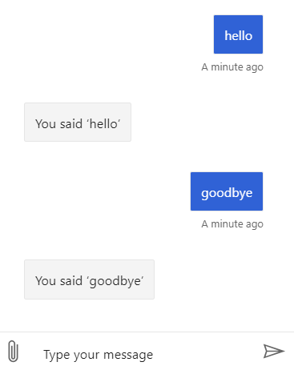

# Create a bot using declarative adaptive dialogs  

[!INCLUDE[applies-to](../includes/applies-to.md)]

This article shows how to create a bot that incorporates **Adaptive dialog** using the declarative approach.

## Prerequisites

- Knowledge of [bot basics][concept-basics], [managing state][concept-state], and the [dialogs library][concept-dialogs].
- Knowledge of [adaptive dialogs][concept-adaptive] and [declarative dialogs][concept-declarative].
- A copy of the declarative **EchoBot** sample in either [**C#**][cs-sample] or [**JavaScript** preview][js-sample].

### Preliminary steps to add a declarative adaptive dialog to a bot

You must follow these steps to load and use a declarative dialog in a bot.

1. Update all Bot Builder NuGet packages to version 4.9.x.
1. Create the declarative files.
1. Add the required packages and references to your bot project.
1. Register the Bot Framework's declarative components for adaptive dialogs.
1. Use a dialog manager in the bot code to start or continue the root dialog each turn.
1. Create a resource explorer in the bot code to load the declarative resources.

<!--
1. Update all Bot Builder NuGet packages to version 4.9.x.
1. Add the `Microsoft.Bot.Builder.Dialogs.Adaptive` package to your bot project.
1. Add the `Microsoft.Bot.Builder.Dialogs.Declarative` package to your bot project.
1. Create the declarative files.
1. Add references to declarative components.
1. Register the bot frameworks declarative components for adaptive dialogs.
1. Use a dialog manager in the bot code to start or continue the root dialog each turn.
1. Create a resource explorer in the bot code to load the declarative resources.
-->

## About the sample

This sample, the Bot Framework Adaptive Dialog declarative Echo bot, demonstrates using a declaratively-defined [adaptive dialog][concept-adaptive] that accepts input from the user and echoes it back.

## Create the declarative files

Declarative dialog files are JSON files that declare the elements of a dialog. They typically have an extension of `.dialog`. The **EchoBot** sample only contains one adaptive dialog with a trigger to handle the `UnknownIntent` event, which when it fires it sends a message to the user that echos what they said: _"You said '${turn.activity.text}'"_.

> [!TIP]
> Declarative files are JSON files and are language-agnostic, meaning that they are the same regardless which language you use to create your bot.

The declarative file ([C#][main.dialog] | [JavaScript][echo.dialog]) for the **EchoBot** sample:

```json
{
  "$schema": "../app.schema",
  "$kind": "Microsoft.AdaptiveDialog",
  "triggers": [
    {
      "$kind": "Microsoft.OnUnknownIntent",
      "actions": [
        {
          "$kind": "Microsoft.SendActivity",
          "activity":  "You said '${turn.activity.text}'"
        }
      ]
    }
  ]
}
```

> [!NOTE]
> It is generally a good practice to keep your declarative files in a sub-folder named `dialogs`, however they can be anywhere. You load them into your bot using the `ResourceExplorer.GetResources` method.

## Add references to declarative components

# [C#](#tab/csharp)

Declarative only works with adaptive dialogs. To enable adaptive in your bot install the **Microsoft.Bot.Builder.Dialogs.Adaptive** NuGet package, then create the following references in your code in **Startup.cs**:

[!code-CSharp[Startup.cs-Using-Statements](~/../botbuilder-samples/samples/csharp_dotnetcore/adaptive-dialog/20.EchoBot-declarative/Startup.cs?range=4-10&highlight=7-9)]

Also in **EchoBot.cs**:

[!code-CSharp[EchoBot.cs-Using-Statements](~/../botbuilder-samples/samples/csharp_dotnetcore/adaptive-dialog/20.EchoBot-declarative/echoBot.cs?range=4-10&highlight=6-7)]

<!--
```CS
using Microsoft.Bot.Builder.Dialogs.Adaptive;
using Microsoft.Bot.Builder.Dialogs.Declarative.Resources;
```
-->

# [JavaScript](#tab/javascript)

Declarative only works with adaptive dialogs. To use adaptive dialogs, your project needs to install the **botbuilder-dialogs-adaptive** npm package. Once installed you can enable declarative by creating the following references in your code in **index.js**:

<!--[!code-JavaScript[AdaptiveDialogComponentRegistration](~/../botbuilder-samples/blob/master/experimental/adaptive-dialog/javascript_nodejs/20.echo-bot-declarative/index.js?range=4-10&highlight=4-5)]-->

```JavaScript
const { ResourceExplorer } = require('botbuilder-dialogs-declarative');
const { AdaptiveDialogComponentRegistration, LanguageGeneratorMiddleWare } = require('botbuilder-dialogs-adaptive');
const { DialogManager } = require('botbuilder-dialogs');
```

> [!TIP]
> `require()` is not part of the standard JavaScript API. But in `Node.js`, it's a built-in function used to load modules. You can find more information in the [Modules][nodejs-modules] section of the Node.js docs.

---

## Register declarative components for adaptive dialogs

# [C#](#tab/csharp)

[!code-CSharp[ConfigureServices](~/../botbuilder-samples/samples/csharp_dotnetcore/adaptive-dialog/20.EchoBot-declarative/Startup.cs?range=30-67&highlight=9-10,15-16,33-34)]

<!--
```CS
ComponentRegistration.Add(new DialogsComponentRegistration());
ComponentRegistration.Add(new DeclarativeComponentRegistration());
var resourceExplorer = new ResourceExplorer().LoadProject(this.HostingEnvironment.ContentRootPath);
services.AddSingleton(resourceExplorer);
```
-->

# [JavaScript](#tab/javascript)

<!--[!code-JavaScript[AdaptiveDialogComponentRegistration](~/../botbuilder-samples/blob/master/experimental/adaptive-dialog/javascript_nodejs/20.echo-bot-declarative/index.js?range=20-22)]-->

```JavaScript
const resourceExplorer = new ResourceExplorer().addFolder(__dirname, true, true);
resourceExplorer.addComponent(new AdaptiveDialogComponentRegistration(resourceExplorer));
```

---

## Create the dialog declaratively

Declarative dialogs are not typical code files. The resource explorer can interpret the resource and generate an instance of the described dialog. Use a resource explorer to load them at run time.

# [C#](#tab/csharp)

First, create a private readonly parameter named `resourceExplorer` of type `ResourceExplorer` and in the `EchoBot` constructor set it to the `ResourceExplorer` object previously created in the `ConfigureServices` method in `Startup.cs`. You also need to create the `DialogManager` object that is required for all bots using adaptive dialogs.

[!code-CSharp[EchoBot-Constructor](~/../botbuilder-samples/samples/csharp_dotnetcore/adaptive-dialog/20.EchoBot-declarative/EchoBot.cs?range=14-23&highlight=4-5,7,10)]

<!--
```Csharp
    public class EchoBot : ActivityHandler
    {
        private IStatePropertyAccessor<DialogState> dialogStateAccessor;
        private readonly ResourceExplorer resourceExplorer;
        private DialogManager dialogManager;

        public EchoBot(ConversationState conversationState, ResourceExplorer resourceExplorer)
        {
            this.dialogStateAccessor = conversationState.CreateProperty<DialogState>("RootDialogState");
            this.resourceExplorer = resourceExplorer;
            ...
```
-->

You can optionally set the dialog to update with new settings anytime the underlying `.dialog` file changes using the `resourceExplorer.Changed` method:

[!code-CSharp[resourceExplorer.Changed](~/../botbuilder-samples/samples/csharp_dotnetcore/adaptive-dialog/20.EchoBot-declarative/EchoBot.cs?range=25-32)]

<!--
```Csharp
// auto reload dialogs when file changes
this.resourceExplorer.Changed += (e, resources) =>
{
    if (resources.Any(resource => resource.Id == ".dialog"))
    {
        Task.Run(() => this.LoadRootDialogAsync());
    }
};
```
-->

Finally, you create a declarative dialog resource that you load into the dialog manager like you would any other adaptive dialog.

[!code-CSharp[CreateDeclarativeDialog](~/../botbuilder-samples/samples/csharp_dotnetcore/adaptive-dialog/20.EchoBot-declarative/EchoBot.cs?range=42-45)]

<!--
```Csharp
var resource = this.resourceExplorer.GetResource("main.dialog");
dialogManager = new DialogManager(resourceExplorer.LoadType<AdaptiveDialog>(resource));
dialogManager.UseResourceExplorer(resourceExplorer);
dialogManager.UseLanguageGeneration();
```
-->

The resource explorer's `GetResource` method reads the declarative file into a resource object, and its `LoadType` method casts the resource to an `AdaptiveDialog` object. Here, this is the **main.dialog** file.
You can then create a dialog manager as you would for any other adaptive dialog. the dialog is being read in and created from the declarative file instead of defined in code.

The dialog manager's `UseResourceExplorer` method registers the resource explorer so that the dialog manager can make use of it later, as necessary. The `UseLanguageGeneration` method tells the dialog manager which language generator to use.

In this case, since no language generation (LG) template file is provided, and this project does not include a **main.lg** default LG file, the dialog manager will use the default language generator, without any predefined templates. However, the echo bot includes an in-line LG template used in the dialog. It is defined in **main.dialog**.

[!code-json[main.dialog](~/../botbuilder-samples/samples/csharp_dotnetcore/adaptive-dialog/20.EchoBot-declarative/Dialogs/main.dialog?range=1-15&highlight=10)]

# [JavaScript](#tab/javascript)

<!--[!code-JavaScript[AdaptiveDialogComponentRegistration](~/../botbuilder-samples/blob/master/experimental/adaptive-dialog/javascript_nodejs/20.echo-bot-declarative/index.js?range=72-82)]-->

```javascript
let myBot;

const loadRootDialog = () => {
    console.log('(Re)Loading dialogs...');
    // Load root dialog
    let rootDialogResource = resourceExplorer.getResource('echo.dialog');
    myBot = new DialogManager();
    myBot.userState = userState;
    myBot.conversationState = conversationState;
    myBot.rootDialog = resourceExplorer.loadType(rootDialogResource);
}

loadRootDialog();
```

**let rootDialogResource = resourceExplorer.getResource('echo.dialog');**

The method `GetResource` loads the declarative file into the variable `rootDialogResource`.

**myBot.rootDialog = resourceExplorer.loadType(rootDialogResource);**

The method `loadType` returns the first top-level `AdaptiveDialog` object found in `rootDialogResource`, which in the EchoBot sample is `echo.dialog`.

This tells the resource explorer that the `resource` represents an `AdaptiveDialog` instance and to create the object from the file. This is comparable to statement `DialogManager = new DialogManager(Dialog);` used in non-declarative adaptive dialogs, except that the dialog is being read in and created from the declarative file instead of defined in code.

<!--
handle Resource Change when a .dialog or other resource file changes
```JavaScript
const handleResourceChange = (resources) => {
    if (Array.isArray(resources)) {
        if((resources || []).find(r => r.resourceId.endsWith('.dialog')) !== undefined) loadRootDialog();
    } else {
        if (resources.resourceId && resources.resourceId.endsWith('.dialog')) loadRootDialog()
    }
};
```
-->
---

## Test the bot

1. If you have not done so already, install the [Bot Framework Emulator](https://aka.ms/bot-framework-emulator-readme).
1. Run the sample locally on your machine.
1. Start the Emulator, connect to your bot, and send messages as shown below.



<!-- Footnote-style links -->

[concept-basics]: bot-builder-basics.md
[concept-state]: bot-builder-concept-state.md
[concept-dialogs]: bot-builder-concept-dialog.md
[concept-adaptive]: bot-builder-adaptive-dialog-introduction.md
[concept-declarative]: bot-builder-concept-declarative.md

[prompting]: bot-builder-prompts.md
[component-dialogs]: bot-builder-compositcontrol.md

[cs-sample]: https://github.com/microsoft/BotBuilder-Samples/tree/master/samples/csharp_dotnetcore/adaptive-dialog/20.EchoBot-declarative

[js-sample]: https://github.com/microsoft/BotBuilder-Samples/tree/master/experimental/adaptive-dialog/javascript_nodejs/20.echo-bot-declarative

[main.dialog]: https://github.com/microsoft/BotBuilder-Samples/tree/master/samples/csharp_dotnetcore/adaptive-dialog/20.EchoBot-declarative/Dialogs/main.dialog

[echo.dialog]: https://github.com/microsoft/BotBuilder-Samples/tree/master/experimental/adaptive-dialog/javascript_nodejs/20.echo-bot-declarative/dialogs/echo.dialog

[nodejs-modules]: https://nodejs.org/api/modules.html#modules_modules
