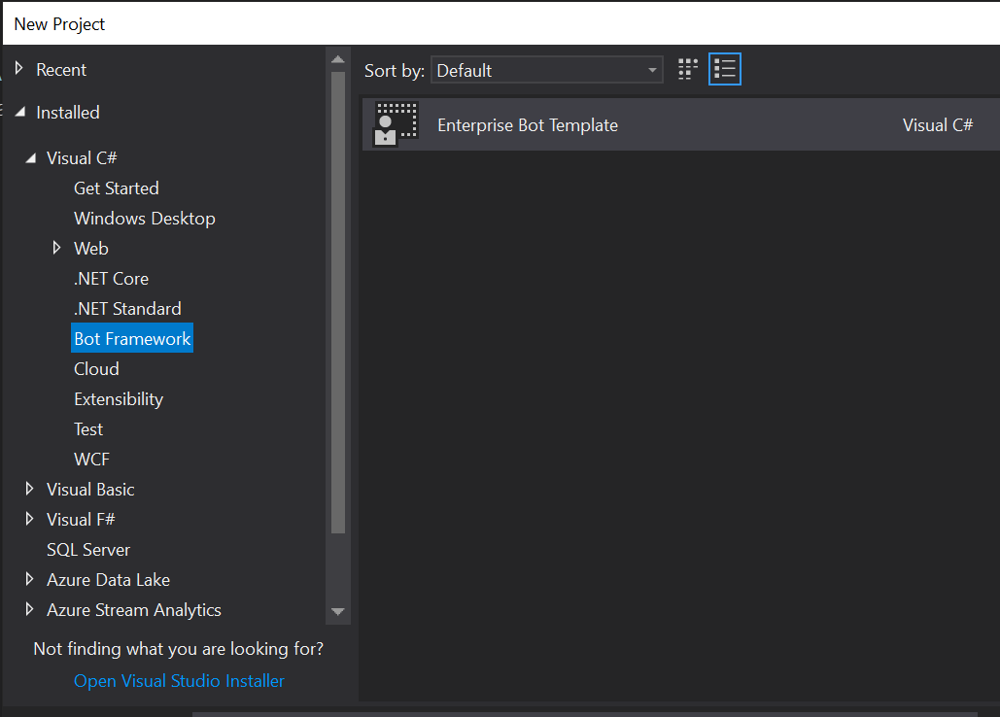

# Enterprise Bot Template - Creating a new project

> [!NOTE]
> This topic applies to v4 version of the SDK. 

Enterprise Bot Template brings together all of the best practices and supporting components we've identified through building of conversational experiences. The template is available in the following Botbuilder SDK platforms:

- .NET
- Node.js (coming soon)

## .NET

The Enterprise Bot Template is available for .NET, targeting **V4** versions of the SDK. It is available as a [VSIX](https://docs.microsoft.com/en-us/visualstudio/extensibility/anatomy-of-a-vsix-package) package. To download, please click the following link:

- [BotBuilder SDK V4 Enterprise Bot Template](https://aka.ms/GetEnterpriseBotTemplate)

#### Prerequisites

- [Visual Studio 2017 or greater](https://www.visualstudio.com/downloads/)
- [Azure account](https://azure.microsoft.com/en-us/free/)
- [Azure PowerShell](https://docs.microsoft.com/en-us/powershell/azure/overview?view=azurermps-6.8.1)

### Install the template

From the saved directory, simply open the VSIX package and Enterprise Bot Template will be installed into Visual Studio and made available the next time you open it.

To create a new bot project using the template, simply open Visual Studio, and select **File** > **new** > **Project**, and from Visual C#, select **Bot Framework** > Enterprise Bot Template. This will create a new bot project locally which you can edit as you wish. 

## Deploy your Bot

Now that your have your project created the next step is to create the supporting Azure infrastructure and perform configuration/deployment enabling the Bot to work right out of the box. Continue with [Deploy the Bot](bot-builder-enterprise-template-deployment.md).

> You must run this step otherwise Bot initalization (AppInsights) and LUIS dependencies will not be available.
## Customize your Bot

After you verify that you have successfully deployed the Bot out of the box, you can customize the bot for your scenario and needs. Continue with [Customize the Bot](bot-builder-enterprise-template-customize.md).
