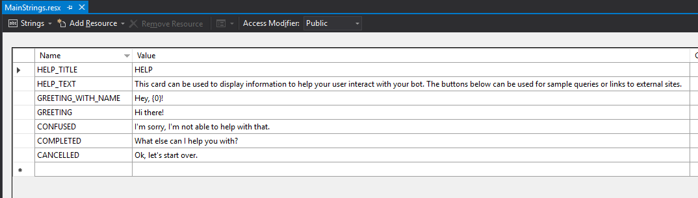

# Enterprise Bot Template - Customize your Bot

> [!NOTE]
> This topics applies to v4 version of the SDK. 

## .NET
After you have deployed and tested that the Enterprise Bot Template works end-to-end as listed in the instructions [here](bot-builder-enterprise-template-deployment.md),
you can easily customize your bot based on your scenario and needs. The goal of the template is to provide a solid foundation upon which to build your conversational experience.

## Project Structure

The folder structure of your Bot is shown below and represents our recommended best practice for structuring your Bot project and processing incoming messages.

    | - YourBot.bot         // The .bot file containing all of your Bot configuration including dependencies
    | - README.md           // README file containing links to documentation
    | - Program.cs          // Default Program.cs file
    | - Startup.cs          // Core Bot Initialisation including Bot Configuration LUIS, Dispatcher, etc. 
    | - <BOTNAME>State.cs   // The Root State class for your Bot
    | - appsettings.json    // References above .bot file for Configuration information. App Insights key
    | - CognitiveModels     
        | - LUIS            // .LU file containing base conversational intents (Greeting, Help, Cancel)
        | - QnA             // .LU file containing example QnA items
    | - DeploymentScripts   // msbot clone recipe for deployment
    | - Dialogs             // All Bot dialogs sit under this folder
        | - Main            // Root Dialog for all messages
            | - MainDialog.cs       // Dialog Logic
            | - MainResponses.cs    // Dialog responses
            | - Resources           // Adaptive Card JSON, Resource File
        | - Onboarding
            | - OnboardingDialog.cs       // Onboarding dialog Logic
            | - OnboardingResponses.cs    // Onboarding dialog responses
            | - OnboardingState.cs        // Localised dialog state
            | - Resources                 Resource File
        | - Cancel
        | - Escalate
        | - Signin
    | - Middleware          // Telemetry, Content Moderator
    | - ServiceClients      // SDK libraries, example GraphClient provided for Auth example
   
## Update Introduction Message

The Introduction message makes use of an [Adaptive Card](https://www.adaptivecards.io). To customize this introduction for your bot you can find the JSON file within the Dialogs/Main/Resources folder called ```Intro.json```. Use the [Adaptive Card visualizer](http://adaptivecards.io/visualizer) to modify the Adaptive Card to suit your Bot's requirements.

## Update Bot Responses

Each Dialog within the project has a set of responses that are stored within supporting resource (.resx) files. These can be found within the Resources folder under each Dialog.

You can change the responses in the Visual Studio resource editor as shown below to adjust how your bot responds.



This approach supports multi-lingual responses using the standard resource file localization approach. Further information can be found [here.](https://docs.microsoft.com/en-us/aspnet/core/fundamentals/localization?view=aspnetcore-2.1)

## Updating your Cognitive Models

There are two Cognitive Models included with the Enterprise Template by default, a sample FAQ QnAMaker Knowledge Base and a LUIS Model for General intents (Greeting, Help, Cancel, etc.). These models can be customized to suit your needs. You can also add new LUIS models and QnAMaker knowledge bases to expand your bot's capabilities.

### Updating an existing LUIS Model
To update an existing LUIS model for the Enterprise Template, perform these steps:
1. Make your changes to the LUIS Model in the [LUIS Portal](http://luis.ai) or using the [LuDown](https://github.com/Microsoft/botbuilder-tools/tree/master/packages/Ludown) and [Luis](https://github.com/Microsoft/botbuilder-tools/tree/master/packages/LUIS) CLI tools. 
2. Run the following command to update your Dispatch model to reflect your changes (ensures proper message routing):
```shell
    dispatch refresh --bot "YOURBOT.bot" --secret YOURSECRET
```
3. Run the following command from your project root for each updated model to update their associated LuisGen classes: 
```shell
    luis export version --appId [LUIS_APP_ID] --versionId [LUIS_APP_VERSION] --authoringKey [YOUR_LUIS_AUTHORING_KEY] | luisgen --cs [CS_FILE_NAME] -o "\Dialogs\Shared\Resources"
```

### Updating an existing QnAMaker Knowledge Base
To update an existing QnAMaker Knowledge Base, perform the following steps:
1. Make changes to your QnAMaker Knowledge Base via the [LuDown](https://github.com/Microsoft/botbuilder-tools/tree/master/packages/Ludown) and [QnAMaker](https://github.com/Microsoft/botbuilder-tools/tree/master/packages/QnAMaker) CLI tools or the [QnAMaker Portal](https://qnamaker.ai).
2. Run the following command to update your Dispatch model to reflect your changes (ensures proper message routing):
```shell
    dispatch refresh --bot "YOURBOT.bot" --secret YOURSECRET
```

### Adding a new LUIS model

In scenarios where you wish to add a new LUIS model to your project you need to update the Bot configuration and Dispatcher to ensure it is aware of the additional model. 
1. Create your LUIS model through LuDown/LUIS CLI tools or through the LUIS portal
2. Run the following command to connect your new LUIS app to your .bot file:
```shell
    msbot connect luis --appId [LUIS_APP_ID] --authoringKey [LUIS_AUTHORING_KEY] --subscriptionKey [LUIS_SUBSCRIPTION_KEY] 
```
3. Add this new LUIS model to your Dispatcher through the following command
```shell
    dispatch add -t luis -id YOUR_LUIS_APPID -bot "YOURBOT.bot" -secret YOURSECRET
```
4. Refresh the dispatch model to reflect the LUIS model changes through the following command
```shell
    dispatch refresh -bot "YOURBOT.bot" -secret YOURSECRET
```

## Adding a new dialog 

To add a new Dialog to your Bot you need to first create a new Folder under Dialogs and ensure this class derives from `EnterpriseDialog`. You then need to wire up the Dialog infrastructure. The Onboarding dialog shows a simple example which you can refer to and an excerpt is shown below alongside an overview of the steps.

- Add a waterfall dialog to your constructor
- Define the steps for your waterfall
- Create your waterfall steps
- Call AddDialog passing your waterfall
- Call AddDialog passing any prompts you use in your waterfall
- Set your InitialDialogId to the first dialog you want the component to run

```
InitialDialogId = nameof(OnboardingDialog);

var onboarding = new WaterfallStep[]
{
    AskForName,
    AskForEmail,
    AskForLocation,
    FinishOnboardingDialog,
};

AddDialog(new WaterfallDialog(InitialDialogId, onboarding));
AddDialog(new TextPrompt(NamePrompt));
AddDialog(new TextPrompt(EmailPrompt));
AddDialog(new TextPrompt(LocationPrompt));
```

Then you need to create the Template Manager to handle responses. Create a new class and derive from TemplateManager, an example is provided in the OnboardingResponses.cs file and an excerpt is shown below.

```
public const string _namePrompt = "namePrompt";
public const string _haveName = "haveName";
public const string _emailPrompt = "emailPrompt";
      
private static LanguageTemplateDictionary _responseTemplates = new LanguageTemplateDictionary
{
    ["default"] = new TemplateIdMap
    {
        {
            _namePrompt,
            (context, data) => OnboardingStrings.NAME_PROMPT
        },
        {
            _haveName,
            (context, data) => string.Format(OnboardingStrings.HAVE_NAME, data.name)
        },
        {
            _emailPrompt,
            (context, data) => OnboardingStrings.EMAIL_PROMPT
        },
```

To render responses you can use a Template Manager instance to access these responses through `ReplyWith` or `RenderTemplate` for Prompts. Examples are shown below.

```
Prompt = await _responder.RenderTemplate(sc.Context, "en", OnboardingResponses._namePrompt),
await _responder.ReplyWith(sc.Context, OnboardingResponses._haveName, new { name });
```

The final piece of Dialog infrastruture is the creation of a State class scoped to your Dialog only. Create a new class and ensure it derives from `DialogState`

Once your dialog is complete, your need to add the dialog to your `MainDialog` component using `AddDialog`. To use your new Dialog, call `dc.BeginDialogAsync()` from within your `RouteAsync` method, triggering with the appropriate LUIS intent if desired.

## Conversational insights using PowerBI dashboard and Application Insights
- To get started with getting Conversational insights, continue with  [Configure conversational analytics with PowerBI dashboard](bot-builder-enterprise-template-powerbi.md).

