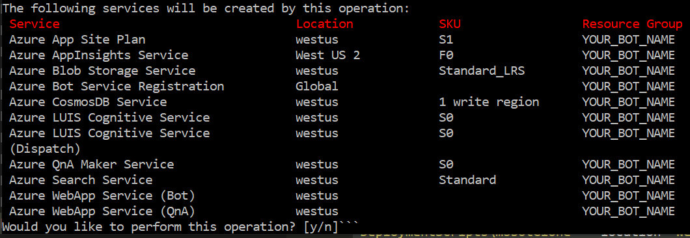

# Enterprise Bot Template - Deploying your Bot

> [!NOTE]
> This topics applies to v4 version of the SDK. 

## Prerequisites

- Ensure you have updated [.NET Core](https://www.microsoft.com/net/download) to the latest version.

- Ensure the [Node Package manager](https://nodejs.org/en/) is installed.

- Install the Azure Bot Service command line (CLI) tools. It's important to do this even if you've used the tools before to ensure you have the latest versions.

```shell
npm install -g ludown luis-apis qnamaker botdispatch msbot luisgen chatdown
```

- Install the Azure Command Line Tools (CLI) from [here](https://docs.microsoft.com/en-us/cli/azure/install-azure-cli-windows?view=azure-cli-latest). If you already have the Azure Bot Service command line (CLI) tool installed, make sure you update it to the latest version by uninstalling your current version and then installing the new one.

- Install the AZ Extension for Bot Service
```shell
az extension add -n botservice
```

## Configuration

- Retrieve your LUIS Authoring Key
   - Review [this](https://docs.microsoft.com/en-us/azure/cognitive-services/luis/luis-reference-regions) documentation page for the correct LUIS portal for the region you plan to deploy to. Note that www.luis.ai refers to the US region and an authoring key retrieved from this portal will not work with a europe deployment.
   - Once signed in click on your name in the top right hand corner.
   - Choose Settings and make a note of the Authoring Key for the next step.

## Deployment

>If you have multiple Azure subscriptions and want to ensure the deployment selects the correct one, run the following commands before continuing.

 Follow the browser login process into your Azure Account
```shell
az login
az account list
az account set --subscription "YOUR_SUBSCRIPTION_NAME"
```

Enterprise Template Bots require the following dependencies for end to end operation.
- Azure Web App
- Azure Storage Account (Transcripts)
- Azure Application Insights (Telemetry)
- Azure CosmosDb (State)
- Azure Cognitive Services - Language Understanding
- Azure Cognitive Services - QnAMaker (including Azure Search, Azure Web App)
- Azure Cognitive Services - Content Moderator (optional manual step)

Your new Bot project has a deployment recipe enabling the `msbot clone services` command to automate deployment of all the above services into your Azure subscription and ensure the .bot file in your project is updated with all of the services including keys enabling seamless operation of your Bot.

> Once deployed, review the Pricing Tiers for the created services and adjust to suit your scenario.

The README.md within your created project contains an example msbot clone services command line updated with your created Bot name and a generic version is shown below. Ensure you update the authoring key from the previous step and choose the Azure datacenter location you wish to use (e.g. westus or westeurope). Ensure the LUIS authoring key retrieved on the previous step is for the region you specify below (e.g. westus for luis.ai or westeurope for eu.luis.ai)

```shell
msbot clone services --name "YOUR_BOT_NAME" --luisAuthoringKey "YOUR_AUTHORING_KEY" --folder "DeploymentScripts\msbotClone" --location "YOUR_REGION"
```

> There is a known issue with some users whereby you might experience the following error when running deployment `ERROR: Unable to provision MSA id automatically. Please pass them in as parameters and try again`. In this situation, please browse to https://apps.dev.microsoft.com and manually create a new application retrieving the ApplicationID and Password/Secret. Run the above msbot clone services command but provide two new arguments `appId` and `appSecret` passing the values you've just retrieved.

The msbot tool will outline the deployment plan including location and SKU. Ensure you review before proceeding.



>After deployment is complete, it's **imperative** that you make a note of the .bot file secret provided as this will be required for later steps.

- Update your `appsettings.json` file with the newly created .bot file name and .bot file secret.
- Run the following command and retrieve the InstrumentationKey for your Application Insights instance and update InstrumentationKey in your `appsettings.json` file.

`msbot list --bot YOURBOTFILE.bot --secret YOUR_BOT_SECRET`

        {
          "botFilePath": ".\\YOURBOTFILE.bot",
          "botFileSecret": "YOUR_BOT_SECRET",
          "ApplicationInsights": {
            "InstrumentationKey": "YOUR_INSTRUMENTATION_KEY"
          }
        }

## Testing

Once complete, run your bot project within your development envrionment and open the Bot Framework Emulator. Within the Emulator, choose Open Bot from the File menu and navigate to the .bot file in your directory.

Then type ```hi``` to verify everything is working.

If there is any issues with the Bot Framework Emulator, first ensure you have the latest Bot Framework Emulator. If your older version of the emulator is not properly updating, uninstall and reinstall emulator.

## Deploy to Azure

Testing can be performed end to end locally. When your ready to deploy your Bot to Azure for additional testing you can use the following command to publish the source code, this can be run whenever you wish to push source code updates.

```shell
az bot publish -g YOUR_BOT_NAME -n YOUR_BOT_NAME --proj-file YOUR_BOT_NAME.csproj --sdk-version v4
```

## Enabling more scenarios

Your Bot project provides additional functionality which you can enable through the following steps.

### Authentication

To enable authentication follow these steps after configuring an Authentication Connection Name within the Settings of your Bot in the Azure Portal. Further information can be found in the [documentation](https://docs.microsoft.com/en-us/azure/bot-service/bot-builder-tutorial-authentication?view=azure-bot-service-3.0).

Register the `SignInDialog` in the MainDialog constructor:
    
`AddDialog(new SignInDialog(_services.AuthConnectionName));`

Add the following in your code at your desired location to test a simple login flow:
    
`var signInResult = await dc.BeginDialogAsync(nameof(SignInDialog));`

### Content Moderation

Content moderation can be used to identify personally identifiable information (PII) and adult content in the messages sent to the bot. To enable this functionality, go to the azure portal
and create a new content moderator service. Collect your subscription key and region to configure your .bot file. 

> This step will be automated in the future.

Add the following code to the bottom of your service.AddBot<>() method in startup to enable content moderation on every turn. 
The result of content moderation can be accessed via your bot state 
    
```
    // Content Moderation Middleware (analyzes incoming messages for inappropriate content including PII, profanity, etc.)
    var moderatorService = botConfig.Services.Where(s => s.Name == ContentModeratorMiddleware.ServiceName).FirstOrDefault();
    if (moderatorService != null)
    {
        var moderator = moderatorService as GenericService;
        var moderatorKey = moderator.Configuration["subscriptionKey"];
        var moderatorRegion = moderator.Configuration["region"];
        var moderatorMiddleware = new ContentModeratorMiddleware(moderatorKey, moderatorRegion);
        options.Middleware.Add(moderatorMiddleware);
    }
```
Access the middleware result by calling this from within your dialog stack
```     
    var cm = dc.Context.TurnState.Get<Microsoft.CognitiveServices.ContentModerator.Models.Screen>(ContentModeratorMiddleware.TextModeratorResultKey);
```

## Customize your Bot

After you verify that you have successfully deployed the Bot out of the box, you can customize the bot for your scenario and needs. Continue with [Customize the Bot](bot-builder-enterprise-template-customize.md).
