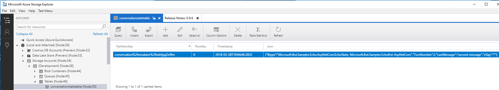

[!INCLUDE [pre-release-label](../includes/pre-release-label.md)]

# Save state using conversation and user properties

<!-- 
A bot may have to save state information, which is information it remembers in order to respond appropriately to incoming messages. The Bot Builder SDK provides classes for storing and retrieving state data as a set of properties associated with a user or a conversation. These properties are saved as key-value pairs. 

* Conversation properties help your bot keep track of the current conversation the bot is having with the user. If your bot completes a sequence of steps or switches between conversation topics, you can use conversation properties to manage steps in a sequence or track the current topic. Since conversation properties reflect the state of the current conversation, you typically clear them at the end of a session, when the bot receives an `endConversation` activity.
* User properties can be used for many purposes, such as determining where the user's prior conversation left off or simply greeting a returning user by name. If you store a user's preferences, you can use that information to customize the conversation the next time you chat. For example, you might alert the user to a news article about a topic that interests her, or alert a user when an appointment becomes available.  
-->


For your bot to save conversation and user state, first initialize state manager middleware, and then use the conversation and user state properties.
For more information about you might do this, see [State and storage](./bot-builder-storage-concept.md).

## Initialize state manager middleware

In the SDK, you need to initialize the bot adapter to use state manager middleware before you can use the conversation or user property stores. _Conversation state_ is used for conversation properties, and _user state_ is used for user properties. (User state properties can be accessed across multiple conversations.) The state manager middleware provides an abstraction that lets you access properties using a simple key-value or object store, independent of the type of underlying storage. The state manager takes care of writing data to storage and managing concurrency, whether the underlying storage type is in-memory, file storage, or Azure Table Storage.


# [C#](#tab/csharp)
To see how `ConversationState` is initialized, see `Startup.cs` in the Microsoft.Bot.Samples.EchoBot-AspNetCore sample.

```csharp
services.AddBot<EchoBot>(options =>
{
    options.CredentialProvider = new ConfigurationCredentialProvider(Configuration);

    IStorage dataStore = new MemoryStorage();
    options.Middleware.Add(new ConversationState<EchoState>(dataStore));
});
```

In the line `options.Middleware.Add(new ConversationState<EchoState>(dataStore));`, `ConversationState` is the conversation state manager object, which is added to the bot as middleware. The `EchoState` type parameter is the type representing how you want conversation state info to be stored. A bot can use any class type for conversation or user state data.

The implementation of `EchoState` is in `EchoBot.cs`:
```csharp
public class EchoState
{
    public int TurnNumber { get; set; }
}
``` 

# [JavaScript](#tab/jsmemorymiddleware)

Define the storage provider and assign it to the state manager you want to use.
You could use the same storage provider for `ConversationState` and `UserState` management middleware.
You would then use the `BotStateSet` library to connect it to the middleware layer that will manage the persisting of data for you.

```javascript
const { BotFrameworkAdapter, MemoryStorage, ConversationState, UserState, BotStateSet } = require('botbuilder');
const restify = require('restify');

// Create adapter
const adapter = new BotFrameworkAdapter({ 
    appId: process.env.MICROSOFT_APP_ID, 
    appPassword: process.env.MICROSOFT_APP_PASSWORD 
});

// Add conversation state middleware.
const conversationState = new ConversationState(new MemoryStorage());
adapter.use(conversationState);

// Alternatively, use both conversation and user state middleware.
// const storage = new MemoryStorage;
// const conversationState = new ConverstationState(storage);
// const userState = new UserState(storage);
// adapter.use(new BotStateSet(conversationState, userState));
```    
---

> [!NOTE] 
> In-memory data storage is intended for testing only. This storage is volatile and temporary. The data is cleared each time the bot is restarted. See [File storage](#file-storage) and [Azure table storage](#azure-table-storage) later in this article to set up other underlying storage mediums for conversation state and user state. 

### Configuring state manager middleware

When initializing the state middleware, an optional _state settings_ parameter allows you to change the default behavior of how properties are saved. The default settings are:

* Persist properties beyond the lifetime of the turn context.
* If more than one instance of the bot writes to a property, allow the last instance of the bot to overwrite the previous one.

## Use conversation and user state properties 
<!-- middleware and message context -->

Once the state manager middleware has been configured, you can get the conversation state and user state properties from the context object.
<!-- Changes are written to storage before the `SendActivity()` pipeline completes. -->

# [C#](#tab/csharppropertysnippet)

You can see how this works using the `Microsoft.Bot.Samples.EchoBot` sample in the Bot Builder SDK. 

In the `OnTurn` handler, `context.GetConversationState` gets the conversation state to access the data you defined, and you can modify the state by using the properties (in this case, incrementing `TurnNumber`).

```csharp
public async Task OnTurn(ITurnContext context)
{
    // This bot is only handling Messages
    if (context.Activity.Type == ActivityTypes.Message)
    {
        // Get the conversation state from the turn context
        var state = context.GetConversationState<EchoState>();

        // Bump the turn count. 
        state.TurnCount++;

        // Echo back to the user whatever they typed.
        await context.SendActivity($"Turn {state.TurnCount}: You sent '{context.Activity.Text}'");
    }
}
```   

# [JavaScript](#tab/jspropertysnippet)

You can see how this works using the generated EchoBot from the Yeoman generator sample.

This code sample shows how you can store a turn counter to the conversation state.

```javascript
const { BotFrameworkAdapter, MemoryStorage, ConversationState } = require('botbuilder');
const restify = require('restify');

// Create server
let server = restify.createServer();
server.listen(process.env.port || process.env.PORT || 3978, function () {
    console.log(`${server.name} listening to ${server.url}`);
});

// Create adapter
const adapter = new BotFrameworkAdapter({ 
    appId: process.env.MICROSOFT_APP_ID, 
    appPassword: process.env.MICROSOFT_APP_PASSWORD 
});

// Add conversation state middleware
const conversationState = new ConversationState(new MemoryStorage());
adapter.use(conversationState);

// Listen for incoming requests 
server.post('/api/messages', (req, res) => {
    // Route received request to adapter for processing
    adapter.processActivity(req, res, (context) => {
        if (context.activity.type === 'message') {
            const state = conversationState.get(context);
            const count = state.count === undefined ? state.count = 0 : ++state.count;
            return context.sendActivity(`${count}: You said "${context.activity.text}"`);
        } else {
            return context.sendActivity(`[${context.activity.type} event detected]`);
        }
    });
});
```
---

## Using conversation state to direct conversation flow

In designing a conversation flow, it is useful to define a state flag to direct the conversation flow. The flag can be a simple **Boolean** type or a type that includes the name of the current topic. The flag can help you track where in a conversation you are. For example, a **Boolean** type flag can tell you whether you are in a conversation or not. While a topic name property can tell you which converversation you are currently in.

The following example uses a Boolean _have asked name_ property to flag when the bot has asked the user for their name. When the next message is received, the bot checks the property. If the property is set to `true`, the bot knows the user was just asked for their name, and interprets the incoming message as a name to save as a user property.


# [C#](#tab/csFlag)
```csharp
public class ConversationInfo
{
    public bool haveAskedNameFlag { get; set; }
    public bool haveAskedNumberFlag { get; set; }
}

public class UserInfo
{
    public string name { get; set; }
    public string telephoneNumber { get; set; }
    public bool done { get; set; }
}

public async Task OnTurn(ITurnContext context)
{
    // Get state objects. Default objects are created if they don't already exist.
    var convo = ConversationState<ConversationInfo>.Get(context);
    var user = UserState<UserInfo>.Get(context);

    if (context.Activity.Type is ActivityTypes.Message)
    {
        if (string.IsNullOrEmpty(user.name) && !convo.haveAskedNameFlag)
        {
            // Ask for the name.
            await context.SendActivity("Hello. What's your name?");

            // Set flag to show we've asked for the name. We save this out so the
            // context object for the next turn of the conversation can check haveAskedName
            convo.haveAskedNameFlag = true;
        }
        else if (convo.haveAskedNumberFlag)
        {
            // Save the name.
            var name = context.Activity.AsMessageActivity().Text;
            user.name = name;
            convo.haveAskedNameFlag = false; // Reset flag

            // Ask for the phone number. You might want a flag to track this, too.
            await context.SendActivity($"Hello, {name}. What's your telephone number?");
            convo.haveAskedNumberFlag = true;
        }
        else if (convo.haveAskedNumberFlag)
        {
            // save the telephone number
            var telephonenumber = context.Activity.AsMessageActivity().Text;

            user.telephoneNumber = telephonenumber;
            convo.haveAskedNumberFlag = false; // Reset flag
            await context.SendActivity($"Got it. I'll call you later.");
        }
    }
}
```

To set up user state so that it can be returned by `ConversationState<ConversationInfo>.Get(context)`, 
you add user state middleware. For example, in `Startup.cs` of the ASP .NET Core EchoBot, changing the code in ConfigureServices.cs:

```csharp
public void ConfigureServices(IServiceCollection services)
{
    services.AddBot<EchoBot>(options =>
    {
        options.CredentialProvider = new ConfigurationCredentialProvider(Configuration);
        
        IStorage dataStore = new MemoryStorage();
        options.Middleware.Add(new ConversationState<ConversationInfo>(dataStore));
    });
}
```

# [JavaScript](#tab/jsflag)

**app.js**

```js
const { BotFrameworkAdapter, MemoryStorage, ConversationState, UserState, BotStateSet } = require('botbuilder');
const restify = require('restify');

// Create server
let server = restify.createServer();
server.listen(process.env.port || process.env.PORT || 3978, function () {
    console.log(`${server.name} listening to ${server.url}`);
});

// Create adapter (it's ok for MICROSOFT_APP_ID and MICROSOFT_APP_PASSWORD to be blank for now)  
const adapter = new BotFrameworkAdapter({ 
    appId: process.env.MICROSOFT_APP_ID, 
    appPassword: process.env.MICROSOFT_APP_PASSWORD 
});

// Storage
const storage = new MemoryStorage();
const conversationState = new ConversationState(storage);
const userState  = new UserState(storage);
adapter.use(new BotStateSet(convoState, userState));

// Listen for incoming requests 
server.post('/api/messages', (req, res) => {
    // Route received request to adapter for processing
    adapter.processActivity(req, res, async (context) => {
        const isMessage = (context.activity.type === 'message');
        const convo = conversationState.get(context);
        const user = userState.get(context);

        if (isMessage) {
            if(!user.name && !convo.haveAskedNameFlag){
                // Ask for the name.
                await context.sendActivity("What is your name?")
                // Set flag to show we've asked for the name. We save this out so the
                // context object for the next turn of the conversation can check haveAskedNameFlag
                convo.haveAskedNameFlag = true;
            } else if(convo.haveAskedNameFlag){
                // Save the name.
                user.name = context.activity.text;
                convo.haveAskedNameFlag = false; // Reset flag

                await context.sendActivity(`Hello, ${convo.name}. What's your telephone number?`);
                convo.haveAskedNumberFlag = true; // Set flag
            } else if(convo.haveAskedNumberFlag){
                // save the phone number
                user.telephonenumber = context.activity.text;
                convo.haveAskedNumberFlag = false; // Reset flag
                await context.sendActivity(`Got it. I'll call you later.`);
            }
        }

        // ...
    });
});

```

---

An alternative is to use the _waterfall_ model of a dialog. The dialog keeps track of the conversation state for you so you do not need to create flags to track your state. For more information, see [Manage conversation with Dialogs](bot-builder-dialog-manage-conversation-flow.md).

## File storage

The memory storage provider uses in-memory storage that gets disposed when the bot is restarted. It is good for testing purposes only. If you want to persist data but do not want to hook your bot up to a database, you can use the file storage provider. While this provider is also intented for testing purposes, it persists state data to a file so that you can inspect it. The data is written out to file using JSON format.

# [C#](#tab/csfileMiddleware)

Go to `Startup.cs` in the Microsoft.Bot.Samples.EchoBot-AspNetCore sample, and edit the code in the `ConfigureServices` method.
```csharp
// This method gets called by the runtime. Use this method to add services to the container.
public void ConfigureServices(IServiceCollection services)
{
    services.AddBot<EchoBot>(options =>
    {
        options.CredentialProvider = new ConfigurationCredentialProvider(Configuration);

        // Using file storage instead of in-memory storage.
        IStorage dataStore = new FileStorage(System.IO.Path.GetTempPath());
        options.Middleware.Add(new ConversationState<EchoState>(dataStore));
    });
}
``` 

Run the code, and let the echobot echo back your input a few times.

Then go to the directory specified by `System.IO.Path.GetTempPath()`. You should see a file with a name starting with "conversation". Open it and look at the JSON it contains something like the following.
```json
{
  "$type": "Microsoft.Bot.Samples.Echo.EchoState, Microsoft.Bot.Samples.EchoBot",
  "TurnNumber": "3",
  "eTag": "ecfe2a23566b4b52b2fe697cffc59385"
}
```

The `$type` specifies the type of the data structure you're using in your bot to store conversation state. The `TurnNumber` field corresponds to the `TurnNumber` property in the `EchoState` class. The `eTag` field is inherited from `IStoreItem`, is a unique value that automatically gets updated each time your bot updates conversation state.  The eTag field enables your bot to enable optimistic concurrency.

# [JavaScript](#tab/jsfilemiddleware)

To use `FileStorage`, update your echo bot sample described in section: [Use conversation and user state properties](#use-conversation-and-user-state-properties) earlier. Make sure `storage` is set to `FileStorage` instead of `MemoryStorage`. That is the only change needed. 

```javascript
// Storage
const storage = new FileStorage("c:/temp");
const conversationState = new ConversationState(storage);
const userState  = new UserState(storage);
adapter.use(new BotStateSet(convoState, userState));
```

The `FileStorage` provider takes a "path" as parameter. Specifying a path allows you to easily find the file with the persisted information from your bot. Each *conversation* will have a new file created for it. So, in the *path*, you may find multiple file names starting with **conversation!**. You can sort by date to find the lastest conversation easier. On the other hand, you will only find one file for the *user* state. The filename will start with **user!**. Anytime the state of either of these object changes, the state manager will update the file to reflect what's changed.

Run the bot and send it a few messages. Then, find the storage file and open it. Here is what the JSON content might look like for the echo bot that keeps track of the turn counter.

```json
{
  "turnNumber": "3",
  "eTag": "322"
}
```
---

## Azure table storage

You can also use Azure Table storage as your storage medium.

# [C#](#tab/csharpazuremiddleware)

In the Microsoft.Bot.Samples.EchoBot-AspNetCore sample, add a reference to the `Microsoft.Bot.Builder.Azure` NuGet package.

Then, go to `Startup.cs`, add a `using Microsoft.Bot.Builder.Azure;` statement, and edit the code in the `ConfigureServices` method.
```csharp
services.AddBot<EchoBot>(options =>
{
    options.CredentialProvider = new ConfigurationCredentialProvider(Configuration);
    // The parameters are the connection string and table name.
    // "UseDevelopmentStorage=true" is the connection string to use if you are using the Azure Storage Emulator.
    // Replace it with your own connection string if you're not using the emulator
    options.Middleware.Add(new ConversationState<EchoState>(new AzureTableStorage("UseDevelopmentStorage=true","conversationstatetable")));
    // you could also specify the cloud storage account instead of the connection string
    /* options.Middleware.Add(new ConversationState<EchoState>(
        new AzureTableStorage(WindowsAzure.Storage.CloudStorageAccount.DevelopmentStorageAccount, "conversationstatetable"))); */
    options.EnableProactiveMessages = true;
});
```
`UseDevelopmentStorage=true` is the connection string you can use with the [Azure Storage Emulator][AzureStorageEmulator]. Replace it with your own connection string if you're not using the emulator.

If the table with the name you specify in the constructor to `AzureTableStorage` doesn't exist, it is created.

<!-- 
TODO: step-by-step inspection of the stored table
-->

# [JavaScript](#tab/jsazuremiddleware)

In `app.js` of the echobot sample, you can create ConversationState using `AzureTableStorage`

```javascript
const { BotFrameworkAdapter, FileStorage, MemoryStorage, ConversationState } = require('botbuilder');
const { TableStorage } = require{'botbuilder-azure'};

// ...

// Create adapter
const adapter = new BotFrameworkAdapter({
    appId: process.env.MICROSOFT_APP_ID,
    appPassword: process.env.MICROSOFT_APP_PASSWORD
});

// Add conversation state middleware
// The parameters are the connection string and table name.
// "UseDevelopmentStorage=true" is the connection string to use if you are using the Azure Storage Emulator.
// Replace it with your own connection string if you're not using the emulator
var azureStorage = new TableStorage({ tableName: "TestAzureTable1", storageAccountOrConnectionString: "UseDevelopmentStorage=true"})

// You can alternatively use your account name and table name
// ar azureStorage = new TableStorage({tableName: "TestAzureTable2", storageAccessKey: "V3ah0go4DLkMtQKUPC6EbgFeXnE6GeA+veCwDNFNcdE6rqSVE/EQO/kjfemJaitPwtAkmR9lMKLtcvgPhzuxZg==", storageAccountOrConnectionString: "storageaccount"});


const conversationState = new ConversationState(azureStorage);
adapter.use(conversationState);

```

`UseDevelopmentStorage=true` is the connection string you can use with the [Azure Storage Emulator][AzureStorageEmulator].
If the table with the name you specify in the constructor to `AzureTableStorage` doesn't exist, it is created.

---

To look at the conversation state data that is saved, run the sample and then open the table using [Azure Storage explorer][AzureStorageExplorer].




The **Partition Key** is a uniquely-generated key specific to the current conversation. If you restart the bot or start a new conversation, the new conversation will get its own row with its own partition key. The `EchoState` data structure is serialized to JSON and saved in the **Json** column of the Azure Table. 

```json
{
    "$type":"Microsoft.Bot.Samples.Echo.AspNetCore.EchoState, Microsoft.Bot.Samples.EchoBot-AspNetCore",
    "TurnNumber":2,
    "LastMessage":"second message",
    "eTag":"*"
}
```

The `$type` and `eTag` fields are added by the BotBuilder SDK. For more about eTags, see [Managing optimistic concurrency](bot-builder-howto-v4-storage.md#manage-concurrency-using-etags)


## Next steps

Now that you know how to use state to help you read and write bot data to storage, lets take a look at how you can read and write directly to storage.

> [!div class="nextstepaction"]
> [How to write directly to storage](bot-builder-howto-v4-storage.md).

## Additional resources
For more background on storage, see [Storage in the Bot Builder SDK](bot-builder-storage-concept.md)

<!-- Links -->
[AzureStorageEmulator]: https://docs.microsoft.com/en-us/azure/storage/common/storage-use-emulator
[AzureStorageExplorer]: https://azure.microsoft.com/en-us/features/storage-explorer/
