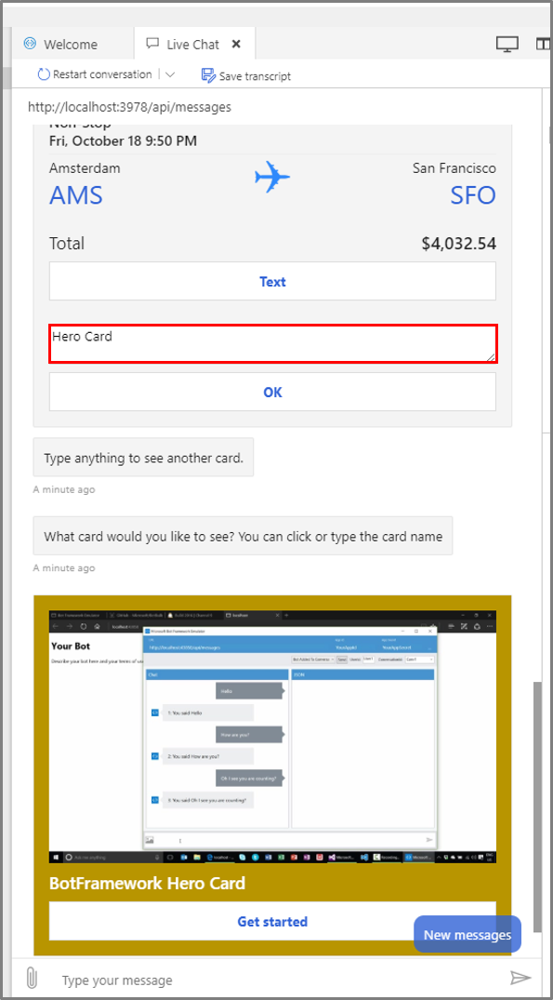

# Add media to messages

[!INCLUDE[applies-to](../includes/applies-to.md)]

<!-- To be done when samples repo location is final:

1) Assure to fix the .openpublishing.publish.config.json following entry:
	{
	         "path_to_root":"botbuilder-python",
	         "url":"https://github.com/microsoft/botbuilder-python",
	         "branch":"master",
	         "branch_mapping":{}
	}
2) Assure that the references to Python code snippets reflect the samples repo location is correct. 
3) Create aka links to GitHub samples.

-->

Messages exchanged between user and bot can contain media attachments, such as images, video, audio, and files. The Bot Framework SDK supports the task of sending rich messages to the user. To determine the type of rich messages a channel (Facebook, Skype, Slack, etc.) supports, consult the channel's documentation for information about limitations.

## Prerequisites
- Knowledge of [bot basics](bot-builder-basics.md).
- The code in this article is based on the following samples:

  | Sample code | C# | JS | Python |
  | :------ | :----- | :---| :---|
  | Cards | [C# sample](https://aka.ms/bot-cards-sample-code) | [JS sample](https://aka.ms/bot-cards-js-sample-code) |[Python sample](https://aka.ms/bot-cards-python-sample-code) |
  | Attachments | [C# sample](https://aka.ms/bot-attachments-sample-code) | [JS sample](https://aka.ms/bot-attachments-sample-code-js) | [Python sample](https://aka.ms/bot-media-attachments-python-sample-code) |
  | Suggested actions | [C# sample](https://aka.ms/SuggestedActionsCSharp) | [JS sample](https://aka.ms/SuggestedActionsJS) | [Python sample](https://aka.ms/SuggestedActionsPython) |

## Send attachments

To send the user content like an image or a video, you can add an attachment or list of attachments to a message.

See [design user experience](../bot-service-design-user-experience.md) for examples of available cards.

### [C#](#tab/csharp)

The `Attachments` property of the `Activity` object contains an array of `Attachment` objects that represent the media attachments and rich cards attached to the message. To add a media attachment to a message, create an `Attachment` object for the `reply` activity (that was created off the activity with `CreateReply()`) and set the `ContentType`, `ContentUrl`, and `Name` properties.

The source code shown here is based on the [Handling Attachments](https://aka.ms/bot-attachments-sample-code) sample.

To create the reply message, define the text and then set up the attachments. Assigning the attachments to the reply is the same for each attachment type, however the various attachments are set up and defined differently, as seen in the following snippets. The code below is setting up the reply for an inline attachment:

**Bots/AttachmentsBot.cs**  
[!code-csharp[inline attachment](~/../botbuilder-samples/samples/csharp_dotnetcore/15.handling-attachments/Bots/AttachmentsBot.cs?range=105-106)]

Next, we look at the types of attachments. First is an inline attachment:

**Bots/AttachmentsBot.cs**  
[!code-csharp[inline attachment](~/../botbuilder-samples/samples/csharp_dotnetcore/15.handling-attachments/Bots/AttachmentsBot.cs?range=167-178)]

Then, an uploaded attachment:

**Bots/AttachmentsBot.cs**  
[!code-csharp[uploaded attachment](~/../botbuilder-samples/samples/csharp_dotnetcore/15.handling-attachments/Bots/AttachmentsBot.cs?range=181-214)]

Lastly, an internet attachment:

**Bots/AttachmentsBot.cs**  
[!code-csharp[online attachment](~/../botbuilder-samples/samples/csharp_dotnetcore/15.handling-attachments/Bots/AttachmentsBot.cs?range=217-226)]

### [JavaScript](#tab/javascript)

The source code shown here is based on the [JS Handling Attachments](https://aka.ms/bot-attachments-sample-code-js) sample.

To use attachments, include the following libraries in your bot:

**bots/attachmentsBot.js**  
[!code-javascript[attachments libraries](~/../botbuilder-samples/samples/javascript_nodejs/15.handling-attachments/bots/attachmentsBot.js?range=4)]

To create the reply message, define the text and then set up the attachments. Assigning the attachments to the reply is the same for each attachment type, however the various attachments are set up and defined differently, as seen in the following snippets. The code below is setting up the reply for an inline attachment:

**bots/attachmentsBot.js**  
[!code-javascript[attachments](~/../botbuilder-samples/samples/javascript_nodejs/15.handling-attachments/bots/attachmentsBot.js?range=119,128-129)]

To send the user a single piece of content like an image or a video, you can send media in a few different ways. First, as an inline attachment:

**bots/attachmentsBot.js**  
[!code-javascript[inline attachments](~/../botbuilder-samples/samples/javascript_nodejs/15.handling-attachments/bots/attachmentsBot.js?range=170-179)]

Then, an uploaded attachment:

**bots/attachmentsBot.js**  
[!code-javascript[uploaded attachments](~/../botbuilder-samples/samples/javascript_nodejs/15.handling-attachments/bots/attachmentsBot.js?range=197-215)]

Lastly, an internet attachment contained in a URL:

**bots/attachmentsBot.js**  
[!code-javascript[internet attachments](~/../botbuilder-samples/samples/javascript_nodejs/15.handling-attachments/bots/attachmentsBot.js?range=184-191)]

### [Python](#tab/python)

To create the reply message, define the text and then set up the attachments. Assigning the attachments to the reply is the same for each attachment type, however the various attachments are set up and defined differently, as seen in the following snippets. 

The source code shown here is based on the [Handling Attachments](https://aka.ms/bot-media-attachments-python-sample-code) sample.

The code below is setting up the reply for an inline attachment:

**bots/attachments_bot.py**  
[!code-python[attachments](~/../botbuilder-python/samples/python/15.handling-attachments/bots/attachments_bot.py?range=112-113)]

To send the user a single piece of content like an image or a video, you can send media in a few different ways. First, as an inline attachment:

**bots/attachments_bot.py** 
[!code-python[inline attachments](~/../botbuilder-python/samples/python/15.handling-attachments/bots/attachments_bot.py?range=153-170)]

Then, an uploaded attachment:

**bots/attachments_bot.py** 
[!code-python[upload attachments](~/../botbuilder-python/samples/python/15.handling-attachments/bots/attachments_bot.py?range=172-207)]

Lastly, an internet attachment contained in a URL:

**bots/attachments_bot.py** 
[!code-python[internet attachments](~/../botbuilder-python/samples/python/15.handling-attachments/bots/attachments_bot.py?range=209-218)]

---

If an attachment is an image, audio, or video, the Connector service will communicate attachment data to the channel in a way that enables the [channel](bot-builder-channeldata.md) to render that attachment within the conversation. If the attachment is a file, the file URL will be rendered as a hyperlink within the conversation.

## Send a hero card

Besides simple image or video attachments, you can attach a **hero card**, which allows you to combine images and buttons in one object, and send them to the user. Markdown is supported for most text fields, but support may vary by channel.

### [C#](#tab/csharp)

To compose a message with a hero card and button, you can attach a `HeroCard` to a message. 

The source code shown here is based on the [Handling Attachments](https://aka.ms/bot-attachments-sample-code) sample.

**Bots/AttachmentsBot.cs**  
[!code-csharp[Hero card](~/../botbuilder-samples/samples/csharp_dotnetcore/15.handling-attachments/Bots/AttachmentsBot.cs?range=39-58)]

### [JavaScript](#tab/javascript)

To compose a message with a hero card and button, you can attach a `HeroCard` to a message. 

The source code shown here is based on the [JS Handling Attachments](https://aka.ms/bot-attachments-sample-code-js) sample.

**bots/attachmentsBot.js**  
[!code-javascript[hero card](~/../botbuilder-samples/samples/javascript_nodejs/15.handling-attachments/bots/attachmentsBot.js?range=147-165)]

### [Python](#tab/python)

To compose a message with a hero card and button, you can attach a `HeroCard` to a message.

The source code shown here is based on the [Handling Attachments](https://aka.ms/bot-media-attachments-python-sample-code) sample.

**bots/attachments_bot.py** 
[!code-python[hero card](~/../botbuilder-python/samples/python/15.handling-attachments/bots/attachments_bot.py?range=125-148)]

---

## Process events within rich cards

To process events within rich cards, use _card action_ objects to specify what should happen when the user clicks a button or taps a section of the card. Each card action has a _type_ and _value_.

To function correctly, assign an action type to each clickable item on the card. This table lists and describes the available action types and what should be in the associated value property.

| Type | Description | Value |
| :---- | :---- | :---- |
| openUrl | Opens a URL in the built-in browser. | The URL to open. |
| imBack | Sends a message to the bot, and posts a visible response in the chat. | Text of the message to send. |
| postBack | Sends a message to the bot, and may not post a visible response in the chat. | Text of the message to send. |
| call | Initiates a phone call. | Destination for the phone call in this format: `tel:123123123123`. |
| playAudio | Plays audio. | The URL of the audio to play. |
| playVideo | Plays a video. | The URL of video to play. |
| showImage | Displays an image. | The URL of the image to display. |
| downloadFile | Downloads a file. | The URL of the file to download. |
| signin | Initiates an OAuth signin process. | The URL of the OAuth flow to initiate. |

## Hero card using various event types

The following code shows examples using various rich card events.

### [C#](#tab/csharp)

For examples of all the available cards, see the [C# cards sample](https://aka.ms/bot-cards-sample-code).

**Cards.cs**  
[!code-csharp[hero cards](~/../botbuilder-samples/samples/csharp_dotnetcore/06.using-cards/Cards.cs?range=27-40)]

**Cards.cs**  
[!code-csharp[cards](~/../botbuilder-samples/samples/csharp_dotnetcore/06.using-cards/Cards.cs?range=91-100)]

### [JavaScript](#tab/javascript)

For examples of all the available cards, see the [JS cards sample](https://aka.ms/bot-cards-js-sample-code).

**dialogs/mainDialog.js**  
[!code-javascript[hero cards](~/../botbuilder-samples/samples/javascript_nodejs/06.using-cards/dialogs/mainDialog.js?range=206-218)]

**dialogs/mainDialog.js**  
[!code-javascript[sign in cards](~/../botbuilder-samples/samples/javascript_nodejs/06.using-cards/dialogs/mainDialog.js?range=259-265)]

### [Python](#tab/python)

For examples of all the available cards, see the [Python cards sample](https://aka.ms/bot-cards-python-sample-code).

**dialogs/main_dialog.py**

<!-- replaced with this when it works: 
[!code-python[hero cards](~/../botbuilder-python/samples/python/06.using-cards/dialogs/main_dialog.py?range=163-179)] -->

```python
def create_hero_card(self) -> Attachment:
  card = HeroCard(
      title="",
      images=[
          CardImage(
              url="https://sec.ch9.ms/ch9/7ff5/e07cfef0-aa3b-40bb-9baa-7c9ef8ff7ff5/buildreactionbotframework_960.jpg"
          )
      ],
      buttons=[
          CardAction(
              type=ActionTypes.open_url,
              title="Get Started",
              value="https://docs.microsoft.com/en-us/azure/bot-service/",
          )
      ],
  )
  return CardFactory.hero_card(card)
```

**dialogs/main_dialog.py**

<!-- replaced with this when it works: 
  [!code-python[sign in cards](~/../botbuilder-python/samples/python/06.using-cards/dialogs/main_dialog.py?range=245-256)] -->

```python
def create_signin_card(self) -> Attachment:
  card = SigninCard(
      text="BotFramework Sign-in Card",
      buttons=[
          CardAction(
              type=ActionTypes.signin,
              title="Sign-in",
              value="https://login.microsoftonline.com",
          )
      ],
  )
  return CardFactory.signin_card(card)
```

---

## Send an Adaptive Card
Adaptive Card and MessageFactory are used to send rich messages including texts, images, video, audio and files to communicate with users. However, there are some differences between them. 

First, only some channels support Adaptive Cards, and channels that do support it might partially support Adaptive Cards. For example, if you send an Adaptive Card in Facebook, the buttons won't work while texts and images work well. MessageFactory is just a helper class within the Bot Framework SDK to automate creation steps for you, and supported by most channels. 

Second, Adaptive Card delivers messages in the card format, and the channel determines the layout of the card. The format of messages MessageFactory delivers depends on the channel, and is not necessarily in the card format unless Adaptive Card is part of the attachment. 

To find the latest information on Adaptive Card channel support, see the <a href="http://adaptivecards.io/designer/">Adaptive Cards Designer</a>.

To use adaptive cards, be sure to add the `AdaptiveCards` NuGet package. 


> [!NOTE]
> You should test this feature with the channels your bot will use to determine whether those channels support adaptive cards.

### [C#](#tab/csharp)

To use Adaptive Cards, be sure to add the `AdaptiveCards` NuGet package.

The source code shown here is based on the [Using cards](https://aka.ms/bot-cards-sample-code) sample.

**Cards.cs**  
[!code-csharp[adaptive cards](~/../botbuilder-samples/samples/csharp_dotnetcore/06.using-cards/Cards.cs?range=13-25)]

### [JavaScript](#tab/javascript)

To use Adaptive Cards, be sure to add the `adaptivecards` npm package.

The source code shown here is based on the [JS Using Cards](https://aka.ms/bot-cards-js-sample-code) sample. 

Here, the Adaptive card is stored in it's own file and included in our bot:

**resources/adaptiveCard.json**  
[!code-json[adaptive cards](~/../botbuilder-samples/samples/javascript_nodejs/06.using-cards/resources/adaptiveCard.json)]

The card is created as follows:

**dialogs/mainDialog.js**  

[!code-javascript[adaptive cards](~/../botbuilder-samples/samples/javascript_nodejs/06.using-cards/dialogs/mainDialog.js?range=6)]

[!code-javascript[adaptive cards](~/../botbuilder-samples/samples/javascript_nodejs/06.using-cards/dialogs/mainDialog.js?range=170-172)]

### [Python](#tab/python)

The source code shown here is based on the [Using cards](https://aka.ms/bot-cards-python-sample-code) sample.

**dialogs/resources/adaptive_card_example.py**
[!code-python[adaptive cards](~/../botbuilder-python/samples/python/06.using-cards/dialogs/resources/adaptive_card_example.py)]

The card is created as follows:

**bots/main_dialog.py**

<!-- replaced with this when it works:  
[!code-python[adaptive cards](~/../botbuilder-python/samples/python/06.using-cards/dialogs/main_dialog.py?range=127-128)] -->

```python
def create_adaptive_card(self) -> Attachment:
  return CardFactory.adaptive_card(ADAPTIVE_CARD_CONTENT)
```

---

## Send a carousel of cards

Messages can also include multiple attachments in a carousel layout, which places the attachments side by side and allows the user to scroll across.

### [C#](#tab/csharp)

The source code shown here is based on the [Cards sample](https://aka.ms/bot-cards-sample-code).

First, create the reply and define the attachments as a list.

**Dialogs/MainDialog.cs**  
[!code-csharp[carousel of cards](~/../botbuilder-samples/samples/csharp_dotnetcore/06.using-cards/Dialogs/MainDialog.cs?range=61-66)]

Then add the attachments. Here we're adding them one at a time, but feel free to manipulate the list to add the cards however you prefer.

**Dialogs/MainDialog.cs**  
[!code-csharp[carousel of cards](~/../botbuilder-samples/samples/csharp_dotnetcore/06.using-cards/Dialogs/MainDialog.cs?range=104-113)]

Once the attachments are added, you can send the reply just like any other.

**Dialogs/MainDialog.cs**  
[!code-csharp[carousel of cards](~/../botbuilder-samples/samples/csharp_dotnetcore/06.using-cards/Dialogs/MainDialog.cs?range=117-118)]

### [JavaScript](#tab/javascript)

The source code shown here is based on the [JS cards sample](https://aka.ms/bot-cards-js-sample-code).

To send a carousel of cards, send a reply with the attachments as an array and the layout type defined as `Carousel`:

**dialogs/mainDialog.js**  
[!code-javascript[carousel of cards](~/../botbuilder-samples/samples/javascript_nodejs/06.using-cards/dialogs/mainDialog.js?range=97-108)]

[!code-javascript[carousel of cards](~/../botbuilder-samples/samples/javascript_nodejs/06.using-cards/dialogs/mainDialog.js?range=113-116)]

### [Python](#tab/python)

The source code shown here is based on [Python cards sample](https://aka.ms/bot-cards-python-sample-code).

First, create the attachments.

**dialogs/main_dialog.py**

<!-- replaced with this when it works:  
[!code-python[hero cards](~/../botbuilder-python/samples/python/06.using-cards/dialogs/main_dialog.py?range=104-112)] -->

```python
reply.attachment_layout = AttachmentLayoutTypes.carousel
reply.attachments.append(self.create_adaptive_card())
reply.attachments.append(self.create_animation_card())
reply.attachments.append(self.create_audio_card())
reply.attachments.append(self.create_hero_card())
reply.attachments.append(self.create_receipt_card())
reply.attachments.append(self.create_signin_card())
reply.attachments.append(self.create_thumbnail_card())
reply.attachments.append(self.create_video_card())
```

Once the attachments are added, you can send the reply.

**dialogs/main_dialog.py**

<!-- replaced with this when it works:  
[!code-python[hero cards](~/../botbuilder-python/samples/python/06.using-cards/dialogs/main_dialog.py?range=114-115)] -->

```python
# Send the card(s) to the user as an attachment to the activity
  await step_context.context.send_activity(reply)
```

---

<!-- TODO: Add a media card, such as video or audion. Revisit which examples we put here and link to the 06 through 08 samples. -->

## Additional resources

See [design user experience](../bot-service-design-user-experience.md) for examples of available cards.

For detailed information on the schema, see the [Bot Framework card schema](https://aka.ms/botSpecs-cardSchema) and the [message activity section](https://aka.ms/botSpecs-activitySchema#message-activity) of the Bot Framework Activity schema.

### Code sample for processing Adaptive Card input

This sample code shows one way to use Adaptive Card inputs within a bot dialog class.
It extends the current sample 06.using-cards by validating the input received in the text field from the responding client.
We first added text input and button functionality to the existing adaptive card by adding the following code just before the final bracket of adaptiveCard.json, found in the resources folder:

```json
...
  "actions": [
    {
      "type": "Action.ShowCard",
      "title": "Text",
      "card": {
      "type": "AdaptiveCard",
      "body": [
        {
          "type": "Input.Text",
          "id": "text",
          "isMultiline": true,
          "placeholder": "Enter your comment"
        }
      ],
      "actions": [
        {
          "type": "Action.Submit",
          "title": "OK"
        }
      ]
    }
  }
]

```

Note that the input field is labeled "text" so our adaptive card will attach comment text data as Value.[text.]

### [C#](#tab/csharp)
Our validator uses Newtonsoft.json to first convert this to a JObject, 
and then create a trimmed text string for comparison. So add:
  ```csharp
  using Newtonsoft.Json.Linq;
  ```
to MainDialog.cs and install the latest stable nuget package of Newtonsoft.Json.
In the validator code we added the logic flow into the code comments. 
This ChoiceValidator() code is placed into the 06.using-cards sample just after the closed brace public for declaration of MainDialog:

```csharp
private async Task ChoiceValidator(
  PromptValidatorContext promptContext,
  CancellationToken cancellationToken)
  {
    // Retrieves Adaptive Card comment text as JObject.
    // looks for JObject field "text" and converts that input into a trimmed text string.
    var jobject = promptContext.Context.Activity.Value as JObject;
    var jtoken = jobject?["text"];
    var text = jtoken?.Value().Trim();
    // Logic: 1. if succeeded = true, just return promptContext
    //        2. if false, see if JObject contained Adaptive Card input.
    //               No = (bad input) return promptContext
    //               Yes = update Value field with JObject text string, return "true".
    if (!promptContext.Recognized.Succeeded && text != null)
    {
       var choice = promptContext.Options.Choices.FirstOrDefault(
       c => c.Value.Equals(text, StringComparison.InvariantCultureIgnoreCase));
       if (choice != null)
       {
           promptContext.Recognized.Value = new FoundChoice
            {
               Value = choice.Value,
             };
            return true;
       }
    }
    return promptContext.Recognized.Succeeded;
  }
```

Now above in the MainDialog declaration change:
  ```csharp
  // Define the main dialog and its related components.
  AddDialog(new ChoicePrompt(nameof(ChoicePrompt)));
  ```
to:
  ```csharp
  // Define the main dialog and its related components.
  AddDialog(new ChoicePrompt(nameof(ChoicePrompt), ChoiceValidator));
  ```
This will invoke your validator to look for Adaptive Card input each time a new ChoicePrompt is created.

### [JavaScript](#tab/javascript)
Open mainDialog.js and find the run method _async run(turnContext, accessor)_
This method handles incoming activity.
Just after the call _dialogSet.add(this);_ add the following:
```JavaScript
  // The following check looks for a non-existant text input
  // plus Adaptive Card input in _activity.value.text
  // If both conditions exist, the Activity Card text 
  // is copied into the text input field.
  if(turnContext._activity.text == null
      && turnContext._activity.value.text != null)
   {
      this.logger.log('replacing null text with Activity Card text input');
      turnContext._activity.text = turnContext._activity.value.text;
   }
```
If this check finds a non-existent text input from the client, it looks to see if there is input from an Adaptive Card.
If an Adaptive Card input exists at \_activity.value.text, it copies this into the normal text input field.

### [Python](#tab/python)

The source code shown here is based on the [Suggested actions](https://aka.ms/SuggestedActionsPython) sample.

Create and sends an activity with suggested actions to the user.

This choice_validator() code is placed into the 06.using-cards sample just after the closed brace public for declaration of MainDialog:

```python
@staticmethod
async def choice_validator(prompt_context: PromptValidatorContext) -> bool:
    if prompt_context.context.activity.value:
        text = prompt_context.context.activity.value["text"].lower()
        if not prompt_context.recognized.succeeded and text:
            matching_choices = [choice for choice in prompt_context.options.choices if choice.value.lower() == text]
            if matching_choices:
                choice = matching_choices[0]
                prompt_context.recognized.value = FoundChoice(
                    value=choice.value,
                    index=0,
                    score=1.0
                )
                return True

    return prompt_context.recognized.succeeded
```

Now above in the MainDialog declaration change:

```python
self.add_dialog(ChoicePrompt(CARD_PROMPT))
```

to:

```python
self.add_dialog(ChoicePrompt(CARD_PROMPT, MainDialog.choice_validator))
```

This will invoke your validator to look for Adaptive Card input each time a new ChoicePrompt is created.

---

To test your code, once an Adaptive Card has been displayed, Click the "Text" button, Enter a valid selection such as "Hero Card" and click the "OK" button.



1. The first input will be used to start a new dialog.
2. Click the "OK" button again and this input will be used to select a new card.

## Next steps

> [!div class="nextstepaction"]
> [Add buttons to guide user action](./bot-builder-howto-add-suggested-actions.md)
