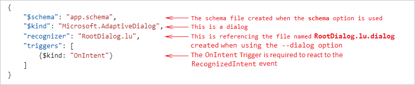

# Deploy LUIS resources using the Bot Framework LUIS CLI commands

[!INCLUDE [applies-to-v4](../includes/applies-to.md)]

The Bot Framework Command Line Interface (CLI) lets you automate the management of LUIS applications (LUIS apps). From a command line or a script, you can create, update, and delete LUIS properties.

This article explains how to deploy a LUIS resource. For information on how to update an existing LUIS resource using BF CLI, see how to [update LUIS resources using the Bot Framework LUIS CLI commands][how-to-update-using-luis-cli].

## Prerequisites

- Knowledge of [LU templates][lu-templates].
- Have a bot project with `.lu` files.
- If working with adaptive dialogs, you should have an understanding of:
    - [Natural language processing in adaptive dialogs][natural-language-processing-in-adaptive-dialogs].
    - [Language understanding in adaptive dialogs][language-understanding].
    - how the [LUIS recognizer][luis-recognizer] is used.

## Using the LUIS CLI commands to enable LUIS in your bot

This article describes how to perform some common tasks using the Bot Framework CLI.

1. [Create your LUIS authoring resource in Azure](#create-your-luis-authoring-resource-in-azure)
1. [Install the Bot Framework CLI](#install-the-bot-framework-cli)
1. [Create your LUIS model](#create-your-luis-model)
1. [Create your LUIS application](#create-your-luis-application)
1. [Get the appId from your LUIS app](#get-the-appid-from-your-luis-app)
1. [Train your LUIS application](#train-your-luis-application)
1. [Publish your LUIS application](#publish-your-luis-application)
1. [Generate source code](#generate-source-code)
1. [Create and train a LUIS app then publish it using the build command][create-and-train-a-luis-app-then-publish-it-using-the-build-command]

Once your bot project's language understanding resources have been created, you are ready to follow the steps outlined in this article to get LUIS working.

## Create your LUIS authoring resource in Azure

The LUIS authoring resource is an [Azure Cognitive Services][cognitive-services-overview] resource that you create using Azure's [Create Cognitive Services][create-cognitive-services] page. You can think of this as a container for your LUIS applications and the model, or models that those LUIS applications are comprised of. The LUIS authoring resource provides a secure way to author your LUIS resources.  You need this to be able to perform the activities involved, such as create, update, train, and publish a LUIS app. The Bot Framework CLI LUIS group provides the commands you need to accomplish these tasks.

1. Go to the Azure [Create Cognitive Services][create-cognitive-services] page.  
2. In the **Create options** section, select **Authoring** to create a LUIS authoring resource.

   

3. Enter values for each of the fields, then select the **Review + create** button.

   

    > [!NOTE]
    > When entering the **Resource Group** and **Name**, keep in mind that you cannot change these values later. Also note that the value you give for **Name** will be part of your **Endpoint URL**.

4. Review the values to ensure they are correct, then select the **Create** button.

The LUIS authoring resource includes information your bot will use to access your LUIS app:

- **Keys**. These are called _subscription keys_, sometimes referred to as _authoring keys_ when referring to keys in the LUIS authoring resource. These are auto generated. You will need an authoring key when referencing your LUIS authoring resource for any action, such as when creating your LUIS App and Models which will be detailed in this article. You can find the keys in the **Keys and Endpoint** blade in your LUIS authoring resource.
- **Endpoint**. This is auto-generated using the LUIS authoring resource name that you provide when creating it. It has the following format: `https://<luis-resource-name>.cognitiveservices.azure.com/`. When referencing your LUIS authoring resource for any action, such as when creating your LUIS App and Models which will be detailed in this article. You can find the key in the **Keys and Endpoint** blade in your LUIS authoring resource.
- **Location**.   This is the Azure region that contains your LUIS authoring resource. You select this when creating the LUIS authoring resource.

   

> [!TIP]
>
> There are two types of subscription keys associated with a LUIS resource, depending on which type of LUIS resource you are referring to. A LUIS authoring resource has an authoring key and a LUIS prediction resource has a prediction key, both are subscription keys and both can be found in the _Keys and endpoint_ blade.

For more information on see [Create LUIS resources][luis-how-to-azure-subscription].

## Install the Bot Framework CLI

[!INCLUDE [applies-to-v4](../includes/install-bf-cli.md)]

## Create your LUIS model

Once you have created all the individual `.lu` files needed in your project, you can combine them to create your LUIS model using the `luis:convert` command. This results in a JSON file that you will reference when creating your LUIS application hosted in Azure Cognitive Services in the _LUIS authoring resource_ you created previously.

``` cli
bf luis:convert -i <input-folder-name> -o <output-file-name> -r
```

In the example below, the command is run in a command line while in the root directory of your project. It will search for all `.lu` files in the _dialogs_ directory and because of the `-r` option, all of its sub-directories. It will save a file named LUISModel.json in the _output_ directory.

``` cli
bf luis:convert -i dialogs -o .\output\LUISModel.json -r
```

## Create your LUIS application

The _LUIS authoring resource_ you perviously created consists of your authoring keys and endpoint, values that you need when creating your LUIS application (LUIS app). You can have multiple LUIS apps associated with a single LUIS authoring resource, each LUIS app will have its own `appId` that will be provided to you as a part of the creation process. You will need that `appId` when referring to this LUIS app in the future. The LUIS app will provide your bot with all functionality provided by LUIS, combined with the app specific data you provide in your LUIS model that you previously created from your projects `.lu` files.

To create your LUIS app:

``` cli
luis:application:import --in <luis-model-json-file> --endpoint <endpoint> --subscriptionKey <subscription-key> --name <name> --versionId <initial-version-id>
```

The example above shows the `luis:application:import` command with its required options. For more details and to see all options available for this command see the [bf luis:application:import][bf-luisapplicationimport] section of the LUIS CLI readme.

To create a LUIS application without including a LUIS model see the [bf luis:application:create][bf-luisapplicationcreate] command.


In the above image, you would use the following command to create your LUIS app, assuming your LUIS model JSON file is in a sub-directory named _output_:

`luis:application:import --in .\output\LUISModel.json --endpoint https://LUIS-Authoring-Resource.cognitiveservices.azure.com/ --subscriptionKey xxxxxxxxxxxxxxxxxxxxxxxxxxxxxxxx --name LUISApplication --versionId 0.1`

> [!NOTE]
>
> The keys in the image above are not valid keys. They are shown here for demonstration purposes only.
> These authoring keys offer you a secure way to access your LUIS authoring resources. Do not share your keys.

## Get the appId from your LUIS app

You will need the `appId` that is returned when the `luis:application:import` command successfully completes, you will also need the `versionId` that you supplied when creating the LUIS application. In scenarios where you do not have this information, or if you are creating scripts to automate this process, you can use the [luis:application:show][bf-luisapplicationshow] command to get this information.

``` cli
bf luis:application:show --appId <application-id> --endpoint <endpoint> --subscriptionKey <subscription-key>
```

## Train your LUIS application

Training is the process of teaching your LUIS app to improve its natural language understanding. You need to train your LUIS app after you have made any updates to the model such as adding, editing, labeling, or deleting entities, intents, or utterances. For additional information see the [Train your active version of the LUIS app][luis-how-to-train] article in the LUIS docs.

To train your LUIS app, use the `luis:train:run` command:

```cli
bf luis:train:run --appId <application-id> --versionId <version-id> --endpoint <endpoint> --subscriptionKey <subscription-key>
```

This enables you to automate what you would normally do in the LUIS site:


For additional information on using this command, see [bf luis:train:run][bf-luistrainrun] in the BF CLI LUIS readme.

> [!TIP]
>
> After training your LUIS app, you should [test][luis-concept-test] it with sample utterances to see if the intents and entities are recognized correctly. If they're not, make updates to the LUIS app, train, and test again. This testing can be done manually in the LUIS site, for more information see the article [Test an utterance][test-an-utterance].

## Publish your LUIS application

When you finish building, training, and testing your active LUIS app, make it available to your client application by publishing it to the endpoint. You can do that using the `luis:application:publish` command.

```cli
bf luis:application:publish --appId <application-id> --versionId <version-id> --endpoint <endpoint> --subscriptionKey <subscription-key>
```

For additional information on using this command, see [bf luis:application:publish][luisapplicationpublish] in the BF CLI LUIS readme.

For information about publishing a LUIS application, see [Publish your active, trained app to a staging or production endpoint][luis-how-to-publish-app].

## Generate source code

[!INCLUDE [applies-to-v4](../includes/generate-source-code-luis-cli.md)]

## Create and train a LUIS app then publish it using the build command

It is helpful to understand how the process of deploying a LUIS app works, and after completing this article up to this point, you should have a better understanding of the processes involved in creating the LUIS model, using that model to create a LUIS app in an Azure Cognitive Services resource, then train and publish it using the Bot Framework CLI commands.

These commands give you a lot of flexibility when tailoring scripts to your specific needs.
You can use the `luis:build` command to create or update, then train and publish a LUIS app.
However, using the `luis:build` command provides you with fewer options for controlling the process.

For each `.lu` file, including `.lu` files for each locale, the build command combines all the following actions into a single command:

1. Creates one LUIS model for [every locale](#lu-and-multiple-language-variations) found using your existing `.lu` files.
1. Using that model, it creates a new LUIS app in the specified Azure Cognitive Services resource if none exists, otherwise it will update the existing LUIS app.
1. When updating an existing LUIS app, it will automatically increment the versionId and optionally delete the old version.
1. Trains the new or updated LUIS app, then publishes it.
1. If you include the `--dialog` option, it will output the `.dialog` definition files that can be used by the [LUIS recognizer][luis-recognizer] when developing using the [declarative approach][declarative]. This is explained in [The dialog file](#the-dialog-file) section.

## How to use the build command

The LUIS build command with its required parameters:

``` cli
bf luis:build --in <input-file-or-folder> --out <output-file-or-folder> --authoringKey <subscription-key> --region <authoring-region>
```

The `luis:build` command will create all assets you need from your local `.lu` files. When using the `--in` option, `luis:build` will create one LUIS application for every `.lu` file found for each locale.

### Required luis:build parameters

- `in`: The directory, including sub-directories, that will be searched for .lu files.
- `out`: The directory to save output files to. This includes all the recognizer files as well as the settings file. If you omit the `--out` option, no files will be saved to disk and only the authoring keys and endpoint from the settings file will be written to the console.
- `botName`: The name of your bot. This will be used as the prefix for the name of the LUIS applications generated.
- `authoringKey`: The same value as the subscriptionKey used in all previous commands discussed in this article.
- `region`: This defines the region to publish your LUIS applications.

For information on the additional options, see [bf luis:build][bf-luisbuild] in the BF CLI readme.

Alternatively, you can include these required, as well as any of the other parameters in a configuration file and refer to them using the `--luConfig` option.

### LUIS build configuration file

The following is a sample of the **luconfig.json** file that you can reference using the `--luConfig` option.

```json
{
    "in": "dialogs",
    "out": "generated",
    "botName":"MyProject",
    "authoringKey":"<your-32-digit-subscription-key>",
    "region": "westus",
    "schema": "app.schema",
    "defaultCulture":"en-us",
    "deleteOldVersion": true,
    "dialog": "multiLanguage",
    "fallbackLocale": "en-us",
    "force": true,  
    "suffix": "<value-to-replace-username>"
}
```

Additionally there is a `models` section in the the **luconfig.json** file that is helpful when you need to control which `.lu` files in your project correspond to a LUIS application. This is especially helpful if you are leveraging external references in your `.lu` files so not every single `.lu` file is treated as a LUIS application. Every file that you list in the `models` section will become a LUIS application, and any `.lu` files not listed will become part of the LUIS application that is created from any `.lu` file that references it. Files referenced in multiple `.lu` files will be duplicated in each LUIS application that references it. Any `.lu` file not explicitly listed in the models section of the **luconfig.json** file or referenced in one of the listed `.lu` files will be ignored.

The example below shows an example _models_ section of the **luconfig.json** file:

```json
    // Each model is a LUIS application.
    "models": [
        // Each line is to an lu file and corresponds to a LUIS application.
        // relative paths here are relative to the luconfig.json file itself.
        "./dialog/AddToDoDialog/AddToDoDialog.lu",
        "./dialog/Common/Common.lu",
        "./dialog/DeleteToDoDialog/DeleteToDoDialog.lu",
        "./dialog/GetUserProfileDialog/GetUserProfileDialog.lu",
        "./dialog/RootDialog/RootDialog.lu",
        "./dialog/ViewToDoDialog/ViewToDoDialog.lu"
    ]
```

Once this configuration file is created, all you need to do is reference it in your `luis:build` command. For example:

``` cli
bf luis:build --luConfig luconfig.json
```

### LU and multiple language variations

Every [.lu file][lu-templates] can have multiple language variations and the `luis:build` command will build a LUIS application for each language supported.

The pattern for the `.lu` file name, when additional locales are used, is as follows:

`<file-name>.<locale>.lu`

For example:

```
RootDialog.en-us.lu
RootDialog.fr-fr.lu
RootDialog.de-de.lu
etc.
```

In the above example, each one of the `.lu` files will have its own unique language specific model created for it, resulting in one LUIS application for each of the three `.lu` files.

> [!TIP]
>
> - As an alternative to including the locale in the file name, you can include it in the `.lu` file itself as part of its configuration information. This is helpful when you need more flexibility with the file naming convention. For example, in the `.lu` file for the French language you would add: `> !# @app.culture = fr-fr`. See [Model description][model-description] in the [.lu file format][lu-templates] reference for more information.
>
> - If no locale can be determined from the file name and it is not included in the `.lu` files configuration information, the value specified in the build commands `--defaultCulture` option will be used. If the `--defaultCulture` option is omitted, the locale will be set to `en-us`.

### LUIS Applications created

Each LUIS application created on your behalf will be named using a combination of the `botName` value that you supply when running the `luis:build` command, the username of the person logged in, and the name of the `.lu` file including the locale.

LUIS application names will use this format:  `{botName}{(suffix)}-{file-name}-{locale}.lu`

For example, if your botName is _MyProject_ and your username is _YuuriTanaka_, and the filename is _GetAddresss_ the names of your LUIS applications would be as follows:

```
MyProject(YuuriTanaka)-GetAddresss.en-us.lu
MyProject(YuuriTanaka)-GetAddresss.fr-fr.lu
MyProject(YuuriTanaka)-GetAddresss.de-de.lu
```

The same LUIS application name will be used in each Azure region, with endpoints internal to it.

> [!TIP]
>
> Including the username as part of the LUIS application name enables multiple developers to work independently. This value is generated automatically, using the username of the person logged in, however you can override this using the `--suffix` option.

### The settings file generated using the build command

All of the `.lu` files for each locale will result in one LUIS application and the output of the `luis:build` command will include one settings file that contains a list of every LUIS application ID that was created for each locale.

For example, if your logged in username is _YuuriTanaka_ and you are targeting authoring region **westus**, your filename would be:

**luis.settings.YuuriTanaka.westus.json**

Example settings file:

```json
{
    "luis": {
        "RootDialog_en_us_lu": "<LUIS-App-ID-for-en-us-locale>",
        "RootDialog_fr_fr_lu": "<LUIS-App-ID-for-fr-fr-locale>"
    }
}
```

### The dialog file

When you include the `--dialog` option, a `.dialog` file will be generated for each of your `.lu` files, one for each locale. 

> [!IMPORTANT]
>
> The `--schema` option is used in conjunction with the `--dialog` option. Including the `--schema` option will ensure that every dialog file created will have a reference to the projects root schema file. This schema file contains the schemas of all the components that are consumed by your bot. Every consumer of declarative files, including [Composer][composer], needs a schema file. If your project does not have a schema file you can generate one using the `dialog:merge` command. You will need to run this command before running the `luis:build` command. For additional information refer to the article on [Using declarative assets in adaptive dialogs][dialog-merge-command].

The luis:build dialog and schema parameters:

- **dialog**. There are two valid values for the dialog option, `multiLanguage` and `crosstrained`.
- **schema**. This takes a relative path and filename pointing to the bot's schema file.

 These files will be written to the directory specified in the `out` option. For example:

```
RootDialog.en-us.lu.dialog <-- LuisRecognizer for en-us locale
RootDialog.fr-fr.lu.dialog <-- LuisRecognizer for fr-fr locale
RootDialog.lu.dialog       <-- MultiLanguageRecognizer configured to use all locales
```

Here is an example of the _MultiLanguageRecognizer_ file:

```json
{
    "$schema": "app.schema",
    "$kind": "Microsoft.MultiLanguageRecognizer",
    "id": "lu_RootDialog",
    "recognizers": {
        "en-us": "RootDialog.en-us.lu",
        "fr-fr": "RootDialog.fr-fr.lu",
        "": "RootDialog.en-us.lu"
    }
}
```

You will use these files if you are using the declarative approach to developing your bot, and you will need to add a reference to this recognizer in your adaptive dialogs `.dialog` file. In the following example the `"recognizer": "RootDialog.lu"` is looking for the recognizer that is defined in the file **RootDialog.lu.dialog**:

 

See [Using declarative assets in adaptive dialogs][declarative] for more information.

## Additional information

- [Updating your LUIS Models][how-to-update-using-luis-cli]

<!----------------------------------------------------------------------------------------------------->
[cognitive-services-overview]: /azure/cognitive-services/Welcome
[create-cognitive-services]: https://portal.azure.com/#create/Microsoft.CognitiveServicesLUISAllInOne
[luis-recognizer]: bot-builder-concept-adaptive-dialog-recognizers.md#luis-recognizer
[natural-language-processing-in-adaptive-dialogs]: bot-builder-concept-adaptive-dialog-recognizers.md#introduction-to-natural-language-processing-in-adaptive-dialogs
[language-understanding]: bot-builder-concept-adaptive-dialog-recognizers.md#language-understanding
[lu-templates]: ../file-format/bot-builder-lu-file-format.md
[model-description]: ../file-format/bot-builder-lu-file-format.md#model-description
[luis-how-to-azure-subscription]: /azure/cognitive-services/luis/luis-how-to-azure-subscription
[bf-cli-overview]: bf-cli-overview.md

[bf-luisapplicationimport]: https://aka.ms/botframework-cli#bf-luisapplicationimport
[bf-luisapplicationcreate]: https://aka.ms/botframework-cli#bf-luisapplicationcreate
[bf-luisapplicationshow]: https://aka.ms/botframework-cli#bf-luisapplicationshow
[bf-luistrainrun]: https://aka.ms/botframework-cli#bf-luistrainrun
[luisapplicationpublish]: https://aka.ms/botframework-cli#bf-luisapplicationpublish
[bf-luisgeneratecs]: https://aka.ms/botframework-cli#bf-luisgeneratecs
[bf-luisgeneratets]: https://aka.ms/botframework-cli#bf-luisgeneratets
[bf-luisbuild]: https://aka.ms/botframework-cli#bf-luisbuild
[declarative]: bot-builder-concept-adaptive-dialog-declarative.md
[dialog-merge-command]: bot-builder-concept-adaptive-dialog-declarative.md#the-merge-command

[luis-how-to-add-intents]: /azure/cognitive-services/LUIS/luis-how-to-add-intents
[luis-how-to-start-new-app]: /azure/cognitive-services/LUIS/luis-how-to-start-new-app
[luis-how-to-train]: /azure/cognitive-services/LUIS/luis-how-to-train
[luis-concept-test]: /azure/cognitive-services/LUIS/luis-concept-test
[test-an-utterance]: /azure/cognitive-services/LUIS/luis-interactive-test#test-an-utterance
[luis-interactive-test]: /azure/cognitive-services/LUIS/luis-interactive-test
[luis-how-to-publish-app]: /azure/cognitive-services/LUIS/luis-how-to-publish-app

[ToDoBotWithLUISAndQnAMakerSample]: https://aka.ms/csharp-adaptive-dialog-08-todo-bot-luis-qnamaker-sample

[how-to-update-using-luis-cli]: bot-builder-howto-bf-cli-update-luis.md

<!----------------------------------------------------------------------------------------------------------------------------->
