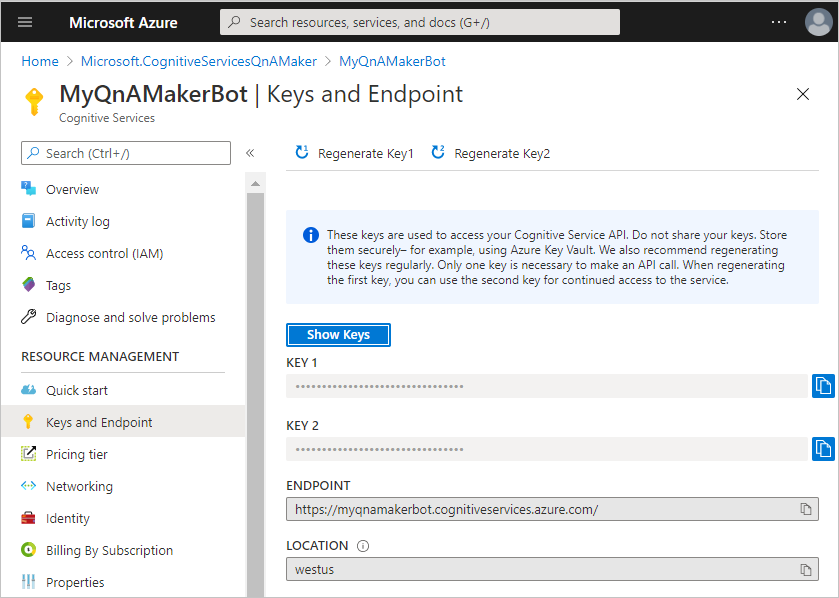
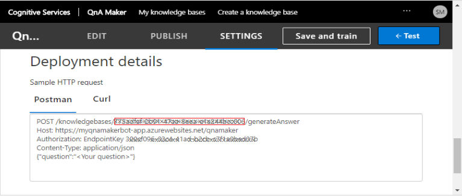

# Deploy QnA Maker knowledge base using the Bot Framework qnamaker CLI commands

[!INCLUDE [applies-to-v4](../includes/applies-to.md)]

The Bot Framework Command Line Interface (CLI) lets you automate the management of QnA Maker knowledge base. It lets you create, update, and delete QnA Maker knowledge base from the command line or a script. This article explains how to deploy QnA Maker knowledge base to a QnA Maker knowledge base in Azure.

## Prerequisites

- Basic understanding of [QnA Maker][qna-overview].
- Knowledge of the [.qna file format][qna-file-format].
- Have a bot project with `.qna` files.
- If working with adaptive dialogs, you should have an understanding of:
    - [Natural Language Processing in adaptive dialogs][natural-language-processing-in-adaptive-dialogs].
    - how the [QnA Maker recognizer][qna-maker-recognizer] is used.

## Using the qnamaker CLI commands to enable QnA Maker in your bot

This article describes how to perform some common tasks using the Bot Framework CLI.

1. [Create your QnA Maker resource in Azure Cognitive Services](#create-your-qna-maker-resource-in-azure-cognitive-services)
1. [Install the Bot Framework SDK CLI](#install-the-bot-framework-sdk-cli)
1. [Create your QnA Maker model](#create-your-qna-maker-model)
1. [Create your QnA Maker knowledge base](#create-your-qna-maker-knowledge-base)
1. [Create your QnA Maker initialization file](#create-your-qna-maker-initialization-file)
1. [Publish your QnA Maker knowledge base](#publish-your-qna-maker-knowledge-base)

Once your bot project's QnA Maker knowledge base `.qna` files have been created, you are ready to follow the steps outlined in this article to create your QnA Maker knowledge base.

## Create your QnA Maker resource in Azure Cognitive Services

The QnA Maker resource is an [Azure Cognitive Services][cognitive-services-overview] resource that you create using Azure's [Create Cognitive Services][create-cognitive-services] page. This provides the security keys and endpoint needed to access your QnA Maker knowledge base in Azure.

1. Go to the Azure [Create Cognitive Services][create-cognitive-services] page.  
2. Enter values for each of the fields, then select the **Review + create** button.

   

    > [!NOTE]
    > When entering the **Resource Group** and **Name**, keep in mind that you cannot change these values later. Also note that the value you give for **Name** will be part of your **Endpoint URL**.

3. Review the values to ensure they are correct, then select the **Create** button.

The QnA Maker resource includes information your bot will use to access your QnA Maker knowledge base:

- **Keys**. These are called _subscription keys_ and are auto generated. You will need the subscription key when referencing your QnA Maker resource for any action, such as when creating or updating your QnA Maker knowledge base which will be detailed in this article. You can find the keys in the **Keys and Endpoint** blade in your QnA Maker resource.
- **Endpoint**. This is auto-generated using the QnA Maker resource name that you provide when creating it. It has the following format: `https://<qnamaker-resource-name>.cognitiveservices.azure.com/`. When referencing your QnA Maker resource for any action, such as when creating your QnA Maker knowledge base which will be detailed in this article. You can find the key in the **Keys and Endpoint** blade in your QnA Maker resource. 

    > [!TIP]
    >
    > It is important to understand the difference between this QnA Maker resource authoring endpoint which is referenced in all BF CLI qnamaker authoring commands and the QnA Maker Knowledge base endpoint key which is referenced in a source code configuration files such as appsettings.json in C#, or `.env` in JavaScript or `config.py` in Python.

- **Location**. This is the Azure region that contains your QnA Maker knowledge base. You select this when creating the QnA Maker resource.

   

## Install the Bot Framework SDK CLI

If you have already installed the Bot Framework CLI you can skip ahead to [Create your QnA Maker model](#create-your-qna-maker-model).

[!INCLUDE [applies-to-v4](../includes/install-bf-cli.md)]

## Create your QnA Maker model

Once you have created the individual `.qna` files for your bot, you can convert them into a single _QnA Maker model_ using the `qnamaker:convert` command. The QnA Maker model is a JSON file used to create a QnA Maker knowledge base.

To create your QnA Maker model:

``` cli
bf qnamaker:convert -i <input-folder-name> -o <output-folder-name> --name <QnA-KB-Name> -r
```

In the following example, this command will recursively search for all `.qna` files in the _dialogs__ directory and any subdirectories and merge them into a single file named **converted.json** in the _output_ directory. This JSON file will contain all of the information needed to create a QnA Maker KB, including the name _MyQnAMakerBot_ which will be the name of the QnA Maker knowledge base that will exist in Azure.

> `bf qnamaker:convert -i dialogs -o output --name MyQnAMakerBot -r`

For additional information on using this command, see [`bf qnamaker:convert`][bf-qnamakerconvert] in the BF CLI QnA Maker readme.

## Create your QnA Maker knowledge base

The _QnA Maker resource_ you perviously created consists of two subscription keys and an endpoint. These are values that you need when creating your QnA Maker knowledge base (QnA Maker KB). You can have multiple QnA Maker KBs associated with a single QnA Maker resource, each QnA Maker KB will have its own ID, named `kbId`. This value will be returned as a part of the creation process. You will need this ID when referring to this QnA Maker KB in the future. This QnA Maker KB provides your bot with all functionality provided by QnA Maker.

To create your QnA Maker KB:

``` cli
bf qnamaker:kb:create -i <QnA-Maker-model-JSON-file> --subscriptionKey <Subscription-Key> --name <QnA-Maker-kb-name>
```

> [!NOTE]
>
> - The input file for this command is the file that is created by running the `qnamaker:convert` command as discussed in the previous step. The filename is **converted.json** by default.
> - The `name` option is the name of the QnA Maker KB and is optional if the QnA Model JSON file has a value for the name property, otherwise it will be required.

For additional information on using this command, see [`bf qnamaker:kb:create`][bf-qnamakerkbcreate] in the BF CLI QnA Maker readme.

## Create your QnA Maker initialization file

You will use the knowledge base ID (`kbId`) returned when your created the QnA Maker KB in the previous step when creating your init file using the `qnamaker:init` command. This will create a JSON file containing the data that is required when running many of the QnAMaker BF CLI commands, these values include _subscriptionKey_, _kbId_, _endpointKey_ and _hostname_. Once this file is created, all future BF CLI commands will automatically get these values from this init file.

``` cli
bf qnamaker:init
```

To create the QnA Maker CLI init file:

1. From your console, enter `bf qnamaker:init`
1. You will be prompted for the subscription key to your QnA Maker Cognitive Services resource in Azure. You can find this in the _Keys and Endpoint_ blade:

    

1. Next you will be prompted for your knowledge base ID (`kbId`). You can find it in [QnAMaker](https://www.qnamaker.ai/) in the _Deployment details_ section of the _SETTINGS_ page:

     

1. The values are gathered and written out to the screen for you to verify. If correct type `yes` or just press the **Enter** key.
1. The file is then created and saved to  _C:\Users\<unsername>\AppData\Local\@microsoft\botframework-cli\config.json_. Since this file contains sensitive data it is not saved in the same directory as your bot's project files to prevent it from being checked into any potentially unsecured location when checking in your source code.

> [!TIP]
> When you enter a `bf qnamaker` CLI command, it will automatically look for the _subscriptionKey_, _kbId_, _endpointKey_ and _hostname_ values in this init file unless you include them when entering the command, at which point the values entered will override the values from the init file.

For additional information on using this command, see [`bf qnamaker:init`][bf-qnamakerinit] in the BF CLI QnA Maker readme.

## Publish your QnA Maker knowledge base

Newly created QnA Maker KBs are automatically published to the _test_ endpoint where it can be tested prior to it going live. For general information about testing your KB, see [Test your knowledge base in QnA Maker][test-knowledge-base].

Once tested you can use the `qnamaker:kb:publish` to publish it to the _production_ endpoint.

To publish your QnA Maker knowledge base:

``` cli
bf qnamaker:kb:publish
```

To publish your QnA Maker knowledge base if you do not have an [init file](#create-your-qna-maker-initialization-file) file:

``` cli
bf qnamaker:kb:publish --subscriptionKey <Subscription-Key> --kbId <knowledge-base-id>
```

> [!TIP]
>
> If scripting this process from end to end you can also script the testing process. For additional information see [Test knowledge base with batch questions and expected answers][batch-testing].

<!-------------------------------------------------------------------------------------------------------------------------->
## Publishing to production using the build command

It is helpful to understand how the process of deploying a QnA Maker KB works, and after completing this article up to this point, you should have a better understanding of the processes involved to publish to your test endpoint using the Bot Framework CLI commands.

There is another BF CLI command that combines most of the commands discussed in this article into a single command that you can use to create or update, then train and publish a QnA Maker knowledge base to the _production_ endpoint, and that is the `qnamaker:build` command. Since the `build` command only publishes to the production endpoint you can use it separately from the previous commands discussed in this article which can be used during the development process to publish to the test endpoint where all required testing can take place before publishing to production.

The QnAMaker build command combines all the following actions into a single command:

1. Creates one QnA Maker model for [every locale](#qna-and-multiple-language-variations) found using your existing `.qna` files.
1. Creates a new QnA Maker KB if none exists, otherwise it will overwrite the existing KB.
1. It trains your QnA Maker knowledge base then publishes it to the production endpoint.
1. If you include the optional `dialog` parameter, it will output a `.dialog` definition file that can be used by the [QnA Maker recognizer][qna-maker-recognizer]. This is explained in [The dialog file](#the-dialog-file) section.

### How to use the build command

The QnAMaker build command with its required parameters:

``` cli
mkdir generated
bf qnamaker:build  --in Dialogs --out generated --log --botName QnAMakerSampleBot --subscriptionKey <Subscription-Key>
```

> [!IMPORTANT]
>
> This command will overwrite your previous QnA Maker model as well any content you might have in your QnA Maker KB, including any that was created directly in [QnA Maker.ai](https://www.qnamaker.ai/).

#### The qnamaker:build parameters

- `in`: This is the directory, along with its sub-directories, that will be searched for .qna files.
- `out`: This is the directory that the files generated by this process are saved to.
- `log`: A boolean value that determines if a log is created during this process.
- `botName`: The name of your bot. This will be used to generate the name of the QnA Maker knowledge base, this is explained in more detail in the [QnA Maker Knowledge Bases created](#qna-maker-knowledge-bases-created) section below.
- `subscriptionKey`: The same subscription key that is in your [initialization file](#create-your-qna-maker-initialization-file).

For information on additional parameters, see [bf qnamaker:build][bf-qnamakerbuild] in the BF CLI qnamaker readme.

There is another useful parameter `qnaConfig` which points to a configuration file that provides the same functionality to the `build` command as the [initialization file](#create-your-qna-maker-initialization-file) discussed previously provides to all other qnamaker CLI commands.

#### The qnamaker configuration file


#### QnA and multiple language variations

Each [.qna file][qna-file-format] can have multiple language variations, one for each language supported.

The pattern for the `.qna` file name when language variants are used is as follows:

`<file-name>.<locale>.qna`

For example:

```
example.en-us.qna
example.fr-fr.qna
example.de-de.qna
etc.
```

In the above example, each one of the `.qna` files will result in one QnA Maker KB created for each of the languages.

> [!TIP]
>
> If the language cannot be determined from file name, then the value specified in the CLI parameter `--defaultCulture` will be used. If the CLI parameter `--defaultCulture` is missing, the language will default to `en-us`.

### QnA Maker Knowledge Bases created

The QnA Maker knowledge bases created using the `qnamaker:build` command are named using a combination of the value you proved as the `botName` parameter followed by the user name you are logged in as, the locale followed by `.qna`.

The QnA Maker KB name:

`<botName>(<user-name>).locale.qna`

For example, if your botName is _MyProject_ and your username is _vishwac_, the names of your KBs would be as follows:

```
MyProject(vishwac).en-us.qna
MyProject(vishwac).fr-fr.qna
MyProject(vishwac).de-de.qna
```

> [!TIP]
>
> Including the username as part of the KB name enables multiple people to work independently.
> You can override the username value using the build commands `--suffix` parameter.

#### The dialog file

When you use the optional `--dialog` parameter, a dialog file will be generated for all language variations of each of your `.qna` files.

<!-------------------------------------------------------------------------------------------------->
[qna-overview]: /azure/cognitive-services/qnamaker/overview/overview
[cognitive-services-overview]: /azure/cognitive-services/Welcome
[create-cognitive-services]: https://portal.azure.com/#create/Microsoft.CognitiveServicesQnAMaker
[qna-maker-recognizer]: bot-builder-concept-adaptive-dialog-recognizers.md#qna-maker-recognizer
[qna-file-format]: ../file-format/bot-builder-qna-file-format.md

[natural-language-processing-in-adaptive-dialogs]: bot-builder-concept-adaptive-dialog-recognizers.md#introduction-to-natural-language-processing-in-adaptive-dialogs

[bf-cli-overview]: bf-cli-overview.md

[bf-qnamakerconvert]: https://aka.ms/botframework-cli-qnamaker#bf-qnamakerconvert
[bf-qnamakerkbcreate]: https://aka.ms/botframework-cli-qnamaker#bf-qnamakerkbcreate
[bf-qnamakerkbpublish]: https://aka.ms/botframework-cli-qnamaker#bf-qnamakerkbpublish
[bf-qnamakerinit]: https://aka.ms/botframework-cli-qnamaker#bf-qnamakerinit
[bf-qnamakerbuild]: https://aka.ms/botframework-cli-qnamaker#bf-qnamakerbuild

[test-knowledge-base]: /azure/cognitive-services/QnAMaker/how-to/test-knowledge-base
[batch-testing]: /azure/cognitive-services/QnAMaker/quickstarts/batch-testing
<!-------------------------------------------------------------------------------------------------->
