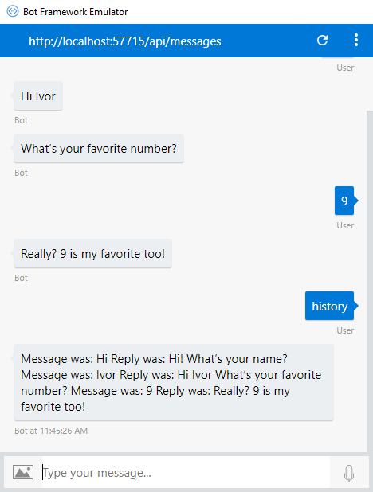

# Create Middleware that logs in Cosmos DB

While useful middleware is provided with the SDK, there are situations where you will need to implement your own middleware to achieve the desired goal.

In this sample, we'll create a middleware layer connecting to Cosmos DB to log all the received messages, and the replies we sent back. The code you'll see here is available as full source code, provided with our [samples](../dotnet/bot-builder-dotnet-samples.md).

## Set up

We need to get a few things set up before getting into the code.

### Create your database

First, we need to have somewhere to store our database.  This can be done through an Azure account, or for testing purposes you can use the [Cosmos DB emulator](https://docs.microsoft.com/en-us/azure/cosmos-db/local-emulator). Whichever method you choose, we need an endpoint URI and key for the database.

The sample, and the code provided here, is using the emulator. The endpoint and key are those provided for the Cosmos DB test account, which are common values provided with the emulator documentation and cannot be used for production.

If you would like to use a real Azure Cosmos DB, follow step 1 of the [Cosmos DB getting started](https://docs.microsoft.com/en-us/azure/cosmos-db/sql-api-get-started) topic. Once that's done, both your endpoint URI and key are available in the **Keys** tab in your database settings. These values will be needed for our configuration file below.

### Build a basic bot

The rest of this topic builds off of a basic bot, such as the HelloBot built in the overview. You can use the [Bot Framework Emulator](https://github.com/Microsoft/BotFramework-Emulator) to connect to, converse with, and test your bot.

In addition to the references needed for standard bots using the Bot Framework, you'll need to add references to the following NuGet packages:

* Microsoft.Azure.Documentdb.Core
* System.Configuration.ConfigurationManager

These libraries are used for communication with the database, and enable use of a configuration file, respectively.

### Add configuration file

Use of a configuration file is good practice for several reasons, so we'll use one here. Our configuration data is short and simple, however you can add other configuration settings to this as your bot gets more complex.

# [C#](#tab/cs)
1. Add a file to your project named `app.config`.
2. Save the following information to it. The endpoint and key are defined for the local emulator, but can be updated for your Cosmos DB instance.
    ```
    <?xml version="1.0" encoding="utf-8"?>
    <configuration>
        <appSettings>
            <add key="EmulatorDbUrl" value="https://localhost:8081"/>
            <add key="EmulatorDbKey" value="C2y6yDjf5/R+ob0N8A7Cgv30VRDJIWEHLM+4QDU5DE2nQ9nDuVTqobD4b8mGGyPMbIZnqyMsEcaGQy67XIw/Jw=="/>
        </appSettings>
    </configuration>
    ```
# [JavaScript](#tab/js)
1. Add a file to your project named `config.js`.
2. Save the following information to it. The endpoint and key are defined for the local emulator, but can be updated for your Cosmos DB instance.
    ```javascript
        var config = {}

        config.EmulatorServiceEndpoint = "https://localhost:8081";
        config.EmulatorAuthKey = "C2y6yDjf5/R+ob0N8A7Cgv30VRDJIWE+4QDU5DE2nQ9nDuVTqobD4b8mGGyPMbIZnqyMsEcaGQy67XIw/Jw==";
        config.database = {
            "id": "Tasks"
        };
        config.collection = {
            "id": "Items"
        };

        module.exports = config;
    ```

---

If you are using an actual Cosmos DB, you can replace the values of the two keys above with the values you have in your Cosmos DB settings. Alternatively, you can add two more keys to your configuration, allowing you to switch between the emulator for testing and your actual Cosmos DB, such as:

# [C#](#tab/cs)
```
    <add key="ActualDbUrl" value="<your database URI>"/>
    <add key="ActualDbKey" value="<your database key>"/>
```
 If you do add two additional keys and want to use the actual database, be sure to specify the correct key in the constructor below instead of `EmulatorDbUrl` and `EmulatorDbKey`.

# [JavaScript](#tab/js)
```
    config.ActualServiceEndpoint = "your database URI;
    config.ActualAuthKey = "your database key";
```

If you do add two additional keys and want to use the actual database, be sure to specify the correct key in the constructor below instead of `EmulatorServiceEndpoint` and `EmulatorAuthKey`.

---


## Creating your middleware

# [C#](#tab/cs)
Before we start writing the actual middleware logic, create a new class in your bot project for the middleware. Once you have that class, change the namespace to what we use for the rest of our bot, `Microsoft.Bot.Samples`. Here you'll see we added references to a few new libraries:

* `Newtonsoft.Json;`
* `Microsoft.Azure.Documents;`
* `Microsoft.Azure.Documents.Client;`
* `Microsoft.Azure.Documents.Linq;`

The various `Microsoft.Azure.Documents.*` are for different parts of communicating with our database, and `Newtonsoft.Json` helps us parse the JSON going back and forth to our database.

Lastly, every piece of middleware implements `IMiddleware` requiring us to define the appropriate handlers for middleware to work properly.

```cs
using System;
using System.Collections.Generic;
using System.Threading.Tasks;
using System.Configuration;
using Newtonsoft.Json;
using Microsoft.Bot.Builder;
using Microsoft.Bot.Schema;
using Microsoft.Azure.Documents;
using Microsoft.Azure.Documents.Client;
using Microsoft.Azure.Documents.Linq;

namespace Microsoft.Bot.Samples
{
    public class CosmosMiddleware : IMiddleware
    {
        ...
```

# [JavaScript](#tab/js)
Before we start writing the actual middleware logic, we need to create our custom Middleware that will start with `onTurn()`. 

```javascript
adapter.use({onTurn: async (context, next) =>{
    // Middleware logic here...
}})
    
```

---

#### Defining local variables

# [C#](#tab/cs)
Next, we need local variables for manipulating our database and a class to store the information we want to log. That information class, which we call `Log`, defines what the JSON properties associated with each member will be named. We'll get back to that further on.

```cs
    private string Endpoint;
    private string Key;
    private static readonly string Database = "BotData";
    private static readonly string Collection = "BotCollection";
    public DocumentClient docClient;

    public class Log
    {
        [JsonProperty("Time")]
        public string Time;

        [JsonProperty("MessageReceived")]
        public string Message;

        [JsonProperty("ReplySent")]
        public string Reply;
    }
```

# [JavaScript](#tab/js)
Next, we need a local variable to store our information that we want to log. In the middleware we must access conversationState which has Cosmos DB as the storage provider. The variable `info` will be the state's object that we will read and write to. 

```javascript
// Add conversation state middleware
const conversationState = new ConversationState(storage);
adapter.use(conversationState);

adapter.use({onTurn: async (context, next) =>{

    const info = conversationState.get(context);
    // More middleware logic 
}})
```

--- 


#### Initialize database connection

# [C#](#tab/cs)
Our constructor of this middleware takes care of pulling the necessary information out of our configuration file defined above and creating the `DocumentClient`, which allows us to read and write from our database. We also make sure our database and collection are set up.

Proper use of a new `DocumentClient` requires it to be disposed of, so our destructor does just that.

Creation of our database depends on attempting to do a basic read of first our database, then the collection within that database. If we hit a `NotFound` exception, we catch that and create the database or collection instead of throwing it up the stack. In most cases these will already be created, but for the sake of this sample this allows us to not worry about the creation of that database before first run. In the sample code, the database and collection are split into two functions for simplicity, but they have been combined in the snippet below.

For more on CosmosDB, take a look at their [website](https://docs.microsoft.com/en-us/azure/cosmos-db/). For the remainder of this topic, we'll breeze over details on Cosmos DB itself, and focus on what's required for your bot to use it.

The definition of `Key`, `Endpoint`, and `docClient` were included in a snippet above, and have only been copied here for clarity.

```cs
    private string Endpoint;
    private string Key;
    // ...
    public DocumentClient docClient;
    // ...

    public CosmosMiddleware()
    {
        Endpoint = ConfigurationManager.AppSettings["EmulatorDbUrl"];
        Key = ConfigurationManager.AppSettings["EmulatorDbKey"];
        docClient = new DocumentClient(new Uri(Endpoint), Key);
        CreateDatabaseAndCollection().ConfigureAwait(false);
    }

    ~CosmosMiddleware()
    {
        docClient.Dispose();
    }

    private async Task CreateDatabaseAndCollection()
    {
        try
        {
            await docClient.ReadDatabaseAsync(UriFactory.CreateDatabaseUri(Database));
        }
        catch (DocumentClientException e)
        {
            if (e.StatusCode == System.Net.HttpStatusCode.NotFound)
            {
                await docClient.CreateDatabaseAsync(new Database { Id = Database });
            }
            else
            {
                throw;
            }
        }

        try
        {
            await docClient.ReadDocumentCollectionAsync(UriFactory.CreateDocumentCollectionUri
                (Database, Collection));
        }
        catch (DocumentClientException e)
        {
            if (e.StatusCode == System.Net.HttpStatusCode.NotFound)
            {
                await docClient.CreateDocumentCollectionAsync(
                    UriFactory.CreateDatabaseUri(Database),
                    new DocumentCollection { Id = Collection });
            }
            else
            {
                throw;
            }
        }
    }
```

# [JavaScript](#tab/js)
Creation of our database depends on attempting to do a basic read of first our database, then the collection within that database. If we hit `undefined`, we catch that and create an object called `log` that will be set to an empty array. In most cases `log` will already be created, but for the sake of this sample this allows us to not worry about the creation of that database before first run. In the sample code, we check to see if `info.log` is undefined. If so set it to an empty array.

```javascript
adapter.use({onTurn: async (context, next) =>{

    const info = conversationState.get(context);

    if(info.log == undefined){
        info.log = [];
    }

    // More bot logic below
}})
```
---

#### Read from database logic

The last helper function reads from our database and returns the most recent specified number of records. It's worth noting that there are better database practices for retrieving data than we use here, particularly when your data store is significantly larger.

# [C#](#tab/cs)
```cs
    public async Task<string> ReadFromDatabase(int numberOfRecords)
    {
        var documents = docClient.CreateDocumentQuery<Log>(
                UriFactory.CreateDocumentCollectionUri(Database, Collection))
                .AsDocumentQuery();
        List<Log> messages = new List<Log>();
        while (documents.HasMoreResults)
        {
            messages.AddRange(await documents.ExecuteNextAsync<Log>());
        }

        // Create a sublist of messages containing the number of requested records.
        List<Log> messageSublist = messages.GetRange(messages.Count - numberOfRecords, numberOfRecords);

        string history = "";

        // Send the last 3 messages.
        foreach (Log logEntry in messageSublist)
        {
            history += ("Message was: " + logEntry.Message + " Reply was: " + logEntry.Reply + "  ");
        }

        return history;
    }
```

# [JavaScript](#tab/js)

The code below is still within the `onTurn()` function and will be called if the user inputs the string "history".

```javascript
adapter.use({onTurn: async (context, next) =>{

    const utterance = (context.activity.text || '').trim().toLowerCase();
    const isMessage = context.activity.type === 'message';
    const info = conversationState.get(context);

    if(info.log == undefined){
        info.log = [];
    }

    if(isMessage && utterance == 'history'){
        // Loop through the info.log array
        var logHistory = "";
        for(var i = 0; i < info.log.length; i++){
            logHistory += info.log[i] + " ";
        }
        await context.sendActivity(logHistory);
        // Short circuit the middleware
        return
    }
    //...
}})

```

---

#### Define OnTurn()

The standard middleware method `OnTurn()` then handles the rest of the work. We only want to log when the current activity is a message, which we check for both before and after calling `next()`.

The first thing we check is if this is our special case message, where the user is asking for the most recent history. If so, we call read from our database to get the most recent records, and send that to the conversation. Since that completely handles the current activity, we short circuit the pipeline instead of passing on execution.

To get the response that bot sends, we create a handler every time we recieve a message to grab those responses, which can be seen in the lambda we give to `OnSendActivity()`. It builds a string to collect all the messages sent through `SendActivity()` for this context object.

Once execution returns up the pipeline from `next()`, we assemble our log data and write it out to the database. 

Look in the Cosmos DB data explorer after a few messages are sent to this bot, and you should see your data in individual records. When examining one of these records, you should see that the first three items are the three values of our log data, named as the string we specified for their respective `JsonProperty`.

# [C#](#tab/cs)
```cs
    public async Task OnTurn
        (ITurnContext context, MiddlewareSet.NextDelegate next)
    {
        string botReply = "";

        if (context.Activity.Type == ActivityTypes.Message)
        {
            if (context.Activity.Text == "history")
            {
                // Read last 3 responses from the database, and short circuit future execution.
                await context.SendActivity(await ReadFromDatabase(3));
                return;
            }

            // Create a send activity handler to grab all response activities 
            // from the activity list.
            context.OnSendActivity(async (activityContext, activityList, activityNext) =>
            {
                foreach (Activity activity in activityList)
                {
                    botReply += (activity.Text + " ");
                }
                await activityNext();
            });
        }

        // Pass execution on to the next layer in the pipeline.
        await next();

        // Save logs for each conversational exchange only.
        if (context.Activity.Type == ActivityTypes.Message)
        {
            // Build a log object to write to the database.
            var logData = new Log
            {
                Time = DateTime.Now.ToString(),
                Message = context.Activity.Text,
                Reply = botReply
            };

            // Write our log to the database.
            try
            {
                var document = await docClient.CreateDocumentAsync(UriFactory.
                    CreateDocumentCollectionUri(Database, Collection), logData);
            }
            catch (Exception ex)
            {
                // More logic for what to do on a failed write can be added here
                throw ex;
            }
        }
    }
```

# [JavaScript](#tab/js)

Building off from our `onTurn` function described above.

```javascript
adapter.use({onTurn: async (context, next) =>{

    const utterance = (context.activity.text || '').trim().toLowerCase();
    const isMessage = context.activity.type === 'message';
    const info = conversationState.get(context);

    if(info.log == undefined){
        info.log = [];
    }

    if(isMessage && utterance == 'history'){
        // Loop through info.log 
        var logHistory = "";
        for(var i = 0; i < info.log.length; i++){
            logHistory += info.log[i] + " ";
        }
        await context.sendActivity(logHistory);
        // Short circuit the middleware
        return
    } else if(isMessage){
        // Store the users response
        info.log.push(`Message was: ${context.activity.text}`); 

        await context.onSendActivities(async (handlerContext, activities, handlerNext) => 
        {
            // Store the bot's reply
            info.log.push(`Reply was: ${activities[0].text}`);
            
            await handlerNext(); 
        });
        await next();
    }
}})

```

---

## Sample output

In the full sample, the bot uses the prompt library to ask for the user's name and favorite number. Details on the prompt library can be found on the [prompting users](~/v4sdk/bot-builder-prompts.md) topic.

Here is an example conversation with our sample bot that is running the code outlined above.



## Additional resources

* [Cosmos DB](https://docs.microsoft.com/en-us/azure/cosmos-db/)
* [Cosmos DB emulator](https://docs.microsoft.com/en-us/azure/cosmos-db/local-emulator)

