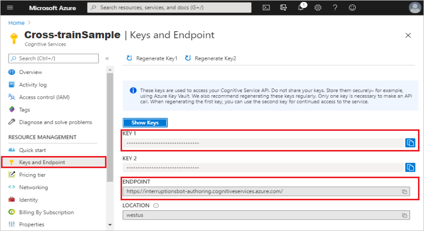
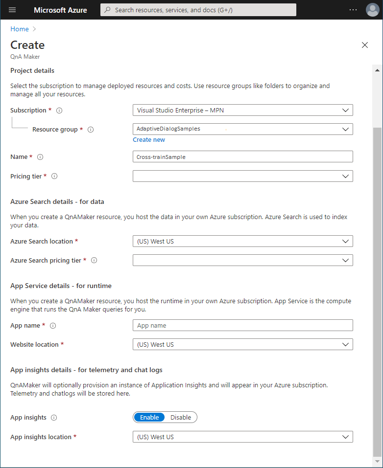
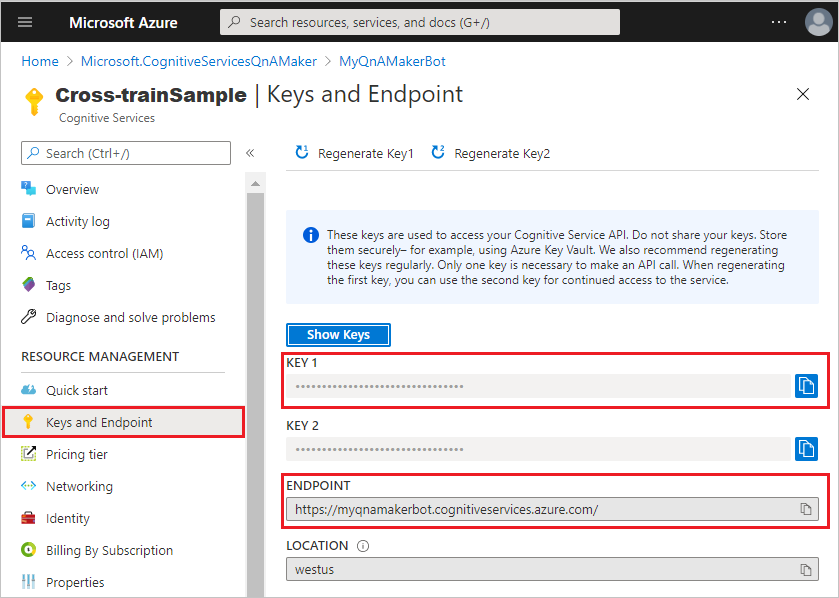
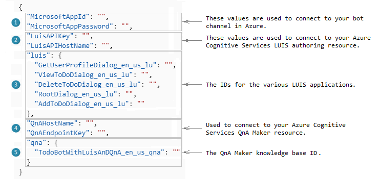
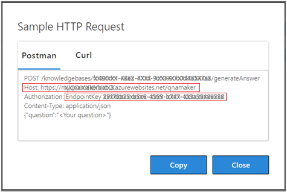

# Create a bot cross trained to use both LUIS and QnA Maker recognizers

[!INCLUDE [applies-to-v4](../includes/applies-to.md)]

This how to article will walk you through the steps required to create a bot that integrates the capabilities of both [LUIS][luis] and [QnA Maker][qnamaker] together in order to determine the best possible response to the user, using [Language Generation][language-generation], and tying all these features together into a ToDo bot.

Integrating the capabilities of both [LUIS][luis] and [QnA Maker][qnamaker] together requires the use of the [CreateCrossTrainedRecognizer][createcrosstrainedrecognizer].

## Prerequisites

This article will walk you through the steps required to create a fully functional bot using adaptive dialogs. In order to accomplish this, you will need to understand the various concepts involved. Before you begin, you should have a solid basic understanding of the following concepts:

- [Introduction to adaptive dialogs](bot-builder-adaptive-dialog-introduction.md)
- [Events and triggers in adaptive dialogs](bot-builder-concept-adaptive-dialog-triggers.md)
- [Actions in adaptive dialogs](bot-builder-concept-adaptive-dialog-actions.md)
- [Asking for user input in adaptive dialogs](bot-builder-concept-adaptive-dialog-inputs.md)
- [Recognizers in adaptive dialogs](bot-builder-concept-adaptive-dialog-recognizers.md)
- [Language Generation in adaptive dialogs](bot-builder-concept-adaptive-dialog-generators.md)
- [Memory scopes and Managing state in adaptive dialogs](bot-builder-concept-adaptive-dialog-memory-states.md)
- [Handling interruptions in adaptive dialogs](bot-builder-concept-adaptive-dialog-interruptions)
- [.lu file format][lu-templates]
- [.qna file format][qna-file-format]

You will also need an Azure account and the sample code:

- If you don't have an Azure subscription, you can [Create your Azure free account]][create-azure-account] before you begin.
- For sample code, this article references the adaptive **Todo bot with LUIS and QnA Maker** sample in [**C#**](https://aka.ms/cs-adaptive-multi-turn-sample).

## What is covered

This article describes how to create a bot that is cross trained to use both LUIS and QnA Maker recognizers to respond to a user. This will entail the following steps:

1. Introduction to [The Todo bot with LUIS and QnA Maker sample](#the-todo-bot-with-luis-and-qna-maker-sample)
1. [Create your LUIS authoring resource in Azure Cognitive Services](#create-your-luis-authoring-resource-in-azure)
1. [Create your QnA Maker resource in Azure Cognitive Services](#create-your-qna-maker-resource-in-azure-cognitive-services)
1. [Install the Bot Framework SDK CLI](#install-the-bot-framework-sdk-cli)
1. [Generate cross-trained LU models](#generate-cross-trained-lu-models)
1. [Create and publish LUIS applications using the build command](#create-and-publish-luis-applications-using-the-build-command)
1. [Create and publish QnA Maker knowledge bases using the build command](#create-and-publish-qna-maker-knowledge-bases-using-the-build-command)
1. [Update your project's configuration file to include connection information for LUIS and QnA Maker](#update-your-project's-configuration-file-to-include-connection-information-for-luis-and-qna-maker)
1. [Testing the bot using Bot Framework Emulator](#testing-the-bot-using-bot-framework-emulator)

## The Todo bot with LUIS and QnA Maker sample

The adaptive **Todo bot with LUIS and QnA Maker** ([**C#**](https://aka.ms/cs-adaptive-multi-turn-sample)) sample has five `.lu` files, five `.qna` files and six `.lg` files. When creating the cross-trained language understanding models you will combine the `.lu` and `.qna` files in a way that will enable you to utilize the capabilities of both LUIS and QnA Maker together in the same recognizer, enabling you to train the recognizer how best to interpret and respond to a users request. After running the cross-train command you will have the same number of each file, but they will be updated so that the `.lu` file contains the required `.qna` information and the `.qna` files contains the required `.lu` information to enable the [Cross-trained recognizer set][crosstrainedrecognizerset] to work.

To clone the samples repository, enter the following git command from a console window: `git clone https://github.com/Microsoft/botbuilder-samples.git`

## Create your LUIS authoring resource in Azure

The LUIS authoring resource is an [Azure Cognitive Services][cognitive-services-overview] resource that you create using Azure's [Create LUIS Cognitive Services][create-cognitive-services-luis] page. You can think of this as a container for your LUIS applications and the model, or models that those LUIS applications are comprised of. The LUIS authoring resource provides a secure way to author your LUIS resources.  You need this to be able to perform the tasks such as create, update, train, and publish a LUIS application that are required to enable LUIS functionality in your bot.

1. Go to the Azure [Create LUIS Cognitive Services][create-cognitive-services-luis] page.  
2. In the **Create options** section, select **Authoring** to create a LUIS authoring resource.

   

3. Enter values for each of the fields, then select the **Review + create** button.

   

    > [!NOTE]
    > When entering the **Resource Group** and **Name**, keep in mind that you cannot change these values later. Also note that the value you give for **Name** is not only the name of your LUIS service, it is also the custom domain name in your endpoint and will be part of your **Endpoint URL**.

4. Review the values to ensure they are correct, then select the **Create** button.

The LUIS authoring resource includes information needed to create or access your LUIS application:

- **Keys**. These are generally referred  to as _subscription keys_. You may also see them referred to as _authoring keys_ since they refer to keys in the LUIS authoring resource as opposed to the [LUIS prediction resource][luis-prediction-resource]. These keys are auto generated. You will need an authoring key when referencing your LUIS authoring resource for any action, such as when creating your LUIS Application. You can find the keys in the **Keys and Endpoint** blade in your LUIS authoring resource.
- **Endpoint**. This is auto-generated using the LUIS authoring resource name that you provide when creating it. It has the following format: `https://<luis-resource-name>.cognitiveservices.azure.com/`. When referencing your LUIS authoring resource for any action, such as when creating your LUIS App and Models which will be detailed in this article. You can find the key in the **Keys and Endpoint** blade in your LUIS authoring resource.
- **Location**.   This is the Azure region that contains your LUIS authoring resource. You select this when creating the LUIS authoring resource.

   

> [!TIP]
>
> There are two types of subscription keys associated with a LUIS resource, depending on which type of [LUIS resource][luis-prediction-resource] you are referring to. There is the LUIS _authoring_ resource described in this section, which has an _authoring key_. There is also the LUIS _prediction_ resource, which has a _prediction key_. both are _subscription keys_ and both are in the _Keys and endpoint_ blade.

## Create your QnA Maker resource in Azure Cognitive Services

Like the LUIS resource, the QnA Maker resource is also an [Azure Cognitive Services][cognitive-services-overview] resource that you create using Azure's [Create Qna Maker Cognitive Services][create-cognitive-services-qnamaker] page. This provides the security keys and endpoint needed to access your QnA Maker KB in Azure.

1. Go to the Azure [Create Qna Maker Cognitive Services][create-cognitive-services-qnamaker] page.
2. Enter values for each of the fields, then select the **Review + create** button.

   

    > [!NOTE]
    > When entering the **Resource Group** and **Name**, keep in mind that you cannot change these values later. Also note that the value you give for **Name** is not only the name of your QnA Maker service, it is also the custom domain name in your endpoint and will be part of your **Endpoint URL**.

3. Review the values to ensure they are correct, then select the **Create** button.

The QnA Maker resource includes information your bot will use to access your QnA Maker knowledge base:

- **Keys**. These are _subscription keys_ and are auto-generated. You will need the subscription key when referencing your QnA Maker resource for any action, such as when creating or updating your QnA Maker Knowledge Base. You can find the keys in the **Keys and Endpoint** blade in your QnA Maker resource.
- **Endpoint**. This is auto-generated using the QnA Maker resource name that you provide when creating it. It has the following format: `https://<qnamaker-resource-name>.cognitiveservices.azure.com/`. When referencing your QnA Maker resource for any action, such as when creating your QnA Maker Knowledge Base. You can find the key in the **Keys and Endpoint** blade in your QnA Maker resource.

    > [!TIP]
    >
    > It is important to understand the difference between this QnA Maker resource authoring endpoint which is referenced in all BF CLI qnamaker authoring commands and the QnA Maker Knowledge base endpoint key which is referenced in a source code configuration files such as appsettings.json in C#, or `.env` in JavaScript or `config.py` in Python.

- **Location**. This is the Azure region that contains your QnA Maker Knowledge Base. You select this when creating the QnA Maker resource.

   

## Install the Bot Framework CLI

[!INCLUDE [applies-to-v4](../includes/install-bf-cli.md)]

## Generate cross-trained LU models

<!-- ### Create your cross-trained LUIS models -->

Before running the build command to create your LUIS application in Azure cognitive services, you need to modify your `.lu` files to include the information required to enable it to defer user input to QnA Maker which it does by creating a new `DeferToRecognizer` intent which is created using the following format: `DeferToRecognizer_<recognizer-type>_<dialog-name>`. For example, in **RootDialog.lu** the new intent would be `DeferToRecognizer_QnA_RootDialog`, and it will contain the questions from **RootDialog.qna** as its user utterances. When a user asks any of these questions the bot will direct it to the [QnA Maker Recognizer][qna-maker-recognizer] for processing. Note also that **RootDialog.qna** references **ChitChat.qna**, and the contents of that referenced file will also be included in the new cross-trained **RootDialog.lu** file.

To create the cross-trained `.lu` files, you use the BF CLI `luis:cross-train` command:

``` cli
bf luis:cross-train -i <input-folder-name> -o <output-file-name> --config <cross-train-configuration-file>
```

#### The luis:cross-train parameters

- `in`: The directory, including sub-directories, that will be searched for both `.lu` and `.qna` files.
- `out`: The directory to save the new cross-trained `.lu` output files to. This is where the luis:build option will point to in its `--in` option.
- `config`: A cross-train configuration file is a JSON file that is necessary for the command to work. Here is an example cross-train configuration file for the **Todo bot with LUIS and QnA Maker** sample:

    ```json
    {
        // list each .lu file including variations per lang x locale.
        // Lang x locale is denoted using 4 letter code. e.g. it-it, fr-fr
        // Paths can either be absolute (full) paths or paths relative to this config file.
        "./RootDialog/RootDialog.lu": {
            // indicate if this is an .lu file for a root dialog.
            "rootDialog": true,
            // list of triggers within that dialog
            "triggers": {
                // Key is name of intent within the .lu file (in this case RootDialog.lu)
                // Value is the path to the child dialog's .lu file.
                "AddItem": "./AddToDoDialog/AddToDoDialog.lu",
                "DeleteItem": "./DeleteToDoDialog/DeleteToDoDialog.lu",
                "ViewItem": "./ViewToDoDialog/ViewToDoDialog.lu",
                "GetUserProfile": "./GetUserProfileDialog/GetUserProfileDialog.lu"
            }
        }
    }
    ```

> [!IMPORTANT]
>
> You need to run either the `luis:cross-train` command or the `qnamaker:cross-train` command, not both. by running `luis:cross-train`, all of the required cross-train information will be included in the resulting `.lu` files. Running both will work, but is unnecessary.

## Create and publish LUIS applications using the build command

For each `.lu` file, including `.lu` files for each locale, the build command combines all the following actions into a single command:

1. Creates one LUIS model for every locale found using your existing `.lu` files.
1. Using that model, it creates a new LUIS app in the specified Azure Cognitive Services resource if none exists, otherwise it will update the existing LUIS app.
1. When updating an existing LUIS app, it will automatically increment the versionId and optionally delete the old version.
1. Trains the new or updated LUIS app, then publishes it.

For a detailed explanation on how to use the `luis:build` command, see [Deploy LUIS applications using the Bot Framework luis CLI commands][luis-build].

## How to use the luis:build command

The LUIS build command with its required parameters:

``` cli
bf luis:build --in <input-file-or-folder> --out <output-file-or-folder> --authoringKey <subscription-key> --region <authoring-region>
```

The `luis:build` command will create all assets you need from your local `.lu` files.

### Required luis:build parameters

- `in`: The directory that will be searched for `.lu` files.
- `out`: The directory to save output files to.
- `botName`: The name of your bot. This will be used as the prefix for the name of the LUIS applications generated.
- `authoringKey`: This is the subscriptionKey.
- `region`: This defines the region to publish your LUIS applications.

For information on the additional options, see [bf luis:build][bf-luisbuild] in the BF CLI readme.

Alternatively, you can include these required, as well as any of the other parameters in a configuration file and refer to them using the `--luConfig` option.

### LUIS build configuration file

The following is a sample of the **luconfig.json** file that you can reference using the `--luConfig` option.

```json
{
    "in": "dialogs",
    "out": "generated",
    "botName":"MyProject",
    "AuthoringKey":"<your-32-digit-subscription-key>",
    "region": "westus",
    "schema": "app.schema",
    "defaultCulture":"en-us",
    "deleteOldVersion": true,
    "dialog": "multiLanguage",
    "fallbackLocale": "en-us",
    "force": true,  
    "suffix": "<value-to-replace-username>"
}
```

Once this configuration file is created, all you need to do is reference it in your `luis:build` command. For example:

``` cli
bf luis:build --luConfig luconfig.json
```

For a detailed explanation on how to use the `luis:build` command, see [Deploy LUIS applications using the Bot Framework luis CLI commands][luis-build].

## Create and publish QnA Maker knowledge bases using the build command

The QnAMaker build command combines all the following actions into a single command:

1. Creates one QnA Maker model for every locale found using your existing `.qna` files.
1. Creates a new QnA Maker KB if none exists, otherwise it will overwrite the existing KB.
1. It trains your QnA Maker KB then publishes it to the production endpoint.

For a detailed explanation on how to use the `qnamaker:build` command, see [Deploy QnA Maker knowledge base using the Bot Framework qnamaker CLI commands][qna-build].

### How to use the qnamaker:build command

The QnAMaker build command with its required parameters:

``` cli
bf qnamaker:build --in <input-file-or-folder> --out <folder-to-save-files-to> --subscriptionKey <Subscription-Key> --botName <bot-name> --log
```

> [!IMPORTANT]
>
> This command will overwrite your previous QnA Maker model as well any content you might have in your QnA Maker KB, including any content created directly in [QnA Maker.ai](https://www.qnamaker.ai/).

#### The qnamaker:build parameters

- `in`: The directory, including sub-directories, that will be searched for .qna files.
- `out`: The directory to save output files to.
- `log`: A Boolean value that determines if a log is created during this process.
- `botName`: The name of your bot. This will be used to generate the name of the QnA Maker KB, this is explained in more detail in the [Deploy QnA Maker knowledge base using the Bot Framework qnamaker CLI commands](#qna-maker-knowledge-bases-created) article.
- `subscriptionKey`: The same subscription key that is in your [initialization file][create-your-qna-maker-initialization-file].

For information on additional parameters, see [bf qnamaker:build][bf-qnamakerbuild] in the BF CLI qnamaker readme.

Alternatively, you can include these required parameters in a configuration file and provide them via the `qnaConfig` parameter.

#### The qnamaker configuration file

The qnamaker configuration file is a JSON file that can contain any valid `qnamaker:build` option.

```json
{
  "in": "<location-of-qna-files>",
  "out": "<location-to-save-output-files>",
  "subscriptionKey": "<Enter-subscription-key-here>",
  "botName": "<Enter-botName-here>"
}
```

Once created all you need to do is reference it in your `qnamaker:build` command, for example:

``` cli
bf qnamaker:build --qnaConfig qnaConfig.json
```

For a detailed explanation on how to use the `qnamaker:build` command, see [Deploy QnA Maker knowledge base using the Bot Framework qnamaker CLI commands][qna-build].

## Update your project's configuration file to include connection information for LUIS and QnA Maker

# [C#](#tab/csharp)

The configuration file is named **appsettings.json**. The following shows the configuration file for **Todo bot with LUIS and QnA Maker** sample:

```json
{
  "MicrosoftAppId": "",
  "MicrosoftAppPassword": "",
  "LuisAPIKey": "",
  "LuisAPIHostName": "",
  "luis": {
    "GetUserProfileDialog_en_us_lu": "",
    "ViewToDoDialog_en_us_lu": "",
    "DeleteToDoDialog_en_us_lu": "",
    "RootDialog_en_us_lu": "",
    "AddToDoDialog_en_us_lu": ""
  },
  "QnAHostName": "",
  "QnAEndpointKey": "",
  "qna": {
    "TodoBotWithLuisAnDQnA_en_us_qna": ""
  }
}
```

The configuration file **appsettings.json** explained:



1. The [Bot channels registration][bot-channels-registration] article details how to get the `MicrosoftAppId` and `MicrosoftAppPassword` values.
2. The ***LuisAPIKey*** is the `subscriptionKey`, and the ***LuisAPIHostName*** is the `ENDPOINT` value. Both values are found in _Keys and Endpoint_ blade in the Azure cognitive services LUIS authoring resource page as shown in the screen shot below:

   

3. This is a list of LUIS application IDs. These values can be found in the _Application Settings_ page for a LUIS application in [www.luis.ai](https://www.luis.ai/), however they are also listed in the settings file created by the `luis:build` command, saved to the location provided as the `--out` option. This settings file contains a list of every LUIS application ID that was created for each locale. The full name of this JSON file is `luis.settings.<username>.<authoring-region>.json`. For example, if your logged in username is _YuuriTanaka_ and you are targeting authoring region **westus**, your filename would be **luis.settings.YuuriTanaka.westus.json**. This is where you will find all the values for the _luis_ section of your **appsettings.json** file.

4. `QnAHostName` is the _Host_ value and `QnAEndpointKey` is the _EndpointKey_ value, both found in QnA Maker, accessed by selecting the **view code** button when in the _My knowledge bases_ page as shown in the screen shot below:

    

5. The `qnamaker:build` command will include one settings file, saved to the location provided as the `--out` option, that contains a list of every QnA Maker knowledge base ID that was created for each locale. The full name of this JSON file is `qnamaker.settings.<username>.<authoring-region>.json`. For example, if your logged in username is _YuuriTanaka_ and you are targeting authoring region **westus**, your filename would be **qnamaker.settings.YuuriTanaka.westus.json**. This is where you will find all the values for the `qna` section of your **appsettings.json** file.

# [JavaScript](#tab/javascript)

The configuration file is named **.env**. The following shows the configuration file for **Todo bot with LUIS and QnA Maker** sample:

```json
MicrosoftAppId=
MicrosoftAppPassword=

LuisAPIHostName=
LuisAPIKey=
GetUserProfileDialog_en_us_lu=
ViewToDoDialog_en_us_lu=
DeleteToDoDialog_en_us_lu=
RootDialog_en_us_lu=
AddToDoDialog_en_us_lu=

QnAHostName=
QnAEndpointKey=
TodoBotWithLuisAndQnAJS_en_us_qna=
```

The configuration file **.env** explained:


1. The [Bot channels registration][bot-channels-registration] article details how to get the `MicrosoftAppId` and `MicrosoftAppPassword` values.
2. The ***LuisAPIKey*** is the `subscriptionKey`, and the ***LuisAPIHostName*** is the `ENDPOINT` value. Both values are found in _Keys and Endpoint_ blade in the Azure cognitive services LUIS authoring resource page as shown in the screen shot below:

   

3. This is a list of LUIS application IDs. These values can be found in the _Application Settings_ page for a LUIS application in [www.luis.ai](https://www.luis.ai/), however they are also listed in the settings file created by the `luis:build` command, saved to the location provided as the `--out` option. This settings file contains a list of every LUIS application ID that was created for each locale. The full name of this JSON file is `luis.settings.<username>.<authoring-region>.json`. For example, if your logged in username is _YuuriTanaka_ and you are targeting authoring region **westus**, your filename would be **luis.settings.YuuriTanaka.westus.json**. This is where you will find all the values for the `luis` section of your **appsettings.json** file.

4. `QnAHostName` is the _Host_ value and `QnAEndpointKey` is the _EndpointKey_ value, both found in QnA Maker, accessed by selecting the **view code** button when in the _My knowledge bases_ page as shown in the screen shot below:

    

5. The `qnamaker:build` command will include one settings file, saved to the location provided as the `--out` option, that contains a list of every QnA Maker knowledge base ID that was created for each locale. The full name of this JSON file is `qnamaker.settings.<username>.<authoring-region>.json`. For example, if your logged in username is _YuuriTanaka_ and you are targeting authoring region **westus**, your filename would be **qnamaker.settings.YuuriTanaka.westus.json**. This is where you will find all the values for the _qna_ section of your **appsettings.json** file.

---

## Testing the bot using Bot Framework Emulator

# [C#](#tab/csharp)

## Prerequisites

- [Visual Studio 2019 or later](https://www.visualstudio.com/downloads) or [Visual Studio Code](https://code.visualstudio.com/Download)
- [.NET Core 3.1](https://dotnet.microsoft.com/download)
- The [Todo bot with LUIS and QnA Maker](https://aka.ms/cs-adaptive-multi-turn-sample) sample.
- [Bot Framework Emulator](https://aka.ms/bot-framework-emulator-readme)

## Build and run the bot locally

To run your bot locally, execute the commands shown below.

1. From a terminal, navigate to `samples\csharp_dotnetcore\adaptive-dialog\08.todo-bot-luis-qnamaker`

1. Run the bot.

   ```cmd
      dotnet run
   ```

This will build the application, deploy it to localhost, and launch the web browser to display the application's `default.htm` page. At this point, your bot should be running locally on port 3978, unless the `applicationUrl` setting in **launchSettings.json** was modified.

## Start the Emulator and connect to your bot

1. Start the Bot Framework Emulator.

1. Click **Open Bot** on the Emulator's **Welcome** tab.

1. Enter your bot's URL, which is the URL of the local port, with /api/messages added to the path, typically `http://localhost:3978/api/messages`.

   <!--This is the same process in the Emulator for all three languages.-->
   

1. Then click **Connect**.

You can now interact with your bot.

# [JavaScript](#tab/javascript)

- [Node.js](https://nodejs.org/)
- [Bot Framework Emulator](https://aka.ms/bot-framework-emulator-readme)
- Knowledge of [restify](http://restify.com/) and asynchronous programming in JavaScript
- [Visual Studio Code](https://www.visualstudio.com/downloads) or your favorite IDE, if you want to edit the bot code.

> [!NOTE]
> The install of Windows build tools listed below is only required if you use Windows as your development operating system.
> For some installations the install step for restify is giving an error related to node-gyp.
> If this is the case you can try running this command with elevated permissions.
> This call may also hang without exiting if python is already installed on your system:

> ```bash
> # only run this command if you are on Windows. Read the above note.
> npm install -g windows-build-tools
> ```

## Start your bot

To run your bot locally, execute the commands shown below.

1. From a terminal, navigate to `samples\csharp_dotnetcore\adaptive-dialog\08.todo-bot-luis-qnamaker`

1. Run the bot.

   ```bash
      npm start
   ```

At this point, your bot is running locally on port 3978.

## Start the Emulator and connect your bot

1. Start the Bot Framework Emulator.

2. Click **Open Bot** on the Emulator's **Welcome** tab.

3. Enter your bot's URL, which is the URL of the local port, with /api/messages added to the path, typically `http://localhost:3978/api/messages`.

   <!--This is the same process in the Emulator for all three languages.-->
   

4. Then click **Connect**.

You can now interact with your bot.

---

<!------------------------------------------------------------------------------------------------------------------>
<!------------------------------------------------------------------------------------------------------------------>
<!------------------------------------------------------------------------------------------------------------------>
[create-azure-account]: https://azure.microsoft.com/free/?WT.mc_id=A261C142F
[luis]: https://aka.ms/luis-what-is-luis
[qnamaker]: /azure/cognitive-services/qnamaker/overview/overview
[cs-sample]: https://aka.ms/csharp-adaptive-dialog-08-todo-bot-luis-qnamaker-sample
[lu-templates]: ../file-format/bot-builder-lu-file-format.md
[qna-file-format]: ../file-format/bot-builder-qna-file-format.md

[bot-channels-registration]: bot-service-quickstart-registration.md

[createcrosstrainedrecognizer]: bot-builder-concept-adaptive-dialog-recognizers.md#cross-trained-recognizer-set
[qna-maker-recognizer]: bot-builder-concept-adaptive-dialog-recognizers.md#qna-maker-recognizer


[crosstrainedrecognizerset]: adaptive-dialog-prebuilt-recognizers.md#cross-trained-recognizer-set
[luis-prediction-resource]: azure/cognitive-services/luis/luis-how-to-azure-subscription#luis-resources
[deploy-luis-using-bf-cli-commands]: bot-builder-howto-bf-cli-deploy-luis.md


[create-cognitive-services-luis]: https://portal.azure.com/#create/Microsoft.CognitiveServicesLUISAllInOne
[create-cognitive-services-qnamaker]: https://portal.azure.com/#create/Microsoft.CognitiveServicesQnAMaker

[bf-qnamakerbuild]: https://aka.ms/botframework-cli#bf-qnamakerbuild
[qna-build]: bot-builder-howto-bf-cli-deploy-qna.md#create-a-qna-maker-knowledge-base-and-publish-it-to-production-using-the-build-command
[qna-maker-knowledge-bases-created]: bot-builder-howto-bf-cli-deploy-qna.md#qna-maker-knowledge-bases-created
[create-your-qna-maker-initialization-file]: bot-builder-howto-bf-cli-deploy-qna.md#create-your-qna-maker-initialization-file

[bf-luisbuild]: https://aka.ms/botframework-cli#bf-luisbuild
[luis-build]: bot-builder-howto-bf-cli-deploy-luis.md#create-and-train-a-luis-app-then-publish-it-using-the-build-command

[how-to-update-using-luis-cli]: bot-builder-howto-bf-cli-update-luis.md

[cognitive-services-overview]: /azure/cognitive-services/Welcome

<!---------------------------------------------------------------------------------------------------------------->
