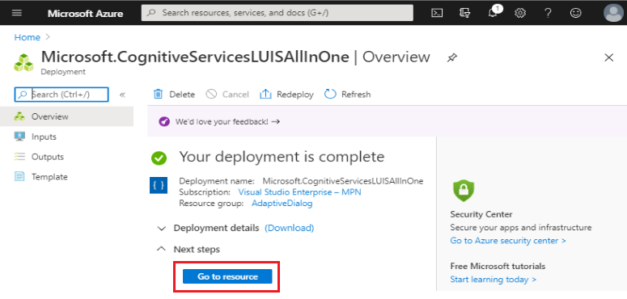
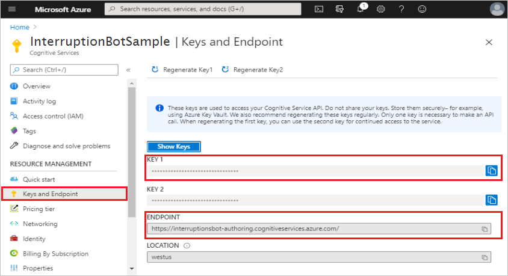
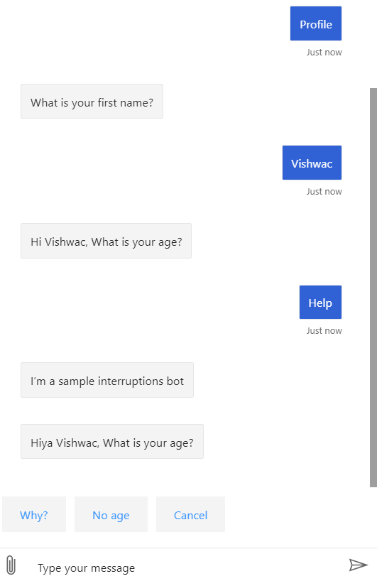

# Handling user interruptions in adaptive dialogs

[!INCLUDE[applies-to](../includes/applies-to.md)]

Handling interruptions is an important aspect of a robust bot. Users will not always follow your defined conversation flow, often they will need to ask a question in the middle of or cancel the process. This article describes some common ways to handle user interruptions in your bot.

## Prerequisites

Handling interruptions is an advanced bot development topic. To get the most from this article, you will need a good working knowledge of the basic concepts of the Bot Framework SDK and adaptive dialogs as well as a knowledge of how to develop a bot that incorporates adaptive dialogs.  It is recommended that you review the items mentioned in the first three bullet points listed below:

- Knowledge of [bot basics][concept-basics], [managing state][concept-state], and [dialogs library][concept-dialogs] Bot Framework SDK concepts.
- Understanding of the adaptive dialog concepts covered in the [Introduction to adaptive dialogs][adaptive-dialog-introduction], [Asking for user input in adaptive dialogs][adaptive-dialog-input] and [Handling interruptions in adaptive dialog][adaptive-dialog-interruptions] concept articles.
- A working knowledge of how to [Create a bot using adaptive dialogs](bot-builder-dialogs-adaptive.md).
- A copy of the interruption bot sample in either [**C#**][cs-sample] or [**JavaScript**][js-sample]. <!-- or [**Python**][python-sample].-->

## Creating LUIS resources in the Azure portal and configuring your bot

This section details configuring and setting up LUIS to work with this sample. If you have already done this, you can skip ahead to [The Interruptions Bot sample](#the-interruptions-bot-sample).

1. Go to the Azure [Create Cognitive Services][CognitiveServicesLUISAllInOne] page.  
2. In the **Create options** section, select **Authoring**.

   

3. Enter values for each of the fields, then select the **Review + create** button.

   

    > [!NOTE]
    > When entering the **Resource Group** and **Name**, keep in mind that you cannot change these values later. Also note that the value you give for **Name** will be part of your **Endpoint URL**.

4. Review the values to ensure they are correct, then select the **Create** button.

### Get your authoring key

Now that you have created your LUIS resource in the Azure portal, you can get your authoring key.

1. Once Azure is done creating your LUIS resources in the Azure portal, you will see a **Your deployment is complete** notification, click **Go to resource**.

   

2. In the left panel, select **Keys and Endpoint**.
3. Copy the **KEY 1** value, this is your ***Authoring Key***. You need to enter this as the value for:
    -  `LuisAPIKey`: A setting in your configuration file.
    - `--authoringKey`: A property of the `bf luis:build` CLI command that is discussed in the following section.

   

4. Copy and save the **ENDPOINT**. You will assign this value to `LuisAPIHostName` in your configuration file.

With this new LUIS resources in Azure portal, you are now ready to connect your bot to it.

## Using CLI to connect your bot to your LUIS resource in Azure

This section explains how to use the Bot Framework CLI to connect your bot to your LUIS resources in Azure. This automates the various tasks required to create, update, train and publish LUIS applications for each .lu file for the bot. In order to use this, you first need Node.js and the Bot Framework CLI.

1. If you have **Node.js** installed, make sure you have version 10.14 or higher by running the following from a command prompt: `npm node.js –version`
1. If you do not have it installed, you can install it from the [Node.js download page](https://nodejs.org/download/).
1. Using Node.js, install the Bot Framework CLI from the command line.

    ```bash
    npm i -g @microsoft/botframework-cli
    ```

1. In a command prompt, navigate to the root directory of your interruption bot sample, generally `..\samples\csharp_dotnetcore\adaptive-dialog\05.interruptions-bot`.

Now you are ready to connect your bot to your LUIS resources in Azure using the Bot Framework CLI.

From a command prompt, while in the root directory of your project source code, run the following command:

``` bash
bf luis:build --in Dialogs --out generated --log --botName InterruptionBotSample --authoringKey <your-authoring-key>
```

The following are the **bf luis:build parameters:**

- `in`: This is the directory, along with its sub-directories, that will be searched for .lu files.
- `out`: This is the directory that the files generated by this process are saved to.
- `log`: A boolean value that determines if a log if created during this process.
- `botName`: Use the same value that you used for **Name** in step 3 of the [Create LUIS resources in Azure portal](#creating-luis-resources-in-the-azure-portal-and-configuring-your-bot) section above.
- `authoringKey`: Your [authoring key](#get-your-authoring-key).

Running the `bf luis:build` command does several things. It uploads all of the information contained in all of your .lu files to your LUIS resource in Azure and then performs the required LUIS training and publishing.  All you need to do now is update your configuration file with the information generated as a result of the steps taken previously.

### Files generated

There are two types of files generated during the `bf luis:build` process, the first is a `.json` file which contains information needed by your bot which you need to add to your [configuration file](#update-your-configuration-file). This file is named `luis.settings.<youralias>.<region>.json`.

The second type of file generated are `.dialog` files, which are useful when using the declarative form of adaptive dialogs. 

There are two `.dialog` files generated for each `.lu` file found:

1. The first is named `<lu-filename>.en-us.lu.dialog`

2. The second is named `<lu-filename>.lu.dialog`

## Update your configuration file

<!--# [C#](#tab/csharp)-->

Add the following values to **appsettings.json**:

``` json
  "luis": {
    "GetUserProfileDialog_en_us_lu": "",
    "RootDialog_en_us_lu": "",
    "LuisAPIKey": "",
    "LuisAPIHostName": ""
  }
```

- **GetUserProfileDialog_en_us_lu**: Get this value from the file named **luis.settings.\<youralias>.\<region>.json** that was generated as a part of running the `bf luis:build` command.

- **RootDialog_en_us_lu**: Get this value from the file named **luis.settings.\<youralias>.\<region>.json** that was generated as a part of running the `bf luis:build` command.

- **LuisAPIKey**: This is your [authoring key](#get-your-authoring-key).

- **LuisAPIHostName**: This is the **ENDPOINT** URL value that you get from the **Keys and Endpoint** section in Azure, which will look something like: `https://InterruptionBotSample.cognitiveservices.azure.com`.

<!--
# [JavaScript](#tab/javascript)

Add the following values to your **.env** file:

``` JavaScript
getUserProfileDialog_en_us_lu=
rootDialog_en_us_lu=
LuisAPIHostName=
LuisAPIKey=
```

- **GetUserProfileDialog_en_us_lu**: Get this value from the file named **luis.settings.\<youralias>.\<region>.json** that was generated as a part of running the `bf luis:build` command.

- **RootDialog_en_us_lu**: Get this value from the file named **luis.settings.\<youralias>.\<region>.json** that was generated as a part of running the `bf luis:build` command.

- **LuisAPIKey**: This is your [authoring key](#get-your-authoring-key).

- **LuisAPIHostName**: This is the **ENDPOINT** URL value that you get from the **Keys and Endpoint** section in Azure, which will look something like: `https://InterruptionBotSample.cognitiveservices.azure.com`.

---
-->
You should now be able to use LUIS in your bot.

## The Interruptions Bot sample

The sample used in this article demonstrates how to create a bot that uses LUIS and adaptive dialogs to achieve advanced LU concepts, including interruption handling. At any time during the conversation with the bot, the user can issue _help_ or _cancel_ commands to interrupt the current conversational flow.

### RootDialog

The RootDialog is the root or main dialog of this bot. It is the parent of the only other adaptive dialog in this bot: [UserProfileDialog](#getuserprofiledialog).

#### RootDialog Recognizer

The first thing that happens when `rootDialog` is created is defining its recognizer. In this sample you will be using the LUIS as your recognizer. Instructions for getting your bot to work using the LUIS recognizer are detailed in the section [Creating LUIS resources in the Azure portal and configuring your bot](#creating-luis-resources-in-the-azure-portal-and-configuring-your-bot).

Every adaptive dialog has its own recognizer, and all adaptive dialogs that use the LUIS recognizer will have a `.lu` file. This file is given the same name as the filename containing the dialog, with the `.lu` file extension, for example if the file hosting the dialog is named _RootDialog_, then the the .lu file will be _RootDialog.lu_. The .lu file is used exclusively by that dialog. In the `.lu` file you define the [intents][intents], [utterances][utterances] and [entities][entities] that are to be used in that dialog. If the user enters an intent that is not defined in that dialogs `.lu` file, that is when the adaptive dialogs consultation mechanism enables your bot to see if the parent dialog has defined the user intent, and if so allows it to handle it, and afterwards returns the user back to where the conversation left off.

<!--# [C#](#tab/csharp)-->

The recognizer is set by calling the `CreateLuisRecognizer()` method and passing in the bot's configuration settings that include the values stored in **appsettings.json** which contain the required LUIS settings.

[!code-csharp[PropertyAssignment](~/../botbuilder-samples/samples/csharp_dotnetcore/adaptive-dialog/05.interruptions-bot/Dialogs/RootDialog/RootDialog.cs?range=31-34&highlight=4)]

```cs
// Create instance of adaptive dialog.
var rootDialog = new AdaptiveDialog(nameof(AdaptiveDialog))
{
    Recognizer = CreateLuisRecognizer(this.configuration),
    ...
```

The `CreateLuisRecognizer()` method first verifies the required values exist in the configuration file (appsettings.json) and if so creates a new `LuisAdaptiveRecognizer` named `Recognizer`. Your LUIS recognizer is now ready.

[!code-csharp[PropertyAssignment](~/../botbuilder-samples/samples/csharp_dotnetcore/adaptive-dialog/05.interruptions-bot/Dialogs/RootDialog/RootDialog.cs?range=99-112)]

```cs
private static Recognizer CreateLuisRecognizer(IConfiguration configuration)
{
    if (string.IsNullOrEmpty(configuration["luis:RootDialog_en_us_lu"]) || string.IsNullOrEmpty(configuration["luis:LuisAPIKey"]) || string.IsNullOrEmpty(configuration["luis:LuisAPIHostName"]))
    {
        throw new Exception("NOTE: LUIS is not configured for RootDialog. To enable all capabilities, add 'LuisAppId-RootDialog', 'LuisAPIKey' and 'LuisAPIHostName' to the appsettings.json file.");
    }

    return new LuisAdaptiveRecognizer()
    {
        ApplicationId = configuration["luis:RootDialog_en_us_lu"],
        EndpointKey = configuration["luis:LuisAPIKey"],
        Endpoint = configuration["luis:LuisAPIHostName"]
    };
}
```

<!--# [JavaScript](#tab/javascript)

The recognizer is set by calling the `CreateLuisRecognizer()` method

[!code-js[recognizer](~/../experimental/adaptive-dialog/javascript_nodejs/05.interruptions-bot/dialogs/rootDialog/rootDialog.js?range=19)]

```javascript
recognizer: this.createLuisRecognizer(),
```

The `CreateLuisRecognizer()` method first verifies the required values exist in the configuration (.env) file and if so creates a new `LuisAdaptiveRecognizer` named `recognizer`. Your LUIS recognizer is now ready.

[!code-js[recognizer](~/../experimental/adaptive-dialog/javascript_nodejs/05.interruptions-bot/dialogs/rootDialog/rootDialog.js?range=119-128)]

```javascript
createLuisRecognizer() {
    if (process.env.getUserProfileDialog_en_us_lu === "" || process.env.LuisAPIHostName === "" || process.env.LuisAPIKey === "")
        throw `Sorry, you need to configure your LUIS application and update .env file.`;
    return new LuisAdaptiveRecognizer().configure(
        {
            endpoint: new StringExpression(process.env.LuisAPIHostName),
            endpointKey: new StringExpression(process.env.LuisAPIKey),
            applicationId: new StringExpression(process.env.getUserProfileDialog_en_us_lu)
        }
    );
```
---
-->

#### RootDialog Generator

The generator requires a valid [Language Generation][language-generation] (.lg) file that defines the language generation templates that will be used by that dialog. This file is given the same name as the filename containing the dialog, with the `.lg` file extension, for example if the file hosting the dialog is named _RootDialog_, then the the .lg file will be _RootDialog.lg_. The .lg file is used exclusively by that dialog.

<!--# [C#](#tab/csharp)-->

[!code-csharp[PropertyAssignment](~/../botbuilder-samples/samples/csharp_dotnetcore/adaptive-dialog/05.interruptions-bot/Dialogs/RootDialog/RootDialog.cs?range=29-35&highlight=1,7)]

```cs
_templates = Templates.ParseFile(Path.Combine(".", "Dialogs", "RootDialog", "RootDialog.lg"));

// Create instance of adaptive dialog.
var rootDialog = new AdaptiveDialog(nameof(AdaptiveDialog))
{
    Recognizer = CreateLuisRecognizer(this.configuration),
    Generator = new TemplateEngineLanguageGenerator(_templates),
```

<!--# [JavaScript](#tab/javascript)

[!code-csharp[PropertyAssignment](~/../experimental/adaptive-dialog/javascript_nodejs/05.interruptions-bot/dialogs/rootDialog/rootDialog.js?range=16-19&highlight=1,3)]

```javascript
const lgFile = Templates.parseFile(path.join(__dirname, 'getUserProfileDialog.lg'));
const dialog = new AdaptiveDialog(DIALOG_ID).configure({
    generator: new TemplateEngineLanguageGenerator(lgFile),
    recognizer: this.createLuisRecognizer(),
```

---
-->

#### RootDialog Triggers

When running this sample bot the first thing that the root dialog does after configuring its recognizer and generator is handles the `conversationUpdate` activity event using the [OnConversationUpdateActivity][OnConversationUpdateActivity] trigger. This will fire anytime a new user joins the conversation, and calls the `WelcomeUserActions` method. The `WelcomeUserActions` method looks for new users and executes two actions, the first is the `SendActivity` action, passing in `${WelcomeUser()}`. See `WelcomeUser` in the file **RootDialog.lu**. This sends a message: _Hello, I'm a sample interruptions bot._ then three suggestions: "Profile | Help | Cancel". This shows the user the hello message then displays the three options that can be selected directly, or the user can type in anything into the input box. The three options and a brief description is given in the following tip:

> [!TIP]
> In the explanation above, `${WelcomeUser()}` is passed as an argument to the `SendActivity` action. `WelcomeUser` is defined in the root dialogs [.lg][lg] file, and is the name of a [Structured response template][structured-response-template]
>
> References to structured response templates are denoted by:
>
> - Appending an open and close parenthesis **()** immediately after the template name: `WelcomeUser()`
> - Surrounding it with braces **{}**: `{WelcomeUser()}`
> - Prefixing it with the dollar sign **$**: `${WelcomeUser()}`

Next are the options shown to the user with an explanation of what happens when they are selected.

##### Profile

If selected:

1. The `OnIntent` trigger containing _Intent = "GetUserProfile"_ fires
1. The action `BeginDialog` executes, instantiating the `userProfileDialog` dialog, which in turn configures its own recognize and generator then executes its triggers and actions.
1. The `userProfileDialog` dialog will be discussed in the [GetUserProfileDialog](#getuserprofiledialog) section below.

Here is the code of the `OnIntent` trigger, in **RootDialog.cs**, that handles the _GetUserProfile_ intent:

[!code-csharp[PropertyAssignment](~/../botbuilder-samples/samples/csharp_dotnetcore/adaptive-dialog/05.interruptions-bot/Dialogs/RootDialog/RootDialog.cs?range=42-52)]

```cs
new OnIntent()
{
    Intent = "GetUserProfile",
    Actions = new List<Dialog>()
    {
        new BeginDialog()
        {
            Dialog = nameof(GetUserProfileDialog)
        }
    }
},
```

##### Help

If selected:

1. The bot fires an `intent` event with a value of "Help".
1. The `OnIntent` trigger containing _Intent = "Help"_ fires, causing its actions to execute.
1. The `SendActivity` action is called passing in `${RootHelp()}` as its parameter, this results in a message to the user similar to the one received when the conversation starts. See the above _Tip_ for a detailed explanation of how this works.

<!--# [C#](#tab/csharp)-->

Here is the `OnIntent` trigger code that handles the _Help_ intent in RootDialog.cs:

[!code-csharp[PropertyAssignment](~/../botbuilder-samples/samples/csharp_dotnetcore/adaptive-dialog/05.interruptions-bot/Dialogs/RootDialog/RootDialog.cs?range=53-60)]

```cs
new OnIntent()
{
    Intent = "Help",
    Actions = new List<Dialog>()
    {
        new SendActivity("${RootHelp()}")
    }
},
```

Here is the [Structured response template][structured-response-template] in **RootDialog.lg** that is related to the "help" intent:

[!code-lg[PropertyAssignment](~/../botbuilder-samples/samples/csharp_dotnetcore/adaptive-dialog/05.interruptions-bot/Dialogs/RootDialog/RootDialog.lg?range=4-8)]

```plaintext
# RootHelp
[Activity
    Text = I'm a sample interruptions bot
    SuggestedActions = Profile | Help | Cancel
]
```

##### Cancel

If selected:
1. The bot fires an `intent` event with a value of "Cancel".
1. The `OnIntent` trigger containing _Intent = "Cancel"_ fires, causing its actions to execute.
1. This results in the [ConfirmInput][confirm-input] action executing, which displays the message "Are you sure you want to cancel?"
1. Next the `IfCondition` action executes in order to respond to the  `ConfirmInput` action.
    - If the user responds affirmatively, `turn.confirm` is set to `true` and the `CancelReadBack` lg template executes, resulting in a message to the user: _Sure, cancelling all dialogs..._, then executes the [CancelAllDialogs][cancel-all-dialogs] action, closing all dialogs.
    - If the user does not respond affirmatively, `turn.confirm` is set to `false` and the `Cancelcancelled` lg template executes, resulting in a message to the user: _No problem_.

Here is the `OnIntent` trigger code in RootDialog.cs:

[!code-csharp[PropertyAssignment](~/../botbuilder-samples/samples/csharp_dotnetcore/adaptive-dialog/05.interruptions-bot/Dialogs/RootDialog/RootDialog.cs?range=61-86)]

```cs
new OnIntent()
{
    Intent = "Cancel",
    Actions = new List<Dialog>()
    {
        new ConfirmInput()
        {
            Property = "turn.confirm",
            AllowInterruptions = false,
            Prompt = new ActivityTemplate("${RootCancelConfirm()}")
        },
        new IfCondition()
        {
            Condition = "turn.confirm == true",
            Actions = new List<Dialog>()
            {
                new SendActivity("${CancelReadBack()}"),
                new CancelAllDialogs()
            },
            ElseActions = new List<Dialog>()
            {
                new SendActivity("${Cancelcancelled()}")
            }
        }
    }
}
```

Here are the three language generation Templates in **RootDialog.lg** that are called from either the `ConfirmInput` or `IfCondition` actions as a result of the "cancel" intent:

[!code-lg[PropertyAssignment](~/../botbuilder-samples/samples/csharp_dotnetcore/adaptive-dialog/05.interruptions-bot/Dialogs/RootDialog/RootDialog.lg?range=16-23)]

```plaintext
# RootCancelConfirm
- Are you sure you want to cancel?

# CancelReadBack
- Sure, cancelling all dialogs...

# Cancelcancelled
- No problem.
```

<!--# [JavaScript](#tab/javascript)
new OnIntent()
{
    Intent = "Cancel",
    Actions = new List<Dialog>()
    {
        new ConfirmInput()
        {
            Property = "turn.confirm",
            AllowInterruptions = false,
            Prompt = new ActivityTemplate("${RootCancelConfirm()}")
        },
        new IfCondition()
        {
            Condition = "turn.confirm == true",
            Actions = new List<Dialog>()
            {
                new SendActivity("${CancelReadBack()}"),
                new CancelAllDialogs()
            },
            ElseActions = new List<Dialog>()
            {
                new SendActivity("${Cancelcancelled()}")
            }
        }
    }
}
```

Here is the LG Template in RootDialog.lg:

[!code-lg[PropertyAssignment](~/../botbuilder-samples/samples/csharp_dotnetcore/adaptive-dialog/05.interruptions-bot/Dialogs/RootDialog/RootDialog.lg?range=16-23)]

```plaintext
# RootCancelConfirm
- Are you sure you want to cancel?

# CancelReadBack
- Sure, cancelling all dialogs...

# Cancelcancelled
- No problem.
```
---
-->

### GetUserProfileDialog

The `userProfileDialog` dialog defined in **GetUserProfileDialog.cs** is the only child dialog in this bot, so all global interruptions will go directly to the root dialog. A quick search of the **GetUserProfileDialog.lu** file will show that there are no  _Help_ or _Cancel_ intents defined. Without the adaptive dialog consultation mechanism, handling these interruptions in `userProfileDialog` would be much more difficult, but because of the effort put into the Bot Framework SDK, these interruptions are easy to handle. Any actions defined in this dialog that has its `AllowInterruptions` property set or evaluate to `true` will enable these interruptions to be handled by its parent dialog, in this case the root dialog.

There are also two local interrupts defined, they are defined as `OnIntent` actions that handle the _Why_ and _NoValue_ intents. You can open the **GetUserProfileDialog.lu** file to view, add or update the utterances associated with these intents. These intents are not a part of the conversational flow, and as such and are handled as local interrupts. Once these interrupts complete, control is returned to the action that was interrupted to seamlessly continue the conversational flow where it left off.

#### GetUserProfileDialog Recognizer

Configuring its recognizer is the first thing that happens when `userProfileDialog` is created. Every dialog configures its own recognizer independent of all other dialogs, and each dialog can use the same type of recognizer, or each can use a different recognizer. Each dialog in your bot can use any type of recognizer defined in the Bot Framework SDK, regardless of what any other dialog is using. To learn more about the different types available, see the [recognizer types][recognizer-types] section of the recognizers concept article. <!---  Add ", or a custom recognizer" once there is an article that discusses this.  -->

As mentioned previously, every adaptive dialog has its own recognizer, and the `.lu` file associated with it is exclusively tied to that dialog. In the `.lu` file you define the [intents][intents], [utterances][utterances] and [entities][entities] that are to be used in that dialog. If the user enters an intent that is not defined in that dialogs `.lu` file, the adaptive dialog consultation mechanism enables your bot to bubble up the user intent to the parent dialog to handle, if it can. In this case the _Help_ and _Cancel_ intents are defined in the root dialog, but your bot can still handle those user intents even when the userProfileDialog is the active dialog. This is explained in detail in the section titled [GetUserProfileDialog Triggers][#getuserprofiledialog-triggers] below.

The code used in GetUserProfileDialog used to define the recognizer is the same as the code used in the [root dialog](#rootdialog-recognizer), so will will not be explained in detail here.

#### GetUserProfileDialog Generator

The generator consists of your LG template file that is in the same directory as the file containing the source code of your adaptive dialog, with the same filename and the `.lg` file extension such as **GetUserProfileDialog.lg**.<!-- if programming using C# or **getUserProfileDialog.lg** if using JavaScript.-->

<!--# [C#](#tab/csharp)-->

[!code-csharp[PropertyAssignment](~/../botbuilder-samples/samples/csharp_dotnetcore/adaptive-dialog/05.interruptions-bot/Dialogs/GetUserProfileDialog/GetUserProfileDialog.cs?range=30-36&highlight=1,7)]

```cs
_templates = Templates.ParseFile(Path.Combine(".", "Dialogs", "GetUserProfileDialog", "GetUserProfileDialog.lg"));

// Create instance of adaptive dialog.
var userProfileDialog = new AdaptiveDialog(nameof(AdaptiveDialog))
{
    Recognizer = CreateLuisRecognizer(this.configuration),
    Generator = new TemplateEngineLanguageGenerator(_templates),
```

<!--# [JavaScript](#tab/javascript)

[!code-js[PropertyAssignment](~/../experimental/adaptive-dialog/javascript_nodejs/05.interruptions-bot/dialogs/getUserProfileDialog/getUserProfileDialog.js?range=16-18&highlight=1,3)]

```javascript
const lgFile = Templates.parseFile(path.join(__dirname, 'getUserProfileDialog.lg'));
const dialog = new AdaptiveDialog(DIALOG_ID).configure({
    generator: new TemplateEngineLanguageGenerator(lgFile),
```

---
-->

#### GetUserProfileDialog Triggers

The dialog defined in **GetUserProfileDialog** is named `userProfileDialog`. This dialog is called by the root dialog in response to the user entering an utterance, also know as a _trigger phrase_, that is associated with the `GetUserProfile` intent defined in **RootDialog.lu**.

[!code-json[env](~/../botbuilder-samples/samples/csharp_dotnetcore/adaptive-dialog/05.interruptions-bot/Dialogs/RootDialog/RootDialog.lu?range=1-5)]

```plaintext
# GetUserProfile
- Hi
- My name is vishwac
- I'm 36 years old
- Profile
```

Once called, the `OnBeginDialog` trigger executes, which in turn executes the two `PropertyAssignment` actions that define two new properties: `user.profile.name` and `user.profile.age`.

<!--# [C#](#tab/csharp)-->

[!code-csharp[PropertyAssignment](~/../botbuilder-samples/samples/csharp_dotnetcore/adaptive-dialog/05.interruptions-bot/Dialogs/GetUserProfileDialog/GetUserProfileDialog.cs?range=53-55,64-71)]

```CS
new SetProperties()
{
	Assignments = new List<PropertyAssignment>()
	{
		new PropertyAssignment()
		{
			Property = "user.profile.name",
			Value = "=coalesce(dialog.userName, @personName)"
		},
		new PropertyAssignment()
		{
			Property = "user.profile.age",
			Value = "=coalesce(dialog.userAge, @age)"
		}
	}
},
```

<!--# [JavaScript](#tab/javascript)

[!code-js[PropertyAssignment](~/../experimental/adaptive-dialog/javascript_nodejs/05.interruptions-bot/dialogs/getUserProfileDialog/getUserProfileDialog.js?range=28-29,36-42)]

<!--
new SetProperty().configure({
	property: new StringExpression("user.profile.name"),
	value: new ValueExpression("=coalesce(dialog.userName, @personName)")
}),
new SetProperty().configure(
{
	property: new StringExpression("user.profile.age"),
	value: new ValueExpression("=coalesce(dialog.userAge, @age)")
}),

---
-->

## To test the bot

1. If you have not done so already, install the [Bot Framework Emulator](https://aka.ms/bot-framework-emulator-readme).
1. Run the sample locally on your machine.
1. Start the emulator, connect to your bot, and send messages as shown below.



<!--## Additional information-->

<!-- Footnote-style links -->

<!-- Prerequisites ----->
[concept-basics]: bot-builder-basics.md
[concept-state]: bot-builder-concept-state.md
[concept-dialogs]: bot-builder-concept-dialog.md
[adaptive-dialog-introduction]: bot-builder-adaptive-dialog-Introduction.md
[adaptive-dialog-input]: bot-builder-concept-adaptive-dialog-Inputs.md
[adaptive-dialog-interruptions]: bot-builder-concept-adaptive-dialog-interruptions.md

<!-- About this sample links ----->
[intents]: bot-builder-concept-adaptive-dialog-recognizers.md#intents
[utterances]: bot-builder-concept-adaptive-dialog-recognizers.md#utterances
[entities]: bot-builder-concept-adaptive-dialog-recognizers.md#entities
[recognizer-types]: bot-builder-concept-adaptive-dialog-recognizers.md#recognizer-types

[OnConversationUpdateActivity]: ../adaptive-dialog/adaptive-dialog-prebuilt-triggers.md#onconversationupdateactivity
[confirm-input]: ../adaptive-dialog/adaptive-dialog-prebuilt-inputs.md##confirminput
[cancel-all-dialogs]: ../adaptive-dialog/adaptive-dialog-prebuilt-actions.md#cancelalldialogs

[lg]: ../file-format/bot-builder-lg-file-format.md
[language-generation]: bot-builder-concept-language-generation.md
[structured-response-template]: ../language-generation/language-generation-structured-response-template.md

<!-- Setting up LUIS ----->
[create-luis-resources-in-azure-portal]: https://docs.microsoft.com/azure/cognitive-services/luis/luis-how-to-azure-subscription#create-luis-resources-in-azure-portal
[CognitiveServicesLUISAllInOne]: https://portal.azure.com/#create/Microsoft.CognitiveServicesLUISAllInOne

<!-- Sample links ----->
[cs-sample]: https://github.com/microsoft/BotBuilder-Samples/tree/master/samples/csharp_dotnetcore/adaptive-dialog/05.interruptions-bot
[js-sample]: https://github.com/microsoft/BotBuilder-Samples/tree/master/experimental/adaptive-dialog/javascript_nodejs/05.interruptions-bot
[python-sample]: https://github.com/microsoft/BotBuilder-Samples/tree/master/experimental/adaptive-dialog/python/05.interruptions-bot
[rootdialog.lu]: https://github.com/microsoft/BotBuilder-Samples/blob/master/samples/csharp_dotnetcore/adaptive-dialog/05.interruptions-bot/Dialogs/RootDialog/RootDialog.lu
