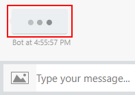

# How to use proactive messaging

Most commonly bots send _reactive messages_, but there are times when we need to be able to send a [proactive message](bot-service-proactive-messages.md) as well. 

A common case of proactive messaging comes when our bot is performing a time-consuming task. In this case, we send a **typing** activity indicates to the user that the bot is in a *processing* mode, and then follow it up with a proactive message once our processing has completed.

## How to send a typing activity message

When the Bot Framework Emulator receives a "typing" task, it displays an animation of three moving dots.



To send a "typing" activity, use the BotContext `SendActivity` method and send a new typing activity:

# [C#](#tab/cs)
```csharp
context.SendActivity(Activity.CreateTypingActivity());
```

# [JavaScript](#tab/js)
```javascript
await context.sendActivity({type: "typing"});
```

---

Depending on the channel, the user will receive an indication that a process is underway.

## Proactively send the follow-up mesage

The follow-up message, however, presents a problem. You've just replied to the user's message by indicating that your bot is working, and that reply closes out the BotContext object. How then does your bot send the message it took so long to create? 

By sending a proactive message.

To send a proactive message, you need the user ID of the user you want to message, and a conversation reference for the current conversation. This can be stored in the bot state and retrived when your bot is ready to send the proactive mesage. 

# [C#](#tab/cs)

In this example, the static Dictionary `conversations` will be used to store the user ID and conversation reference.

```csharp
public class MessagesController : Controller
{
    static readonly Dictionary<string, ConversationReference> conversations = new Dictionary<string, ConversationReference>();
```

When the bot receives the message from the user, it stores `context.ConversationReference` data in the `userId` of the Dictionary. Then the bot sends the typing activity to the user. After this, a new `context` object is created for the user. After the lengthy task completes, the `SendActivity` method of the new `context` is used to send the proactive message to the user.

```csharp
using Microsoft.Bot.Builder;
// ...

namespace Microsoft.Bot.Samples
{
    public class ProactiveBot : IBot
    {
        public async Task OnReceiveActivity(IBotContext context)
        {
            // If this is a "message", 
            if (context.Request.Type == "message")
            {
                // Store the conversation reference and user ID for later use.
                var reference = context.ConversationReference;
                var userId = reference.User.Id;
                conversations[userId] = reference;

                // First, send a "typing" activity to indicate that the bot is working.
                context.SendActivity(Activity.CreateTypingActivity());

                // Then send a proactive message.
                GenerateActivityForMessage(userId, context.Request.AsMessageActivity()?.Text.Trim());
            }
        }

        private void GenerateActivityForMessage(string userId, string text)
        {
            // Create and send a proactive message activity after the completion of a long process.
            CreateContextForUser(userId, async (IBotContext context) =>
            {
                // Use Task.Delay to simulate a long process.
                await Task.Delay(3000);

                // Send the proactive message to the user.
                context.SendActivity("You said, \"" + text + "\"");
            });
        }

        private async void CreateContextForUser(string userId, Func<IBotContext, Task> onReady)
        {
            // Get the conversation reference for this user ID.
            var reference = conversations[userId];

            // Create the context for the message.
            await bot.CreateContext(reference, onReady);
        }
    }
}
```

In `Startup.cs` be sure to enable proactive messages for your bot when configuring services.

```csharp
public void ConfigureServices(IServiceCollection services)
        {
            services.AddSingleton(_ => Configuration);
            services.AddBot<ProactiveBot>(options =>
            {
                options.CredentialProvider = new ConfigurationCredentialProvider(Configuration);

                // Flip the switch to enable proactive messaging.
                options.EnableProactiveMessages = true;
            });
        }
```

# [JavaScript](#tab/js)

```javascript
// Listen for incoming activity 
server.post('/api/messages', (req, res) => {
    // Route received activity to adapter for processing
    adapter.processActivity(req, res, async (context) => {
        // If this is a "message"
        if (context.activity.type === 'message') {            
            // Store the conversation reference and user ID for later use.
            const reference = context.activity;
            const userId = reference.id;
            const changes = {};
            changes['reference/' + userId] = reference;
            await storage.write(changes)

            // Then send a proactive message.
            await subscribeUser(userId, context.activity.text)
            await context.sendActivity(`Thank You! We will message you shortly.`);
        }
    });
});

// Create and send a proactive message activity after the completion of a long process.
async function subscribeUser(userId, text) {
    // Use setTimeout to simulate a long process.
    setTimeout(() => {
        createContextForUser(userId, async (context) => {
             // Send the proactive message to the user.
            await context.sendActivity(`You said ${text}`);
        })
    }, 2000);
}

async function createContextForUser(userId, callback) {
    // Get the conversation reference for this user ID
    const referenceKey = 'reference/' + userId;
    var rows = await storage.read([referenceKey])
    var reference = await rows[referenceKey]

    // Create the context for the message.
    await callback(adapter.createContext(reference))
}
```

---

## Test your bot

To test your bot, deploy it to Azure as a registration only bot, and test it in Web Chat.
