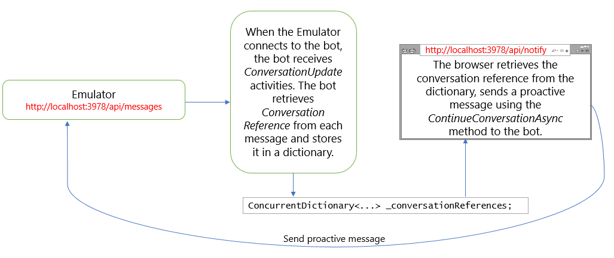

# Send proactive notifications to users

[!INCLUDE[applies-to](../includes/applies-to.md)]

Typically, each message that a bot sends to the user directly relates to the user's prior input.
In some cases, a bot may need to send the user a message that is not directly related to the current topic of conversation or to the last message the user sent. These types of messages are called _proactive messages_.

Proactive messages can be useful in a variety of scenarios. For example, if the user has previously asked the bot to monitor the price of a product, the bot can alert the user if the price of the product has dropped by 20%. Or, if a bot requires some time to compile a response to the user's question, it may inform the user of the delay and allow the conversation to continue in the meantime. When the bot finishes compiling the response to the question, it will share that information with the user.

When implementing proactive messages in your bot, don't send several proactive messages within a short amount of time. Some channels enforce restrictions on how frequently a bot can send messages to the user, and will disable the bot if it violates those restrictions.

An ad hoc proactive message is the simplest type of proactive message. The bot simply interjects the message into the conversation whenever it is triggered, without any regard for whether the user is currently engaged in a separate topic of conversation with the bot and will not attempt to change the conversation in any way.

To handle notifications more smoothly, consider other ways to integrate the notification into the conversation flow, such as setting a flag in the conversation state or adding the notification to a queue.

## Prerequisites

- Understand [bot basics](bot-builder-basics.md).
- A copy of the proactive messages sample in either **[CSharp](https://aka.ms/proactive-sample-cs) or [JavaScript](https://aka.ms/proactive-sample-js)**. This sample is used to explain proactive messaging in this article.

## About the proactive sample

The sample has a bot and an additional controller that is used to send proactive messages to the bot, as shown in the following illustration.



## Retrieve and store conversation reference

When the emulator connects to the bot, the bot receives two conversation update activities. In the bot's conversation update activity handler, the conversation reference is retrieved and stored in a dictionary as shown below.

# [C#](#tab/csharp)

**Bots\ProactiveBot.cs**

[!code-csharp[OnConversationUpdateActivityAsync](~/../botbuilder-samples/samples/csharp_dotnetcore/16.proactive-messages/Bots/ProactiveBot.cs?range=26-37&highlight=3-4,9)]

# [JavaScript](#tab/javascript)

**bots/proactiveBot.js**

[!code-javascript[onConversationUpdateActivity](~/../botbuilder-samples/samples/javascript_nodejs/16.proactive-messages/bots/proactiveBot.js?range=13-17&highlight=2)]

[!code-javascript[onConversationUpdateActivity](~/../botbuilder-samples/samples/javascript_nodejs/16.proactive-messages/bots/proactiveBot.js?range=41-44&highlight=2-3)]

---

Note: In a real-world scenario you would persist conversation references in a database instead of using an object in memory.

The conversation reference has a _conversation_ property that describes the conversation in which the activity exists. The conversation has a _user_ property that lists the users participating in the conversation, and a _service URL_ property that channels use to denote the URL where replies to the current activity may be sent. A valid conversation reference is needed to send proactive messages to users.

## Send proactive message

The second controller, the _notify_ controller, is responsible for sending the proactive message to the bot. Use the following steps to generate a proactive message.

1. Retrieve the reference for the conversation to which to send the proactive message.
1. Call the adapter's _continue conversation_ method, providing the conversation reference and the turn handler delegate to use. The continue conversation method generates a turn context for the referenced conversation and then calls the specified turn handler delegate.
1. In the delegate, use the turn context to send the proactive message.

# [C#](#tab/csharp)

**Controllers\NotifyController .cs**

Each time the bot's notify page is requested, the notify controller retrieves the conversation references from the dictionary.
The controller then uses the `ContinueConversationAsync` and `BotCallback` methods to send the proactive message.

[!code-csharp[Notify logic](~/../botbuilder-samples/samples/csharp_dotnetcore/16.proactive-messages/Controllers/NotifyController.cs?range=17-59&highlight=28,40-43)]

To send a proactive message, the adapter requires an app ID for the bot. In a production environment, you can use the bot's app ID. In a local test environment, you can use any GUID. If the bot is not currently assigned an app ID, the notify controller self-generates a placeholder ID to use for the call.

# [JavaScript](#tab/javascript)

**index.js**

Each time the server's `/api/notify` page is requested, the server retrieves the conversation references from the dictionary.
The server then uses the `continueConversation` method to send the proactive message.
The parameter to `continueConversation` is a function that serves as the bot's turn handler for this turn.

[!code-javascript[Notify logic](~/../botbuilder-samples/samples/javascript_nodejs/16.proactive-messages/index.js?range=56-62&highlight=4-5)]

---

## Test your bot

1. If you have not done so already, install the [Bot Framework Emulator](https://aka.ms/bot-framework-emulator-readme).
1. Run the sample locally on your machine.
1. Start the emulator and connect to your bot.
1. Load to your bot's api/notify page. This will generate a proactive message in the emulator.

## Additional information

Besides the sample used in this article, additional samples are available in C# and JS on [GitHub](https://github.com/Microsoft/BotBuilder-Samples/).

### Avoiding 401 "Unauthorized" Errors 

By default, the BotBuilder SDK adds a `serviceUrl` to the list of trusted host names if the incoming request is authenticated by BotAuthentication. They are maintained in an in-memory cache. If your bot is restarted, a user awaiting a proactive message cannot receive it unless they have messaged the bot again after it restarted. 

To avoid this, you must manually add the `serviceUrl` to the list of trusted host names by using: 

# [C#](#tab/csharp)

```csharp 
MicrosoftAppCredentials.TrustServiceUrl(serviceUrl); 
``` 

For proactive messaging, `serviceUrl` is the URL of the channel that the recipient of the proactive message is using and can be found in `Activity.ServiceUrl`. 

You'll want to add the above code just prior to the the code that sends the proactive message. This sample has it near the end of `CreateCallback()` in `ProactiveBot.cs`, but it is commented out because it will not work in Emulator without an `appId` and `appPassword`.

# [JavaScript](#tab/javascript)

```js
MicrosoftAppCredentials.trustServiceUrl(serviceUrl);
```

For proactive messaging, `serviceUrl` is the URL of the channel that the recipient of the proactive message is using and can be found in `activity.serviceUrl`.

You'll want to add the above code just prior to the the code that sends the proactive message. This sample has it near the end of `completeJob()` in `bot.js`, but it is commented out because it will not work in Emulator without an `appId` and `appPassword`.

---

## Next steps

> [!div class="nextstepaction"]
> [Implement sequential conversation flow](bot-builder-dialog-manage-conversation-flow.md)
