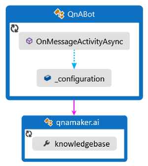
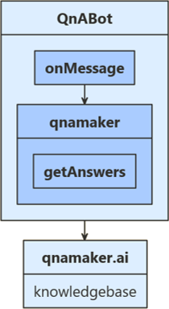
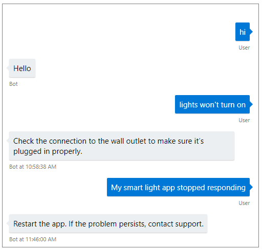

# Use QnA Maker to answer questions

[!INCLUDE[applies-to](../includes/applies-to.md)]

QnA Maker provides a conversational question and answer layer over your data. This allows your bot to send QnA Maker a question and recieve an answer without you needing to parse and interpret the intent of their question. 

One of the basic requirements in creating your own QnA Maker service is to seed it with questions and answers. In many cases, the questions and answers already exist in content like FAQs or other documentation; other times, you may want to customize your answers to questions in a more natural, conversational way. 

## Prerequisites

- The code in this article is based on the QnA Maker sample. You'll need a copy of it either in **[CSharp](https://aka.ms/cs-qna) or [JavaScript](https://aka.ms/js-qna-sample)**.
- [QnA Maker](https://www.qnamaker.ai/) account
- Knowledge of [bot basics](bot-builder-basics.md), [QnA Maker](https://docs.microsoft.com/en-us/azure/cognitive-services/qnamaker/overview/overview), and [managing bot resources](bot-file-basics.md).

## About this sample

For your bot to utilize QnA Maker, you'll need to first create a knowledge base on [QnA Maker](https://www.qnamaker.ai/), which we'll cover in the next section. Your bot then can send it the user's query, and it will provide the best answer to the question in response.

## [C#](#tab/cs)


`OnMessageActivityAsync` is called for each user input received. When called, it accesses `_configuration` information stored within the sample code's `appsetting.json` file to find the value to connect to your pre-configured QnA Maker knowledgebase. 

## [JavaScript](#tab/js)


`OnMessage` is called for each user input received. When called, it accesses your `qnamaker` connector that was pre-configured using values provided from your sample code's `.env` file.  The qnamaker method `getAnswers` connects your bot to your external QnA Maker knowledgebase.

---
The user's input is sent to your knowledgebase and the best returned answer is displayed back to your user.

## Create a QnA Maker service and publish a knowledge base
The first step is to create a QnA Maker service. Follow the steps listed in the QnA Maker [documentation](https://docs.microsoft.com/en-us/azure/cognitive-services/qnamaker/how-to/set-up-qnamaker-service-azure) to create the service in Azure.

Next, you'll create a knowledge base using the `smartLightFAQ.tsv` file located in the CognitiveModels folder of the sample project. The steps to create, train, and publish your QnA Maker [knowledge base](https://docs.microsoft.com/en-us/azure/cognitive-services/qnamaker/quickstarts/create-publish-knowledge-base) are listed in the QnA Maker documentation. As you follow these steps, name your KB `qna`,  and use the `smartLightFAQ.tsv` file to populate your KB.

> Note. This article may also be used to access your own user developed QnA Maker knowledgebase.

## Obtain values to connect your bot to the knowledge base
1. In the [QnA Maker](https://www.qnamaker.ai/) site, select your knowledge base.
1. With your knowledge base open, select the **Settings**. Record the value shown for _service name_. This value is useful for finding your knowledgebase of interest when using the QnA Maker portal interface. It is not used to connect your bot app to this knowledgebase. 
1. Scroll down to find **Deployment details** record the following values from the Postman sample HTTP request:
   - POST /knowledgebases/\<knowledge-base-id>/generateAnswer
   - Host: \<your-hostname> // Full URL ending with /qnamaker
   - Authorization: EndpointKey \<your-endpoint-key>
   
The full URL string for your Hostname will look like "https://< >.azure.net/qnamaker". These three values will provide the information necessary for your app to connect to your QnA Maker knowledgebase via your Azure QnA service.  

## Update the settings file

First, add the information required to access your knowledge base including hostname, endpoint key and knowledge base Id (kbId) into the settings file. These are the values you saved from the **Settings** tab of your knowledge base in QnA Maker. 

If you aren't deploying this for production, the app ID and password fields can be left blank.

> [!NOTE]
> If you are adding access to a QnA Maker knowledgebase into an existing bot application, be sure to add informative titles for your QnA entries. The "name" value within this section provides the key required to access this information from within your app.

## [C#](#tab/cs)

### Update your appsettings.json file

```json
{
  "MicrosoftAppId": "",
  "MicrosoftAppPassword": "",
  
  "QnAKnowledgebaseId": "<knowledge-base-id>",
  "QnAAuthKey": "<your-endpoint-key>",
  "QnAEndpointHostName": "<your-hostname>"
}
```

## [JavaScript](#tab/js)

### Update your .env file

```file
MicrosoftAppId=""
MicrosoftAppPassword=""

QnAKnowledgebaseId="<knowledge-base-id>"
QnAAuthKey="<your-endpoint-key>"
QnAEndpointHostName="<your-hostname>"
```

---

## Set up the QnA Maker instance

First, we create an object for accessing our QnA Maker knowledge base.

## [C#](#tab/cs)

Be sure that the **Microsoft.Bot.Builder.AI.QnA** NuGet package is installed for your project.

In **QnABot.cs**, in the `OnMessageActivityAsync` method, we create a QnAMaker instance. The `QnABot` class is also where the names of the connection information, saved in `appsettings.json` above, are pulled in. If you have chosen different names for your knowledge base connection information in your settings file, be sure to update the names here to reflect your chosen name.

**Bots/QnABot.cs**
[!code-csharp[qna connection](~/../botbuilder-samples/samples/csharp_dotnetcore/11.qnamaker/Bots/QnABot.cs?range=32-37)]

## [JavaScript](#tab/js)

Be sure that npm package **botbuilder-ai** is installed for your project.

In our sample the code for the bot logic is in a **QnABot.js** file.

In the **QnABot.js** file, we use the connection information provided by your .env file to establish a connection to the QnA Maker service: _this.qnaMaker_.

**QnAMaker.js**
[!code-javascript[QnAMaker](~/../botbuilder-samples/samples/javascript_nodejs/11.qnamaker/bots/QnABot.js?range=19-23)]


---

## Calling QnA Maker from your bot

## [C#](#tab/cs)

When your bot needs an answer from QnAMaker, call `GetAnswersAsync()` from your bot code to get the appropriate answer based on the current context. If you are accessing your own knowledge base, change the _no answers found_ message below to provide useful instructions for your users.

**QnABot.cs**
[!code-csharp[qna connection](~/../botbuilder-samples/samples/csharp_dotnetcore/11.qnamaker/Bots/QnABot.cs?range=43-52)]

## [JavaScript](#tab/js)

In the **QnABot.js** file, we pass the user's input to the QnA Maker service's `getAnswers` method to get answers from the knowledge base. If QnA Maker returns a response, this is shown to the user. Otherwise, the user receives the message 'No QnA Maker answers were found.' 

**QnABot.js**
[!code-javascript[OnMessage](~/../botbuilder-samples/samples/javascript_nodejs/11.qnamaker/bots/QnABot.js?range=43-59)]

---

## Test the bot

Run the sample locally on your machine. If you have not done so already, install the [Bot Framework Emulator](https://github.com/Microsoft/BotFramework-Emulator/blob/master/README.md#download). For further instructions, refer to the readme file for [C# sample](https://aka.ms/cs-qna) or [Javascript sample](https://aka.ms/js-qna-sample).

Start the emulator, connect to your bot, and send a message as shown below.



## Next steps

QnA Maker can be combined with other Cognitive Services, to make your bot even more powerful. The Dispatch tool provides a way to combine QnA with Language Understanding (LUIS) in your bot.

> [!div class="nextstepaction"]
> [Combine LUIS and QnA services using the Dispatch tool](./bot-builder-tutorial-dispatch.md)
